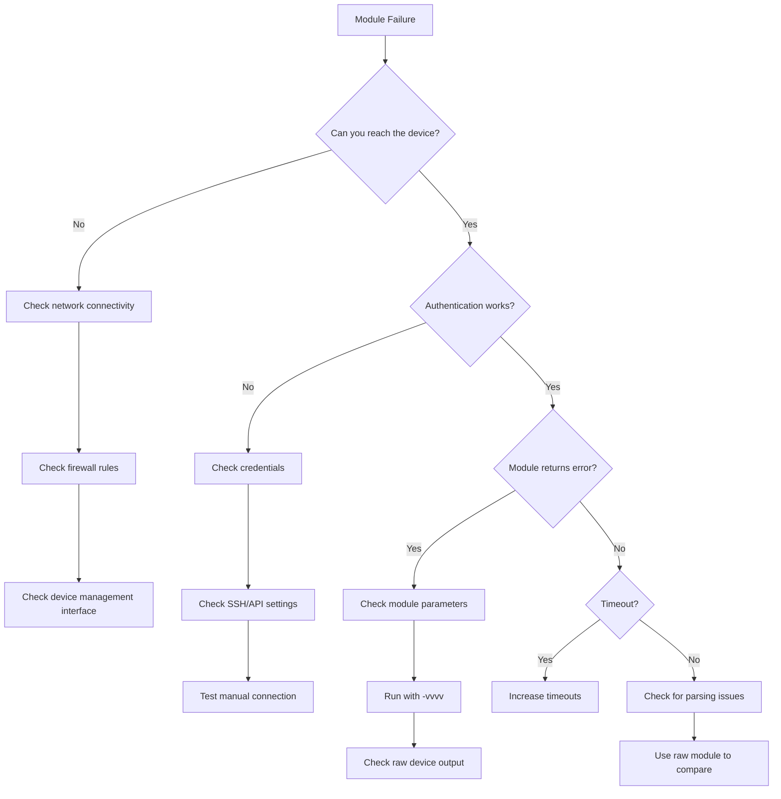

# How to Debug Network Module Failures in Ansible

Author: [nawazdhandala](https://www.github.com/nawazdhandala)

Tags: Ansible, Networking, Debugging, Troubleshooting

Description: Learn practical techniques to debug and troubleshoot Ansible network module failures including connection issues, authentication errors, and module bugs.

---

Network module failures in Ansible can be some of the most frustrating issues to debug. Unlike server modules where you can SSH in and poke around, network devices have limited access and the error messages from Ansible can be cryptic at best. I have spent more hours than I care to admit tracking down network automation failures, and this post captures the debugging techniques that have saved me the most time.

## Common Failure Categories

Network module failures generally fall into a few buckets:

- Connection failures (can't reach the device)
- Authentication failures (wrong credentials or unsupported auth method)
- Module execution failures (the command failed on the device)
- Parsing failures (Ansible can't understand the device response)
- Timeout failures (device took too long to respond)

Let us go through debugging techniques for each.

## Increasing Verbosity

The first thing to try is always increasing Ansible's verbosity. Each level reveals more detail.

```bash
# Standard verbosity - shows task results
ansible-playbook network_config.yml -v

# More detail - shows connection info and module arguments
ansible-playbook network_config.yml -vv

# Even more - shows SSH/API connection details
ansible-playbook network_config.yml -vvv

# Maximum verbosity - shows everything including raw device output
ansible-playbook network_config.yml -vvvv
```

At `-vvvv`, you get the raw data being sent to and received from the device. This is usually where you find the actual problem.

## Debugging Connection Issues

Connection problems are the most common source of failures. Here is how to isolate them.

```yaml
# playbooks/test_connection.yml
---
- name: Test Network Device Connection
  hosts: network_devices
  gather_facts: false

  tasks:
    # Simple ping test to verify reachability
    - name: Test basic connectivity
      wait_for:
        host: "{{ ansible_host }}"
        port: "{{ ansible_port | default(22) }}"
        timeout: 10
      delegate_to: localhost
      register: conn_test
      ignore_errors: true

    - name: Report connectivity status
      debug:
        msg: >
          Device {{ inventory_hostname }} ({{ ansible_host }})
          is {{ 'reachable' if conn_test is success else 'UNREACHABLE' }}
          on port {{ ansible_port | default(22) }}
```

For httpapi-based connections (like FortiGate or Check Point), check that SSL settings are correct.

```yaml
# Common httpapi connection variables that cause failures
ansible_connection: httpapi
ansible_httpapi_use_ssl: true
ansible_httpapi_validate_certs: false  # Set to false for self-signed certs
ansible_httpapi_port: 443
ansible_network_os: fortinet.fortios.fortios
```

## Debugging Authentication Failures

Authentication errors often look like connection errors. Here is how to tell the difference.

```bash
# Test SSH authentication manually from the Ansible control node
ssh -o StrictHostKeyChecking=no admin@192.168.1.1

# For network_cli connections, test with the same settings Ansible uses
ssh -o KexAlgorithms=diffie-hellman-group14-sha1 admin@192.168.1.1
```

If manual SSH works but Ansible fails, check your inventory variables.

```yaml
# playbooks/debug_auth.yml
---
- name: Debug Authentication
  hosts: network_devices
  gather_facts: false

  tasks:
    # Print the connection variables Ansible is using (mask passwords)
    - name: Show connection parameters
      debug:
        msg:
          connection: "{{ ansible_connection }}"
          host: "{{ ansible_host }}"
          port: "{{ ansible_port | default('not set') }}"
          user: "{{ ansible_user | default('not set') }}"
          network_os: "{{ ansible_network_os | default('not set') }}"
          # Never print the actual password in production
          password_set: "{{ 'yes' if ansible_password is defined else 'no' }}"
          ssh_key_set: "{{ 'yes' if ansible_ssh_private_key_file is defined else 'no' }}"
```

## Using the Debug Module with Register

Capture and inspect the full output of failed tasks.

```yaml
# playbooks/debug_module_output.yml
---
- name: Debug Module Failures
  hosts: network_devices
  gather_facts: false

  tasks:
    # Run a command and capture the full output
    - name: Run show version
      ios_command:
        commands:
          - show version
      register: version_output
      ignore_errors: true

    # Print everything the module returned
    - name: Show full module output
      debug:
        var: version_output

    # If it failed, show the specific error
    - name: Show error details
      debug:
        msg: |
          Failed: {{ version_output.failed | default(false) }}
          RC: {{ version_output.rc | default('N/A') }}
          Message: {{ version_output.msg | default('No message') }}
          Stderr: {{ version_output.stderr | default('No stderr') }}
      when: version_output is failed
```

## Enabling Network Debug Logging

Ansible has a built-in network debugging feature that logs all device interactions to a file.

```bash
# Enable persistent connection logging
export ANSIBLE_PERSISTENT_LOG_MESSAGES=true
export ANSIBLE_LOG_PATH=/tmp/ansible-network-debug.log

# Set longer timeouts for slow devices
export ANSIBLE_PERSISTENT_CONNECT_TIMEOUT=60
export ANSIBLE_PERSISTENT_COMMAND_TIMEOUT=60

# Run the playbook
ansible-playbook network_config.yml -vvvv
```

Check the log file for raw device communication.

```bash
# View the debug log - look for the actual device responses
cat /tmp/ansible-network-debug.log | grep -A 5 "response"
```

## Debugging Timeout Failures

Network devices can be slow, especially during configuration changes. Increase timeouts when you see timeout-related errors.

```yaml
# ansible.cfg - increase timeouts for slow network devices
[persistent_connection]
connect_timeout = 60
command_timeout = 60
connect_retry_timeout = 30
```

You can also set timeouts per task.

```yaml
# Set a longer timeout for a specific task
- name: Apply large configuration change
  ios_config:
    src: large_config.j2
  vars:
    ansible_command_timeout: 120
```

## Debugging Parsing Failures

Sometimes the module connects fine but cannot parse the device response. This often happens with older or non-standard IOS versions.

```yaml
# playbooks/debug_parsing.yml
---
- name: Debug Parsing Issues
  hosts: network_devices
  gather_facts: false

  tasks:
    # Use raw command to see exactly what the device returns
    - name: Run raw command (bypasses module parsing)
      raw: "show running-config | section interface"
      register: raw_output

    - name: Show raw device output
      debug:
        var: raw_output.stdout

    # Compare with the module output
    - name: Run same command through module
      ios_command:
        commands:
          - "show running-config | section interface"
      register: module_output
      ignore_errors: true

    - name: Show module output
      debug:
        var: module_output
```

## Network Debug Workflow



## Using Ansible's Built-in Debug Strategy

The debug strategy lets you interactively step through failures.

```yaml
# ansible.cfg
[defaults]
strategy = debug
```

When a task fails, you get an interactive prompt where you can:

```
# Commands available in debug strategy
p result    # Print the task result
p task      # Print the task definition
p vars      # Print available variables
r           # Re-run the failed task
c           # Continue to the next task
q           # Quit the playbook
```

## Creating a Debug Playbook

I keep a standard debug playbook that I run against any new network device before writing automation.

```yaml
# playbooks/network_preflight.yml
---
- name: Network Device Preflight Check
  hosts: "{{ target_host }}"
  gather_facts: false

  tasks:
    - name: Test TCP connectivity
      wait_for:
        host: "{{ ansible_host }}"
        port: "{{ ansible_port | default(22) }}"
        timeout: 10
      delegate_to: localhost

    - name: Gather device facts
      ios_facts:
        gather_subset:
          - min
      register: device_facts
      ignore_errors: true

    - name: Show device info
      debug:
        msg:
          hostname: "{{ device_facts.ansible_facts.ansible_net_hostname | default('FAILED') }}"
          version: "{{ device_facts.ansible_facts.ansible_net_version | default('FAILED') }}"
          model: "{{ device_facts.ansible_facts.ansible_net_model | default('FAILED') }}"
      when: device_facts is success

    - name: Run basic command test
      ios_command:
        commands:
          - show clock
      register: cmd_test
      ignore_errors: true

    - name: Show command test result
      debug:
        var: cmd_test
```

Run it against a specific host.

```bash
ansible-playbook network_preflight.yml -e "target_host=switch01" -vvv
```

## Key Debugging Tips

1. Always start with `-vvvv` when debugging network module failures. The raw device output at maximum verbosity reveals what is actually happening.
2. Use the `raw` module to bypass all Ansible parsing and see exactly what the device returns.
3. Check that `ansible_network_os` matches your device. A mismatch between the expected and actual OS causes silent failures.
4. Many network modules require `gather_facts: false` in the play definition. If you forget this, Ansible tries to run setup on the device and fails.
5. Keep a simple "ping and show version" playbook handy for quick connectivity tests.
6. When dealing with multiple device types, use separate inventory groups with correct connection variables for each platform.

Debugging network automation is a skill that gets better with practice. The more familiar you are with how Ansible communicates with different platforms, the faster you can identify where things are breaking.
