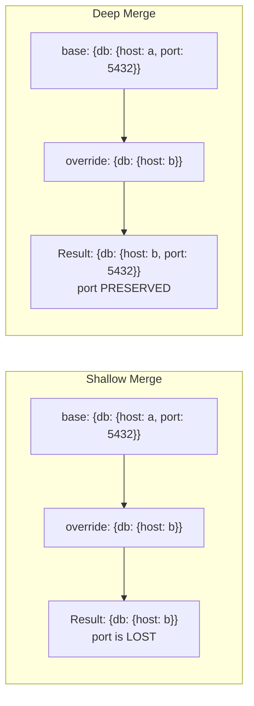

# How to Deep Merge Dictionaries in Ansible

Author: [nawazdhandala](https://www.github.com/nawazdhandala)

Tags: Ansible, Dictionary, Deep Merge, Configuration Management

Description: Learn how to deep merge dictionaries in Ansible using combine with recursive option, list_merge parameter, and custom merge strategies for nested configurations.

---

Shallow merging replaces entire nested dictionaries when keys overlap. Deep merging, on the other hand, recursively merges nested dictionaries key by key, preserving keys that exist in either source. This distinction matters enormously when working with layered configuration data.

## The Problem: Shallow Merge Loses Data

Without deep merging, nested dictionaries are replaced entirely:

```yaml
# playbook-shallow-problem.yml
# Demonstrates the data loss problem with shallow (default) merging
- name: Demonstrate shallow merge problem
  hosts: localhost
  gather_facts: false
  vars:
    base_config:
      database:
        host: localhost
        port: 5432
        pool_size: 5
        timeout: 30
      logging:
        level: info
        format: json
        file: /var/log/app.log

    override:
      database:
        host: db.production.internal
      logging:
        level: debug

  tasks:
    - name: Shallow merge (default behavior)
      ansible.builtin.set_fact:
        shallow_result: "{{ base_config | combine(override) }}"

    - name: Show result - notice lost keys
      ansible.builtin.debug:
        var: shallow_result
```

Shallow merge output (port, pool_size, timeout, format, file are ALL lost):

```json
{
    "database": {"host": "db.production.internal"},
    "logging": {"level": "debug"}
}
```

## The Solution: recursive=true

Adding `recursive=true` to `combine` enables deep merging:

```yaml
# playbook-deep-merge.yml
# Uses recursive=true to deep merge, preserving all nested keys
- name: Deep merge with recursive=true
  hosts: localhost
  gather_facts: false
  vars:
    base_config:
      database:
        host: localhost
        port: 5432
        pool_size: 5
        timeout: 30
      logging:
        level: info
        format: json
        file: /var/log/app.log

    override:
      database:
        host: db.production.internal
      logging:
        level: debug

  tasks:
    - name: Deep merge
      ansible.builtin.set_fact:
        deep_result: "{{ base_config | combine(override, recursive=true) }}"

    - name: Show result - all keys preserved
      ansible.builtin.debug:
        var: deep_result
```

Deep merge output (all keys preserved, only specified ones overridden):

```json
{
    "database": {
        "host": "db.production.internal",
        "port": 5432,
        "pool_size": 5,
        "timeout": 30
    },
    "logging": {
        "level": "debug",
        "format": "json",
        "file": "/var/log/app.log"
    }
}
```

## Merge Comparison



## Controlling List Merge Behavior

When deep merging, you also need to decide how to handle lists within the nested structures. The `list_merge` parameter controls this:

```yaml
# playbook-list-merge.yml
# Demonstrates different list merging strategies during deep merge
- name: Deep merge with list_merge options
  hosts: localhost
  gather_facts: false
  vars:
    base:
      firewall:
        allowed_ports:
          - 22
          - 80
          - 443
        blocked_ips:
          - 10.0.0.1
      features:
        - logging
        - monitoring

    additions:
      firewall:
        allowed_ports:
          - 8080
          - 9090
        blocked_ips:
          - 10.0.0.2
      features:
        - alerting

  tasks:
    - name: "list_merge='replace' (default) - lists are replaced"
      ansible.builtin.debug:
        msg: "{{ base | combine(additions, recursive=true, list_merge='replace') }}"

    - name: "list_merge='append' - lists are concatenated"
      ansible.builtin.debug:
        msg: "{{ base | combine(additions, recursive=true, list_merge='append') }}"

    - name: "list_merge='prepend' - new items come first"
      ansible.builtin.debug:
        msg: "{{ base | combine(additions, recursive=true, list_merge='prepend') }}"

    - name: "list_merge='append_rp' - append and remove duplicates"
      ansible.builtin.debug:
        msg: "{{ base | combine(additions, recursive=true, list_merge='append_rp') }}"
```

Available `list_merge` options:
- `replace` (default): Override list entirely
- `keep`: Keep the original list
- `append`: Add new items to end
- `prepend`: Add new items to beginning
- `append_rp`: Append and remove duplicates (keep last occurrence)
- `prepend_rp`: Prepend and remove duplicates (keep first occurrence)

## Multi-Layer Deep Merge

Deep merging multiple layers of configuration:

```yaml
# playbook-multi-layer.yml
# Deep merges four configuration layers with increasing specificity
- name: Multi-layer deep merge
  hosts: localhost
  gather_facts: false
  vars:
    global_defaults:
      app:
        port: 8080
        workers: 4
        debug: false
      database:
        port: 5432
        pool_size: 5
        ssl: false
      monitoring:
        enabled: true
        interval: 60

    environment_config:
      app:
        workers: 8
      database:
        host: db.production.internal
        ssl: true
      monitoring:
        interval: 30

    region_config:
      app:
        workers: 16
      database:
        pool_size: 20

    host_config:
      app:
        bind_address: "10.0.1.5"

  tasks:
    - name: Deep merge all four layers
      ansible.builtin.set_fact:
        final_config: >-
          {{ global_defaults |
             combine(environment_config, recursive=true) |
             combine(region_config, recursive=true) |
             combine(host_config, recursive=true) }}

    - name: Show final merged config
      ansible.builtin.debug:
        var: final_config
```

Result has all keys from all layers, with later layers overriding earlier ones at each nested level.

## Deep Merge a List of Dictionaries

When you have an arbitrary number of config fragments:

```yaml
# playbook-merge-list.yml
# Deep merges a dynamic list of configuration fragments sequentially
- name: Deep merge list of dicts
  hosts: localhost
  gather_facts: false
  vars:
    config_layers:
      - server:
          port: 80
          workers: 2
      - server:
          port: 443
          ssl: true
      - server:
          workers: 8
          timeout: 30
      - monitoring:
          enabled: true

  tasks:
    - name: Deep merge all fragments
      ansible.builtin.set_fact:
        merged: "{{ merged | default({}) | combine(item, recursive=true) }}"
      loop: "{{ config_layers }}"

    - name: Show merged result
      ansible.builtin.debug:
        var: merged
```

## Deeply Nested Structures (3+ Levels)

Deep merge handles arbitrary nesting depth:

```yaml
# playbook-deep-nested.yml
# Deep merges configurations with 4 levels of nesting
- name: Deep merge with 4 levels of nesting
  hosts: localhost
  gather_facts: false
  vars:
    base:
      level1:
        level2:
          level3:
            level4:
              value_a: original_a
              value_b: original_b
              value_c: original_c

    override:
      level1:
        level2:
          level3:
            level4:
              value_b: overridden_b
            new_key: added

  tasks:
    - name: Deep merge preserves all levels
      ansible.builtin.set_fact:
        result: "{{ base | combine(override, recursive=true) }}"

    - name: Verify deep preservation
      ansible.builtin.debug:
        msg:
          value_a: "{{ result.level1.level2.level3.level4.value_a }}"
          value_b: "{{ result.level1.level2.level3.level4.value_b }}"
          value_c: "{{ result.level1.level2.level3.level4.value_c }}"
          new_key: "{{ result.level1.level2.level3.new_key }}"
```

## Practical Example: Kubernetes Deployment Overlay

```yaml
# playbook-k8s-overlay.yml
# Deep merges base Kubernetes deployment spec with environment-specific overlays
- name: K8s deployment overlay
  hosts: localhost
  gather_facts: false
  vars:
    base_deployment:
      apiVersion: apps/v1
      kind: Deployment
      metadata:
        name: myapp
        labels:
          app: myapp
      spec:
        replicas: 1
        selector:
          matchLabels:
            app: myapp
        template:
          spec:
            containers:
              - name: myapp
                image: myapp:latest
                resources:
                  requests:
                    cpu: "100m"
                    memory: "128Mi"
                  limits:
                    cpu: "500m"
                    memory: "512Mi"
                env:
                  - name: LOG_LEVEL
                    value: info

    production_overlay:
      spec:
        replicas: 5
        template:
          spec:
            containers:
              - name: myapp
                image: myapp:2.1.0
                resources:
                  requests:
                    cpu: "500m"
                    memory: "512Mi"
                  limits:
                    cpu: "2000m"
                    memory: "2Gi"

  tasks:
    - name: Merge base with production overlay
      ansible.builtin.set_fact:
        prod_deployment: "{{ base_deployment | combine(production_overlay, recursive=true) }}"

    - name: Write production manifest
      ansible.builtin.copy:
        content: "{{ prod_deployment | to_nice_yaml(indent=2) }}"
        dest: /tmp/deployment-production.yml

    - name: Verify merge
      ansible.builtin.debug:
        msg:
          replicas: "{{ prod_deployment.spec.replicas }}"
          image: "{{ prod_deployment.spec.template.spec.containers[0].image }}"
          cpu_limit: "{{ prod_deployment.spec.template.spec.containers[0].resources.limits.cpu }}"
```

## Summary

Deep merging with `combine(recursive=true)` is essential for layered configuration management in Ansible. It preserves nested keys that are not explicitly overridden, while still allowing specific keys to be changed at any depth. Use `list_merge` to control whether lists within the structure are replaced, appended, or prepended. For multi-layer configurations, chain combine calls or loop over a list of fragments. This pattern is the backbone of overlay-style configuration where you have defaults, environment settings, region settings, and host-specific overrides that all need to merge cleanly.
