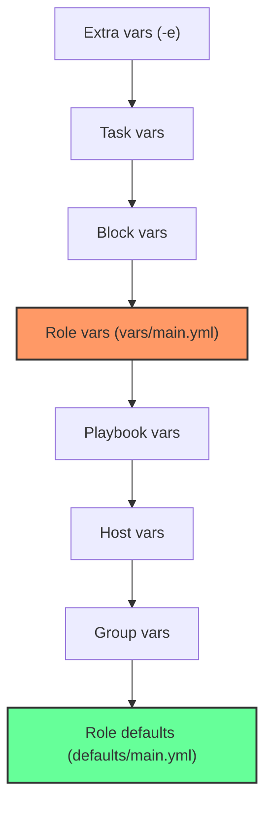

# How to Define Role Variables in Ansible

Author: [nawazdhandala](https://www.github.com/nawazdhandala)

Tags: Ansible, Roles, Variables, YAML

Description: Understand how to define role variables in Ansible using the vars directory, including precedence rules and practical use cases.

---

Ansible roles have two places to define variables: `defaults/` and `vars/`. While defaults are meant to be overridden, role vars are the opposite. They carry high precedence and are intended for values that should remain constant within the role. Knowing when to use each is critical for building roles that behave predictably. This post dives into the `vars/` directory, how it differs from `defaults/`, and how to use it correctly.

## Where Role Variables Live

Role variables are defined in `vars/main.yml`:

```
roles/
  database/
    vars/
      main.yml    <-- high-priority role variables
    defaults/
      main.yml    <-- low-priority defaults
    tasks/
      main.yml
```

Like defaults, Ansible automatically loads `vars/main.yml` when the role is applied. No manual includes are needed.

## The Precedence Difference

This is the single most important thing to understand. In Ansible's 22-level variable precedence hierarchy, role defaults sit near the bottom (level 2), while role vars sit at level 18. That means role vars override almost everything except:

- Block variables
- Task variables
- `include_params`
- `set_fact` / `register`
- Extra vars (`-e`)

Here is a simplified view of the relevant precedence levels:



## When to Use vars/ vs defaults/

The rule of thumb is:

- **defaults/**: Values you *want* consumers to override (port numbers, versions, feature flags)
- **vars/**: Internal constants that *should not* be overridden (package names, file paths that depend on the OS, config file locations)

Here is a concrete example. Consider a PostgreSQL role:

```yaml
# roles/postgresql/defaults/main.yml
# Consumer-facing configuration - override these freely
---
postgresql_version: "15"
postgresql_port: 5432
postgresql_max_connections: 100
postgresql_shared_buffers: "256MB"
postgresql_effective_cache_size: "1GB"
postgresql_listen_addresses: "localhost"
```

```yaml
# roles/postgresql/vars/main.yml
# Internal constants derived from the version - do not override
---
postgresql_service_name: "postgresql-{{ postgresql_version }}"
postgresql_data_dir: "/var/lib/pgsql/{{ postgresql_version }}/data"
postgresql_config_dir: "/etc/postgresql/{{ postgresql_version }}/main"
postgresql_bin_dir: "/usr/pgsql-{{ postgresql_version }}/bin"
```

The defaults are things a DBA would tune. The vars are internal paths that must match the installed version and should not be changed arbitrarily.

## OS-Specific Variables

One of the most common patterns for role vars is loading different values based on the target operating system. Package names, service names, and file paths differ between distros, and `vars/` is the right place to handle that.

Create separate variable files per OS family:

```yaml
# roles/postgresql/vars/Debian.yml
# Package and path differences for Debian/Ubuntu
---
postgresql_packages:
  - "postgresql-{{ postgresql_version }}"
  - "postgresql-client-{{ postgresql_version }}"
  - "postgresql-contrib-{{ postgresql_version }}"
postgresql_config_dir: "/etc/postgresql/{{ postgresql_version }}/main"
postgresql_service_name: "postgresql"
```

```yaml
# roles/postgresql/vars/RedHat.yml
# Package and path differences for RHEL/CentOS/Rocky
---
postgresql_packages:
  - "postgresql{{ postgresql_version }}-server"
  - "postgresql{{ postgresql_version }}-contrib"
postgresql_config_dir: "/var/lib/pgsql/{{ postgresql_version }}/data"
postgresql_service_name: "postgresql-{{ postgresql_version }}"
```

Then load the appropriate file in your tasks:

```yaml
# roles/postgresql/tasks/main.yml
# Load the right variable file for the target OS family
---
- name: Load OS-specific variables
  ansible.builtin.include_vars: "{{ ansible_os_family }}.yml"

- name: Install PostgreSQL packages
  ansible.builtin.package:
    name: "{{ postgresql_packages }}"
    state: present
```

The `include_vars` module loads variables at task runtime and gives them high precedence (even higher than `vars/main.yml`), which makes it perfect for overriding values based on discovered facts.

## Computed Variables

Sometimes you need variables that are derived from other variables. The `vars/` directory is a natural place for these:

```yaml
# roles/myapp/vars/main.yml
# Computed values derived from defaults - keep these as internal constants
---
myapp_download_url: "https://releases.example.com/{{ myapp_version }}/myapp-{{ myapp_version }}-linux-amd64.tar.gz"
myapp_checksum_url: "https://releases.example.com/{{ myapp_version }}/SHA256SUMS"
myapp_binary_path: "{{ myapp_install_dir }}/bin/myapp"
myapp_config_path: "{{ myapp_install_dir }}/config/app.yml"
myapp_pid_file: "/run/myapp/myapp.pid"
myapp_socket_path: "/run/myapp/myapp.sock"
```

These depend on values from `defaults/main.yml` (like `myapp_version` and `myapp_install_dir`), but they represent internal implementation details. Nobody consuming the role should need to change the download URL format or PID file location.

## Using vars/ as a Directory (Ansible 2.11+)

Just like with defaults, you can use a directory instead of a single file:

```
roles/postgresql/vars/
  main/
    paths.yml
    packages.yml
    services.yml
  Debian.yml
  RedHat.yml
```

```yaml
# roles/postgresql/vars/main/paths.yml
---
postgresql_data_dir: "/var/lib/pgsql/{{ postgresql_version }}/data"
postgresql_bin_dir: "/usr/pgsql-{{ postgresql_version }}/bin"
postgresql_log_dir: "/var/log/postgresql"
```

```yaml
# roles/postgresql/vars/main/packages.yml
---
postgresql_common_packages:
  - python3-psycopg2
  - acl
```

Files in `vars/main/` are auto-loaded and merged. The OS-specific files (`Debian.yml`, `RedHat.yml`) remain separate because you load them explicitly with `include_vars`.

## Protecting Internal Variables

Since role vars have high precedence, they are naturally hard to override from inventory or group vars. But they can still be overridden by task vars, block vars, and extra vars. If you absolutely need a value to be immutable, you can validate it:

```yaml
# roles/postgresql/tasks/main.yml
# Ensure nobody has overridden a critical internal variable
---
- name: Validate that config directory matches expected pattern
  ansible.builtin.assert:
    that:
      - postgresql_config_dir is match("/etc/postgresql/.*|/var/lib/pgsql/.*")
    fail_msg: "postgresql_config_dir has an unexpected value: {{ postgresql_config_dir }}"
    quiet: yes
```

## Combining set_fact with Role Vars

Sometimes you need to compute a variable value at runtime based on gathered facts:

```yaml
# roles/postgresql/tasks/main.yml
# Compute memory-based settings from actual system RAM
---
- name: Calculate shared_buffers based on system memory
  ansible.builtin.set_fact:
    postgresql_calculated_shared_buffers: "{{ (ansible_memtotal_mb * 0.25) | int }}MB"
  when: postgresql_shared_buffers == "auto"
```

Variables set with `set_fact` have higher precedence than role vars, so this pattern works well for dynamic computation.

## A Complete Example

Let's put it all together with a role that installs and configures Redis:

```yaml
# roles/redis/defaults/main.yml
---
redis_version: "7.2"
redis_port: 6379
redis_bind: "127.0.0.1"
redis_maxmemory: "256mb"
redis_maxmemory_policy: "allkeys-lru"
redis_appendonly: "yes"
```

```yaml
# roles/redis/vars/main.yml
---
redis_config_file: "/etc/redis/redis.conf"
redis_log_file: "/var/log/redis/redis-server.log"
redis_data_dir: "/var/lib/redis"
redis_pid_file: "/var/run/redis/redis-server.pid"
```

```yaml
# roles/redis/vars/Debian.yml
---
redis_packages:
  - redis-server
  - redis-tools
redis_service_name: redis-server
```

```yaml
# roles/redis/vars/RedHat.yml
---
redis_packages:
  - redis
redis_service_name: redis
```

```yaml
# roles/redis/tasks/main.yml
---
- name: Load OS-specific variables
  ansible.builtin.include_vars: "{{ ansible_os_family }}.yml"

- name: Install Redis packages
  ansible.builtin.package:
    name: "{{ redis_packages }}"
    state: present

- name: Deploy Redis configuration
  ansible.builtin.template:
    src: redis.conf.j2
    dest: "{{ redis_config_file }}"
    owner: redis
    group: redis
    mode: '0640'
  notify: Restart Redis

- name: Ensure Redis is running
  ansible.builtin.service:
    name: "{{ redis_service_name }}"
    state: started
    enabled: yes
```

## Wrapping Up

Role variables in `vars/main.yml` serve a fundamentally different purpose than role defaults. Defaults are the public API of your role. Vars are the internal implementation details. Use `vars/` for OS-specific package names, computed paths, service names, and anything else that should stay constant regardless of who is consuming the role. Use `defaults/` for everything you want consumers to configure. Getting this split right makes your roles predictable, portable, and easy to maintain.
