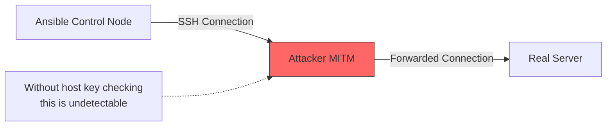

# How to Disable SSH Host Key Checking in Ansible

Author: [nawazdhandala](https://www.github.com/nawazdhandala)

Tags: Ansible, SSH, Host Key Checking, Security

Description: Learn how and when to disable SSH host key checking in Ansible, along with the security trade-offs and better alternatives.

---

The first time you SSH into a new server, you see that familiar prompt: "The authenticity of host X can't be established. Are you sure you want to continue connecting?" This is SSH host key verification, and it is a critical security feature. But in automated environments, this interactive prompt breaks everything. Ansible cannot answer "yes" to a prompt, so you need a strategy for handling host keys. Let us look at all the options, from quick-and-dirty to production-ready.

## The Problem

When Ansible tries to connect to a host it has never contacted before, SSH blocks the connection waiting for manual confirmation:

```
The authenticity of host '192.168.1.10 (192.168.1.10)' can't be established.
ED25519 key fingerprint is SHA256:abc123def456...
Are you sure you want to continue connecting (yes/no/[fingerprint])?
```

In an automated pipeline, there is nobody to type "yes." The connection fails, and your playbook dies.

## Method 1: ansible.cfg (Most Common)

The most popular approach is disabling host key checking in the Ansible configuration file:

```ini
# ansible.cfg
[defaults]
host_key_checking = False
```

This tells Ansible to skip host key verification entirely. It applies to all connections made by Ansible from this project directory.

## Method 2: Environment Variable

For temporary disabling or CI/CD pipelines:

```bash
# Disable host key checking for a single run
export ANSIBLE_HOST_KEY_CHECKING=False
ansible-playbook deploy.yml

# Or inline with the command
ANSIBLE_HOST_KEY_CHECKING=False ansible-playbook deploy.yml
```

## Method 3: SSH Arguments

Pass it directly through SSH arguments:

```ini
# ansible.cfg
[ssh_connection]
ssh_args = -o StrictHostKeyChecking=no -o UserKnownHostsFile=/dev/null
```

The `UserKnownHostsFile=/dev/null` part prevents SSH from saving host keys to the known_hosts file, which avoids "host key changed" warnings when you reprovision servers with the same IP.

## Method 4: Inventory Variables

Disable it per host or per group:

```ini
# inventory/hosts
[webservers]
web01 ansible_host=192.168.1.10 ansible_ssh_extra_args="-o StrictHostKeyChecking=no"
web02 ansible_host=192.168.1.11 ansible_ssh_extra_args="-o StrictHostKeyChecking=no"

[webservers:vars]
ansible_ssh_extra_args=-o StrictHostKeyChecking=no -o UserKnownHostsFile=/dev/null
```

## Method 5: In Group Variables

```yaml
# group_vars/all.yml
ansible_ssh_extra_args: "-o StrictHostKeyChecking=no -o UserKnownHostsFile=/dev/null"
```

Or scope it to specific groups:

```yaml
# group_vars/dynamic_servers.yml
# Only disable for servers that get reprovisioned frequently
ansible_ssh_extra_args: "-o StrictHostKeyChecking=no -o UserKnownHostsFile=/dev/null"
```

## The Security Implications

Disabling host key checking makes you vulnerable to man-in-the-middle (MITM) attacks. Without host key verification, someone could intercept your SSH connection, present their own server as the target, and you would have no way of knowing. They would see every command you send and every response you receive.



In practice, this risk is lower on internal networks where you control the infrastructure. But on cloud environments with dynamic IPs, or when connecting over the public internet, the risk is real.

## Better Alternative: StrictHostKeyChecking=accept-new

Instead of disabling host key checking entirely, use `accept-new`:

```ini
# ansible.cfg
[ssh_connection]
ssh_args = -o StrictHostKeyChecking=accept-new
```

This tells SSH:
- **New host**: Accept the key automatically and save it (no prompt)
- **Known host, same key**: Connect normally
- **Known host, different key**: Reject the connection (potential MITM)

This gives you the best of both worlds. New servers work without prompts, but you are still protected if a known server's key changes unexpectedly.

## Pre-Populating known_hosts

The most secure approach is to add host keys to `known_hosts` before connecting:

```bash
# Scan a host's SSH key and add it to known_hosts
ssh-keyscan -H 192.168.1.10 >> ~/.ssh/known_hosts

# Scan multiple hosts
ssh-keyscan -H 192.168.1.10 192.168.1.11 192.168.1.12 >> ~/.ssh/known_hosts

# Scan an entire subnet (be patient)
for i in $(seq 1 254); do
    ssh-keyscan -H 192.168.1.$i 2>/dev/null >> ~/.ssh/known_hosts
done
```

Automate it with Ansible using the `known_hosts` module:

```yaml
# populate_known_hosts.yml
---
- name: Populate known_hosts file
  hosts: localhost
  gather_facts: no

  tasks:
    # Scan and register host keys
    - name: Scan host keys
      command: "ssh-keyscan -H {{ item }}"
      register: host_keys
      loop:
        - 192.168.1.10
        - 192.168.1.11
        - 192.168.1.12
      changed_when: false

    # Add keys to known_hosts
    - name: Add to known_hosts
      known_hosts:
        name: "{{ item.item }}"
        key: "{{ item.stdout }}"
        state: present
      loop: "{{ host_keys.results }}"
```

## Handling Dynamic Infrastructure

In cloud environments where servers come and go, host keys change constantly. Here is a practical approach:

```yaml
# group_vars/cloud_instances.yml
# For ephemeral cloud instances, disable strict checking
# but still warn about changed keys
ansible_ssh_extra_args: >-
  -o StrictHostKeyChecking=accept-new
  -o UserKnownHostsFile=~/.ssh/known_hosts_ansible
```

Using a separate `known_hosts` file for Ansible keeps your personal known_hosts clean and avoids conflicts when cloud IPs get reassigned.

## CI/CD Pipeline Configuration

In CI/CD, you typically want to disable host key checking because the runner is ephemeral:

```yaml
# GitLab CI example
deploy:
  stage: deploy
  script:
    - export ANSIBLE_HOST_KEY_CHECKING=False
    - ansible-playbook -i inventory/production deploy.yml
  variables:
    ANSIBLE_HOST_KEY_CHECKING: "False"
```

```yaml
# GitHub Actions example
- name: Deploy with Ansible
  env:
    ANSIBLE_HOST_KEY_CHECKING: "False"
  run: |
    ansible-playbook -i inventory/production deploy.yml
```

## Clearing Stale Host Keys

When a server is reprovisioned, its host key changes. You will see this error:

```
@@@@@@@@@@@@@@@@@@@@@@@@@@@@@@@@@@@@@@@@@@@@@@@@@@@@@@@@@@@
@    WARNING: REMOTE HOST IDENTIFICATION HAS CHANGED!     @
@@@@@@@@@@@@@@@@@@@@@@@@@@@@@@@@@@@@@@@@@@@@@@@@@@@@@@@@@@@
```

Fix it by removing the old key:

```bash
# Remove a specific host's key
ssh-keygen -R 192.168.1.10

# Remove by hostname
ssh-keygen -R web01.example.com

# Remove from a custom known_hosts file
ssh-keygen -R 192.168.1.10 -f ~/.ssh/known_hosts_ansible
```

Automate stale key cleanup:

```yaml
# cleanup_host_keys.yml
---
- name: Clean up and refresh host keys
  hosts: localhost
  gather_facts: no

  tasks:
    - name: Remove old host keys
      command: "ssh-keygen -R {{ item }}"
      loop: "{{ groups['webservers'] | map('extract', hostvars, 'ansible_host') | list }}"
      ignore_errors: yes

    - name: Scan new host keys
      command: "ssh-keyscan -H {{ item }}"
      register: new_keys
      loop: "{{ groups['webservers'] | map('extract', hostvars, 'ansible_host') | list }}"

    - name: Add new keys to known_hosts
      known_hosts:
        name: "{{ item.item }}"
        key: "{{ item.stdout }}"
        state: present
      loop: "{{ new_keys.results }}"
```

## Recommended Settings by Environment

| Environment | Setting | Reason |
|------------|---------|--------|
| Development | `StrictHostKeyChecking=no` | Convenience, low risk |
| CI/CD | `StrictHostKeyChecking=no` | Ephemeral runners, no persistent state |
| Staging | `StrictHostKeyChecking=accept-new` | Balance of security and convenience |
| Production | `StrictHostKeyChecking=yes` + pre-populated known_hosts | Maximum security |

## Wrapping Up

Disabling host key checking in Ansible is one of those settings everyone copies from a blog post without understanding the implications. For development and CI/CD, disabling it is fine. For production, take the time to either use `accept-new` or pre-populate your `known_hosts` file. The extra effort is minimal compared to the security benefit. And if you are managing dynamic cloud infrastructure, use a separate `known_hosts` file for Ansible to keep things clean and avoid conflicts with your personal SSH configuration.
