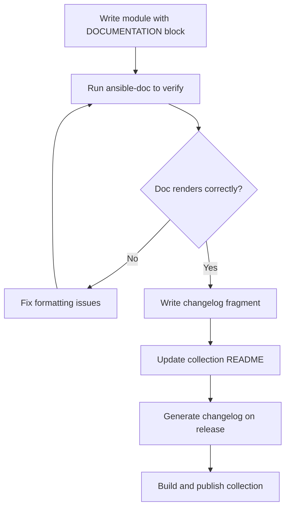

# How to Document Ansible Collections

Author: [nawazdhandala](https://www.github.com/nawazdhandala)

Tags: Ansible, Documentation, Collections, DevOps

Description: How to write effective documentation for Ansible collections including module docs, collection-level docs, changelogs, and docsite generation.

---

Good documentation is the difference between a collection people actually use and one they abandon after 10 minutes of confusion. Ansible has a built-in documentation system that parses structured strings from your Python code, but there is more to documenting a collection than just filling in DOCUMENTATION blocks.

This post covers the full documentation story: module-level docs, collection-level docs, changelogs, and how to generate a browsable documentation site.

## Module and Plugin Documentation

Every module and plugin should contain three documentation strings: `DOCUMENTATION`, `EXAMPLES`, and `RETURN`. Ansible parses these to generate help pages and the online documentation.

Here is a well-documented module showing all the sections:

```python
#!/usr/bin/python
# plugins/modules/config_entry.py

from __future__ import absolute_import, division, print_function
__metaclass__ = type

DOCUMENTATION = r"""
---
module: config_entry
short_description: Manage configuration entries in the app config store
version_added: "1.0.0"
description:
  - Creates, updates, or removes configuration entries from the
    application configuration store.
  - Supports encrypted values for sensitive configuration data.
  - Entries are identified by their unique key within a namespace.
options:
  key:
    description:
      - The configuration key to manage.
      - Must be unique within the specified namespace.
    required: true
    type: str
  value:
    description:
      - The value to set for the configuration key.
      - Required when C(state=present).
    required: false
    type: str
  namespace:
    description:
      - The configuration namespace.
      - Namespaces provide logical grouping for configuration entries.
      - Defaults to C(default) if not specified.
    required: false
    type: str
    default: default
  encrypted:
    description:
      - Whether to store the value in encrypted form.
      - When set to C(true), the value is encrypted at rest.
    required: false
    type: bool
    default: false
  state:
    description:
      - Whether the configuration entry should exist or not.
    required: false
    type: str
    choices:
      - present
      - absent
    default: present
  api_url:
    description:
      - URL of the configuration store API.
    required: true
    type: str
  api_token:
    description:
      - Authentication token for the API.
      - Can also be set via the C(CONFIG_STORE_TOKEN) environment variable.
    required: true
    type: str
    env:
      - name: CONFIG_STORE_TOKEN
notes:
  - This module requires network access to the configuration store API.
  - Encrypted values cannot be retrieved in plaintext after storage.
requirements:
  - requests >= 2.20.0
seealso:
  - module: my_namespace.my_collection.config_snapshot
    description: Create snapshots of configuration state.
  - name: Configuration Store API docs
    link: https://docs.internal.com/config-store/api
    description: Full API documentation for the configuration store.
author:
  - Platform Team (@platform-team)
"""

EXAMPLES = r"""
- name: Set a simple configuration value
  my_namespace.my_collection.config_entry:
    key: database_host
    value: db.internal.com
    namespace: production
    api_url: https://config.internal.com/api
    api_token: "{{ vault_config_token }}"

- name: Set an encrypted configuration value
  my_namespace.my_collection.config_entry:
    key: database_password
    value: "{{ vault_db_password }}"
    namespace: production
    encrypted: true
    api_url: https://config.internal.com/api
    api_token: "{{ vault_config_token }}"

- name: Remove a configuration entry
  my_namespace.my_collection.config_entry:
    key: deprecated_setting
    namespace: production
    state: absent
    api_url: https://config.internal.com/api
    api_token: "{{ vault_config_token }}"

- name: Set configuration in the default namespace
  my_namespace.my_collection.config_entry:
    key: log_level
    value: info
    api_url: https://config.internal.com/api
    api_token: "{{ vault_config_token }}"
"""

RETURN = r"""
entry:
  description: The configuration entry data after the operation.
  returned: when state is present
  type: dict
  contains:
    key:
      description: The configuration key.
      type: str
      returned: always
      sample: database_host
    value:
      description: The configuration value (masked if encrypted).
      type: str
      returned: always
      sample: db.internal.com
    namespace:
      description: The configuration namespace.
      type: str
      returned: always
      sample: production
    encrypted:
      description: Whether the value is stored encrypted.
      type: bool
      returned: always
      sample: false
    last_modified:
      description: Timestamp of the last modification.
      type: str
      returned: always
      sample: "2024-01-15T10:30:00Z"
previous_value:
  description: The previous value of the key (if it existed).
  returned: when changed
  type: str
  sample: old-db.internal.com
"""
```

### Documentation String Formatting

The DOCUMENTATION block supports special formatting:

- `C(text)` renders as inline code
- `I(text)` renders as italic
- `B(text)` renders as bold
- `U(url)` renders as a URL link
- `L(text, url)` renders as a named link
- `M(module.name)` renders as a module reference link
- `R(text, reference)` renders as a reference link

## Using ansible-doc to View Documentation

Test your documentation locally with `ansible-doc`:

```bash
# View module documentation
ansible-doc my_namespace.my_collection.config_entry

# View examples only
ansible-doc my_namespace.my_collection.config_entry -s

# View documentation for a filter plugin
ansible-doc -t filter my_namespace.my_collection.mask_sensitive

# View documentation for a lookup plugin
ansible-doc -t lookup my_namespace.my_collection.vault_secret

# List all modules in a collection
ansible-doc -l -t module my_namespace.my_collection
```

If `ansible-doc` shows errors, your documentation has formatting issues. Fix them before publishing.

## Collection-Level Documentation

Beyond module docs, your collection should have top-level documentation.

### README.md

The collection README is shown on Galaxy and is the first thing users see:

```markdown
# My Namespace - My Collection

This collection provides modules and roles for managing the internal
application configuration store and deployment pipeline.

## Requirements

- ansible-core >= 2.14
- Python >= 3.9
- requests >= 2.20.0

## Installation

Install from Ansible Galaxy:

    ansible-galaxy collection install my_namespace.my_collection

Install from a requirements file:

    ansible-galaxy collection install -r requirements.yml

## Included Content

### Modules

| Module | Description |
|--------|------------|
| config_entry | Manage configuration store entries |
| config_snapshot | Create configuration snapshots |
| app_deploy | Trigger application deployments |

### Roles

| Role | Description |
|------|------------|
| nginx_proxy | Set up Nginx as a reverse proxy |
| hardening | Apply system hardening configuration |

### Filter Plugins

| Filter | Description |
|--------|------------|
| mask_sensitive | Mask sensitive string values |
| to_tag_dict | Convert tag list to dictionary |

## Usage

Basic example:

    - name: Set database configuration
      my_namespace.my_collection.config_entry:
        key: database_host
        value: db.internal.com
        api_url: https://config.internal.com/api
        api_token: "{{ vault_config_token }}"

## License

MIT
```

### docs/ Directory

The `docs/` directory can contain additional documentation files. Ansible Galaxy and automation hub render these:

```
docs/
  docsite/
    rst/
      guide_getting_started.rst
      guide_authentication.rst
      guide_troubleshooting.rst
```

## Changelogs

Changelogs track what changed between versions. The `antsibull-changelog` tool generates them automatically from fragments.

Install the tool:

```bash
pip install antsibull-changelog
```

Initialize the changelog configuration:

```bash
cd /path/to/collection
antsibull-changelog init .
```

This creates `changelogs/config.yaml`:

```yaml
# changelogs/config.yaml
---
notesdir: fragments
changes_file: changelog.yaml
changes_format: combined
keep_fragments: false
changelog_filename_template: CHANGELOG.rst
changelog_filename_version_depth: 0
title: My Namespace.My Collection
```

### Writing Changelog Fragments

When you make a change, create a fragment file in `changelogs/fragments/`:

```yaml
# changelogs/fragments/42-add-config-entry-module.yml
---
minor_changes:
  - config_entry - New module for managing configuration store entries.
```

```yaml
# changelogs/fragments/45-fix-deploy-timeout.yml
---
bugfixes:
  - app_deploy - Fixed timeout calculation that caused premature failures
    on slow networks (https://github.com/org/repo/issues/45).
```

Fragment categories include:

| Category | When to Use |
|----------|------------|
| major_changes | Breaking changes or major features |
| minor_changes | New features, new modules |
| bugfixes | Bug fixes |
| deprecated_features | Features being deprecated |
| removed_features | Features removed in this version |
| breaking_changes | Changes that break backward compatibility |
| known_issues | Known issues in this release |

### Generating the Changelog

When preparing a release, generate the changelog:

```bash
# Generate changelog for a new version
antsibull-changelog release --version 1.2.0
```

This reads all fragments, combines them into `changelogs/changelog.yaml`, and generates `CHANGELOG.rst`:

```rst
===================================
My Namespace.My Collection Release Notes
===================================

.. contents:: Topics

v1.2.0
======

Minor Changes
-------------

- config_entry - New module for managing configuration store entries.

Bugfixes
--------

- app_deploy - Fixed timeout calculation that caused premature failures
  on slow networks (https://github.com/org/repo/issues/45).
```

## Documentation Fragments for Shared Options

When multiple modules share the same parameters, use documentation fragments to avoid repetition:

```python
# plugins/doc_fragments/config_store.py
# Shared documentation for configuration store connection parameters

from __future__ import absolute_import, division, print_function
__metaclass__ = type


class ModuleDocFragment(object):
    DOCUMENTATION = r"""
options:
  api_url:
    description:
      - URL of the configuration store API.
      - Can also be set via the C(CONFIG_STORE_URL) environment variable.
    required: true
    type: str
    env:
      - name: CONFIG_STORE_URL
  api_token:
    description:
      - Authentication token for the configuration store API.
      - Can also be set via the C(CONFIG_STORE_TOKEN) environment variable.
    required: true
    type: str
    no_log: true
    env:
      - name: CONFIG_STORE_TOKEN
  validate_certs:
    description:
      - Whether to validate SSL certificates when connecting to the API.
    required: false
    type: bool
    default: true
"""
```

Reference it in your module:

```python
DOCUMENTATION = r"""
---
module: config_entry
extends_documentation_fragment:
  - my_namespace.my_collection.config_store
# ... rest of documentation
"""
```

## Documentation Workflow



## Validating Documentation

Run sanity tests to catch documentation issues:

```bash
# The validate-modules test checks documentation format
ansible-test sanity --test validate-modules --docker

# Check for documentation compilation errors
ansible-test sanity --test compile --docker
```

Common documentation errors that sanity tests catch:

- Missing required fields in DOCUMENTATION
- Type mismatches between argument_spec and DOCUMENTATION
- Invalid formatting codes
- Missing EXAMPLES or RETURN blocks
- Incorrect YAML syntax in documentation strings

## Conclusion

Documentation is what turns code into a usable product. Fill in all three documentation strings for every module and plugin, use documentation fragments for shared parameters, maintain a changelog with antsibull-changelog, and keep your collection README up to date. Run `ansible-doc` locally to verify your docs render correctly, and let the sanity tests catch formatting issues in CI. Users who can understand your collection without reading the source code are users who will keep coming back.
