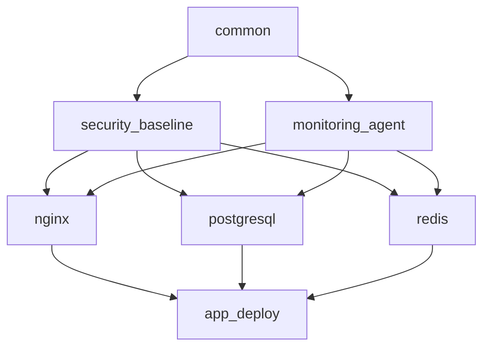

# How to Document Ansible Roles and Playbooks

Author: [nawazdhandala](https://www.github.com/nawazdhandala)

Tags: Ansible, Documentation, DevOps, Team Collaboration

Description: Learn how to write effective documentation for Ansible roles and playbooks that helps your team understand, maintain, and extend your automation.

---

Documentation is the part of Ansible projects that everyone skips until a new team member joins and spends three days figuring out what a role does. Or until you yourself come back to a playbook six months later and cannot remember why you wrote it that way. Good documentation does not need to be lengthy; it needs to be accurate and placed where people will actually find it.

## Role README Files

Every role should have a `README.md` at its root. Ansible Galaxy generates a template, but the default template is bloated. Here is a practical format:

```markdown
# nginx

Installs and configures Nginx as a reverse proxy with SSL termination.

## Requirements

- Ubuntu 20.04 or 22.04
- SSL certificates must be provisioned separately (see `ssl_certificates` role)

## Role Variables

| Variable | Default | Description |
|----------|---------|-------------|
| `nginx_worker_processes` | `auto` | Number of worker processes |
| `nginx_worker_connections` | `1024` | Max connections per worker |
| `nginx_ssl_enabled` | `true` | Enable SSL termination |
| `nginx_ssl_certificate` | `""` | Path to SSL certificate |
| `nginx_ssl_certificate_key` | `""` | Path to SSL private key |
| `nginx_vhosts` | `[]` | List of virtual host configs |

## Dependencies

- `common` role must run first

## Example Usage

```yaml
- hosts: webservers
  roles:
    - role: nginx
      nginx_ssl_enabled: true
      nginx_ssl_certificate: /etc/ssl/certs/example.crt
      nginx_ssl_certificate_key: /etc/ssl/private/example.key
      nginx_vhosts:
        - server_name: app.example.com
          proxy_pass: http://127.0.0.1:8080
```

## Handlers

- `Restart nginx` - Full restart, use when changing worker settings
- `Reload nginx` - Graceful reload, use when changing vhost configs

## Tags

- `nginx` - All nginx tasks
- `nginx_config` - Configuration tasks only
- `nginx_install` - Installation tasks only
```

## Documenting Variables Inline

Beyond the README, document variables where they are defined:

```yaml
# roles/postgresql/defaults/main.yml
# PostgreSQL version to install. Supported: 13, 14, 15, 16
postgresql_version: 15

# Listen addresses. Use '*' for all interfaces or specific IPs
# Example: '10.0.1.5,127.0.0.1'
postgresql_listen_addresses: 'localhost'

# Maximum number of concurrent connections
# Increase this for high-traffic databases
# Each connection uses approximately 10MB of memory
postgresql_max_connections: 200

# Shared buffer size. Recommended: 25% of total system memory
# Format: integer followed by MB or GB
postgresql_shared_buffers: '256MB'

# WAL level for replication. Options: minimal, replica, logical
# Use 'replica' for streaming replication
# Use 'logical' for logical replication or change data capture
postgresql_wal_level: replica

# List of databases to create
# Each entry must have 'name' and optionally 'owner' and 'encoding'
postgresql_databases:
  - name: appdb
    owner: appuser
    encoding: UTF-8
```

## Playbook Documentation

Document playbooks with a comment block at the top:

```yaml
# playbooks/deploy-application.yml
#
# Deploys the application to target servers with zero-downtime rolling update.
#
# Usage:
#   ansible-playbook playbooks/deploy-application.yml -i inventories/production/hosts.yml
#   ansible-playbook playbooks/deploy-application.yml -i inventories/staging/hosts.yml
#
# Required variables:
#   app_version - Git tag or branch to deploy (e.g., 'v2.1.0')
#
# Optional variables:
#   app_skip_migrations - Set to true to skip database migrations
#   app_rollback_version - Version to rollback to if deployment fails
#
# Tags:
#   deploy - Full deployment
#   migrations - Only run migrations
#   restart - Only restart services
#
# Example:
#   ansible-playbook playbooks/deploy-application.yml \
#     -i inventories/production/hosts.yml \
#     -e "app_version=v2.1.0"
#
- name: Deploy application with rolling update
  hosts: app_servers
  serial: "25%"
  become: yes
  vars:
    app_skip_migrations: false
  roles:
    - role: app_deploy
      tags: [deploy]
```

## Documenting Complex Tasks

When a task does something non-obvious, explain why:

```yaml
# roles/postgresql/tasks/configure.yml

# We set vm.overcommit_memory to 2 because PostgreSQL's shared memory
# allocation can cause the OOM killer to terminate the postmaster process
# under memory pressure. Setting overcommit to 2 ensures the kernel
# only commits memory it can actually back with RAM + swap.
- name: Set kernel overcommit memory policy
  ansible.builtin.sysctl:
    name: vm.overcommit_memory
    value: '2'
    state: present
    sysctl_set: yes

# The checkpoint_completion_target of 0.9 spreads checkpoint writes
# across 90% of the checkpoint interval, reducing I/O spikes.
# Default of 0.5 causes bursty writes that impact query latency.
- name: Configure WAL checkpoint settings
  ansible.builtin.lineinfile:
    path: /etc/postgresql/{{ postgresql_version }}/main/postgresql.conf
    regexp: '^#?checkpoint_completion_target'
    line: "checkpoint_completion_target = 0.9"
  notify: restart postgresql
```

## Meta Documentation for Roles

The `meta/main.yml` file serves as structured documentation:

```yaml
# roles/postgresql/meta/main.yml
galaxy_info:
  author: platform-team
  description: >
    Installs and configures PostgreSQL with support for streaming
    replication, custom extensions, and automated backups.
  license: MIT
  min_ansible_version: "2.14"

  platforms:
    - name: Ubuntu
      versions:
        - jammy
        - focal
    - name: Debian
      versions:
        - bookworm
        - bullseye

  galaxy_tags:
    - database
    - postgresql
    - replication

dependencies:
  - role: common
  # The common role must run first to ensure base packages
  # and NTP synchronization are configured. PostgreSQL replication
  # requires accurate time synchronization between nodes.
```

## Architecture Documentation

Create a high-level document that explains how roles relate to each other:

```yaml
# docs/architecture.md content (as a code example)
# This would be a markdown file in your docs/ directory

# Infrastructure Architecture
#
# The following roles are applied in order:
# 1. common - Base OS configuration, NTP, DNS
# 2. security_baseline - Firewall, SSH hardening, fail2ban
# 3. monitoring_agent - Prometheus node exporter
# 4. Service-specific roles (nginx, postgresql, redis, etc.)
```

Visualize the role dependency graph:



## Runbook Documentation

For operational playbooks, create runbooks that explain when and how to use them:

```yaml
# docs/runbooks/database-failover.md content structure:
#
# Database Failover Runbook
#
# When to use: Primary database is unresponsive after 5 minutes
#
# Pre-requisites:
# - Confirm primary is actually down (not a network issue)
# - Notify the on-call team in #incidents channel
#
# Steps:
# 1. Run the failover playbook:
#    ansible-playbook playbooks/db-failover.yml \
#      -i inventories/production/hosts.yml \
#      -e "new_primary=db02.prod.example.com"
#
# 2. Verify replication status:
#    ansible-playbook playbooks/db-check-replication.yml
#
# 3. Update DNS if needed:
#    ansible-playbook playbooks/update-dns.yml \
#      -e "record=db.example.com target=db02.prod.example.com"
#
# Rollback:
# If the old primary recovers, add it as a replica:
#    ansible-playbook playbooks/db-add-replica.yml \
#      -e "replica_host=db01.prod.example.com"
```

## Auto-Generating Documentation

You can generate variable documentation from defaults files:

```python
#!/usr/bin/env python3
# scripts/generate-role-docs.py
# Generates a markdown table of variables from role defaults

import yaml
import sys
import os

def extract_vars(defaults_file):
    """Parse defaults/main.yml and extract variable names and values."""
    with open(defaults_file, 'r') as f:
        content = f.read()

    data = yaml.safe_load(content)
    if not data:
        return []

    variables = []
    for key, value in data.items():
        variables.append({
            'name': key,
            'default': repr(value) if isinstance(value, (list, dict)) else str(value),
        })
    return variables

def generate_table(variables):
    """Generate a markdown table from variables."""
    lines = ['| Variable | Default |', '|----------|---------|']
    for var in variables:
        lines.append(f"| `{var['name']}` | `{var['default']}` |")
    return '\n'.join(lines)

if __name__ == '__main__':
    role_path = sys.argv[1]
    defaults_file = os.path.join(role_path, 'defaults', 'main.yml')
    if os.path.exists(defaults_file):
        variables = extract_vars(defaults_file)
        print(generate_table(variables))
```

## Summary

Good Ansible documentation lives close to the code it describes. Put a README in every role with variables, dependencies, and usage examples. Comment variables where they are defined. Document playbooks with usage instructions at the top. Explain non-obvious tasks with comments that describe the "why." Create runbooks for operational procedures. The goal is not comprehensive prose but enough context that any engineer on your team can understand, use, and modify your automation without hunting you down for answers.
