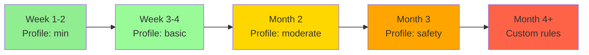
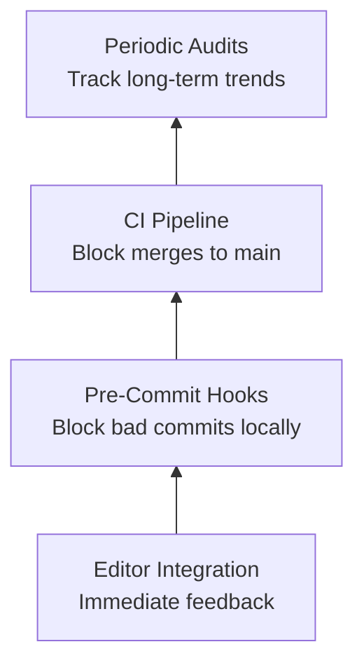

# How to Enforce Ansible Code Standards with Linting

Author: [nawazdhandala](https://www.github.com/nawazdhandala)

Tags: Ansible, Linting, Code Standards, DevOps, Best Practices

Description: A comprehensive guide to establishing and enforcing Ansible code standards across your team using linting tools, CI pipelines, and governance processes.

---

Every team that writes Ansible code eventually faces the same problem: inconsistent quality. One person uses FQCN everywhere while another uses short module names. Someone names their tasks in lowercase, another uses Title Case. Variables follow three different naming conventions. The result is a codebase that is hard to read, harder to maintain, and even harder to onboard new team members into.

Linting solves this by turning your coding standards from suggestions into automated checks. In this post, we will build a complete code standards enforcement strategy using ansible-lint, yamllint, pre-commit hooks, and CI pipelines.

## Step 1: Define Your Standards

Before configuring any tools, document the standards your team will follow. Write them down in a simple format that everyone can reference.

Here is an example standards document:

```yaml
# docs/ansible-standards.yml - Team coding standards
---
formatting:
  indentation: 2 spaces
  line_length: 160
  truthy_values: "true/false only"
  document_start: "required (---)"
  trailing_whitespace: "not allowed"
  final_newline: "required"

naming:
  tasks: "Start with capital letter, no Jinja2 templates"
  variables: "snake_case, role-prefixed in roles"
  roles: "lowercase with underscores"
  handlers: "Descriptive, match notify exactly"

modules:
  fqcn: "required for all modules"
  deprecated: "not allowed, migrate immediately"
  shell_vs_command: "use command unless shell features needed"

security:
  file_permissions: "always set explicitly"
  become_user: "always specify when using become"
  secrets: "use Ansible Vault or external secrets manager"
  no_hardcoded_passwords: "enforced"

tags:
  required: "at least one tag per task"
  conventions: "lowercase, hyphen-separated"
```

## Step 2: Configure yamllint

Start with the YAML layer. yamllint catches structural issues that affect all YAML files.

```yaml
# .yamllint.yml - YAML formatting standards
---
extends: default

rules:
  line-length:
    max: 160
    level: warning
    allow-non-breakable-inline-mappings: true
  truthy:
    allowed-values: ["true", "false"]
    check-keys: false
  comments:
    require-starting-space: true
    min-spaces-from-content: 2
  indentation:
    spaces: 2
    indent-sequences: true
  document-start:
    present: true
  document-end: disable
  empty-lines:
    max: 2
    max-start: 0
    max-end: 0
  octal-values:
    forbid-implicit-octal: true

ignore: |
  .cache/
  .git/
  collections/
  venv/
```

## Step 3: Configure ansible-lint

Layer Ansible-specific checks on top of yamllint:

```yaml
# .ansible-lint - Ansible code quality standards
---
profile: safety

exclude_paths:
  - .cache/
  - .git/
  - collections/ansible_collections/
  - roles/external/
  - molecule/

# Rules we skip with documented reasons
skip_list:
  # yamllint handles YAML formatting, avoid duplicate warnings
  - yaml

# Rules that warn but do not block
warn_list:
  - experimental

# Optional rules we want enabled
enable_list:
  - no-same-owner
```

## Step 4: Add Custom Rules

Encode your team-specific standards as custom ansible-lint rules:

```python
# custom_rules/require_task_tags.py - Enforce tag requirements
"""Require tags on all tasks."""
from ansiblelint.rules import AnsibleLintRule


class RequireTaskTagsRule(AnsibleLintRule):
    """All tasks must have at least one tag."""

    id = "org-require-tags"
    description = "Tasks must have tags for selective execution."
    severity = "MEDIUM"
    tags = ["organizational"]

    SKIP_MODULES = {"meta", "ansible.builtin.meta"}

    def matchtask(self, task, file=None):
        module = task.get("action", {}).get("__ansible_module__", "")
        if module in self.SKIP_MODULES:
            return False

        if file and hasattr(file, "kind") and file.kind == "handlers":
            return False

        tags = task.get("tags", [])
        if not tags:
            return "Task is missing required tags"
        return False
```

```python
# custom_rules/require_file_permissions.py - Enforce explicit permissions
"""Require explicit file permissions on all file operations."""
from ansiblelint.rules import AnsibleLintRule


FILE_MODULES = [
    "ansible.builtin.copy",
    "ansible.builtin.template",
    "ansible.builtin.file",
    "ansible.builtin.unarchive",
    "ansible.builtin.get_url",
]


class RequireFilePermissionsRule(AnsibleLintRule):
    """File operations must set explicit permissions."""

    id = "org-file-permissions"
    description = "All file operations must include mode, owner, and group."
    severity = "HIGH"
    tags = ["organizational", "security"]

    def matchtask(self, task, file=None):
        module = task.get("action", {}).get("__ansible_module__", "")

        if module not in FILE_MODULES:
            return False

        action = task.get("action", {})
        state = action.get("state", "file")

        # Skip directory removal and link operations
        if state in ("absent", "link"):
            return False

        missing = []
        if "mode" not in action:
            missing.append("mode")
        if "owner" not in action:
            missing.append("owner")
        if "group" not in action:
            missing.append("group")

        if missing:
            return f"File task is missing: {', '.join(missing)}"
        return False
```

Reference the custom rules:

```yaml
# .ansible-lint - Include custom rules
---
profile: safety
rulesdir:
  - ./custom_rules/
```

## Step 5: Set Up Pre-Commit Hooks

Catch violations before they reach the repository:

```yaml
# .pre-commit-config.yaml - Local enforcement
---
repos:
  - repo: https://github.com/pre-commit/pre-commit-hooks
    rev: v4.6.0
    hooks:
      - id: end-of-file-fixer
        files: \.(yml|yaml)$
      - id: trailing-whitespace
        files: \.(yml|yaml)$
      - id: check-yaml
        args: [--unsafe]
        exclude: templates/

  - repo: https://github.com/adrienverge/yamllint
    rev: v1.35.1
    hooks:
      - id: yamllint
        args: [-c, .yamllint.yml]
        files: \.(yml|yaml)$
        exclude: >-
          (?x)^(
            docker-compose\.yml|
            .github/.*|
            .pre-commit-config\.yaml
          )$

  - repo: https://github.com/ansible/ansible-lint
    rev: v24.10.0
    hooks:
      - id: ansible-lint
        additional_dependencies:
          - ansible.posix
          - community.general
```

## Step 6: Enforce in CI

The CI pipeline is the ultimate enforcer. Even if someone skips pre-commit hooks locally, CI catches everything:

```yaml
# .github/workflows/enforce-standards.yml - CI enforcement
---
name: Enforce Ansible Standards

on:
  pull_request:
    branches: [main]

jobs:
  yaml-lint:
    name: YAML Standards
    runs-on: ubuntu-latest
    steps:
      - uses: actions/checkout@v4
      - uses: actions/setup-python@v5
        with:
          python-version: "3.12"
          cache: "pip"
      - run: pip install yamllint
      - run: yamllint -c .yamllint.yml .

  ansible-lint:
    name: Ansible Standards
    runs-on: ubuntu-latest
    needs: yaml-lint
    steps:
      - uses: actions/checkout@v4
      - uses: actions/setup-python@v5
        with:
          python-version: "3.12"
          cache: "pip"
      - run: pip install ansible-lint
      - run: |
          if [ -f collections/requirements.yml ]; then
            ansible-galaxy collection install -r collections/requirements.yml
          fi
      - run: ansible-lint --sarif-file results.sarif || true
      - run: ansible-lint
      - uses: github/codeql-action/upload-sarif@v3
        with:
          sarif_file: results.sarif
        if: always()
```

Enable branch protection to require these checks to pass before merging.

## Step 7: Gradual Adoption Strategy

Do not try to enforce everything at once on an existing codebase. Here is a phased approach:



### Phase 1: Baseline (Weeks 1-2)

```yaml
# .ansible-lint - Phase 1: catch only critical issues
---
profile: min
progressive: true
```

Enable `progressive: true` so only new/changed files are checked. Existing violations are ignored.

### Phase 2: Basic Standards (Weeks 3-4)

```yaml
# .ansible-lint - Phase 2: enforce basic rules
---
profile: basic
progressive: true

warn_list:
  - fqcn[action-core]
  - name[casing]
```

### Phase 3: Full Standards (Month 2)

```yaml
# .ansible-lint - Phase 3: moderate enforcement
---
profile: moderate

warn_list:
  - name[template]
```

### Phase 4: Safety and Custom Rules (Month 3+)

```yaml
# .ansible-lint - Phase 4: full enforcement
---
profile: safety

rulesdir:
  - ./custom_rules/
```

## Monitoring Compliance

Track your linting progress over time:

```bash
#!/bin/bash
# scripts/lint-report.sh - Generate compliance report
echo "=== Ansible Lint Compliance Report ==="
echo "Date: $(date)"
echo ""

# Count total violations
total=$(ansible-lint -f codeclimate 2>/dev/null | python3 -c "
import json, sys
data = json.load(sys.stdin)
print(len(data))
" 2>/dev/null || echo "0")

echo "Total violations: $total"
echo ""

# Count violations by rule
echo "Violations by rule:"
ansible-lint -f codeclimate 2>/dev/null | python3 -c "
import json, sys
from collections import Counter
data = json.load(sys.stdin)
counts = Counter(item.get('check_name', 'unknown') for item in data)
for rule, count in counts.most_common():
    print(f'  {rule}: {count}')
" 2>/dev/null

echo ""
echo "Files with violations:"
ansible-lint -f codeclimate 2>/dev/null | python3 -c "
import json, sys
from collections import Counter
data = json.load(sys.stdin)
files = Counter(
    item.get('location', {}).get('path', 'unknown')
    for item in data
)
for f, count in files.most_common(10):
    print(f'  {f}: {count} violations')
" 2>/dev/null
```

Run this weekly to track progress:

```bash
bash scripts/lint-report.sh >> lint-history.log
```

## The Enforcement Pyramid

Think of enforcement as a pyramid with multiple layers:



Each layer catches what the previous one missed. The editor catches most issues immediately. Pre-commit hooks catch anything the developer overlooked. CI catches anything that slipped past local hooks. And periodic audits identify systemic issues that need attention.

## Making It Stick

The technical setup is the easy part. The hard part is getting your team to adopt and maintain the standards. Here are some practical tips:

1. **Involve the team in defining standards.** People follow rules they helped create.

2. **Start lenient and get stricter over time.** A flood of violations on day one kills motivation.

3. **Fix violations as a team activity.** Schedule a "lint fix" sprint where everyone contributes.

4. **Celebrate progress.** Share the compliance report and acknowledge improvement.

5. **Make the tooling easy.** A single `make lint` command should run everything.

6. **Document exceptions.** When someone needs to skip a rule, require a comment explaining why.

Code standards enforcement is not about being pedantic. It is about making your Ansible codebase consistent, readable, and maintainable as your team and infrastructure grow. The investment in setting up proper linting pays for itself many times over in reduced code review friction, fewer production incidents from sloppy code, and faster onboarding for new team members.
