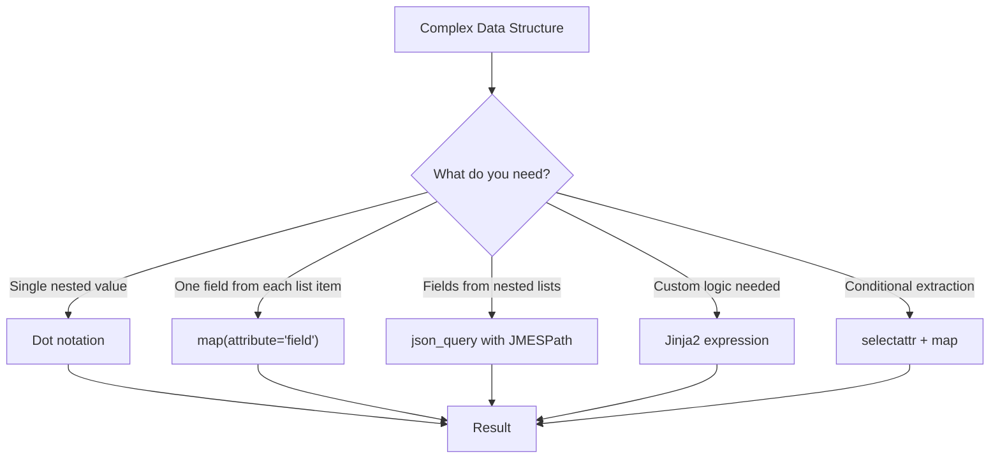

# How to Extract Specific Fields from Complex Data in Ansible

Author: [nawazdhandala](https://www.github.com/nawazdhandala)

Tags: Ansible, Data Extraction, Filters, JSON

Description: Learn how to extract specific fields from complex nested data structures in Ansible using map, json_query, dot notation, and custom Jinja2 expressions.

---

Real-world data from APIs, cloud providers, and monitoring systems is rarely flat. You get deeply nested dictionaries, lists of lists, and mixed structures that you need to drill into and pull out just the pieces you care about. This post covers all the techniques for extracting specific fields from complex data in Ansible.

## Dot Notation for Simple Access

The simplest method is direct dot notation on Ansible variables:

```yaml
# playbook-dot-notation.yml
# Accesses nested fields using simple dot notation
- name: Extract with dot notation
  hosts: localhost
  gather_facts: false
  vars:
    server:
      name: web-01
      network:
        interfaces:
          eth0:
            ip: 10.0.1.10
            netmask: 255.255.255.0
          eth1:
            ip: 192.168.1.10
            netmask: 255.255.255.0
      storage:
        root:
          size_gb: 50
          used_gb: 23

  tasks:
    - name: Access deeply nested value
      ansible.builtin.debug:
        msg: "eth0 IP: {{ server.network.interfaces.eth0.ip }}"

    - name: Access using bracket notation (for variable keys)
      ansible.builtin.debug:
        msg: "Root disk used: {{ server.storage.root.used_gb }}GB"
```

## Using map(attribute=...) on Lists

When you have a list of objects and want one field from each:

```yaml
# playbook-map-extract.yml
# Extracts a single field from each item in a list using map
- name: Extract fields from list of objects
  hosts: localhost
  gather_facts: false
  vars:
    containers:
      - name: nginx
        image: nginx:1.24
        ports:
          - host: 80
            container: 80
          - host: 443
            container: 443
      - name: postgres
        image: postgres:15
        ports:
          - host: 5432
            container: 5432
      - name: redis
        image: redis:7
        ports:
          - host: 6379
            container: 6379

  tasks:
    - name: Get all container names
      ansible.builtin.debug:
        msg: "{{ containers | map(attribute='name') | list }}"

    - name: Get all images
      ansible.builtin.debug:
        msg: "{{ containers | map(attribute='image') | list }}"

    - name: Get all host ports (nested extraction)
      ansible.builtin.debug:
        msg: "{{ containers | map(attribute='ports') | flatten | map(attribute='host') | list }}"
```

## Using json_query for Deep Extraction

For deeply nested or complex structures, `json_query` is the most powerful option:

```yaml
# playbook-json-query-extract.yml
# Uses JMESPath to extract fields from deeply nested cloud API response data
- name: Extract with json_query
  hosts: localhost
  gather_facts: false
  vars:
    cloud_response:
      data:
        clusters:
          - name: production
            nodes:
              - id: node-1
                labels:
                  role: worker
                  zone: us-east-1a
                resources:
                  cpu_cores: 8
                  memory_gb: 32
              - id: node-2
                labels:
                  role: master
                  zone: us-east-1b
                resources:
                  cpu_cores: 4
                  memory_gb: 16
          - name: staging
            nodes:
              - id: node-3
                labels:
                  role: worker
                  zone: eu-west-1a
                resources:
                  cpu_cores: 4
                  memory_gb: 16

  tasks:
    - name: Get all node IDs across all clusters
      ansible.builtin.debug:
        msg: "{{ cloud_response | json_query('data.clusters[].nodes[].id') }}"

    - name: Get CPU cores for all nodes
      ansible.builtin.debug:
        msg: "{{ cloud_response | json_query('data.clusters[].nodes[].resources.cpu_cores') }}"

    - name: Get worker node IDs only
      ansible.builtin.debug:
        msg: "{{ cloud_response | json_query(\"data.clusters[].nodes[?labels.role=='worker'].id[]\") }}"

    - name: Get nodes with 8+ CPU cores
      ansible.builtin.debug:
        msg: "{{ cloud_response | json_query('data.clusters[].nodes[?resources.cpu_cores>=`8`].id[]') }}"

    - name: Extract specific fields into new objects
      ansible.builtin.debug:
        msg: >-
          {{ cloud_response | json_query('data.clusters[].nodes[].{node_id: id, cpu: resources.cpu_cores, zone: labels.zone}') }}
```

## Using Jinja2 for Custom Extraction

When you need extraction logic that filters cannot express:

```yaml
# playbook-jinja2-extract.yml
# Uses Jinja2 loops to extract and reshape data from a complex structure
- name: Custom extraction with Jinja2
  hosts: localhost
  gather_facts: false
  vars:
    deployments:
      production:
        services:
          - name: api
            replicas: 3
            version: "2.1.0"
          - name: worker
            replicas: 5
            version: "2.1.0"
      staging:
        services:
          - name: api
            replicas: 1
            version: "2.2.0-rc1"
          - name: worker
            replicas: 1
            version: "2.2.0-rc1"

  tasks:
    - name: Extract all service versions across environments
      ansible.builtin.set_fact:
        all_versions: >-
          
          
          
          
          
          
          {{ result }}

    - name: Show all versions
      ansible.builtin.debug:
        var: all_versions
```

## Extraction Decision Flow



## Extracting from Registered Variables

Task results stored with `register` have a specific structure. Here is how to extract from them:

```yaml
# playbook-registered-extract.yml
# Extracts data from registered task results, including loop results
- name: Extract from registered variables
  hosts: localhost
  gather_facts: false

  tasks:
    - name: Run commands on multiple items
      ansible.builtin.shell: "echo {{ item }}"
      loop:
        - alpha
        - bravo
        - charlie
      register: command_results
      changed_when: false

    - name: Extract stdout from each result
      ansible.builtin.debug:
        msg: "{{ command_results.results | map(attribute='stdout') | list }}"

    - name: Extract return codes
      ansible.builtin.debug:
        msg: "{{ command_results.results | map(attribute='rc') | list }}"

    - name: Get failed results only
      ansible.builtin.debug:
        msg: "{{ command_results.results | selectattr('failed', 'equalto', true) | list }}"
```

## Extracting and Restructuring

Sometimes you need to extract and reshape at the same time:

```yaml
# playbook-restructure.yml
# Extracts data from one structure and reshapes it into a different format
- name: Extract and restructure data
  hosts: localhost
  gather_facts: false
  vars:
    aws_instances:
      - InstanceId: i-001
        InstanceType: t3.medium
        State:
          Name: running
        Tags:
          - Key: Name
            Value: web-01
          - Key: Environment
            Value: production
        NetworkInterfaces:
          - PrivateIpAddress: 10.0.1.10
            Association:
              PublicIp: 54.23.10.5

  tasks:
    - name: Build clean server list from AWS data
      ansible.builtin.set_fact:
        clean_servers: >-
          
          
          
          
          
          
          {{ result }}

    - name: Show clean server data
      ansible.builtin.debug:
        var: clean_servers
```

## Using the extract Filter

The `extract` filter pulls values from a mapping by key:

```yaml
# playbook-extract-filter.yml
# Uses the extract filter to look up values from a mapping by a list of keys
- name: Use the extract filter
  hosts: localhost
  gather_facts: false
  vars:
    port_map:
      nginx: 80
      postgresql: 5432
      redis: 6379
      mysql: 3306
    active_services:
      - nginx
      - redis

  tasks:
    - name: Get ports for active services
      ansible.builtin.debug:
        msg: "{{ active_services | map('extract', port_map) | list }}"
```

Output: `[80, 6379]`

## Practical Example: Extracting Monitoring Data

```yaml
# playbook-monitoring-extract.yml
# Extracts actionable alerts from monitoring system data
- name: Extract actionable data from monitoring
  hosts: localhost
  gather_facts: false
  vars:
    monitoring_data:
      checks:
        - name: cpu_usage
          host: web-01
          status: critical
          value: 95
          threshold: 80
        - name: disk_space
          host: web-01
          status: ok
          value: 45
          threshold: 90
        - name: cpu_usage
          host: db-01
          status: warning
          value: 75
          threshold: 80
        - name: memory
          host: db-01
          status: critical
          value: 92
          threshold: 85

  tasks:
    - name: Extract all critical alerts
      ansible.builtin.set_fact:
        critical_alerts: >-
          {{ monitoring_data.checks |
             selectattr('status', 'equalto', 'critical') |
             map(attribute='name') | list }}

    - name: Extract hosts with any non-ok status
      ansible.builtin.set_fact:
        problem_hosts: >-
          {{ monitoring_data.checks |
             rejectattr('status', 'equalto', 'ok') |
             map(attribute='host') | unique | list }}

    - name: Build alert summary
      ansible.builtin.debug:
        msg:
          critical_checks: "{{ critical_alerts }}"
          problem_hosts: "{{ problem_hosts }}"
```

## Summary

Ansible gives you multiple tools for field extraction, each suited to different complexity levels. Use dot notation for direct access to known paths. Use `map(attribute=...)` to pull a single field from every item in a list. Use `json_query` with JMESPath for complex nested structures, conditional extraction, and reshaping. Use `selectattr` combined with `map` for filtered extraction. And when none of the built-in filters can express your logic, Jinja2 loops with namespace variables handle any custom extraction pattern. Pick the simplest tool that gets the job done.
