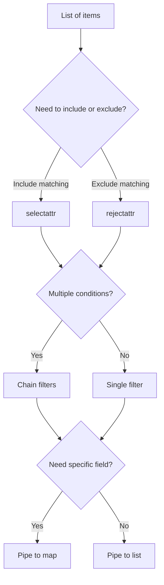

# How to Filter Lists by Attributes in Ansible

Author: [nawazdhandala](https://www.github.com/nawazdhandala)

Tags: Ansible, Filters, Jinja2, Data Manipulation

Description: Learn how to filter lists by attributes in Ansible using selectattr, rejectattr, and custom Jinja2 tests for precise data selection in playbooks.

---

Filtering lists is something you will do constantly in Ansible. Whether you are working with inventory data, API responses, or gathered facts, you need to narrow down lists to just the items that match your criteria. Ansible provides the `selectattr` and `rejectattr` filters for this, along with a variety of test functions you can apply.

## Basic selectattr Usage

The `selectattr` filter selects items from a list where a specified attribute passes a given test. Think of it as a WHERE clause for your data.

```yaml
# playbook-selectattr-basic.yml
# Filters a list of servers to find only those that are running
- name: Filter servers by status
  hosts: localhost
  gather_facts: false
  vars:
    servers:
      - name: web-01
        status: running
        cpu: 45
      - name: web-02
        status: stopped
        cpu: 0
      - name: db-01
        status: running
        cpu: 72
      - name: cache-01
        status: maintenance
        cpu: 0
      - name: db-02
        status: running
        cpu: 30

  tasks:
    - name: Get only running servers
      ansible.builtin.set_fact:
        running_servers: "{{ servers | selectattr('status', 'equalto', 'running') | list }}"

    - name: Display running servers
      ansible.builtin.debug:
        var: running_servers
```

The output includes only the three servers with `status: running`.

## Available Test Functions

You can use these tests with `selectattr`:

- `equalto` - exact match
- `ne` - not equal
- `match` - regex match from start of string
- `search` - regex search anywhere in string
- `in` - value is in a list
- `greaterthan` (or `gt`) - numeric greater than
- `lessthan` (or `lt`) - numeric less than
- `greaterthan` or equal (`ge`) - numeric >=
- `lessthan` or equal (`le`) - numeric <=
- `defined` - attribute exists
- `undefined` - attribute does not exist
- `truthy` - attribute is truthy
- `falsy` - attribute is falsy

```yaml
# playbook-tests.yml
# Demonstrates multiple test functions for filtering
- name: Filter with different test functions
  hosts: localhost
  gather_facts: false
  vars:
    servers:
      - name: web-01
        cpu: 45
        region: us-east-1
        critical: true
      - name: web-02
        cpu: 85
        region: eu-west-1
        critical: false
      - name: db-01
        cpu: 92
        region: us-east-1
        critical: true
      - name: cache-01
        cpu: 15
        region: ap-south-1
        critical: false

  tasks:
    - name: Servers with CPU > 80
      ansible.builtin.debug:
        msg: "{{ servers | selectattr('cpu', 'gt', 80) | map(attribute='name') | list }}"

    - name: Servers in us-east-1
      ansible.builtin.debug:
        msg: "{{ servers | selectattr('region', 'equalto', 'us-east-1') | map(attribute='name') | list }}"

    - name: Critical servers
      ansible.builtin.debug:
        msg: "{{ servers | selectattr('critical', 'truthy') | map(attribute='name') | list }}"

    - name: Servers with name matching web pattern
      ansible.builtin.debug:
        msg: "{{ servers | selectattr('name', 'match', 'web-.*') | list }}"
```

## Using rejectattr for Exclusion

The `rejectattr` filter is the inverse of `selectattr`. It returns items that do NOT match the test.

```yaml
# playbook-rejectattr.yml
# Uses rejectattr to exclude stopped services from a list
- name: Exclude items with rejectattr
  hosts: localhost
  gather_facts: false
  vars:
    services:
      - name: nginx
        state: active
        port: 80
      - name: mysql
        state: inactive
        port: 3306
      - name: redis
        state: active
        port: 6379
      - name: memcached
        state: failed
        port: 11211

  tasks:
    - name: Get all services that are NOT inactive
      ansible.builtin.set_fact:
        not_inactive: "{{ services | rejectattr('state', 'equalto', 'inactive') | list }}"

    - name: Show services that are not inactive
      ansible.builtin.debug:
        var: not_inactive
```

## Chaining Multiple Filters

You can chain `selectattr` calls to apply multiple conditions (AND logic):

```yaml
# playbook-chaining.yml
# Chains multiple selectattr filters to find critical servers with high CPU in a specific region
- name: Chain multiple filter conditions
  hosts: localhost
  gather_facts: false
  vars:
    servers:
      - name: web-01
        region: us-east-1
        cpu: 85
        critical: true
      - name: web-02
        region: us-east-1
        cpu: 30
        critical: false
      - name: db-01
        region: eu-west-1
        cpu: 90
        critical: true
      - name: web-03
        region: us-east-1
        cpu: 92
        critical: true

  tasks:
    - name: Find critical US East servers with high CPU
      ansible.builtin.set_fact:
        alert_servers: >-
          {{ servers
             | selectattr('region', 'equalto', 'us-east-1')
             | selectattr('cpu', 'gt', 80)
             | selectattr('critical', 'truthy')
             | list }}

    - name: Show servers needing attention
      ansible.builtin.debug:
        var: alert_servers
```

## Filtering and Extracting Specific Fields

After filtering, you often want to extract just one field. Combine `selectattr` with `map`:

```yaml
# playbook-extract.yml
# Filters servers and extracts just the IP addresses
- name: Filter and extract specific fields
  hosts: localhost
  gather_facts: false
  vars:
    hosts_data:
      - hostname: app-01
        ip: 10.0.1.10
        role: application
        active: true
      - hostname: app-02
        ip: 10.0.1.11
        role: application
        active: false
      - hostname: db-01
        ip: 10.0.2.10
        role: database
        active: true
      - hostname: lb-01
        ip: 10.0.0.10
        role: loadbalancer
        active: true

  tasks:
    - name: Get IPs of active application servers
      ansible.builtin.set_fact:
        app_ips: >-
          {{ hosts_data
             | selectattr('role', 'equalto', 'application')
             | selectattr('active', 'truthy')
             | map(attribute='ip')
             | list }}

    - name: Show active application IPs
      ansible.builtin.debug:
        var: app_ips
```

## Filter Decision Flow



## Filtering with Undefined Attributes

When some items might not have the attribute you are filtering on, use the `defined` or `undefined` test first:

```yaml
# playbook-undefined.yml
# Safely filters items where some may be missing the target attribute
- name: Handle items with missing attributes
  hosts: localhost
  gather_facts: false
  vars:
    instances:
      - name: web-01
        public_ip: 54.23.10.5
        private_ip: 10.0.1.10
      - name: db-01
        private_ip: 10.0.2.10
      - name: bastion-01
        public_ip: 54.23.10.6
        private_ip: 10.0.0.5

  tasks:
    - name: Get instances that have a public IP
      ansible.builtin.set_fact:
        public_instances: "{{ instances | selectattr('public_ip', 'defined') | list }}"

    - name: Get instances without a public IP
      ansible.builtin.set_fact:
        private_only: "{{ instances | selectattr('public_ip', 'undefined') | list }}"

    - name: Show results
      ansible.builtin.debug:
        msg:
          public: "{{ public_instances | map(attribute='name') | list }}"
          private_only: "{{ private_only | map(attribute='name') | list }}"
```

## OR Logic with union

For OR conditions (items matching condition A or condition B), use `union`:

```yaml
# playbook-or-logic.yml
# Combines two filter results with union to implement OR logic
- name: Filter with OR logic
  hosts: localhost
  gather_facts: false
  vars:
    alerts:
      - service: cpu
        severity: critical
        host: web-01
      - service: memory
        severity: warning
        host: db-01
      - service: disk
        severity: critical
        host: db-02
      - service: network
        severity: info
        host: web-02

  tasks:
    - name: Get critical OR warning alerts
      ansible.builtin.set_fact:
        important_alerts: >-
          {{ (alerts | selectattr('severity', 'equalto', 'critical') | list)
             | union(alerts | selectattr('severity', 'equalto', 'warning') | list) }}

    - name: Show important alerts
      ansible.builtin.debug:
        var: important_alerts
```

## Practical Example: Managing Users

```yaml
# playbook-users.yml
# Filters user list to separate active admins from users to deactivate
- name: Manage users based on attributes
  hosts: all
  vars:
    company_users:
      - username: alice
        role: admin
        active: true
        ssh_key: "ssh-rsa AAAA..."
      - username: bob
        role: developer
        active: true
        ssh_key: "ssh-rsa BBBB..."
      - username: charlie
        role: admin
        active: false
        ssh_key: "ssh-rsa CCCC..."
      - username: diana
        role: developer
        active: true
        ssh_key: "ssh-rsa DDDD..."

  tasks:
    - name: Create accounts for active users only
      ansible.builtin.user:
        name: "{{ item.username }}"
        state: present
        groups: "{{ 'sudo' if item.role == 'admin' else 'developers' }}"
      loop: "{{ company_users | selectattr('active', 'truthy') | list }}"

    - name: Remove inactive user accounts
      ansible.builtin.user:
        name: "{{ item.username }}"
        state: absent
        remove: true
      loop: "{{ company_users | rejectattr('active', 'truthy') | list }}"
```

## Summary

Use `selectattr` to keep items matching a condition and `rejectattr` to exclude them. Chain multiple filter calls for AND logic, and use `union` for OR logic. Always check for `defined` before filtering on attributes that might not exist on every item. These filters, combined with `map` for field extraction, give you a SQL-like querying capability right inside your playbooks.
