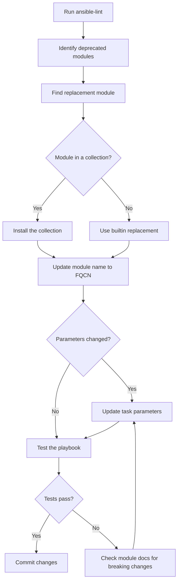

# How to Fix ansible-lint Deprecated Module Warnings

Author: [nawazdhandala](https://www.github.com/nawazdhandala)

Tags: Ansible, ansible-lint, Deprecation, Module Migration

Description: Learn how to identify and replace deprecated Ansible modules with their modern equivalents to keep your playbooks compatible with current versions.

---

Ansible evolves quickly, and modules get deprecated regularly. When a module is deprecated, it still works for a while but will eventually be removed entirely. ansible-lint flags these deprecations early so you can migrate before things break. Ignoring these warnings means waking up one day to a playbook that simply fails because the module no longer exists.

This post covers the most common deprecated module warnings, what to replace them with, and how to manage the transition.

## Understanding Deprecation in Ansible

When Ansible deprecates a module, it goes through stages:

1. **Deprecation warning added**: The module still works but prints a warning
2. **Module moved to a collection**: The module is removed from ansible-core but available in a community collection
3. **Module removed entirely**: The module no longer exists anywhere

ansible-lint catches modules in stages 1 and 2, giving you time to migrate.

## Common Deprecated Module Replacements

### include (replaced by include_tasks and import_tasks)

The bare `include` module was deprecated in Ansible 2.7.

```yaml
# Deprecated: bare include
---
- name: Deploy application
  hosts: webservers
  tasks:
    - include: tasks/install.yml
    - include: tasks/configure.yml
      when: needs_config | bool
```

```yaml
# Fixed: use include_tasks for dynamic inclusion
---
- name: Deploy application
  hosts: webservers
  tasks:
    - name: Include installation tasks
      ansible.builtin.include_tasks: tasks/install.yml

    - name: Include configuration tasks
      ansible.builtin.include_tasks: tasks/configure.yml
      when: needs_config | bool
```

The choice between `include_tasks` and `import_tasks` matters:

```yaml
# import_tasks: static, processed at playbook parse time
# Use when you do NOT need conditionals or loops on the include itself
- name: Import base configuration
  ansible.builtin.import_tasks: tasks/base.yml

# include_tasks: dynamic, processed at runtime
# Use when you need conditionals, loops, or variable file names
- name: Include environment-specific tasks
  ansible.builtin.include_tasks: "tasks/{{ env }}.yml"
  when: env is defined
```

### include_role static behavior

The `include_role` with `static: yes` is deprecated.

```yaml
# Deprecated
- name: Include web role statically
  include_role:
    name: webserver
    static: yes

# Fixed: use import_role for static behavior
- name: Import web role
  ansible.builtin.import_role:
    name: webserver
```

### docker modules moved to community.docker

Many Docker modules moved from the builtin namespace to the `community.docker` collection.

```yaml
# Deprecated: old docker module names
- name: Run container
  docker_container:
    name: myapp
    image: myapp:latest

- name: Build image
  docker_image:
    name: myapp
    source: build
    build:
      path: /opt/myapp

- name: Log in to registry
  docker_login:
    registry: registry.example.com
    username: deploy
    password: "{{ registry_pass }}"
```

```yaml
# Fixed: use community.docker collection
- name: Run container
  community.docker.docker_container:
    name: myapp
    image: myapp:latest

- name: Build image
  community.docker.docker_image:
    name: myapp
    source: build
    build:
      path: /opt/myapp

- name: Log in to registry
  community.docker.docker_login:
    registry: registry.example.com
    username: deploy
    password: "{{ registry_pass }}"
```

Install the collection first:

```bash
ansible-galaxy collection install community.docker
```

### AWS modules moved to amazon.aws and community.aws

```yaml
# Deprecated: old AWS module names
- name: Create EC2 instance
  ec2:
    instance_type: t3.micro
    image: ami-12345678
    wait: true

- name: Create S3 bucket
  s3_bucket:
    name: my-bucket
    state: present

- name: Manage Route53
  route53:
    state: present
    zone: example.com
    record: app.example.com
    type: A
    value: 1.2.3.4
```

```yaml
# Fixed: use amazon.aws collection modules
- name: Create EC2 instance
  amazon.aws.ec2_instance:
    instance_type: t3.micro
    image_id: ami-12345678
    wait: true

- name: Create S3 bucket
  amazon.aws.s3_bucket:
    name: my-bucket
    state: present

- name: Manage Route53
  amazon.aws.route53:
    state: present
    zone: example.com
    record: app.example.com
    type: A
    value: 1.2.3.4
```

### Azure modules moved to azure.azcollection

```yaml
# Deprecated
- name: Create resource group
  azure_rm_resourcegroup:
    name: myResourceGroup
    location: eastus

# Fixed
- name: Create resource group
  azure.azcollection.azure_rm_resourcegroup:
    name: myResourceGroup
    location: eastus
```

### GCP modules moved to google.cloud

```yaml
# Deprecated
- name: Create GCE instance
  gce:
    instance_names: webserver
    machine_type: n1-standard-1
    zone: us-central1-a

# Fixed
- name: Create GCE instance
  google.cloud.gcp_compute_instance:
    name: webserver
    machine_type: n1-standard-1
    zone: us-central1-a
```

## Finding Deprecated Modules in Your Codebase

Run ansible-lint and filter for deprecation warnings:

```bash
# Show only deprecation-related warnings
ansible-lint playbook.yml 2>&1 | grep -i "deprecated"

# List all files with deprecated module usage
ansible-lint -f codeclimate . 2>&1 | grep "deprecated"
```

You can also use grep to find common deprecated patterns:

```bash
# Find bare include statements
grep -rn "^\s*- include:" --include="*.yml" .

# Find old docker module names without collection prefix
grep -rn "^\s*docker_container:" --include="*.yml" .
grep -rn "^\s*docker_image:" --include="*.yml" .

# Find old AWS module names
grep -rn "^\s*ec2:" --include="*.yml" .
grep -rn "^\s*s3_bucket:" --include="*.yml" .
```

## Migration Workflow

Here is a systematic approach to migrating deprecated modules:



## Handling Parameter Changes

Sometimes the replacement module has different parameter names. Always check the documentation for the new module.

```yaml
# Old ec2 module had different parameters
- name: Launch instance (old way)
  ec2:
    instance_type: t3.micro
    image: ami-12345678      # Parameter was 'image'
    count: 1
    wait: true

# New ec2_instance module uses different names
- name: Launch instance (new way)
  amazon.aws.ec2_instance:
    instance_type: t3.micro
    image_id: ami-12345678   # Parameter is now 'image_id'
    wait: true
    # 'count' parameter works differently
```

## Installing Required Collections

When migrating to collection-based modules, make sure to install the collections. Create a `requirements.yml` file:

```yaml
# collections/requirements.yml - Collection dependencies
---
collections:
  - name: amazon.aws
    version: ">=7.0.0"
  - name: community.docker
    version: ">=3.0.0"
  - name: community.general
    version: ">=8.0.0"
  - name: ansible.posix
    version: ">=1.5.0"
  - name: community.postgresql
    version: ">=3.0.0"
```

Install them:

```bash
ansible-galaxy collection install -r collections/requirements.yml
```

## Suppressing Deprecated Warnings Temporarily

If you cannot migrate immediately, you can suppress the warning while you plan the migration:

```yaml
# .ansible-lint - Temporarily suppress deprecation warnings
---
warn_list:
  - deprecated-module

# Or skip entirely (not recommended for long periods)
# skip_list:
#   - deprecated-module
```

For individual tasks:

```yaml
- name: Use old module until migration sprint  # noqa: deprecated-module
  docker_container:
    name: myapp
    image: myapp:latest
```

But set a deadline. Put a comment with a date and a ticket number so the suppression does not become permanent.

## Testing After Migration

After replacing deprecated modules, run your playbooks in check mode first:

```bash
# Dry run to verify syntax and basic logic
ansible-playbook site.yml --check --diff

# Run ansible-lint to confirm no more deprecation warnings
ansible-lint site.yml
```

Then test in a staging environment before applying to production. Some replacement modules have subtle behavioral differences that check mode will not catch.

Deprecated module warnings are not optional cleanup work. They are advance notice that your playbooks will break in a future Ansible version. Treat them as high-priority items and schedule migration sprints to address them before they become emergencies.
