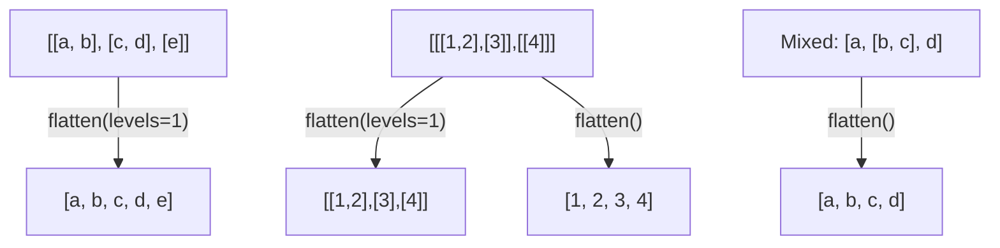

# How to Flatten Nested Lists in Ansible

Author: [nawazdhandala](https://www.github.com/nawazdhandala)

Tags: Ansible, Data Transformation, Filters, Lists

Description: Learn how to flatten nested lists in Ansible using the flatten filter with depth control, plus practical patterns for handling multi-level data structures.

---

Nested lists show up in Ansible more often than you might expect. When you gather data from multiple hosts, combine results from several tasks, or work with complex data structures, you frequently end up with lists inside lists. The `flatten` filter is your tool for turning these nested structures into a single flat list.

## Basic Flattening

The `flatten` filter takes a nested list and collapses all levels into one flat list:

```yaml
# playbook-basic-flatten.yml
# Flattens a deeply nested list structure into a single flat list
- name: Basic list flattening
  hosts: localhost
  gather_facts: false
  vars:
    nested_list:
      - - nginx
        - apache
      - - postgresql
        - mysql
      - - redis
        - memcached

  tasks:
    - name: Flatten the nested list
      ansible.builtin.debug:
        msg: "{{ nested_list | flatten }}"
```

Output: `["nginx", "apache", "postgresql", "mysql", "redis", "memcached"]`

## Controlling Flatten Depth

By default, `flatten` collapses all levels. You can pass a `levels` parameter to control how deep the flattening goes:

```yaml
# playbook-depth-control.yml
# Shows the difference between full flatten and single-level flatten
- name: Flatten with depth control
  hosts: localhost
  gather_facts: false
  vars:
    deep_list:
      - - - level3_a
          - level3_b
        - - level3_c
      - - - level3_d

  tasks:
    - name: Flatten one level only
      ansible.builtin.debug:
        msg: "{{ deep_list | flatten(levels=1) }}"

    - name: Flatten all levels (default)
      ansible.builtin.debug:
        msg: "{{ deep_list | flatten }}"
```

One level of flattening removes the outermost nesting but preserves inner nesting. Full flattening collapses everything.

## Flattening Mixed Structures

Real data often has a mix of single items and lists. The `flatten` filter handles this gracefully:

```yaml
# playbook-mixed.yml
# Handles a list containing both single items and nested sublists
- name: Flatten mixed list structure
  hosts: localhost
  gather_facts: false
  vars:
    packages:
      - common_packages:
          - vim
          - curl
          - wget
      - web_packages:
          - nginx
          - certbot
      - single_package: htop

  tasks:
    - name: Collect all package names
      ansible.builtin.set_fact:
        all_packages: >-
          {{ packages | map('dict2items') | flatten |
             map(attribute='value') | flatten }}

    - name: Display all packages
      ansible.builtin.debug:
        var: all_packages
```

## Flattening Results from Loops

One of the most common use cases is flattening results collected from loop tasks. When you use `register` inside a loop, the results come back as a nested structure.

```yaml
# playbook-loop-results.yml
# Collects package lists from multiple files and flattens them into one list
- name: Flatten loop results
  hosts: localhost
  gather_facts: false

  tasks:
    - name: Simulate gathering package lists from different sources
      ansible.builtin.set_fact:
        source_packages:
          - packages:
              - httpd
              - mod_ssl
          - packages:
              - postgresql-server
              - postgresql-contrib
          - packages:
              - python3
              - python3-pip

    - name: Flatten all packages from all sources
      ansible.builtin.set_fact:
        all_packages: "{{ source_packages | map(attribute='packages') | flatten }}"

    - name: Install all packages (demonstration)
      ansible.builtin.debug:
        msg: "Would install: {{ all_packages | join(', ') }}"
```

## Flattening with subelements

The `subelements` lookup is another approach when you have a list of items, each with a sublist you want to iterate over:

```yaml
# playbook-subelements.yml
# Uses subelements to create user-sshkey pairs from nested data
- name: Flatten with subelements
  hosts: localhost
  gather_facts: false
  vars:
    users:
      - name: alice
        ssh_keys:
          - "ssh-rsa AAAA... alice@laptop"
          - "ssh-rsa BBBB... alice@desktop"
      - name: bob
        ssh_keys:
          - "ssh-rsa CCCC... bob@workstation"

  tasks:
    - name: Deploy SSH keys for all users
      ansible.builtin.debug:
        msg: "User {{ item.0.name }} key: {{ item.1 | truncate(30) }}"
      loop: "{{ users | subelements('ssh_keys') }}"
```

## Flatten vs list

It is important to understand that `flatten` and `list` do different things. The `list` filter converts an iterable to a list but does not collapse nesting. The `flatten` filter actually recursively unpacks nested lists.

```yaml
# playbook-flatten-vs-list.yml
# Compares the behavior of list vs flatten on nested data
- name: Flatten vs list comparison
  hosts: localhost
  gather_facts: false
  vars:
    nested: [[1, 2], [3, 4], [5, 6]]

  tasks:
    - name: Using list (no flattening)
      ansible.builtin.debug:
        msg: "{{ nested | list }}"
        # Output: [[1, 2], [3, 4], [5, 6]]

    - name: Using flatten
      ansible.builtin.debug:
        msg: "{{ nested | flatten }}"
        # Output: [1, 2, 3, 4, 5, 6]
```

## Flatten Operation Flow



## Practical Example: Collecting Data from Multiple Hosts

```yaml
# playbook-multi-host.yml
# Gathers firewall rules from all hosts and flattens into one consolidated list
- name: Collect and flatten data from multiple hosts
  hosts: all
  gather_facts: false

  tasks:
    - name: Get firewall rules from each host
      ansible.builtin.shell: "iptables -L -n --line-numbers"
      register: fw_rules
      changed_when: false

- name: Process collected data
  hosts: localhost
  gather_facts: false

  tasks:
    - name: Flatten all firewall rule outputs
      ansible.builtin.set_fact:
        all_rules: >-
          {{ groups['all'] | map('extract', hostvars, 'fw_rules') |
             map(attribute='stdout_lines') | flatten | unique | list }}

    - name: Display consolidated rules
      ansible.builtin.debug:
        var: all_rules
```

## Flattening with Deduplication

Combine `flatten` with `unique` to get a deduplicated flat list:

```yaml
# playbook-flatten-unique.yml
# Flattens overlapping role requirement lists and removes duplicates
- name: Flatten and deduplicate
  hosts: localhost
  gather_facts: false
  vars:
    role_requirements:
      webserver:
        - python3
        - nginx
        - certbot
      database:
        - python3
        - postgresql
        - pg_stat_monitor
      monitoring:
        - python3
        - prometheus-node-exporter
        - certbot

  tasks:
    - name: Get unique list of all required packages
      ansible.builtin.set_fact:
        unique_packages: "{{ role_requirements.values() | flatten | unique | sort }}"

    - name: Display unique packages
      ansible.builtin.debug:
        var: unique_packages
```

## Real-World Example: Building a Consolidated Allow List

```yaml
# playbook-allowlist.yml
# Combines multiple per-team IP allow lists into one consolidated firewall rule set
- name: Build consolidated IP allow list
  hosts: firewalls
  vars:
    team_allow_lists:
      development:
        - 10.0.1.0/24
        - 10.0.2.0/24
      operations:
        - 10.0.1.0/24
        - 10.0.3.0/24
        - 172.16.0.0/16
      security:
        - 10.0.4.0/24

  tasks:
    - name: Build consolidated unique allow list
      ansible.builtin.set_fact:
        allow_list: "{{ team_allow_lists.values() | flatten | unique | sort }}"

    - name: Apply firewall rules
      ansible.posix.firewalld:
        rich_rule: "rule family=ipv4 source address={{ item }} accept"
        permanent: true
        state: enabled
      loop: "{{ allow_list }}"
```

## Summary

The `flatten` filter is essential for working with nested list structures in Ansible. Use it without arguments to collapse all levels, or pass `levels=1` (or any number) when you only want partial flattening. Combine it with `map(attribute=...)` to extract nested sublists before flattening, with `unique` to remove duplicates, and with `sort` for ordered output. For iterating over parent-child relationships, consider `subelements` as an alternative to flattening. These patterns cover the vast majority of nested list scenarios you will encounter in production playbooks.
