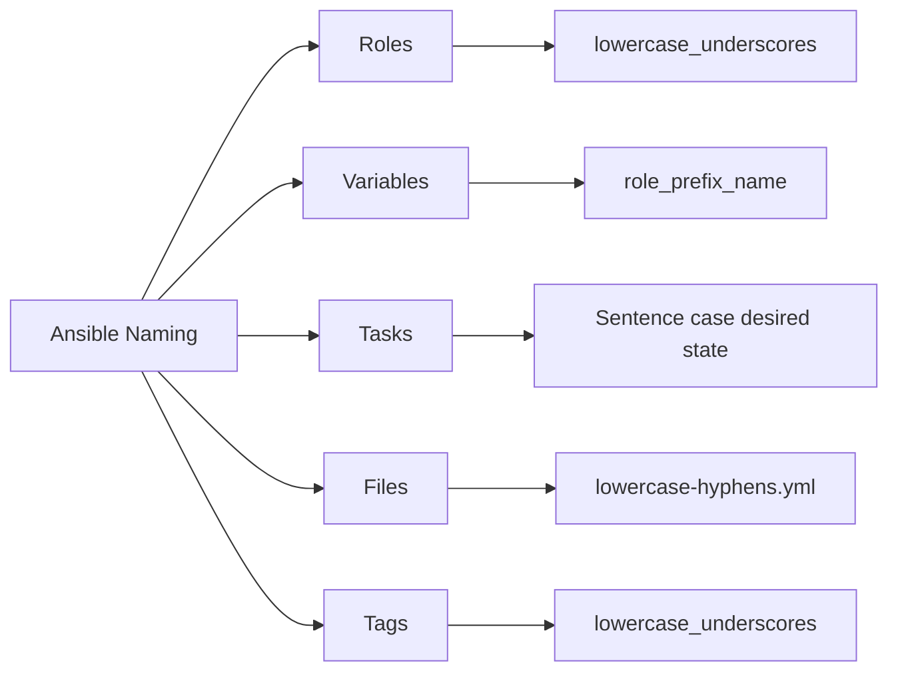

# How to Follow Ansible Naming Conventions

Author: [nawazdhandala](https://www.github.com/nawazdhandala)

Tags: Ansible, Naming Conventions, DevOps, Code Quality

Description: Learn the recommended naming conventions for Ansible playbooks, roles, variables, tasks, and handlers to keep your automation consistent and readable.

---

Naming conventions might seem trivial, but on a team of five engineers working on 200 roles, inconsistent naming turns into a real problem. You waste time searching for variables, misread task names in logs, and accidentally shadow variables because two roles used the same name. Here are the naming conventions that keep Ansible projects sane.

## Role Naming

Role names should be lowercase with underscores separating words. They should describe the software or function they manage, not the action they perform.

```
# GOOD role names
roles/
  nginx/
  postgresql/
  redis_server/
  ssl_certificates/
  monitoring_agent/
  firewall_rules/
  backup_client/

# BAD role names
roles/
  InstallNginx/          # PascalCase, includes action verb
  setup-postgres/        # Hyphens instead of underscores
  doFirewallStuff/       # camelCase, vague name
  role1/                 # Meaningless name
```

If a role is specific to an application, prefix it with the application name:

```
roles/
  myapp_backend/
  myapp_frontend/
  myapp_worker/
```

## Variable Naming

This is the most important naming convention. Variables should be prefixed with the role name to avoid collisions.

```yaml
# roles/nginx/defaults/main.yml
# Prefix all variables with the role name
nginx_worker_processes: auto
nginx_worker_connections: 1024
nginx_log_dir: /var/log/nginx
nginx_ssl_enabled: true
nginx_ssl_protocols: "TLSv1.2 TLSv1.3"
nginx_vhosts: []

# roles/postgresql/defaults/main.yml
# Different role, different prefix
postgresql_version: 15
postgresql_port: 5432
postgresql_max_connections: 200
postgresql_data_dir: /var/lib/postgresql/15/main
postgresql_log_dir: /var/log/postgresql
```

Without prefixing, you risk variable collisions:

```yaml
# BAD: Two roles both define 'port' and 'log_dir'
# roles/nginx/defaults/main.yml
port: 80
log_dir: /var/log/nginx

# roles/postgresql/defaults/main.yml
port: 5432           # Overrides nginx port!
log_dir: /var/log/pg  # Overrides nginx log_dir!
```

## Boolean Variable Names

Boolean variables should read naturally in English. Use prefixes like `is_`, `has_`, or `enable_`:

```yaml
# GOOD: Clear boolean intent
nginx_ssl_enabled: true
nginx_gzip_enabled: false
app_debug_mode: false
backup_compression_enabled: true
monitoring_alerts_enabled: true

# BAD: Ambiguous boolean names
nginx_ssl: true       # Is this the SSL config or a flag?
compress: false       # Compress what?
debug: true           # Debug for which component?
```

## Task Naming

Every task needs a descriptive `name` field. The name should describe the desired state, not the action being taken. Use sentence case.

```yaml
# GOOD: Describes the desired state
- name: Ensure nginx is installed
  ansible.builtin.apt:
    name: nginx
    state: present

- name: Ensure nginx configuration is deployed
  ansible.builtin.template:
    src: nginx.conf.j2
    dest: /etc/nginx/nginx.conf

- name: Ensure nginx service is running and enabled
  ansible.builtin.service:
    name: nginx
    state: started
    enabled: yes

# BAD: Action-oriented or missing names
- name: Install nginx       # Action, not state
  ansible.builtin.apt:
    name: nginx
    state: present

- ansible.builtin.template:  # No name at all!
    src: nginx.conf.j2
    dest: /etc/nginx/nginx.conf

- name: do stuff             # Vague, lowercase
  ansible.builtin.service:
    name: nginx
    state: started
```

## Handler Naming

Handlers should describe the action they perform. Since handlers are triggered by name, clarity prevents triggering the wrong handler.

```yaml
# roles/nginx/handlers/main.yml
# Clear, specific handler names
- name: Restart nginx
  ansible.builtin.service:
    name: nginx
    state: restarted

- name: Reload nginx
  ansible.builtin.service:
    name: nginx
    state: reloaded

- name: Validate nginx configuration
  ansible.builtin.command: nginx -t
  changed_when: false
```

When a role might be included multiple times, prefix handlers with the role name:

```yaml
# Prefixed handler names prevent conflicts
- name: nginx - restart service
  ansible.builtin.service:
    name: nginx
    state: restarted

- name: nginx - reload configuration
  ansible.builtin.service:
    name: nginx
    state: reloaded
```

## Playbook and File Naming

Playbook files should use lowercase with hyphens. They should describe what they target or accomplish:

```
playbooks/
  site.yml                    # Master playbook
  webservers.yml              # Targets web servers
  dbservers.yml               # Targets database servers
  deploy-application.yml      # Deploys the application
  setup-monitoring.yml        # Sets up monitoring
  rolling-update.yml          # Performs rolling update
```

Template files should match the configuration file they produce, with a `.j2` extension:

```
roles/nginx/templates/
  nginx.conf.j2
  default-site.conf.j2
  ssl-params.conf.j2
```

## Inventory Group Naming

Inventory groups should be lowercase with underscores. Use functional names, not hostnames or locations:

```yaml
# inventories/production/hosts.yml
# Groups named by function, not location
all:
  children:
    webservers:
      hosts:
        web01.example.com:
        web02.example.com:
    app_servers:
      hosts:
        app01.example.com:
        app02.example.com:
    db_servers:
      hosts:
        db01.example.com:
        db02.example.com:
    monitoring_servers:
      hosts:
        mon01.example.com:
```

You can add location-based groups as secondary groupings:

```yaml
# Secondary grouping by datacenter
all:
  children:
    dc_east:
      children:
        webservers_east:
          hosts:
            web01.east.example.com:
        db_servers_east:
          hosts:
            db01.east.example.com:
    dc_west:
      children:
        webservers_west:
          hosts:
            web01.west.example.com:
```

## Tag Naming

Tags should be lowercase with underscores. Use consistent categories:

```yaml
# Consistent tag naming strategy
- name: Install base packages
  ansible.builtin.apt:
    name: "{{ common_packages }}"
    state: present
  tags:
    - common
    - packages
    - install

- name: Configure firewall rules
  ansible.posix.firewalld:
    service: http
    state: enabled
    permanent: yes
  tags:
    - security
    - firewall
    - configuration

- name: Deploy application code
  ansible.builtin.git:
    repo: "{{ app_repo }}"
    dest: "{{ app_dir }}"
  tags:
    - deploy
    - application
```

## Naming Convention Reference



## Enforcing Conventions with ansible-lint

You can enforce naming conventions automatically:

```yaml
# .ansible-lint
# Enforce naming rules across the project
enable_list:
  - name[casing]
  - name[template]
  - role-name
  - var-naming

var_naming_pattern: "^[a-z_][a-z0-9_]*$"

warn_list:
  - name[missing]

skip_list: []
```

Run it as part of your CI pipeline:

```bash
# Check all roles and playbooks for naming violations
ansible-lint roles/ playbooks/ --strict
```

## Summary

Consistent naming in Ansible projects reduces confusion and bugs. Prefix variables with role names to avoid collisions. Name tasks after the desired state, not the action. Use lowercase with underscores for roles, variables, and tags. Use lowercase with hyphens for files. Enforce these conventions with ansible-lint in your CI pipeline. These rules are simple but they compound in value as your project and team grow.
