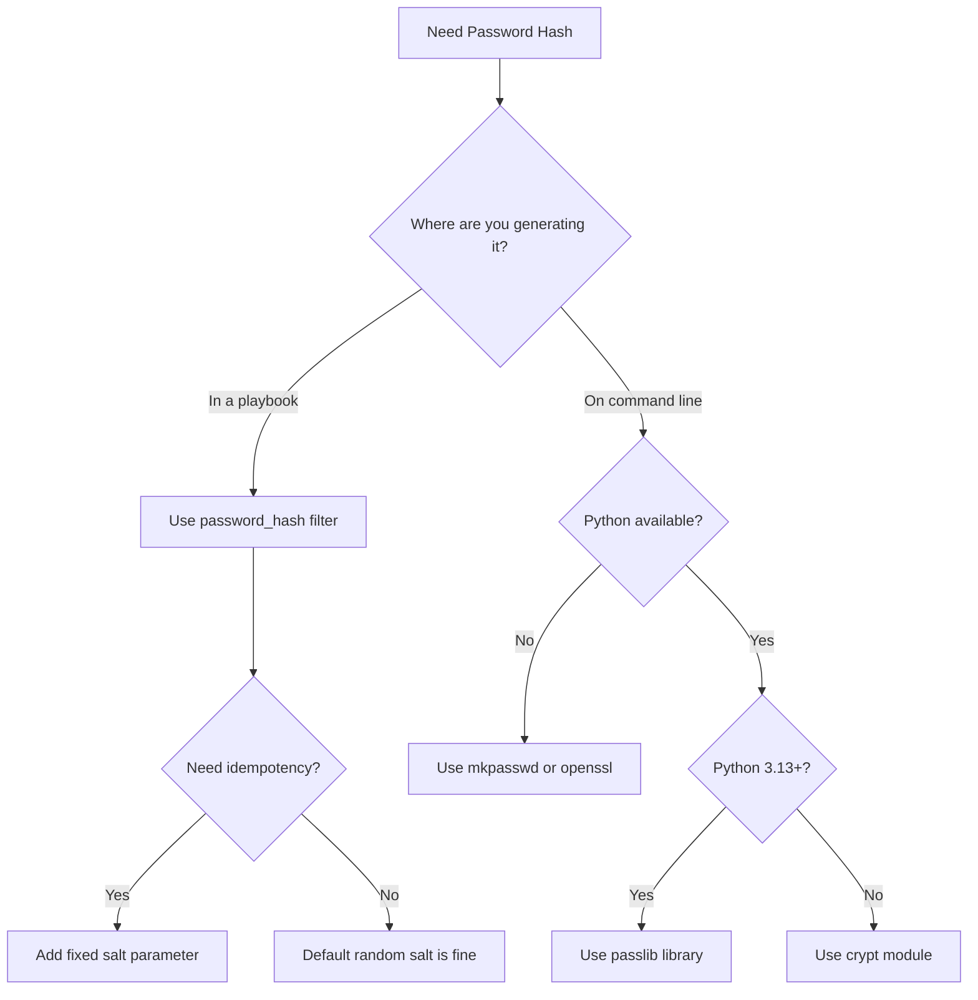

# How to Generate Password Hashes for Ansible user Module

Author: [nawazdhandala](https://www.github.com/nawazdhandala)

Tags: Ansible, Security, Password Management, Linux

Description: A complete guide to generating password hashes compatible with the Ansible user module using Python, mkpasswd, and Ansible filters.

---

One of the most frequently asked questions in Ansible forums is "why can my user not log in after I set their password?" The answer is almost always the same: the password was not properly hashed before being passed to the `user` module. Ansible needs a pre-hashed password string, and this post covers every reliable way to generate one.

## Understanding Linux Password Hashes

Before jumping into the methods, let us understand what a Linux password hash looks like. Open `/etc/shadow` on any Linux system and you will see entries like:

```
username:$6$randomsalt$longhashvalue:18900:0:99999:7:::
```

The password field has three parts separated by `$`:

- **$6$** - The hash algorithm identifier (6 = SHA-512)
- **randomsalt** - The salt value
- **longhashvalue** - The actual hash

Here are the common algorithm identifiers:

| ID | Algorithm | Recommendation |
|----|-----------|----------------|
| $1$ | MD5 | Do not use, insecure |
| $5$ | SHA-256 | Acceptable |
| $6$ | SHA-512 | Recommended |
| $y$ | yescrypt | Modern, supported on newer systems |

## Method 1: Python crypt Module

The most portable method is using Python's built-in `crypt` module. This works on any system with Python installed:

```bash
# Generate SHA-512 hash with auto-generated salt
python3 -c "import crypt; print(crypt.crypt('YourPassword', crypt.mksalt(crypt.METHOD_SHA512)))"
```

You can also specify a fixed salt for reproducibility:

```bash
# Generate SHA-512 hash with a specific salt
python3 -c "import crypt; print(crypt.crypt('YourPassword', '\$6\$mysaltvalue\$'))"
```

Note: The `crypt` module was deprecated in Python 3.11 and removed in Python 3.13. For newer Python versions, use the `passlib` library instead.

## Method 2: passlib Library

The `passlib` library is the most robust option and works on all platforms including macOS where the native `crypt` module behaves differently:

```bash
# Install passlib
pip3 install passlib

# Generate a SHA-512 hash
python3 -c "from passlib.hash import sha512_crypt; print(sha512_crypt.using(rounds=656000).hash('YourPassword'))"
```

For a fixed salt (needed for idempotency):

```bash
# Generate hash with a fixed salt using passlib
python3 -c "from passlib.hash import sha512_crypt; print(sha512_crypt.using(salt='fixedsaltval', rounds=656000).hash('YourPassword'))"
```

## Method 3: mkpasswd Command

The `mkpasswd` utility is available on most Linux systems (part of the `whois` package on Debian/Ubuntu):

```bash
# Install mkpasswd on Debian/Ubuntu
sudo apt-get install whois

# Generate SHA-512 hash
mkpasswd --method=sha-512 'YourPassword'

# Generate with a specific salt
mkpasswd --method=sha-512 --salt='mysaltvalue' 'YourPassword'
```

On CentOS/RHEL, `mkpasswd` might come from a different package or may not support the `--method` flag. In that case, use the Python method instead.

## Method 4: openssl Command

OpenSSL can also generate password hashes, though the syntax varies by version:

```bash
# Generate a SHA-512 hash with openssl (version 1.1+)
openssl passwd -6 'YourPassword'

# Generate with a specific salt
openssl passwd -6 -salt 'mysaltvalue' 'YourPassword'
```

The `-6` flag specifies SHA-512. Use `-5` for SHA-256. Note that older versions of OpenSSL might not support these flags.

## Method 5: Ansible password_hash Filter

This is probably the most convenient method because it runs inline in your playbook:

```yaml
# inline-hash.yml - Generate hash inline with Ansible
- name: Set password using inline hash
  hosts: all
  become: yes
  tasks:
    - name: Create user with hashed password
      ansible.builtin.user:
        name: testuser
        # password_hash filter generates the hash at runtime
        password: "{{ 'YourPassword' | password_hash('sha512') }}"
        state: present
      no_log: yes
```

For idempotent runs with a fixed salt:

```yaml
# inline-hash-idempotent.yml - Idempotent inline hash
- name: Set password idempotently
  hosts: all
  become: yes
  tasks:
    - name: Create user with consistent hash
      ansible.builtin.user:
        name: testuser
        password: "{{ 'YourPassword' | password_hash('sha512', 'fixedsalt12345') }}"
        state: present
      no_log: yes
```

## Choosing the Right Method

Here is a decision tree to help you pick:



## Generating Hashes in an Ansible Lookup

You can also generate password hashes using Ansible's `password` lookup plugin, which can create and store passwords automatically:

```yaml
# lookup-password.yml - Generate and store passwords
- name: Generate and use passwords
  hosts: all
  become: yes
  tasks:
    - name: Create user with auto-generated password
      ansible.builtin.user:
        name: appuser
        # This generates a random password, stores it in a file, and hashes it
        password: "{{ lookup('password', '/tmp/appuser_password length=20 chars=ascii_letters,digits') | password_hash('sha512', 'stablesalt1234') }}"
        state: present
      no_log: yes
```

The `password` lookup generates a random password and stores the plain-text version in the specified file. The `password_hash` filter then hashes it for use with the `user` module. This way you have the plain-text version available to share with the user via a secure channel.

## Batch Hash Generation Script

If you need to generate hashes for many users at once, here is a Python script that does the job:

```python
#!/usr/bin/env python3
# generate_hashes.py - Generate password hashes for multiple users
import sys
try:
    from passlib.hash import sha512_crypt
except ImportError:
    print("Install passlib: pip3 install passlib")
    sys.exit(1)

# Define users and their passwords
users = {
    "alice": "AlicePass2024!",
    "bob": "BobSecure#456",
    "carol": "CarolStrong@789",
}

# Generate hashes with stable salts for Ansible idempotency
for username, password in users.items():
    salt = f"salt_{username}"[:16]  # Salt max 16 chars
    hashed = sha512_crypt.using(salt=salt, rounds=656000).hash(password)
    print(f"{username}: {hashed}")
```

Run it to get the hashes:

```bash
# Run the hash generation script
python3 generate_hashes.py
```

## Verifying Your Hash

After generating a hash, you should verify it works correctly. Here is a quick Python snippet to test:

```python
#!/usr/bin/env python3
# verify_hash.py - Verify a password hash
import crypt

password = "YourPassword"
stored_hash = "$6$fixedsalt$generatedHashGoesHere"

# Verify by hashing the password with the same salt
if crypt.crypt(password, stored_hash) == stored_hash:
    print("Password hash is valid")
else:
    print("Hash verification failed")
```

## Salt Requirements and Best Practices

A few things to keep in mind about salts:

1. **Salt length**: For SHA-512, the salt can be up to 16 characters. Longer salts are silently truncated.
2. **Salt characters**: Use only `[a-zA-Z0-9./]`. Other characters may cause issues.
3. **Fixed vs random salt**: Use fixed salts for Ansible idempotency. Use random salts when you do not care about change detection (like one-time provisioning).
4. **Salt uniqueness**: When using fixed salts across multiple users, include the username in the salt to ensure each user has a unique salt. For example, `'salt_' + item.name`.

## Rounds Configuration

The `rounds` parameter controls how many iterations the hash algorithm runs. More rounds means more security but slower authentication:

```bash
# Generate hash with custom rounds
python3 -c "from passlib.hash import sha512_crypt; print(sha512_crypt.using(rounds=100000).hash('YourPassword'))"
```

The default is usually 5000 rounds, but many systems use 656000. Higher values make brute-force attacks harder but also make every login slightly slower. For most servers, the default is fine.

Password hashing is a critical step in Ansible user management. Get it wrong and users cannot log in. Get it right and you have a secure, repeatable process for managing credentials across your entire infrastructure.
