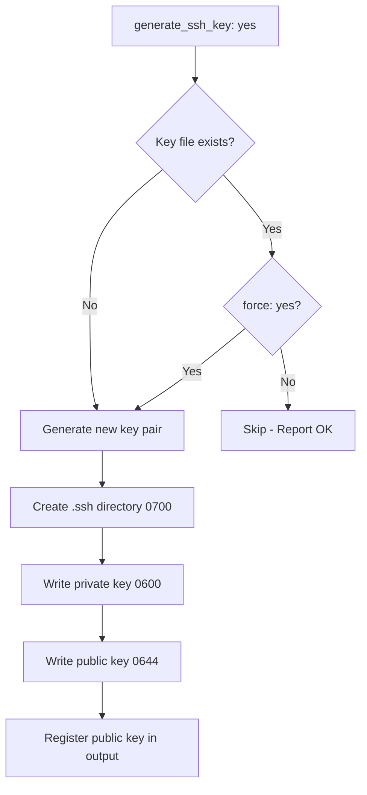

# How to Generate SSH Keys for Users with the Ansible user Module

Author: [nawazdhandala](https://www.github.com/nawazdhandala)

Tags: Ansible, SSH, User Management, Security

Description: Learn how to generate SSH key pairs for users with the Ansible user module, including key type selection, passphrase configuration, and deployment.

---

The Ansible `user` module can generate SSH key pairs for users during account creation or at any point afterward. This is incredibly useful when you need to set up passwordless SSH between servers, deploy keys for service accounts, or provision developer workstations. In this post, I will cover every aspect of SSH key generation with the `user` module.

## Basic SSH Key Generation

The `generate_ssh_key` parameter tells the `user` module to create an SSH key pair for the user:

```yaml
# generate-ssh-key-basic.yml - Generate a basic SSH key pair
- name: Generate SSH key for user
  hosts: all
  become: yes
  tasks:
    - name: Create user with SSH key
      ansible.builtin.user:
        name: deploy
        generate_ssh_key: yes
        state: present
```

This creates an RSA key pair at `~deploy/.ssh/id_rsa` and `~deploy/.ssh/id_rsa.pub`. The `.ssh` directory is created with `0700` permissions, and the key files get `0600` (private) and `0644` (public) permissions.

If the key already exists, Ansible leaves it alone and reports "ok". It will not overwrite an existing key unless you explicitly tell it to.

## Choosing the Key Type

RSA is the default, but you should use Ed25519 for new deployments. It is faster, more secure, and generates shorter keys:

```yaml
# generate-ed25519.yml - Generate Ed25519 SSH key
- name: Generate Ed25519 SSH key
  hosts: all
  become: yes
  tasks:
    - name: Create user with Ed25519 key
      ansible.builtin.user:
        name: deploy
        generate_ssh_key: yes
        ssh_key_type: ed25519
        ssh_key_comment: "deploy@{{ inventory_hostname }}"
        state: present
```

Here are the available key types:

| Type | Parameter | Notes |
|------|-----------|-------|
| RSA | rsa | Default, widely compatible |
| Ed25519 | ed25519 | Recommended for new deployments |
| ECDSA | ecdsa | Good performance, smaller keys |
| DSA | dsa | Deprecated, do not use |

## Setting Key Parameters

The `user` module gives you control over several key properties:

```yaml
# ssh-key-full-config.yml - Full SSH key configuration
- name: Generate SSH key with full configuration
  hosts: all
  become: yes
  tasks:
    - name: Create user with fully configured SSH key
      ansible.builtin.user:
        name: deploy
        generate_ssh_key: yes
        ssh_key_type: rsa
        ssh_key_bits: 4096
        ssh_key_comment: "deploy@{{ inventory_hostname }}-{{ ansible_date_time.date }}"
        ssh_key_file: .ssh/id_rsa
        ssh_key_passphrase: ""
        state: present
      register: user_result

    - name: Display generated public key
      ansible.builtin.debug:
        msg: "Public key: {{ user_result.ssh_public_key }}"
```

Let me explain each parameter:

- **ssh_key_type**: The algorithm (rsa, ed25519, ecdsa).
- **ssh_key_bits**: Key size in bits. Only relevant for RSA (use 4096) and ECDSA (256, 384, or 521). Ed25519 has a fixed size.
- **ssh_key_comment**: A comment appended to the public key. Useful for identifying which key belongs to which server.
- **ssh_key_file**: Path relative to the user's home directory. Defaults to `.ssh/id_rsa` for RSA keys.
- **ssh_key_passphrase**: Passphrase to protect the private key. Empty string means no passphrase.

## SSH Key Generation Workflow

Here is the decision flow when Ansible processes SSH key generation:



## Overwriting Existing Keys

By default, the `user` module will not overwrite an existing SSH key. If you need to regenerate a key (for rotation or after a compromise), use the `force` parameter:

```yaml
# regenerate-ssh-key.yml - Force regenerate SSH key
- name: Force regenerate SSH key
  hosts: all
  become: yes
  tasks:
    - name: Regenerate SSH key for deploy user
      ansible.builtin.user:
        name: deploy
        generate_ssh_key: yes
        ssh_key_type: ed25519
        ssh_key_comment: "deploy@{{ inventory_hostname }}-rotated"
        force: yes
        state: present
      register: new_key

    - name: Show new public key
      ansible.builtin.debug:
        msg: "New public key: {{ new_key.ssh_public_key }}"
```

**Warning**: Using `force: yes` on the `user` module also forces other user properties. Be careful to only use it when you specifically want to regenerate the key.

## Deploying the Generated Key to Other Servers

After generating a key on one server, you often need to deploy the public key to other servers for passwordless SSH:

```yaml
# deploy-key-cross-server.yml - Generate key and deploy to remote hosts
- name: Generate and deploy SSH key
  hosts: source_server
  become: yes
  tasks:
    - name: Create user and generate SSH key
      ansible.builtin.user:
        name: deploy
        generate_ssh_key: yes
        ssh_key_type: ed25519
        state: present
      register: deploy_user

    - name: Store public key as fact
      ansible.builtin.set_fact:
        deploy_public_key: "{{ deploy_user.ssh_public_key }}"

- name: Deploy SSH key to target servers
  hosts: target_servers
  become: yes
  tasks:
    - name: Ensure deploy user exists on target
      ansible.builtin.user:
        name: deploy
        state: present

    - name: Add public key to authorized_keys
      ansible.posix.authorized_key:
        user: deploy
        key: "{{ hostvars[groups['source_server'][0]].deploy_public_key }}"
        state: present
```

## Generating Keys for Service Accounts

Service accounts that need SSH access (like backup agents or monitoring tools) should have keys generated as part of their provisioning:

```yaml
# service-account-keys.yml - Generate SSH keys for service accounts
- name: Set up backup service account with SSH
  hosts: all
  become: yes
  tasks:
    - name: Create backup user with SSH key
      ansible.builtin.user:
        name: backup_agent
        system: yes
        shell: /bin/bash
        home: /var/lib/backup_agent
        create_home: yes
        generate_ssh_key: yes
        ssh_key_type: ed25519
        ssh_key_comment: "backup_agent@{{ inventory_hostname }}"
        state: present
      register: backup_user

    - name: Store the public key for later distribution
      ansible.builtin.copy:
        content: "{{ backup_user.ssh_public_key }}"
        dest: /var/lib/backup_agent/public_key.txt
        owner: backup_agent
        group: backup_agent
        mode: '0644'
```

## Generating Keys for Multiple Users

When provisioning a team, generate keys for everyone in a loop:

```yaml
# team-ssh-keys.yml - Generate SSH keys for team members
- name: Generate SSH keys for team
  hosts: all
  become: yes
  vars:
    team_members:
      - name: alice
        key_type: ed25519
      - name: bob
        key_type: ed25519
      - name: carol
        key_type: rsa
        key_bits: 4096
  tasks:
    - name: Create users with SSH keys
      ansible.builtin.user:
        name: "{{ item.name }}"
        generate_ssh_key: yes
        ssh_key_type: "{{ item.key_type }}"
        ssh_key_bits: "{{ item.key_bits | default(omit) }}"
        ssh_key_comment: "{{ item.name }}@{{ inventory_hostname }}"
        state: present
      loop: "{{ team_members }}"
      register: team_keys

    - name: Display all generated public keys
      ansible.builtin.debug:
        msg: "{{ item.item.name }}: {{ item.ssh_public_key }}"
      loop: "{{ team_keys.results }}"
      when: item.ssh_public_key is defined
```

## Collecting Keys with a Callback

If you need to collect all generated public keys into a central location:

```yaml
# collect-keys.yml - Generate keys and collect them centrally
- name: Generate and collect SSH keys
  hosts: all
  become: yes
  tasks:
    - name: Generate SSH key for deploy user
      ansible.builtin.user:
        name: deploy
        generate_ssh_key: yes
        ssh_key_type: ed25519
        state: present
      register: deploy_key

    - name: Fetch public key to control machine
      ansible.builtin.fetch:
        src: /home/deploy/.ssh/id_ed25519.pub
        dest: "collected_keys/{{ inventory_hostname }}/deploy.pub"
        flat: yes
```

After running this playbook, you will have all the public keys organized by hostname on your control machine.

## Key Rotation Strategy

Here is a playbook for periodic key rotation:

```yaml
# rotate-ssh-keys.yml - Rotate SSH keys
- name: Rotate SSH keys for service account
  hosts: all
  become: yes
  vars:
    rotation_user: deploy
  tasks:
    # Backup old key
    - name: Backup current private key
      ansible.builtin.copy:
        src: "/home/{{ rotation_user }}/.ssh/id_ed25519"
        dest: "/home/{{ rotation_user }}/.ssh/id_ed25519.old"
        remote_src: yes
        owner: "{{ rotation_user }}"
        mode: '0600'
      ignore_errors: yes

    # Generate new key (force overwrite)
    - name: Generate new SSH key
      ansible.builtin.user:
        name: "{{ rotation_user }}"
        generate_ssh_key: yes
        ssh_key_type: ed25519
        ssh_key_comment: "{{ rotation_user }}@{{ inventory_hostname }}-{{ ansible_date_time.date }}"
        force: yes
        state: present
      register: new_key

    - name: Display new public key for distribution
      ansible.builtin.debug:
        msg: "New key: {{ new_key.ssh_public_key }}"
```

## Best Practices

1. **Use Ed25519** for new key generation. It is the modern standard and is faster and more secure than RSA.

2. **Include the hostname in the comment**. This makes it easy to identify which key belongs to which server when reviewing `authorized_keys` files.

3. **Use empty passphrases for service accounts**. Automated processes cannot type passphrases. For human users, consider setting a passphrase and using ssh-agent.

4. **Do not use `force: yes` unless you mean it**. Regenerating a key breaks all existing trust relationships that depend on the old key.

5. **Collect and distribute keys centrally**. Use the `fetch` module to gather public keys and the `authorized_key` module to deploy them.

6. **Rotate keys periodically**. Even if it is inconvenient, key rotation is a security best practice. Automate it with Ansible to make it painless.

SSH key generation is one of those features in the `user` module that saves a surprising amount of time. Instead of manually running `ssh-keygen` on each server, you declare the desired state and let Ansible handle the rest.
