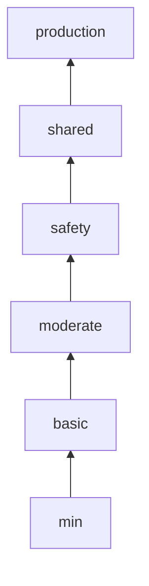

# How to Grade Your Ansible Code Quality with ansible-lint

Author: [nawazdhandala](https://www.github.com/nawazdhandala)

Tags: Ansible, ansible-lint, Code Quality, DevOps, Best Practices

Description: Learn how to use ansible-lint profiles to grade your Ansible code quality from basic to production level and progressively improve your playbooks.

---

Not all Ansible code needs the same level of polish. A quick script for a one-time migration does not need the same rigor as a playbook that deploys your production infrastructure every day. ansible-lint introduced profiles that let you set quality thresholds and grade your code against them. This gives you a clear picture of where your code stands and a roadmap for improvement. In this post, I will show you how to use these profiles, interpret the results, and progressively raise the bar on your Ansible code quality.

## Understanding ansible-lint Profiles

ansible-lint ships with several built-in profiles, each representing a quality level. Each profile includes all the rules from the levels below it plus additional stricter rules.



Here is what each profile enforces:

- **min** - Bare minimum. Only catches syntax errors and rules that would cause playbook failures.
- **basic** - Adds basic best practices like naming tasks and avoiding deprecated syntax.
- **moderate** - Adds formatting rules, FQCN requirements, and idempotency checks.
- **safety** - Adds security-focused rules like file permissions and no_log requirements.
- **shared** - Designed for code that will be shared with others. Adds documentation and metadata requirements.
- **production** - The strictest level. Everything from shared plus additional rules for reliability and maintainability.

## Running a Quality Grade Check

To grade your code, specify a profile when running ansible-lint.

```bash
# Check your code against the production profile (strictest)
ansible-lint -p production playbook.yml

# Check against the basic profile (more lenient)
ansible-lint -p basic playbook.yml

# Check against safety (security-focused)
ansible-lint -p safety playbook.yml
```

## Setting Your Target Profile

The best approach is to set your target profile in the configuration file.

```yaml
# .ansible-lint
# Set the quality profile for this project
profile: moderate

# Start here and work toward production
# Current violations will be reported as errors
strict: true
```

## Grading a Real Playbook

Let me walk through grading an actual playbook and show what each profile catches. Here is a playbook with various quality issues.

```yaml
# deploy-app.yml - a playbook with several quality issues
---
- hosts: webservers
  become: yes
  tasks:
    - yum:
        name: httpd
        state: present

    - copy:
        src: httpd.conf
        dest: /etc/httpd/conf/httpd.conf
      notify: restart httpd

    - service:
        name: httpd
        state: started
        enabled: yes

    - shell: curl -s http://localhost/health
      register: health

    - debug:
        var: health.stdout

  handlers:
    - name: restart httpd
      service:
        name: httpd
        state: restarted
```

### What the min Profile Catches

```bash
# Running with the min profile
ansible-lint -p min deploy-app.yml
```

The min profile might not flag anything here because the playbook is syntactically valid. It focuses on things that would actually break execution.

### What the basic Profile Catches

```bash
# Running with the basic profile
ansible-lint -p basic deploy-app.yml
```

The basic profile catches:
- Missing task names on several tasks
- Using `yes` instead of `true` for boolean values
- Missing play name

### What the moderate Profile Catches

The moderate profile adds:
- Non-FQCN module names (`yum` instead of `ansible.builtin.yum`)
- YAML formatting issues
- Missing `changed_when` on the shell task

### What the safety Profile Catches

The safety profile adds:
- Missing file permissions on the copy task
- Using shell instead of the uri module for the health check

### What the production Profile Catches

The production profile catches everything above plus any remaining best practice violations.

## Fixing to Production Grade

Here is the same playbook fixed to pass the production profile.

```yaml
# deploy-app.yml - production grade
---
- name: Deploy and configure Apache web server
  hosts: webservers
  become: true
  tasks:
    - name: Install Apache HTTP Server
      ansible.builtin.yum:
        name: httpd
        state: present

    - name: Deploy Apache configuration file
      ansible.builtin.copy:
        src: httpd.conf
        dest: /etc/httpd/conf/httpd.conf
        owner: root
        group: root
        mode: "0644"
      notify: Restart Apache HTTP Server

    - name: Ensure Apache is running and enabled
      ansible.builtin.service:
        name: httpd
        state: started
        enabled: true

    - name: Verify application health endpoint
      ansible.builtin.uri:
        url: http://localhost/health
        return_content: true
      register: health
      changed_when: false

    - name: Display health check result
      ansible.builtin.debug:
        var: health.content

  handlers:
    - name: Restart Apache HTTP Server
      ansible.builtin.service:
        name: httpd
        state: restarted
```

## Creating a Quality Scorecard

You can build a simple scorecard by running against each profile and counting violations.

```bash
#!/bin/bash
# grade-ansible.sh - Generate a quality scorecard for your Ansible project

PROJECT_DIR="${1:-.}"
PROFILES=("min" "basic" "moderate" "safety" "shared" "production")

echo "============================================"
echo "Ansible Code Quality Scorecard"
echo "Project: $PROJECT_DIR"
echo "Date: $(date +%Y-%m-%d)"
echo "============================================"
echo ""

for profile in "${PROFILES[@]}"; do
    # Count violations at each level
    count=$(ansible-lint -p "$profile" -f json "$PROJECT_DIR" 2>/dev/null | \
        python3 -c "import json,sys; data=json.load(sys.stdin); print(len(data))" 2>/dev/null || echo "error")

    if [ "$count" = "0" ]; then
        status="PASS"
    elif [ "$count" = "error" ]; then
        status="ERROR"
        count="?"
    else
        status="FAIL"
    fi

    printf "%-12s : %s (%s violations)\n" "$profile" "$status" "$count"
done

echo ""
echo "============================================"
```

Running this might produce output like:

```
============================================
Ansible Code Quality Scorecard
Project: playbooks/
Date: 2026-02-21
============================================

min          : PASS (0 violations)
basic        : PASS (0 violations)
moderate     : FAIL (23 violations)
safety       : FAIL (31 violations)
shared       : FAIL (45 violations)
production   : FAIL (52 violations)
============================================
```

This tells you that your code passes basic quality checks but needs work to meet moderate standards.

## Progressive Quality Improvement Strategy

Jumping straight to the production profile on a legacy codebase is overwhelming. A better approach is to improve incrementally.

```yaml
# Phase 1: Start with basic profile (Week 1-2)
# .ansible-lint
profile: basic
strict: true

# Phase 2: Move to moderate (Week 3-4)
# .ansible-lint
profile: moderate
strict: true

# Phase 3: Move to safety (Week 5-6)
# .ansible-lint
profile: safety
strict: true

# Phase 4: Reach production (Week 7-8)
# .ansible-lint
profile: production
strict: true
```

## Tracking Quality Metrics Over Time

Store quality metrics from each CI run to track improvement trends.

```yaml
# GitHub Actions workflow that tracks quality metrics
name: Ansible Quality Metrics
on:
  push:
    branches: [main]

jobs:
  quality-grade:
    runs-on: ubuntu-latest
    steps:
      - uses: actions/checkout@v4

      - name: Install ansible-lint
        run: pip install ansible-lint

      - name: Generate quality report
        run: |
          for profile in min basic moderate safety shared production; do
            count=$(ansible-lint -p "$profile" -f json playbooks/ 2>/dev/null | \
              python3 -c "import json,sys; print(len(json.load(sys.stdin)))" 2>/dev/null || echo "-1")
            echo "${profile}=${count}" >> quality-metrics.txt
          done
          cat quality-metrics.txt

      - name: Upload metrics artifact
        uses: actions/upload-artifact@v4
        with:
          name: quality-metrics-${{ github.sha }}
          path: quality-metrics.txt
```

## Custom Profiles

If the built-in profiles do not match your needs, you can create a custom configuration that acts like a custom profile.

```yaml
# .ansible-lint - custom quality profile
# Based on 'safety' but with project-specific adjustments

profile: safety

# Additional rules we want enforced beyond the safety profile
enable_list:
  - fqcn
  - name[casing]
  - name[template]

# Rules we have decided to skip for valid reasons
skip_list:
  - yaml[line-length]  # We allow long lines for readability of complex Jinja2
  - role-name[path]    # Our role naming convention differs from the default

# Rules that warn but do not block
warn_list:
  - experimental
  - galaxy[no-changelog]
```

## Quality Gates in CI/CD

Use profiles as quality gates that block merges if code does not meet the required grade.

```yaml
# .gitlab-ci.yml
ansible-quality-gate:
  stage: lint
  image: python:3.11-slim
  before_script:
    - pip install ansible-lint
  script:
    # The project must pass the 'safety' profile to merge
    - ansible-lint -p safety --strict playbooks/ roles/
  rules:
    - if: $CI_MERGE_REQUEST_ID
  allow_failure: false
```

## Tips for Reaching Production Grade

Based on grading dozens of Ansible projects, here are the most common blockers at each level:

1. **basic to moderate** - FQCN is usually the biggest hurdle. Use `ansible-lint --fix` to handle it automatically.

2. **moderate to safety** - File permissions and `no_log` on sensitive tasks. Audit every `copy`, `template`, and `file` task.

3. **safety to shared** - Documentation and metadata. Add descriptions to roles, write meaningful task names, and ensure `meta/main.yml` is complete in every role.

4. **shared to production** - This is about consistency and polish. Proper handler naming, no unused variables, and clean YAML formatting throughout.

Grading your Ansible code is not about achieving a perfect score for its own sake. It is about having visibility into the quality of your infrastructure code and making informed decisions about where to invest improvement effort. Start where you are, set a realistic target, and improve steadily.
