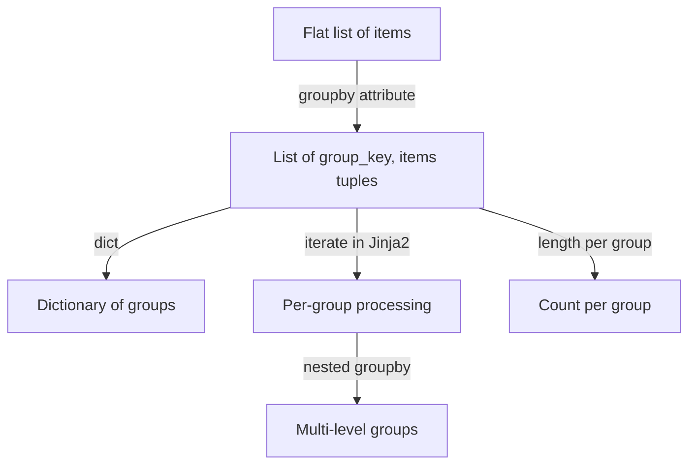

# How to Group Data by Attributes in Ansible

Author: [nawazdhandala](https://www.github.com/nawazdhandala)

Tags: Ansible, Data Manipulation, Jinja2, Groupby

Description: Learn how to group lists of data by attributes in Ansible using the groupby filter, custom Jinja2 logic, and json_query for organized data processing.

---

Grouping data by a shared attribute is something you run into often when working with infrastructure automation. Maybe you need to group servers by region, users by department, or packages by category. Ansible's `groupby` filter (inherited from Jinja2) handles this cleanly, though it has a few quirks worth knowing about.

## Basic groupby Usage

The `groupby` filter takes a list of dictionaries and groups them by a specified attribute. It returns a list of tuples, where each tuple is `(group_key, list_of_items)`.

```yaml
# playbook-basic-groupby.yml
# Groups servers by their region attribute
- name: Group servers by region
  hosts: localhost
  gather_facts: false
  vars:
    servers:
      - name: web-01
        region: us-east-1
        role: webserver
      - name: db-01
        region: us-east-1
        role: database
      - name: web-02
        region: eu-west-1
        role: webserver
      - name: cache-01
        region: eu-west-1
        role: cache
      - name: web-03
        region: ap-south-1
        role: webserver

  tasks:
    - name: Group servers by region
      ansible.builtin.debug:
        msg: |
          
          Region: {{ region }}
          
            - {{ host.name }} ({{ host.role }})
          
          
```

Output:

```
Region: ap-south-1
  - web-03 (webserver)
Region: eu-west-1
  - web-02 (webserver)
  - cache-01 (cache)
Region: us-east-1
  - web-01 (webserver)
  - db-01 (database)
```

## Converting groupby Results to a Dictionary

The groupby output is a list of tuples, which is not always convenient. You can convert it to a dictionary:

```yaml
# playbook-groupby-dict.yml
# Converts groupby results into a proper dictionary for easier access
- name: Convert groupby to dictionary
  hosts: localhost
  gather_facts: false
  vars:
    services:
      - name: nginx
        type: web
      - name: apache
        type: web
      - name: postgresql
        type: database
      - name: mysql
        type: database
      - name: redis
        type: cache

  tasks:
    - name: Group by type and convert to dict
      ansible.builtin.set_fact:
        grouped: "{{ dict(services | groupby('type')) }}"

    - name: Access specific group
      ansible.builtin.debug:
        msg: "Web services: {{ grouped['web'] | map(attribute='name') | list }}"

    - name: Show all groups
      ansible.builtin.debug:
        var: grouped
```

## Grouping and Counting

A common pattern is to group items and then count how many are in each group:

```yaml
# playbook-group-count.yml
# Groups alerts by severity and counts each group
- name: Count items per group
  hosts: localhost
  gather_facts: false
  vars:
    alerts:
      - id: 1
        severity: critical
      - id: 2
        severity: warning
      - id: 3
        severity: critical
      - id: 4
        severity: info
      - id: 5
        severity: warning
      - id: 6
        severity: warning
      - id: 7
        severity: critical

  tasks:
    - name: Count alerts by severity
      ansible.builtin.debug:
        msg: |
          Alert Summary:
          
          {{ severity }}: {{ items | length }} alert(s)
          
```

Output:

```
Alert Summary:
critical: 3 alert(s)
info: 1 alert(s)
warning: 3 alert(s)
```

## Grouping by Nested Attributes

You can group by nested attributes using dot notation:

```yaml
# playbook-nested-groupby.yml
# Groups VMs by a nested attribute (location.datacenter)
- name: Group by nested attribute
  hosts: localhost
  gather_facts: false
  vars:
    vms:
      - name: vm-01
        location:
          datacenter: dc-1
          rack: A1
      - name: vm-02
        location:
          datacenter: dc-2
          rack: B1
      - name: vm-03
        location:
          datacenter: dc-1
          rack: A2
      - name: vm-04
        location:
          datacenter: dc-2
          rack: B2

  tasks:
    - name: Group VMs by datacenter
      ansible.builtin.debug:
        msg: |
          
          Datacenter {{ dc }}: {{ machines | map(attribute='name') | join(', ') }}
          
```

## Multi-Level Grouping

For grouping by multiple attributes, you can nest groupby operations:

```yaml
# playbook-multi-group.yml
# Groups employees first by department, then by role within each department
- name: Multi-level grouping
  hosts: localhost
  gather_facts: false
  vars:
    employees:
      - name: Alice
        department: engineering
        role: senior
      - name: Bob
        department: engineering
        role: junior
      - name: Carol
        department: sales
        role: senior
      - name: David
        department: engineering
        role: senior
      - name: Eve
        department: sales
        role: junior
      - name: Frank
        department: sales
        role: senior

  tasks:
    - name: Group by department then by role
      ansible.builtin.debug:
        msg: |
          
          == {{ dept | upper }} ==
          
            {{ role }}:
          
              - {{ person.name }}
          
          
          
```

## Groupby Process Flow



## Practical Example: Generating Per-Region Inventory

```yaml
# playbook-inventory-report.yml
# Groups hosts by region and generates a per-region inventory report
- name: Generate per-region inventory report
  hosts: localhost
  gather_facts: false
  vars:
    all_hosts:
      - hostname: web-use1-01
        region: us-east-1
        type: t3.medium
        role: web
      - hostname: db-use1-01
        region: us-east-1
        type: r5.large
        role: database
      - hostname: web-euw1-01
        region: eu-west-1
        type: t3.medium
        role: web
      - hostname: web-euw1-02
        region: eu-west-1
        type: t3.large
        role: web
      - hostname: db-euw1-01
        region: eu-west-1
        type: r5.xlarge
        role: database
      - hostname: web-aps1-01
        region: ap-south-1
        type: t3.medium
        role: web

  tasks:
    - name: Generate regional summary
      ansible.builtin.copy:
        content: |
          # Infrastructure Inventory Report
          # Generated by Ansible

          
          ## {{ region }}
          Total hosts: {{ hosts | length }}

          
          ### {{ role }}
          
          - {{ h.hostname }} ({{ h.type }})
          
          

          
        dest: /tmp/inventory_report.txt

    - name: Show summary stats
      ansible.builtin.debug:
        msg: |
          
          {{ region }}: {{ hosts | length }} hosts ({{ hosts | map(attribute='role') | unique | join(', ') }})
          
```

## Grouping with json_query

For more complex grouping scenarios, `json_query` (JMESPath) can be useful:

```yaml
# playbook-jmespath-group.yml
# Uses json_query to extract grouped data from a complex structure
- name: Group with json_query
  hosts: localhost
  gather_facts: false
  vars:
    deployments:
      - app: frontend
        env: production
        version: "2.1.0"
      - app: backend
        env: production
        version: "3.4.1"
      - app: frontend
        env: staging
        version: "2.2.0-rc1"
      - app: backend
        env: staging
        version: "3.5.0-beta"

  tasks:
    - name: Get all production deployments
      ansible.builtin.set_fact:
        prod_apps: "{{ deployments | json_query(\"[?env=='production']\") }}"

    - name: Show production apps
      ansible.builtin.debug:
        var: prod_apps
```

## Building Custom Group Summaries

```yaml
# playbook-group-summary.yml
# Builds a summary dictionary with counts and member lists per group
- name: Build group summary with metadata
  hosts: localhost
  gather_facts: false
  vars:
    tickets:
      - id: "T-001"
        status: open
        assignee: alice
      - id: "T-002"
        status: closed
        assignee: bob
      - id: "T-003"
        status: open
        assignee: alice
      - id: "T-004"
        status: in_progress
        assignee: carol
      - id: "T-005"
        status: open
        assignee: bob

  tasks:
    - name: Build summary by status
      ansible.builtin.set_fact:
        status_summary: >-
          
          
          
          
          {{ result }}

    - name: Display status summary
      ansible.builtin.debug:
        var: status_summary
```

## Summary

The `groupby` filter is Ansible's built-in tool for organizing flat lists into groups based on shared attribute values. Convert the results to a dictionary with `dict()` for key-based access. Use nested groupby for multi-level categorization. Pair it with `length` for counting, `map` for field extraction, and Jinja2 loops for formatted output. When the built-in groupby does not offer enough flexibility, fall back to `json_query` or raw Jinja2 logic to build exactly the grouped structure you need.
