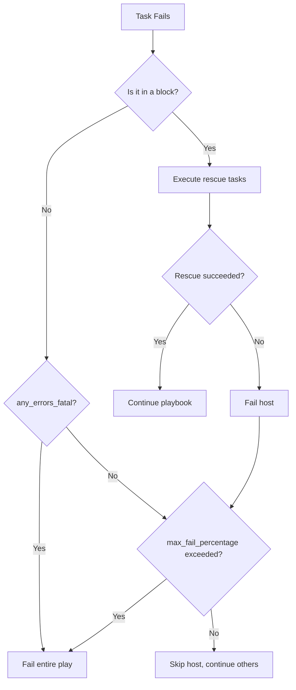

# How to Handle Ansible Playbook Failures in Production

Author: [nawazdhandala](https://www.github.com/nawazdhandala)

Tags: Ansible, Error Handling, Production, Incident Response

Description: Learn how to handle Ansible playbook failures in production environments with block/rescue patterns, rollback strategies, and failure notification systems.

---

Production failures are inevitable. A package repository goes down, a service fails to start, a configuration has a typo. What matters is how your playbooks handle these failures. A well-designed playbook detects the failure, limits the blast radius, attempts recovery, and notifies the team. A poorly designed one silently corrupts half your fleet.

## The block/rescue/always Pattern

This is your primary tool for production error handling:

```yaml
# playbooks/deploy.yml
- name: Deploy application with failure handling
  hosts: app_servers
  become: yes
  serial: "25%"
  max_fail_percentage: 10

  tasks:
    - name: Deploy with rollback on failure
      block:
        - name: Stop application gracefully
          ansible.builtin.service:
            name: myapp
            state: stopped

        - name: Deploy new version
          ansible.builtin.git:
            repo: "{{ app_repo }}"
            dest: "{{ app_dir }}"
            version: "{{ app_version }}"
          register: deploy_result

        - name: Install dependencies
          ansible.builtin.pip:
            requirements: "{{ app_dir }}/requirements.txt"
            virtualenv: "{{ app_dir }}/venv"

        - name: Run database migrations
          ansible.builtin.command:
            cmd: "{{ app_dir }}/venv/bin/python manage.py migrate --noinput"
            chdir: "{{ app_dir }}"
          run_once: true

        - name: Start application
          ansible.builtin.service:
            name: myapp
            state: started

        - name: Verify application health
          ansible.builtin.uri:
            url: "http://localhost:{{ app_port }}/health"
            status_code: 200
          retries: 10
          delay: 5

      rescue:
        - name: Deployment failed - rolling back
          ansible.builtin.debug:
            msg: "FAILURE on {{ inventory_hostname }}: Rolling back to {{ app_previous_version }}"

        - name: Restore previous version
          ansible.builtin.git:
            repo: "{{ app_repo }}"
            dest: "{{ app_dir }}"
            version: "{{ app_previous_version }}"

        - name: Reinstall previous dependencies
          ansible.builtin.pip:
            requirements: "{{ app_dir }}/requirements.txt"
            virtualenv: "{{ app_dir }}/venv"

        - name: Start application with old version
          ansible.builtin.service:
            name: myapp
            state: started

        - name: Verify rollback health
          ansible.builtin.uri:
            url: "http://localhost:{{ app_port }}/health"
            status_code: 200
          retries: 10
          delay: 5

        - name: Send failure notification
          ansible.builtin.uri:
            url: "{{ slack_webhook }}"
            method: POST
            body_format: json
            body:
              text: |
                :red_circle: *Deployment Failed*
                Host: {{ inventory_hostname }}
                Version: {{ app_version }}
                Rolled back to: {{ app_previous_version }}
                Time: {{ ansible_date_time.iso8601 }}
          delegate_to: localhost

      always:
        - name: Ensure application is running regardless of outcome
          ansible.builtin.service:
            name: myapp
            state: started

        - name: Log deployment attempt
          ansible.builtin.lineinfile:
            path: /var/log/deployments.log
            line: "{{ ansible_date_time.iso8601 }} | {{ app_version }} | {{ 'FAILED' if ansible_failed_task is defined else 'SUCCESS' }} | {{ inventory_hostname }}"
            create: yes
            mode: '0644'
```

## Limiting Blast Radius

Use `serial` and `max_fail_percentage` to prevent fleet-wide damage:

```yaml
# Deploy to 25% of hosts at a time, abort if more than 10% fail
- name: Rolling deployment
  hosts: webservers
  serial: "25%"
  max_fail_percentage: 10
  become: yes

  tasks:
    - name: Deploy application
      ansible.builtin.include_role:
        name: app_deploy
```

For critical deployments, use explicit batches:

```yaml
# Deploy to canary first, then gradually expand
- name: Canary deployment
  hosts: webservers[0]
  become: yes
  roles:
    - app_deploy

- name: Verify canary
  hosts: webservers[0]
  tasks:
    - name: Check canary health
      ansible.builtin.uri:
        url: "http://{{ inventory_hostname }}:{{ app_port }}/health"
        status_code: 200
      retries: 15
      delay: 10

- name: Deploy to remaining servers
  hosts: webservers[1:]
  serial: "33%"
  become: yes
  roles:
    - app_deploy
```

## Handling Specific Error Types

```yaml
# Handle different failure scenarios differently
- name: Install package with fallback
  block:
    - name: Install from primary repository
      ansible.builtin.apt:
        name: "mypackage={{ target_version }}"
        state: present
        update_cache: yes

  rescue:
    - name: Primary repo failed - try fallback repository
      ansible.builtin.apt_repository:
        repo: "{{ fallback_apt_repo }}"
        state: present

    - name: Install from fallback repository
      ansible.builtin.apt:
        name: "mypackage={{ target_version }}"
        state: present
        update_cache: yes
```

## Failure Decision Tree



## Pre-Flight Checks

Catch problems before making changes:

```yaml
# playbooks/preflight.yml
- name: Pre-flight checks before deployment
  hosts: app_servers
  become: yes
  gather_facts: yes

  tasks:
    - name: Verify disk space is sufficient
      ansible.builtin.assert:
        that:
          - ansible_mounts | selectattr('mount', 'equalto', '/') | map(attribute='size_available') | first | int > 1073741824
        fail_msg: "Less than 1GB free disk space on {{ inventory_hostname }}"

    - name: Verify required services are running
      ansible.builtin.service_facts:

    - name: Assert database is reachable
      ansible.builtin.wait_for:
        host: "{{ db_host }}"
        port: "{{ db_port }}"
        timeout: 5
      delegate_to: localhost

    - name: Verify application repository is accessible
      ansible.builtin.git:
        repo: "{{ app_repo }}"
        dest: /tmp/repo-check
        version: "{{ app_version }}"
        clone: no
        update: no
      delegate_to: localhost
      run_once: true
      changed_when: false
```

## Retry Logic

Build retry mechanisms for transient failures:

```yaml
# Retry a flaky operation with exponential backoff
- name: Download application artifact
  ansible.builtin.get_url:
    url: "{{ artifact_url }}"
    dest: "/tmp/app-{{ app_version }}.tar.gz"
    checksum: "sha256:{{ artifact_checksum }}"
  retries: 5
  delay: 10
  register: download_result
  until: download_result is succeeded

# Retry with custom condition
- name: Wait for database to accept connections after restart
  ansible.builtin.command:
    cmd: pg_isready -h localhost -p 5432
  register: db_ready
  until: db_ready.rc == 0
  retries: 30
  delay: 2
  changed_when: false
```

## Post-Failure Diagnostics

Collect diagnostic information when things go wrong:

```yaml
# tasks/collect-diagnostics.yml
# Collect information to help debug failures
- name: Collect system logs
  ansible.builtin.command: journalctl -u myapp --since "10 minutes ago" --no-pager
  register: service_logs
  changed_when: false
  failed_when: false

- name: Collect system resources
  ansible.builtin.command: "{{ item }}"
  loop:
    - "free -m"
    - "df -h"
    - "ps aux --sort=-%mem | head -20"
  register: system_info
  changed_when: false
  failed_when: false

- name: Write diagnostic bundle
  ansible.builtin.copy:
    content: |
      Diagnostic Report for {{ inventory_hostname }}
      Time: {{ ansible_date_time.iso8601 }}

      === Service Logs ===
      {{ service_logs.stdout }}

      === System Resources ===
      
      --- {{ result.cmd | join(' ') }} ---
      {{ result.stdout }}
      
    dest: "/tmp/diagnostic-{{ inventory_hostname }}-{{ ansible_date_time.epoch }}.txt"
  delegate_to: localhost
```

## Summary

Handling Ansible failures in production requires defense in depth. Use `block/rescue/always` for automatic rollback on failure. Limit blast radius with `serial` and `max_fail_percentage`. Run pre-flight checks before making changes. Build retry logic for transient failures. Collect diagnostics when things go wrong. Notify the team immediately on failure. The goal is not to prevent all failures but to ensure that when failures happen, they are contained, communicated, and recoverable.
