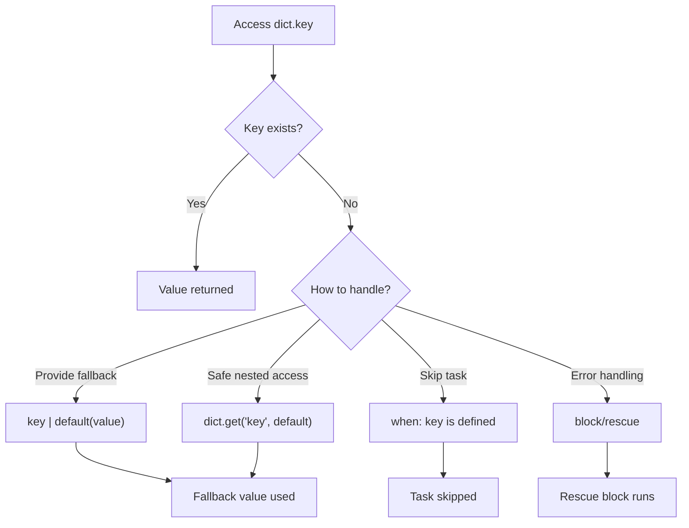

# How to Handle Missing Keys in Dictionaries in Ansible

Author: [nawazdhandala](https://www.github.com/nawazdhandala)

Tags: Ansible, Error Handling, Dictionaries, Jinja2

Description: Learn how to safely handle missing dictionary keys in Ansible using default filter, defined test, ternary, and try/rescue patterns to avoid undefined variable errors.

---

One of the most common errors in Ansible playbooks is trying to access a dictionary key that does not exist. This causes the dreaded "undefined variable" error and stops your playbook. Handling missing keys gracefully is essential for writing robust automation that works across different environments and data sources.

## The Problem

When you access a missing key in Ansible, you get an error:

```yaml
# This will fail if 'database' or 'port' does not exist
- name: This task will fail on missing key
  ansible.builtin.debug:
    msg: "Port is {{ config.database.port }}"
```

Error: `The task includes an option with an undefined variable. 'dict object' has no attribute 'database'`

## Using the default Filter

The `default` filter provides a fallback value when a variable or key is undefined:

```yaml
# playbook-default.yml
# Uses default filter to provide fallback values for missing dictionary keys
- name: Handle missing keys with default
  hosts: localhost
  gather_facts: false
  vars:
    config:
      server:
        host: "0.0.0.0"
        port: 8080

  tasks:
    - name: Access existing key
      ansible.builtin.debug:
        msg: "Port: {{ config.server.port | default(3000) }}"

    - name: Access missing key with default
      ansible.builtin.debug:
        msg: "Log level: {{ config.server.log_level | default('info') }}"

    - name: Access completely missing section with default
      ansible.builtin.debug:
        msg: "DB host: {{ config.database.host | default('localhost') }}"
```

Wait, that last one still fails! If `config.database` does not exist, Ansible errors before the `default` filter can catch it. You need to handle each level:

```yaml
    - name: Safely access nested missing key
      ansible.builtin.debug:
        msg: "DB host: {{ (config.database | default({})).host | default('localhost') }}"
```

## Chaining Defaults for Nested Access

For deeply nested dictionaries, chain defaults at each level:

```yaml
# playbook-nested-defaults.yml
# Chains default filters for safe access to deeply nested dictionary paths
- name: Safe nested dictionary access
  hosts: localhost
  gather_facts: false
  vars:
    app_config:
      server:
        host: "0.0.0.0"

  tasks:
    - name: Safe access three levels deep
      ansible.builtin.debug:
        msg: >-
          DB pool size: {{
            ((app_config.database | default({})).connection | default({})).pool_size | default(5)
          }}

    - name: Build safe config with all defaults
      ansible.builtin.set_fact:
        safe_config:
          host: "{{ app_config.server.host | default('0.0.0.0') }}"
          port: "{{ app_config.server.port | default(8080) }}"
          db_host: "{{ (app_config.database | default({})).host | default('localhost') }}"
          db_port: "{{ (app_config.database | default({})).port | default(5432) }}"
          log_level: "{{ (app_config.logging | default({})).level | default('info') }}"

    - name: Show safe config
      ansible.builtin.debug:
        var: safe_config
```

## Using the defined Test

Check if a key exists before using it:

```yaml
# playbook-defined-test.yml
# Uses the defined/undefined tests to check key existence before access
- name: Check if keys exist
  hosts: localhost
  gather_facts: false
  vars:
    server_config:
      hostname: web-01
      port: 8080

  tasks:
    - name: Check if key is defined
      ansible.builtin.debug:
        msg: "SSL is configured"
      when: server_config.ssl_enabled is defined

    - name: Check if key is NOT defined
      ansible.builtin.debug:
        msg: "SSL is NOT configured, using defaults"
      when: server_config.ssl_enabled is not defined

    - name: Conditional value based on key existence
      ansible.builtin.set_fact:
        listen_address: >-
          {{ server_config.hostname }}:{{ server_config.port }}
          {{ '(SSL)' if server_config.ssl_enabled is defined and server_config.ssl_enabled else '' }}

    - name: Show result
      ansible.builtin.debug:
        var: listen_address
```

## Using dict.get() Method

Python's dict `get()` method works in Jinja2 and returns None (or a specified default) for missing keys:

```yaml
# playbook-dict-get.yml
# Uses Python's dict.get() method for safe key access
- name: Use dict.get() method
  hosts: localhost
  gather_facts: false
  vars:
    config:
      port: 8080
      host: "0.0.0.0"

  tasks:
    - name: Use get with default value
      ansible.builtin.debug:
        msg: "Log level: {{ config.get('log_level', 'info') }}"

    - name: Check for key existence with get
      ansible.builtin.debug:
        msg: "SSL: {{ config.get('ssl_enabled', false) }}"

    - name: Nested get
      ansible.builtin.debug:
        msg: "DB host: {{ config.get('database', {}).get('host', 'localhost') }}"
```

## Decision Flow for Missing Keys



## Using the omit Placeholder

When a missing key should cause a module parameter to be omitted entirely:

```yaml
# playbook-omit.yml
# Uses omit to skip optional module parameters when keys are missing
- name: Use omit for optional parameters
  hosts: all
  become: true
  vars:
    user_config:
      name: appuser
      # uid and shell may or may not be defined

  tasks:
    - name: Create user with optional parameters
      ansible.builtin.user:
        name: "{{ user_config.name }}"
        uid: "{{ user_config.uid | default(omit) }}"
        shell: "{{ user_config.shell | default(omit) }}"
        groups: "{{ user_config.groups | default(omit) }}"
        state: present
```

When the value is `omit`, Ansible simply does not pass that parameter to the module at all.

## Building Defaults Layer

A clean pattern for handling many optional keys:

```yaml
# playbook-defaults-layer.yml
# Merges user-provided config with a defaults dictionary to fill in missing keys
- name: Defaults layer pattern
  hosts: localhost
  gather_facts: false
  vars:
    user_provided_config:
      port: 9090
      log_format: json

    config_defaults:
      host: "0.0.0.0"
      port: 8080
      workers: 4
      log_level: info
      log_format: text
      max_connections: 1000
      timeout: 30

  tasks:
    - name: Merge defaults with user config (user config wins)
      ansible.builtin.set_fact:
        final_config: "{{ config_defaults | combine(user_provided_config) }}"

    - name: Show final config (all keys guaranteed to exist)
      ansible.builtin.debug:
        var: final_config
```

## Handling Missing Keys in Loops

When looping over items where some might lack certain keys:

```yaml
# playbook-loop-missing.yml
# Safely handles missing keys when looping over items with varying structures
- name: Handle missing keys in loops
  hosts: localhost
  gather_facts: false
  vars:
    servers:
      - name: web-01
        port: 8080
        ssl: true
      - name: web-02
        port: 8080
      - name: web-03
        port: 9090
        ssl: true
        custom_header: "X-Custom: value"

  tasks:
    - name: Process servers with optional keys
      ansible.builtin.debug:
        msg: >-
          {{ item.name }} on port {{ item.port }}
           (SSL enabled)
           with {{ item.custom_header }}
      loop: "{{ servers }}"

    - name: Get only SSL-enabled servers (safe filter)
      ansible.builtin.set_fact:
        ssl_servers: >-
          {{ servers | selectattr('ssl', 'defined') |
             selectattr('ssl', 'equalto', true) | list }}

    - name: Show SSL servers
      ansible.builtin.debug:
        var: ssl_servers
```

## Practical Example: Multi-Environment Configuration

```yaml
# playbook-multi-env.yml
# Safely builds environment-specific config by merging layered defaults
- name: Multi-environment config with safe defaults
  hosts: localhost
  gather_facts: false
  vars:
    defaults:
      database:
        host: localhost
        port: 5432
        pool_size: 5
        ssl: false
      cache:
        host: localhost
        port: 6379
        ttl: 3600
      app:
        workers: 4
        debug: false
        log_level: info

    production_overrides:
      database:
        host: db.production.internal
        pool_size: 20
        ssl: true
      app:
        workers: 16

  tasks:
    - name: Build production config with safe defaults
      ansible.builtin.set_fact:
        production_config: "{{ defaults | combine(production_overrides, recursive=true) }}"

    - name: All keys are guaranteed to exist now
      ansible.builtin.debug:
        msg:
          db: "{{ production_config.database.host }}:{{ production_config.database.port }}"
          cache_ttl: "{{ production_config.cache.ttl }}"
          workers: "{{ production_config.app.workers }}"
          debug: "{{ production_config.app.debug }}"
```

## Using block/rescue for Error Handling

For cases where you cannot predict the data shape:

```yaml
# playbook-block-rescue.yml
# Uses block/rescue to gracefully handle completely unexpected data structures
- name: Block/rescue for unpredictable data
  hosts: localhost
  gather_facts: false

  tasks:
    - name: Safely process external data
      block:
        - name: Try to access the data
          ansible.builtin.set_fact:
            value: "{{ external_data.deeply.nested.value }}"
      rescue:
        - name: Use fallback when data structure is unexpected
          ansible.builtin.set_fact:
            value: "fallback_value"

        - name: Log the issue
          ansible.builtin.debug:
            msg: "Could not access external_data.deeply.nested.value, using fallback"
```

## Summary

Handling missing dictionary keys is a fundamental skill for writing reliable Ansible playbooks. The `default` filter is your first line of defense for simple cases. For nested dictionaries, chain defaults or use `dict.get()`. Use `is defined` for conditional logic, `omit` for optional module parameters, and `combine` with a defaults dictionary for the cleanest approach to bulk default handling. When data structures are truly unpredictable, `block/rescue` provides a safety net. The defaults-layer pattern, where you define all expected keys with default values and then merge user-provided overrides on top, is the most maintainable approach for larger configurations.
