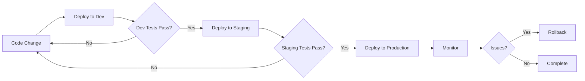

# How to Handle Multi-Environment Ansible Deployments

Author: [nawazdhandala](https://www.github.com/nawazdhandala)

Tags: Ansible, Multi-Environment, Deployment, Infrastructure

Description: Learn how to manage Ansible deployments across development, staging, and production environments with proper isolation and variable management.

---

Most teams run at least three environments: development, staging, and production. Each one has different hosts, different credentials, different performance settings, and sometimes different software versions. Managing all of this with Ansible requires a clear structure that prevents the worst possible outcome: running a production playbook against staging, or vice versa.

## Inventory-Based Environment Separation

The cleanest approach is separate inventory directories for each environment:

```
inventories/
├── development/
│   ├── hosts.yml
│   ├── group_vars/
│   │   ├── all.yml
│   │   ├── all/
│   │   │   └── vault.yml
│   │   ├── webservers.yml
│   │   └── dbservers.yml
│   └── host_vars/
│       └── dev-web01.yml
├── staging/
│   ├── hosts.yml
│   ├── group_vars/
│   │   ├── all.yml
│   │   ├── all/
│   │   │   └── vault.yml
│   │   ├── webservers.yml
│   │   └── dbservers.yml
│   └── host_vars/
├── production/
│   ├── hosts.yml
│   ├── group_vars/
│   │   ├── all.yml
│   │   ├── all/
│   │   │   └── vault.yml
│   │   ├── webservers.yml
│   │   └── dbservers.yml
│   └── host_vars/
│       ├── prod-web01.yml
│       └── prod-web02.yml
```

Each environment's inventory file defines its own hosts:

```yaml
# inventories/production/hosts.yml
all:
  children:
    webservers:
      hosts:
        prod-web01.example.com:
          ansible_host: 10.0.1.10
        prod-web02.example.com:
          ansible_host: 10.0.1.11
    dbservers:
      hosts:
        prod-db01.example.com:
          ansible_host: 10.0.2.10
        prod-db02.example.com:
          ansible_host: 10.0.2.11
```

```yaml
# inventories/staging/hosts.yml
all:
  children:
    webservers:
      hosts:
        stg-web01.example.com:
          ansible_host: 10.1.1.10
    dbservers:
      hosts:
        stg-db01.example.com:
          ansible_host: 10.1.2.10
```

## Environment-Specific Variables

Each environment gets its own variable values while sharing the same variable names:

```yaml
# inventories/production/group_vars/all.yml
env_name: production
env_short: prod
domain: example.com

# Performance tuning for production
nginx_worker_connections: 4096
postgresql_max_connections: 500
postgresql_shared_buffers: 4GB

# Monitoring and alerting
monitoring_enabled: true
alerting_enabled: true
log_level: warn

# Deployment settings
deploy_strategy: rolling
deploy_serial: "25%"
```

```yaml
# inventories/staging/group_vars/all.yml
env_name: staging
env_short: stg
domain: staging.example.com

# Reduced resources for staging
nginx_worker_connections: 512
postgresql_max_connections: 100
postgresql_shared_buffers: 512MB

# Monitoring on, alerting off
monitoring_enabled: true
alerting_enabled: false
log_level: debug

# Faster deploys in staging
deploy_strategy: all_at_once
deploy_serial: "100%"
```

```yaml
# inventories/development/group_vars/all.yml
env_name: development
env_short: dev
domain: dev.example.com

# Minimal resources for development
nginx_worker_connections: 256
postgresql_max_connections: 50
postgresql_shared_buffers: 128MB

monitoring_enabled: false
alerting_enabled: false
log_level: debug

deploy_strategy: all_at_once
deploy_serial: "100%"
```

## Running Against Specific Environments

Select the environment with the `-i` flag:

```bash
# Deploy to staging
ansible-playbook playbooks/site.yml -i inventories/staging/hosts.yml

# Deploy to production
ansible-playbook playbooks/site.yml -i inventories/production/hosts.yml

# Check what would change in production (dry run)
ansible-playbook playbooks/site.yml -i inventories/production/hosts.yml --check --diff
```

## Safety Guards

Add environment verification at the start of production playbooks:

```yaml
# playbooks/site.yml
- name: Verify target environment
  hosts: all
  gather_facts: false
  tasks:
    - name: Display target environment
      ansible.builtin.debug:
        msg: "Deploying to {{ env_name | upper }} environment"
      run_once: true

    - name: Require confirmation for production deployments
      ansible.builtin.pause:
        prompt: "You are deploying to PRODUCTION. Type 'yes' to continue"
      register: confirm
      when: env_name == 'production'
      run_once: true

    - name: Abort if not confirmed
      ansible.builtin.fail:
        msg: "Deployment cancelled by operator"
      when:
        - env_name == 'production'
        - confirm.user_input | default('') != 'yes'
      run_once: true
```

## Makefile for Environment Targeting

```makefile
# Makefile
# Convenience targets for each environment

ENV ?= staging

deploy:
	ansible-playbook playbooks/site.yml -i inventories/$(ENV)/hosts.yml

check:
	ansible-playbook playbooks/site.yml -i inventories/$(ENV)/hosts.yml --check --diff

deploy-staging:
	$(MAKE) deploy ENV=staging

deploy-production:
	$(MAKE) deploy ENV=production

ping:
	ansible all -m ping -i inventories/$(ENV)/hosts.yml
```

Usage:

```bash
# Default targets staging
make deploy

# Explicit environment
make deploy ENV=production

# Shortcut targets
make deploy-staging
make deploy-production
```

## Shared Variables Across Environments

Some variables are the same everywhere. Use the project-level `group_vars`:

```yaml
# group_vars/all.yml (project root, applies to all inventories)
# Shared across ALL environments
ntp_servers:
  - 0.pool.ntp.org
  - 1.pool.ntp.org

common_packages:
  - vim
  - htop
  - curl
  - wget
  - git

ssh_allowed_users:
  - deploy
  - admin

timezone: UTC
```

## Environment Promotion Flow



## Handling Environment-Specific Roles

Sometimes a role should only run in certain environments:

```yaml
# playbooks/site.yml
- name: Configure all servers
  hosts: all
  become: yes
  roles:
    - common
    - security_baseline
    - monitoring_agent

- name: Configure debug tools (non-production only)
  hosts: all
  become: yes
  roles:
    - role: debug_tools
      when: env_name != 'production'

- name: Configure production hardening
  hosts: all
  become: yes
  roles:
    - role: production_hardening
      when: env_name == 'production'
```

## Environment-Specific Templates

Use the same template with environment-aware logic:

```jinja2
{# templates/app.conf.j2 #}
[server]
host = 0.0.0.0
port = {{ app_port }}
workers = {{ app_workers }}

[database]
url = postgresql://{{ database_user }}:{{ database_password }}@{{ database_host }}:{{ database_port }}/{{ database_name }}
pool_size = {{ db_pool_size }}

[logging]
level = {{ log_level }}

format = json
output = /var/log/{{ app_name }}/app.log

format = text
output = stdout



[debug]
enabled = true
profiling = true

```

## Testing Across Environments

Validate your playbooks work across all environments:

```bash
# Syntax check against each environment
for env in development staging production; do
  echo "Checking ${env}..."
  ansible-playbook playbooks/site.yml \
    -i inventories/${env}/hosts.yml \
    --syntax-check
done

# Dry run against staging before production
ansible-playbook playbooks/site.yml \
  -i inventories/staging/hosts.yml \
  --check --diff
```

## Summary

Multi-environment Ansible deployments work best with separate inventory directories per environment. Keep the same variable names across environments with different values. Use project-level `group_vars` for truly shared settings. Add safety guards for production deployments. Use a Makefile to simplify environment targeting. Test playbooks against staging before production. The inventory-based approach gives you complete isolation between environments while keeping your playbooks and roles identical across all of them.
