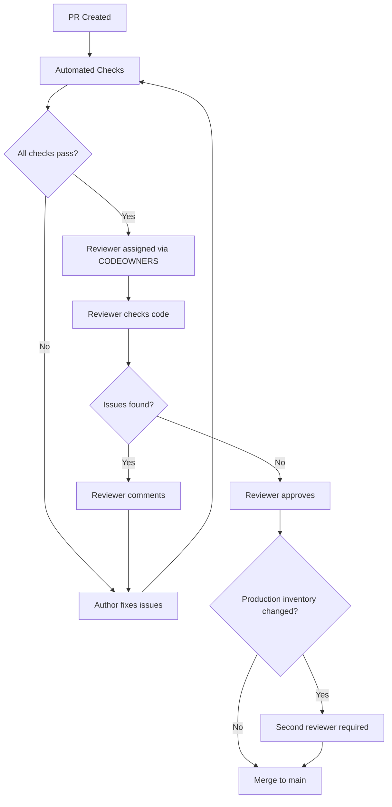

# How to Implement Ansible Code Review Process

Author: [nawazdhandala](https://www.github.com/nawazdhandala)

Tags: Ansible, Code Review, DevOps, Quality Assurance

Description: Establish an effective code review process for Ansible playbooks and roles with checklists, automated checks, and review guidelines for teams.

---

Code review for Ansible is different from reviewing application code. You are reviewing infrastructure changes that can bring down production systems. A missed variable, a wrong host group, or a misconfigured service can cause outages. Having a structured review process catches these issues before they reach your servers.

## Set Up Branch Protection

Start with enforcing reviews through branch protection:

```yaml
# .github/settings.yml (using probot/settings app)
# Or configure manually in GitHub repository settings
branches:
  - name: main
    protection:
      required_pull_request_reviews:
        required_approving_review_count: 1
        dismiss_stale_reviews: true
        require_code_owner_reviews: true
      required_status_checks:
        strict: true
        contexts:
          - "ansible-lint"
          - "molecule-tests"
          - "syntax-check"
      enforce_admins: true
      restrictions: null
```

## Define CODEOWNERS

Assign reviewers based on file paths:

```
# .github/CODEOWNERS
# Require platform team review for all infrastructure changes

# Default owners for all Ansible files
*.yml @platform-team

# Role-specific owners
roles/nginx/ @web-team @platform-team
roles/postgresql/ @database-team @platform-team
roles/kubernetes/ @k8s-team @platform-team

# Inventory changes require senior review
inventories/production/ @senior-engineers

# Security-related changes
roles/security_baseline/ @security-team
roles/firewall/ @security-team
```

## Automated Pre-Review Checks

Run automated validation before human review:

```yaml
# .github/workflows/pr-checks.yml
name: PR Validation

on:
  pull_request:
    branches: [main]

jobs:
  ansible-lint:
    runs-on: ubuntu-latest
    steps:
      - uses: actions/checkout@v4
      - uses: actions/setup-python@v5
        with:
          python-version: '3.11'
      - run: pip install ansible-lint ansible-core
      - run: ansible-lint playbooks/ roles/ --strict

  syntax-check:
    runs-on: ubuntu-latest
    steps:
      - uses: actions/checkout@v4
      - uses: actions/setup-python@v5
        with:
          python-version: '3.11'
      - run: pip install ansible-core
      - name: Syntax check all playbooks
        run: |
          for pb in playbooks/*.yml; do
            echo "Checking $pb"
            ansible-playbook "$pb" --syntax-check -i localhost,
          done

  molecule-tests:
    runs-on: ubuntu-latest
    strategy:
      matrix:
        role: [common, nginx, postgresql]
    steps:
      - uses: actions/checkout@v4
      - uses: actions/setup-python@v5
        with:
          python-version: '3.11'
      - run: pip install molecule molecule-docker ansible-core
      - run: molecule test
        working-directory: roles/${{ matrix.role }}

  diff-summary:
    runs-on: ubuntu-latest
    steps:
      - uses: actions/checkout@v4
        with:
          fetch-depth: 0
      - name: Generate change summary
        run: |
          echo "## Changed Files" > summary.md
          echo "" >> summary.md
          git diff --name-only origin/main...HEAD | while read f; do
            echo "- \`$f\`" >> summary.md
          done
          echo "" >> summary.md
          echo "## Affected Roles" >> summary.md
          git diff --name-only origin/main...HEAD | grep "^roles/" | cut -d/ -f2 | sort -u | while read r; do
            echo "- $r" >> summary.md
          done
      - name: Post summary as PR comment
        uses: marocchino/sticky-pull-request-comment@v2
        with:
          path: summary.md
```

## The Review Checklist

Create a PR template with a review checklist:

```markdown
<!-- .github/pull_request_template.md -->
## Description
<!-- What does this change do? -->

## Type of Change
- [ ] New role
- [ ] Role update
- [ ] Variable change
- [ ] Inventory change
- [ ] Playbook change
- [ ] Bug fix

## Environments Affected
- [ ] Development
- [ ] Staging
- [ ] Production

## Review Checklist

### For the Author
- [ ] All tasks have descriptive names
- [ ] Variables are prefixed with role name
- [ ] Sensitive data uses ansible-vault
- [ ] FQCNs used for all modules
- [ ] Tasks are idempotent
- [ ] Molecule tests pass locally
- [ ] README updated if adding new variables

### For the Reviewer
- [ ] No hardcoded credentials or secrets
- [ ] No hardcoded IP addresses or hostnames
- [ ] Variable precedence is correct
- [ ] Handlers are properly notified
- [ ] Tags are consistent with project conventions
- [ ] Check mode compatibility (--check works)
- [ ] No destructive operations without safeguards
- [ ] Error handling for critical operations
```

## What Reviewers Should Look For

Here are common issues to catch during review:

```yaml
# Issue 1: Missing become on tasks that need root
# BAD
- name: Install packages
  ansible.builtin.apt:
    name: nginx
    state: present
  # Will fail without become: yes

# GOOD
- name: Install packages
  ansible.builtin.apt:
    name: nginx
    state: present
  become: yes
```

```yaml
# Issue 2: Using shell when a module exists
# BAD
- name: Create directory
  ansible.builtin.shell: mkdir -p /opt/myapp && chown deploy:deploy /opt/myapp

# GOOD
- name: Create directory
  ansible.builtin.file:
    path: /opt/myapp
    state: directory
    owner: deploy
    group: deploy
    mode: '0755'
```

```yaml
# Issue 3: Missing no_log on sensitive tasks
# BAD
- name: Set database password
  ansible.builtin.shell: "echo 'ALTER USER app PASSWORD {{ db_password }}' | psql"

# GOOD
- name: Set database password
  community.postgresql.postgresql_user:
    name: app
    password: "{{ db_password }}"
  no_log: true
```

```yaml
# Issue 4: Non-idempotent commands without safeguards
# BAD
- name: Initialize database
  ansible.builtin.command: /opt/app/bin/init-db

# GOOD
- name: Initialize database
  ansible.builtin.command: /opt/app/bin/init-db
  args:
    creates: /opt/app/data/.initialized
```

## Review Process Flow



## Review Comments Best Practices

Write constructive review comments:

```
# Instead of:
"This is wrong."

# Write:
"This command module should use `creates` parameter to be
idempotent. Without it, the initialization script runs on
every playbook execution. Example:

  args:
    creates: /opt/app/.initialized"
```

```
# Instead of:
"You forgot become."

# Write:
"This task needs `become: yes` because apt requires root
privileges. The playbook-level `become` does not apply here
since this is inside a block that overrides it."
```

## Dry Run Reviews for Critical Changes

For production changes, require a dry-run report:

```bash
# Generate a dry-run diff report
ansible-playbook playbooks/site.yml \
  -i inventories/production/hosts.yml \
  --check --diff 2>&1 > dry-run-report.txt
```

Attach the dry-run output to the PR as a comment so reviewers can see exactly what will change on production servers.

## Summary

An effective Ansible code review process combines automated checks with human review. Set up branch protection and CODEOWNERS to enforce reviews. Run ansible-lint, syntax checks, and Molecule tests in CI before any human looks at the code. Use a PR template with a review checklist. Train reviewers to look for idempotency issues, missing security controls, and hardcoded values. Require dry-run reports for production changes. This process catches infrastructure bugs before they become outages.
