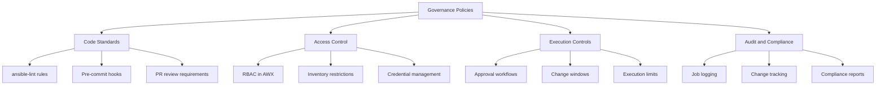

# How to Implement Ansible Governance Policies

Author: [nawazdhandala](https://www.github.com/nawazdhandala)

Tags: Ansible, Governance, Policy Enforcement, Enterprise

Description: Implement governance policies for Ansible automation including approval workflows, execution controls, and compliance enforcement in enterprise environments.

---

Governance in Ansible means ensuring that automation runs within defined boundaries. Who can execute what, against which hosts, with what level of approval. Without governance, a junior engineer can accidentally run a destructive playbook against production. With proper governance, the system prevents that from happening.

## Governance Layers



## Code Quality Policies

Enforce code quality through automated checks:

```yaml
# .ansible-lint
# Strict linting rules for governance
profile: production

enable_list:
  - fqcn[action-core]
  - fqcn[action]
  - name[casing]
  - name[template]
  - no-changed-when
  - no-handler
  - role-name
  - var-naming[no-role-prefix]
  - yaml[truthy]
  - no-free-form
  - risky-shell-pipe

# Block dangerous patterns
warn_list: []

skip_list: []

# Custom rules
rulesdir:
  - .ansible-lint-rules/
```

Create custom lint rules for organization-specific policies:

```python
# .ansible-lint-rules/no_shell_without_changed.py
# Custom rule: shell/command must have changed_when

from ansiblelint.rules import AnsibleLintRule

class NoShellWithoutChanged(AnsibleLintRule):
    id = 'company001'
    shortdesc = 'shell/command tasks must define changed_when'
    description = (
        'All shell and command tasks must explicitly set changed_when '
        'to ensure idempotency tracking.'
    )
    severity = 'HIGH'
    tags = ['company-policy', 'idempotency']

    def matchtask(self, task, file=None):
        if task['action']['__ansible_module__'] in ('command', 'shell',
            'ansible.builtin.command', 'ansible.builtin.shell'):
            if 'changed_when' not in task:
                return True
        return False
```

```python
# .ansible-lint-rules/require_no_log_secrets.py
# Custom rule: tasks with secret variables must use no_log

from ansiblelint.rules import AnsibleLintRule
import re

class RequireNoLogSecrets(AnsibleLintRule):
    id = 'company002'
    shortdesc = 'Tasks handling secrets must use no_log'
    description = (
        'Any task that references vault_ variables or password/secret '
        'variables must set no_log: true.'
    )
    severity = 'HIGH'
    tags = ['company-policy', 'security']

    SECRET_PATTERNS = re.compile(
        r'(vault_|password|secret|api_key|token|private_key)',
        re.IGNORECASE
    )

    def matchtask(self, task, file=None):
        task_str = str(task.get('action', {}))
        if self.SECRET_PATTERNS.search(task_str):
            if not task.get('no_log', False):
                return True
        return False
```

## Access Control with AWX RBAC

Define strict role-based access:

```yaml
# AWX organization and team structure
organizations:
  - name: engineering
    teams:
      - name: platform-admins
        # Full access to all templates and inventories
        permissions:
          - type: admin
            resource: organization

      - name: web-developers
        permissions:
          # Can only deploy to web servers in staging
          - type: execute
            resource: job_template
            name: "Deploy Web Application"
          - type: use
            resource: inventory
            name: "staging-webservers"
          # Cannot access production
          # Cannot access database servers

      - name: database-admins
        permissions:
          - type: execute
            resource: job_template
            name: "Database Maintenance"
          - type: execute
            resource: job_template
            name: "Database Backup"
          - type: use
            resource: inventory
            name: "production-databases"
          - type: use
            resource: inventory
            name: "staging-databases"

      - name: security-team
        permissions:
          - type: execute
            resource: job_template
            name: "Security Audit"
          - type: execute
            resource: job_template
            name: "Compliance Check"
          - type: use
            resource: inventory
            name: "all-servers"
          - type: read
            resource: job  # Can view but not modify jobs
```

## Approval Workflows

Implement approval gates for critical operations:

```yaml
# AWX workflow with approval node
workflow:
  name: "Production Deployment"
  nodes:
    - name: "Pre-deployment checks"
      type: job
      template: "preflight-checks"
      success_nodes: ["Request Approval"]

    - name: "Request Approval"
      type: approval
      description: "Approve production deployment"
      timeout: 3600  # 1 hour to approve
      success_nodes: ["Deploy to Production"]
      failure_nodes: ["Notify Rejection"]

    - name: "Deploy to Production"
      type: job
      template: "deploy-application"
      extra_vars:
        environment: production
      success_nodes: ["Verify Deployment"]

    - name: "Verify Deployment"
      type: job
      template: "verify-deployment"

    - name: "Notify Rejection"
      type: job
      template: "notify-rejection"
```

## Execution Guardrails

Prevent dangerous operations at the playbook level:

```yaml
# playbooks/includes/governance-checks.yml
# Include this at the start of every production playbook

- name: Verify executor identity
  ansible.builtin.assert:
    that:
      - lookup('env', 'AWX_JOB_ID') | length > 0
    fail_msg: "This playbook must be executed through AWX, not directly via CLI"
  when: env_name == 'production'

- name: Verify execution within change window
  ansible.builtin.assert:
    that:
      - ansible_date_time.weekday not in ['Saturday', 'Sunday']
      - ansible_date_time.hour | int >= 9
      - ansible_date_time.hour | int < 17
    fail_msg: >
      Production changes can only be executed during business hours
      (Mon-Fri 9 AM - 5 PM). Current time: {{ ansible_date_time.iso8601 }}
  when:
    - env_name == 'production'
    - not emergency_override | default(false) | bool

- name: Verify change ticket reference
  ansible.builtin.assert:
    that:
      - change_ticket is defined
      - change_ticket | length > 0
    fail_msg: "A change ticket number is required for production changes"
  when: env_name == 'production'
```

## Resource Limits

Prevent runaway automation:

```yaml
# playbooks/governance/resource-limits.yml
# Enforce resource limits on self-service provisioning

- name: Check resource limits
  hosts: localhost
  tasks:
    - name: Count team's existing resources
      amazon.aws.ec2_instance_info:
        filters:
          "tag:Team": "{{ team_name }}"
          instance-state-name:
            - running
            - stopped
      register: team_instances

    - name: Enforce instance limit
      ansible.builtin.assert:
        that:
          - team_instances.instances | length < team_instance_limit
        fail_msg: >
          Team {{ team_name }} has {{ team_instances.instances | length }}
          instances. Maximum allowed: {{ team_instance_limit }}.
          Please delete unused instances before provisioning new ones.

    - name: Enforce instance size policy
      ansible.builtin.assert:
        that:
          - requested_instance_type in allowed_instance_types
        fail_msg: >
          Instance type {{ requested_instance_type }} is not allowed.
          Allowed types: {{ allowed_instance_types | join(', ') }}
```

## Audit Logging

Log every Ansible execution for compliance:

```yaml
# callback_plugins/governance_audit.py content shown as config reference
# In ansible.cfg:
# [defaults]
# callbacks_enabled = governance_audit

# The audit callback logs:
# - Who ran the playbook (AWX user or CLI user)
# - What playbook was executed
# - Which hosts were targeted
# - What changes were made
# - Start time, end time, duration
# - Success or failure status
# - Associated change ticket number
```

```yaml
# playbooks/governance/audit-report.yml
# Generate governance audit report
- name: Generate audit report
  hosts: localhost
  tasks:
    - name: Query AWX job history
      ansible.builtin.uri:
        url: "{{ awx_url }}/api/v2/jobs/?created__gte={{ report_start_date }}"
        method: GET
        headers:
          Authorization: "Bearer {{ awx_token }}"
      register: job_history

    - name: Generate report
      ansible.builtin.template:
        src: audit-report.html.j2
        dest: "/tmp/audit-report-{{ ansible_date_time.date }}.html"
      vars:
        jobs: "{{ job_history.json.results }}"
```

## Policy Enforcement Summary

```yaml
# governance-policy-matrix.yml
# Reference document for governance policies

policies:
  code_quality:
    - "All playbooks must pass ansible-lint with production profile"
    - "All modules must use FQCN"
    - "All tasks must have descriptive names"
    - "Variables must be prefixed with role name"
    - "Secrets must use ansible-vault"

  access_control:
    - "Production access requires platform-admin or team-lead role"
    - "Staging access available to all developers"
    - "Credentials are managed centrally in AWX"
    - "SSH keys rotate every 90 days"

  execution:
    - "Production changes require change ticket"
    - "Production changes restricted to business hours (except emergencies)"
    - "Critical changes require approval workflow"
    - "Maximum 25% of hosts updated simultaneously"

  audit:
    - "All AWX jobs logged with user, time, hosts, status"
    - "Monthly audit report generated automatically"
    - "Failed jobs trigger immediate notification"
    - "Audit logs retained for 12 months"
```

## Summary

Ansible governance combines code quality enforcement (lint rules, custom policies), access control (RBAC in AWX), execution guardrails (change windows, approval workflows, resource limits), and comprehensive audit logging. Implement governance incrementally: start with code quality, add access controls, then layer on execution policies. The goal is to make it impossible to do the wrong thing while making it easy to do the right thing. Governance should enable teams, not slow them down.
