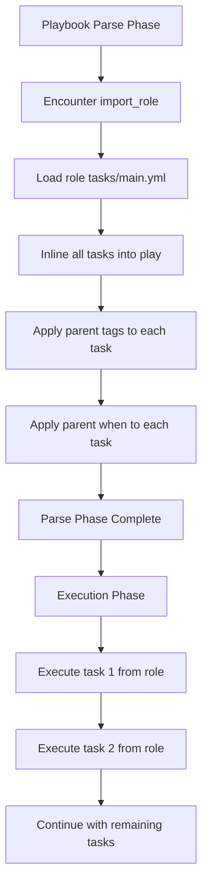

# How to Import Roles Statically with import_role

Author: [nawazdhandala](https://www.github.com/nawazdhandala)

Tags: Ansible, Roles, Static Imports, Playbook Organization

Description: Learn how to use import_role in Ansible for static role imports with full tag support, task visibility, and predictable execution.

---

Ansible gives you two mechanisms for applying roles within tasks: `import_role` (static) and `include_role` (dynamic). The static approach with `import_role` processes the role at playbook parse time, which means all tasks, handlers, and variables from the role are loaded before any task executes. This makes the playbook more predictable and gives you full tag support. This post explains how `import_role` works, where it shines, and how it differs from the dynamic alternative.

## How Static Imports Work

When Ansible encounters `import_role`, it reads the role's tasks, handlers, and variables immediately during the parsing phase. The role's tasks are effectively inlined into the play as if you had written them directly in the playbook. This has several implications:

1. All tasks from the role appear in `--list-tasks` output
2. Tags on individual tasks within the role work correctly
3. Handlers are available immediately
4. `when` conditions are applied to each task individually, not to the role as a whole

## Basic Usage

```yaml
# site.yml
# Import a role statically as a task
---
- hosts: web_servers
  tasks:
    - name: Apply base configuration
      ansible.builtin.import_role:
        name: common

    - name: Deploy web server
      ansible.builtin.import_role:
        name: nginx
```

At parse time, Ansible expands this into the individual tasks from each role. If `common` has 5 tasks and `nginx` has 8 tasks, the play effectively has 13 tasks.

## Passing Variables

You can pass variables to imported roles:

```yaml
# site.yml
# Import role with specific variable overrides
---
- hosts: web_servers
  tasks:
    - name: Deploy Nginx with custom settings
      ansible.builtin.import_role:
        name: nginx
      vars:
        nginx_port: 8080
        nginx_worker_processes: 4
        nginx_server_name: app.example.com
```

## Tags with import_role

This is where `import_role` really stands out compared to `include_role`. Tags applied to an `import_role` task propagate to all tasks within the role:

```yaml
# site.yml
# Tags work correctly with import_role
---
- hosts: all
  tasks:
    - name: Apply security hardening
      ansible.builtin.import_role:
        name: security
      tags:
        - security
        - hardening

    - name: Deploy application
      ansible.builtin.import_role:
        name: app_deploy
      tags:
        - deploy
        - app
```

Now you can run specific tagged tasks:

```bash
# Run only security-related tasks
ansible-playbook site.yml --tags security

# Run only deployment tasks
ansible-playbook site.yml --tags deploy

# Skip security tasks
ansible-playbook site.yml --skip-tags security
```

With `import_role`, this works exactly as expected because the tags are applied to each individual task during parsing. With `include_role`, tag behavior is more complex and requires the `apply` keyword.

## The when Condition Gotcha

Here is the most important behavioral difference between `import_role` and `include_role`. When you put a `when` condition on `import_role`, the condition is applied to *every task inside the role individually*, not to the role as a whole:

```yaml
# The when condition is copied to every task in the role
- name: Deploy database only on db hosts
  ansible.builtin.import_role:
    name: postgresql
  when: "'db_servers' in group_names"
```

This is equivalent to:

```yaml
# What Ansible actually does at parse time
- name: Install PostgreSQL packages
  ansible.builtin.apt:
    name: postgresql
    state: present
  when: "'db_servers' in group_names"

- name: Deploy PostgreSQL configuration
  ansible.builtin.template:
    src: postgresql.conf.j2
    dest: /etc/postgresql/15/main/postgresql.conf
  when: "'db_servers' in group_names"

# ... and so on for every task in the role
```

This means the `when` condition is evaluated for each task separately. If a task inside the role modifies the variable used in the condition, subsequent tasks might behave differently. With `include_role`, the condition is evaluated once, and if false, the entire role is skipped.

## Using tasks_from

Like `include_role`, you can specify an alternate task file:

```yaml
# Run the backup task file from the database role
- name: Run database backup
  ansible.builtin.import_role:
    name: database
    tasks_from: backup
```

The difference from `include_role` is that the tasks from `backup.yml` are loaded at parse time and appear in `--list-tasks`.

## Listing Tasks

One major advantage of `import_role` is visibility. You can see all tasks before running the playbook:

```bash
# List all tasks including those from imported roles
ansible-playbook site.yml --list-tasks
```

Output:

```
playbook: site.yml

  play #1 (web_servers): Configure web servers
    tasks:
      common : Install base packages
      common : Configure timezone
      common : Set hostname
      nginx : Install Nginx
      nginx : Deploy configuration
      nginx : Enable virtual host
      nginx : Start Nginx service
```

With `include_role`, you would only see the include task itself, not the tasks inside the role.

## Comparison: import_role vs include_role

Here is a side-by-side comparison:

```yaml
# Static import - tasks loaded at parse time
- name: Apply role statically
  ansible.builtin.import_role:
    name: myapp

# Dynamic include - tasks loaded at runtime
- name: Apply role dynamically
  ansible.builtin.include_role:
    name: myapp
```

| Feature | import_role | include_role |
|---------|-------------|--------------|
| Processing time | Parse time | Runtime |
| Tasks visible in --list-tasks | Yes | No |
| Tag inheritance | Automatic | Requires apply keyword |
| when behavior | Applied per task | Applied to whole role |
| Looping support | No | Yes |
| Variable role name | No | Yes |
| Handler visibility | Immediate | Deferred |

## Practical Pattern: Mixed Approach

In real-world playbooks, you often mix both approaches:

```yaml
# site.yml
# Static imports for core roles, dynamic includes for conditional ones
---
- hosts: all
  tasks:
    # Always runs, tags work correctly
    - name: Apply base configuration
      ansible.builtin.import_role:
        name: common
      tags:
        - common
        - base

    # Always runs, tags work correctly
    - name: Apply security hardening
      ansible.builtin.import_role:
        name: security
      tags:
        - security

    # Conditional - only for production
    - name: Apply monitoring if production
      ansible.builtin.include_role:
        name: monitoring
      when: deployment_env == "production"
      tags:
        - monitoring

    # Dynamic - role name from variable
    - name: Apply webserver role
      ansible.builtin.include_role:
        name: "{{ webserver_type }}"
      tags:
        - webserver
```

## import_role with handlers_from

You can load handlers from a specific file:

```yaml
# Load handlers from an alternate file
- name: Deploy application
  ansible.builtin.import_role:
    name: app_deploy
    handlers_from: rolling_restart.yml
```

This requires:

```
roles/app_deploy/handlers/
  main.yml              <-- default handlers
  rolling_restart.yml   <-- alternate handlers
```

## Error Handling Considerations

Since `import_role` is processed at parse time, it cannot be used inside `block/rescue` constructs for error handling based on the role's behavior. The tasks are already expanded:

```yaml
# This works but the rescue applies to individual tasks, not the role as a unit
- block:
    - name: Deploy application
      ansible.builtin.import_role:
        name: app_deploy
  rescue:
    - name: Rollback
      ansible.builtin.debug:
        msg: "A task in app_deploy failed"
```

If you need to treat the role as a single unit for error handling, use `include_role` instead.

## Execution Flow



## When to Choose import_role

Use `import_role` when:

- You want tags to work reliably across all role tasks
- You need to see all tasks in `--list-tasks` output
- The role should always be loaded regardless of runtime conditions
- You want handlers to be available immediately at parse time
- Predictability is more important than flexibility

The general recommendation is: default to `import_role` for core infrastructure roles that always run, and switch to `include_role` when you need runtime flexibility like conditionals, loops, or dynamic role names.

## Wrapping Up

The `import_role` module gives you static, predictable role application with full tag support and task visibility. Its behavior is straightforward: the role's tasks are inlined into the play at parse time, making them indistinguishable from tasks written directly in the playbook. The main limitation is the lack of runtime flexibility, as you cannot loop over imported roles or use variable role names. For most infrastructure roles that always need to run, `import_role` is the right choice. Reserve `include_role` for the cases where you genuinely need dynamic, runtime decision-making.
