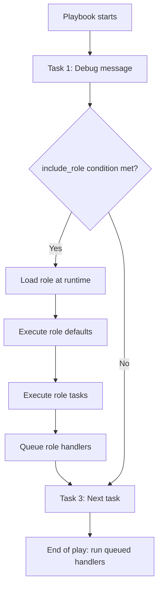

# How to Include Roles Dynamically with include_role

Author: [nawazdhandala](https://www.github.com/nawazdhandala)

Tags: Ansible, Roles, Dynamic Includes, Automation

Description: Learn how to use include_role in Ansible for dynamic role inclusion with conditionals, loops, and runtime decision-making.

---

Ansible provides two ways to apply roles within tasks: `include_role` (dynamic) and `import_role` (static). The dynamic approach with `include_role` is processed at runtime, which means you can wrap it in conditionals, loops, and even choose which role to include based on variable values. This post walks through how `include_role` works, when to use it over `import_role`, and practical patterns for dynamic role inclusion.

## Basic Usage

The `include_role` module is used as a regular task within a playbook or another role's tasks:

```yaml
# site.yml
# Include a role dynamically as a task
---
- hosts: all
  tasks:
    - name: Apply the common role
      ansible.builtin.include_role:
        name: common

    - name: Apply the webserver role
      ansible.builtin.include_role:
        name: webserver
```

This looks similar to listing roles under the `roles:` keyword, but it executes differently. The role is loaded and processed at runtime when the task is reached, not at playbook parse time.

## Including Roles Conditionally

The biggest advantage of `include_role` is that it supports `when` conditions:

```yaml
# site.yml
# Include roles based on host group membership
---
- hosts: all
  tasks:
    - name: Apply database role for db servers
      ansible.builtin.include_role:
        name: postgresql
      when: "'db_servers' in group_names"

    - name: Apply webserver role for web servers
      ansible.builtin.include_role:
        name: nginx
      when: "'web_servers' in group_names"

    - name: Apply monitoring on all production hosts
      ansible.builtin.include_role:
        name: monitoring
      when: env == "production"
```

With static role application (the `roles:` keyword or `import_role`), conditions are evaluated differently. With `include_role`, the entire role is skipped if the condition is false, and none of its tasks, handlers, or variables are loaded.

## Looping Over Roles

You can use `include_role` in a loop to apply multiple roles dynamically:

```yaml
# site.yml
# Apply a list of roles determined at runtime
---
- hosts: all
  vars:
    roles_to_apply:
      - common
      - security_hardening
      - monitoring
  tasks:
    - name: Apply each role in the list
      ansible.builtin.include_role:
        name: "{{ role_item }}"
      loop: "{{ roles_to_apply }}"
      loop_control:
        loop_var: role_item
```

Note the use of `loop_control` with `loop_var`. This changes the loop variable name from the default `item` to `role_item`, which prevents conflicts with any `item` variable used inside the included roles.

## Passing Variables to Included Roles

You can pass variables to `include_role` just like you would with the `roles:` keyword:

```yaml
# site.yml
# Include a role with custom variable values
---
- hosts: web_servers
  tasks:
    - name: Deploy the application
      ansible.builtin.include_role:
        name: app_deploy
      vars:
        app_version: "3.2.1"
        app_port: 8080
        app_environment: production
```

## Using tasks_from to Run Specific Task Files

One of the most useful features of `include_role` is the ability to run a specific task file instead of the default `tasks/main.yml`:

```yaml
# site.yml
# Run only the backup tasks from the database role
---
- hosts: db_servers
  tasks:
    - name: Run database backup
      ansible.builtin.include_role:
        name: database
        tasks_from: backup

    - name: Run database health check
      ansible.builtin.include_role:
        name: database
        tasks_from: healthcheck
```

This requires corresponding task files in the role:

```
roles/database/tasks/
  main.yml         <-- default entry point
  backup.yml       <-- alternate entry point
  healthcheck.yml  <-- alternate entry point
```

```yaml
# roles/database/tasks/backup.yml
# Standalone task file for database backups
---
- name: Create backup directory
  ansible.builtin.file:
    path: /backups/db
    state: directory
    mode: '0750'

- name: Run pg_dump
  ansible.builtin.command: >
    pg_dump -U {{ db_user }} -h localhost {{ db_name }}
    -f /backups/db/{{ db_name }}_{{ ansible_date_time.date }}.sql
  changed_when: true
```

## Selective Loading with defaults_from and vars_from

You can also load specific default and variable files:

```yaml
# Load alternate defaults and vars files from the role
- name: Include role with custom variable files
  ansible.builtin.include_role:
    name: webserver
    defaults_from: high_traffic.yml
    vars_from: production.yml
```

This requires:

```
roles/webserver/defaults/
  main.yml
  high_traffic.yml    <-- alternate defaults
roles/webserver/vars/
  main.yml
  production.yml      <-- alternate vars
```

## Dynamic Role Selection

Since `include_role` is evaluated at runtime, you can determine which role to include based on facts or variables:

```yaml
# site.yml
# Choose the web server role based on a variable
---
- hosts: web_servers
  vars:
    preferred_webserver: nginx
  tasks:
    - name: Install the preferred web server
      ansible.builtin.include_role:
        name: "{{ preferred_webserver }}"
```

A more practical example based on OS family:

```yaml
# Choose a role based on the operating system
- name: Apply OS-specific hardening
  ansible.builtin.include_role:
    name: "hardening_{{ ansible_os_family | lower }}"
```

This would include `hardening_debian` on Ubuntu systems and `hardening_redhat` on CentOS/RHEL systems.

## Controlling Variable Scope

By default, variables set inside an included role are available to tasks that run after it. You can use `public` to control this:

```yaml
# Prevent role variables from leaking into the outer scope
- name: Include role with private scope
  ansible.builtin.include_role:
    name: helper_role
    public: false
```

When `public: false`, variables defined in the role's `defaults/` and `vars/` directories are only available within the role itself. This prevents variable name collisions when including many roles.

## Combining include_role with Blocks

You can use `include_role` inside blocks for error handling:

```yaml
# site.yml
# Handle role failures gracefully
---
- hosts: all
  tasks:
    - name: Deploy application with rollback
      block:
        - name: Deploy new version
          ansible.builtin.include_role:
            name: app_deploy
          vars:
            app_version: "3.2.1"

      rescue:
        - name: Rollback to previous version
          ansible.builtin.include_role:
            name: app_deploy
          vars:
            app_version: "{{ previous_version }}"

        - name: Send failure notification
          ansible.builtin.include_role:
            name: notifications
          vars:
            notification_message: "Deployment of 3.2.1 failed, rolled back to {{ previous_version }}"
```

## The apply Keyword

When using `include_role` with tags, the tags only apply to the `include_role` task itself, not to the tasks inside the role. To apply tags to all tasks within the included role, use the `apply` keyword:

```yaml
# Apply tags to all tasks within the included role
- name: Deploy application
  ansible.builtin.include_role:
    name: app_deploy
    apply:
      tags:
        - deploy
        - app
  tags:
    - deploy
    - app
```

You need tags in both places: on the task (so the `include_role` task itself runs when you filter by tag) and in `apply` (so the tasks inside the role are also tagged).

## Execution Flow Diagram



## When to Use include_role vs import_role

Use `include_role` when:
- You need `when` conditions that skip the entire role
- You are looping over a list of roles
- The role name is determined by a variable
- You want to use `tasks_from` to run specific task files
- You need to include roles inside blocks for error handling

Use `import_role` when:
- The role should always run
- You want role tasks to appear in `--list-tasks` output
- You need tags applied to individual tasks inside the role
- You want handler names to be visible at parse time

## Wrapping Up

The `include_role` module gives you runtime flexibility that the static `roles:` keyword and `import_role` cannot match. You can conditionally include roles, loop over role lists, dynamically select which role to apply, and target specific task files within a role. The trade-off is that dynamically included roles are less visible during planning (they do not show up in `--list-tasks` until they actually execute). For most real-world playbooks, a combination of static imports for core roles and dynamic includes for conditional logic gives you the best of both worlds.
