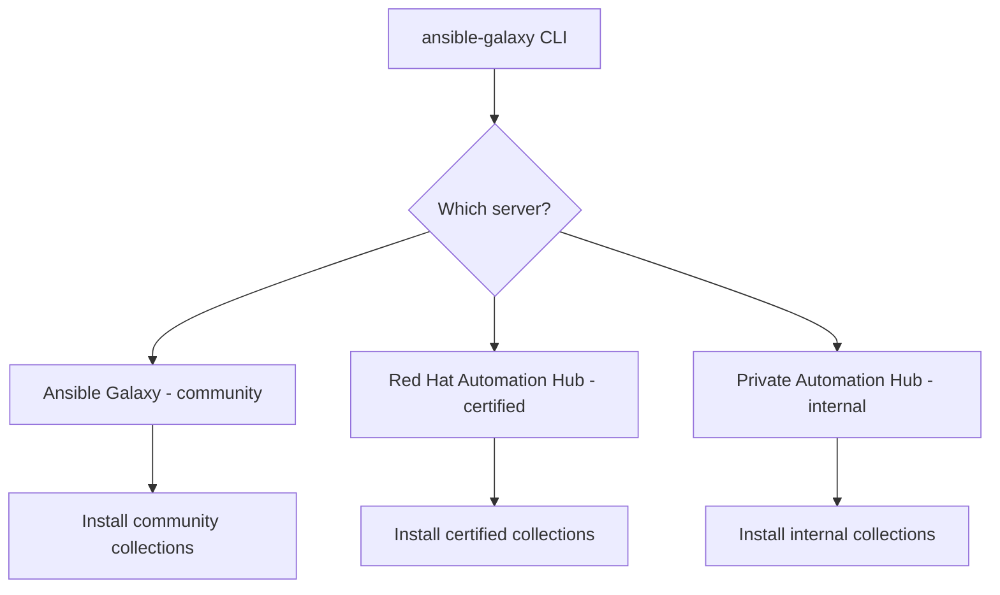

# How to Install Ansible Collections from Automation Hub

Author: [nawazdhandala](https://www.github.com/nawazdhandala)

Tags: Ansible, Automation Hub, Collections, Red Hat, DevOps

Description: Learn how to configure and install Ansible collections from Red Hat Automation Hub, including authentication setup and private hub configuration.

---

Red Hat Automation Hub is the official source for Red Hat certified and validated Ansible collections. If your organization runs Red Hat Ansible Automation Platform (AAP), Automation Hub is where you get enterprise-supported collections that have been tested and certified by Red Hat. It is also possible to run a private Automation Hub instance within your organization to host your own internal collections.

This post covers how to configure `ansible-galaxy` to pull collections from Automation Hub, set up authentication, and manage collections from both public Galaxy and Automation Hub simultaneously.

## Public Automation Hub vs Private Automation Hub

There are two flavors of Automation Hub:

**console.redhat.com/ansible/automation-hub** is the cloud-hosted public Automation Hub. Red Hat customers can access certified collections here. You need a Red Hat account with an active Ansible Automation Platform subscription to use it.

**Private Automation Hub** is an on-premises instance that ships as part of Ansible Automation Platform. Organizations use it to host curated collections, including their own custom collections, and control exactly which versions are available to their teams.



## Getting Your Authentication Token

Before you can pull collections from the cloud-hosted Automation Hub, you need an API token.

1. Log in to [console.redhat.com](https://console.redhat.com)
2. Navigate to Ansible Automation Platform > Automation Hub
3. Click on the "Connect to Hub" or go to the token management page
4. Click "Load token" to generate a new API token
5. Copy the token immediately (you will not be able to see it again)

For a private Automation Hub, the process is similar but done through your organization's PAH web interface. Your admin can generate tokens from the API Token Management page.

## Configuring ansible.cfg for Automation Hub

The core configuration happens in your `ansible.cfg` file. You need to define the Galaxy server(s) and their authentication details.

This configuration sets up Automation Hub as the primary server with Galaxy as a fallback:

```ini
# ansible.cfg - Configure Automation Hub as primary collection source
[galaxy]
server_list = automation_hub, galaxy

[galaxy_server.automation_hub]
url = https://console.redhat.com/api/automation-hub/content/published/
auth_url = https://sso.redhat.com/auth/realms/redhat-external/protocol/openid-connect/token
token = your-api-token-here

[galaxy_server.galaxy]
url = https://galaxy.ansible.com/
```

The `server_list` parameter controls the search order. Ansible tries the first server, and if the collection is not found there, it moves to the next one.

## Using Environment Variables for Tokens

Hardcoding tokens in `ansible.cfg` is not great for security. A better approach is to use environment variables:

```ini
# ansible.cfg - Reference token from environment variable
[galaxy]
server_list = automation_hub, galaxy

[galaxy_server.automation_hub]
url = https://console.redhat.com/api/automation-hub/content/published/
auth_url = https://sso.redhat.com/auth/realms/redhat-external/protocol/openid-connect/token
token = {{ lookup('env', 'AUTOMATION_HUB_TOKEN') }}

[galaxy_server.galaxy]
url = https://galaxy.ansible.com/
```

Wait, that lookup syntax does not work in `ansible.cfg`. Instead, set the token as an environment variable that `ansible-galaxy` reads:

```bash
# Export the token as an environment variable
export ANSIBLE_GALAXY_SERVER_AUTOMATION_HUB_TOKEN="your-api-token-here"

# The environment variable name follows the pattern:
# ANSIBLE_GALAXY_SERVER_<SERVER_NAME>_TOKEN
# where <SERVER_NAME> matches the name in server_list (uppercased)
```

This pattern works for any galaxy_server setting:

```bash
# Set the URL via environment variable
export ANSIBLE_GALAXY_SERVER_AUTOMATION_HUB_URL="https://console.redhat.com/api/automation-hub/content/published/"

# Set the auth URL
export ANSIBLE_GALAXY_SERVER_AUTOMATION_HUB_AUTH_URL="https://sso.redhat.com/auth/realms/redhat-external/protocol/openid-connect/token"

# Set the token
export ANSIBLE_GALAXY_SERVER_AUTOMATION_HUB_TOKEN="your-token-here"
```

## Installing Collections from Automation Hub

Once configured, the install commands are identical to Galaxy. Ansible-galaxy uses your `ansible.cfg` to determine which servers to query.

```bash
# Install a certified collection
ansible-galaxy collection install redhat.rhel_system_roles

# Install with a specific version
ansible-galaxy collection install redhat.rhel_system_roles:1.23.0

# Install from requirements file
ansible-galaxy collection install -r requirements.yml
```

Your requirements file can mix collections from both Automation Hub and Galaxy:

```yaml
# requirements.yml - Mix of certified and community collections
---
collections:
  # This comes from Automation Hub (certified)
  - name: redhat.rhel_system_roles
    version: "1.23.0"

  # This also comes from Automation Hub
  - name: redhat.satellite
    version: "3.14.0"

  # This comes from Galaxy (community)
  - name: community.docker
    version: "3.8.0"

  # You can explicitly specify the source
  - name: ansible.posix
    version: "1.5.4"
    source: https://galaxy.ansible.com/
```

The `source` field lets you pin a collection to a specific server, overriding the search order.

## Configuring a Private Automation Hub

If your organization runs a private Automation Hub instance, the configuration is similar but points to your internal server:

```ini
# ansible.cfg - Private Automation Hub configuration
[galaxy]
server_list = private_hub, automation_hub, galaxy

[galaxy_server.private_hub]
url = https://pah.internal.example.com/api/galaxy/content/published/
token = your-pah-token-here
# Disable SSL verification only if using self-signed certs (not recommended for production)
# validate_certs = false

[galaxy_server.automation_hub]
url = https://console.redhat.com/api/automation-hub/content/published/
auth_url = https://sso.redhat.com/auth/realms/redhat-external/protocol/openid-connect/token
token = your-rh-token-here

[galaxy_server.galaxy]
url = https://galaxy.ansible.com/
```

With this setup, `ansible-galaxy` first checks your private hub, then Red Hat's Automation Hub, and finally Galaxy. This gives your internal collections the highest priority.

## Syncing Collections to a Private Automation Hub

One of the main benefits of a private Automation Hub is the ability to curate which collections and versions are available to your teams. You sync collections from external sources into your private hub.

Through the PAH web interface:

1. Navigate to Collections > Repositories
2. Add the upstream repositories (Galaxy, Red Hat Automation Hub)
3. Configure sync policies (manual, on-demand, or scheduled)
4. Select which collections and versions to include or exclude
5. Run the sync

You can also use the `pulp` API for programmatic sync configuration:

```bash
# Example: Sync a specific collection to your private hub using the API
curl -X POST "https://pah.internal.example.com/api/galaxy/content/staging/v3/sync/" \
  -H "Authorization: Token your-admin-token" \
  -H "Content-Type: application/json" \
  -d '{
    "requirements": "collections:\n  - name: community.docker\n    version: \"3.8.0\""
  }'
```

## Publishing Internal Collections to Private Hub

To publish your own collections to the private Automation Hub, build the collection tarball and upload it:

```bash
# Build the collection
ansible-galaxy collection build

# Publish to your private hub
ansible-galaxy collection publish ./my_namespace-my_collection-1.0.0.tar.gz \
  --server private_hub
```

The `--server` flag references the server name from your `ansible.cfg`. The collection goes into a staging area where an admin can approve it before it becomes available to users.

## Handling Multiple ansible.cfg Files

In complex environments, you might have different configurations for different projects. Ansible looks for `ansible.cfg` in this order:

1. `ANSIBLE_CONFIG` environment variable
2. `ansible.cfg` in the current directory
3. `~/.ansible.cfg`
4. `/etc/ansible/ansible.cfg`

A common pattern is to keep a per-project `ansible.cfg` in each repository:

```bash
# Project directory structure
my-ansible-project/
  ansible.cfg          # Project-specific config with hub settings
  requirements.yml     # Collection dependencies
  collections/         # Local collection install path
  playbooks/
  inventory/
```

## Troubleshooting Automation Hub Connections

If you run into authentication errors, check these common issues:

```bash
# Test the connection with verbose output
ansible-galaxy collection install redhat.rhel_system_roles -vvv
```

Common problems and fixes:

**401 Unauthorized**: Your token is expired or invalid. Generate a new one from the Automation Hub web interface.

**403 Forbidden**: Your Red Hat account may not have the Ansible Automation Platform entitlement. Check your subscription status.

**SSL certificate errors with private hub**: If using self-signed certificates, either add the CA to your system trust store or set `validate_certs = false` in the server config (not recommended for production).

**Collection not found**: The collection might not be available on that server. Check which repositories are enabled in your Automation Hub instance. Certified collections come from the `published` content repository.

```bash
# Check which servers are configured
ansible-config dump | grep GALAXY

# Verify server configuration
ansible-galaxy collection install redhat.rhel_system_roles -vvvv 2>&1 | grep "server"
```

## Conclusion

Automation Hub gives organizations control over which collections are available and ensures they are getting certified, supported content. The setup involves configuring server URLs and tokens in `ansible.cfg`, but once that is done, the `ansible-galaxy` commands work the same as with public Galaxy. For teams running Ansible Automation Platform, combining a private Automation Hub with Red Hat's cloud hub and public Galaxy provides a layered approach to collection management that balances enterprise requirements with community innovation.
