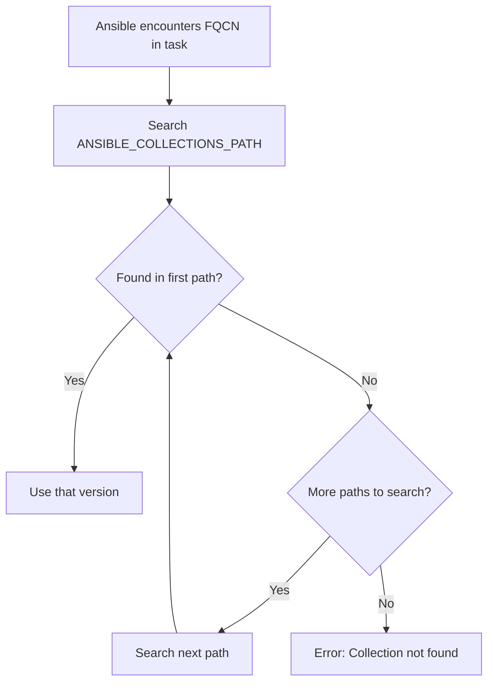

# How to Install Ansible Collections from Galaxy

Author: [nawazdhandala](https://www.github.com/nawazdhandala)

Tags: Ansible, Galaxy, Collections, DevOps, Automation

Description: Step-by-step guide to installing Ansible collections from Ansible Galaxy with version pinning, requirements files, and offline installation.

---

Ansible Galaxy is the primary public repository for Ansible collections. It hosts thousands of community-maintained and vendor-supported collections that extend Ansible's capabilities for cloud providers, databases, networking, containers, and more. Installing collections from Galaxy is something you will do on practically every Ansible project, so it pays to understand the various options and best practices.

## Installing a Single Collection

The most basic install command pulls the latest version of a collection:

```bash
# Install the latest version of community.docker
ansible-galaxy collection install community.docker
```

This downloads the collection and places it in your default collections path, which is typically `~/.ansible/collections/ansible_collections/`. You can verify the installation:

```bash
# List installed collections and their versions
ansible-galaxy collection list
```

Output looks something like this:

```
Collection        Version
----------------- -------
community.docker  3.8.0
```

## Installing a Specific Version

Pinning to a specific version is critical for reproducible automation. You do not want a collection upgrade to break your playbooks without warning.

```bash
# Install an exact version
ansible-galaxy collection install community.docker:3.7.0

# Install with a version range
ansible-galaxy collection install 'community.docker:>=3.4.0,<4.0.0'
```

The version range syntax follows Python's PEP 440 conventions. Here are the common patterns:

```bash
# Exact version
ansible-galaxy collection install community.docker:3.7.0

# Minimum version
ansible-galaxy collection install 'community.docker:>=3.4.0'

# Compatible release (same as >=3.4.0,<4.0.0)
ansible-galaxy collection install 'community.docker:~=3.4'

# Exclude a specific version
ansible-galaxy collection install 'community.docker:!=3.5.0'
```

## Using a Requirements File

When your project depends on multiple collections, listing them in a `requirements.yml` file is the way to go. This file acts as a dependency manifest for your automation project.

Create a requirements file that lists all your collection dependencies:

```yaml
# requirements.yml - Collection dependencies for the project
---
collections:
  - name: community.docker
    version: "3.8.0"

  - name: community.postgresql
    version: ">=3.2.0,<4.0.0"

  - name: ansible.posix
    version: "1.5.4"

  - name: community.general
    version: ">=8.0.0"

  - name: amazon.aws
    version: "7.2.0"
```

Install everything at once:

```bash
# Install all collections from the requirements file
ansible-galaxy collection install -r requirements.yml
```

If you need to upgrade collections that are already installed, add the `--force` flag:

```bash
# Force reinstall even if already installed
ansible-galaxy collection install -r requirements.yml --force
```

## Controlling the Installation Path

By default, collections install to `~/.ansible/collections`. This works fine for local development, but for CI/CD pipelines and shared environments, you often want collections installed within the project directory.

```bash
# Install to a local directory within your project
ansible-galaxy collection install -r requirements.yml -p ./collections

# Or set the environment variable
export ANSIBLE_COLLECTIONS_PATH=./collections
ansible-galaxy collection install -r requirements.yml
```

When you install to a custom path, make sure Ansible knows where to find the collections. You can set this in `ansible.cfg`:

```ini
# ansible.cfg - Point Ansible to your local collections directory
[defaults]
collections_path = ./collections:~/.ansible/collections
```

The path is a colon-separated list. Ansible searches left to right, so your project-local collections take priority over globally installed ones.

## Offline Installation

In air-gapped environments or restricted networks, you can download collections on a machine with internet access and transfer them.

First, download the collections to a local directory:

```bash
# Download collections without installing them
ansible-galaxy collection download -r requirements.yml -p ./collection-tarballs/
```

This creates a directory full of `.tar.gz` files plus a `requirements.yml` that references them. Copy this directory to your target machine, then install:

```bash
# Install from the downloaded tarballs
ansible-galaxy collection install -r ./collection-tarballs/requirements.yml -p ./collections
```

## Verifying Collection Integrity

Starting with Ansible 2.13, you can verify the integrity of installed collections using the `--verify` flag:

```bash
# Verify that installed collections match their Galaxy signatures
ansible-galaxy collection verify community.docker
```

This checks that the files on disk match what was published to Galaxy. If someone modified files in the installed collection (accidentally or otherwise), the verification will flag the differences.

For a full integrity check of all installed collections:

```bash
# Verify all installed collections
ansible-galaxy collection verify --offline
```

## Understanding the Collection Search Order

When you have collections installed in multiple locations, Ansible searches them in a specific order. This matters when you want to override a globally installed collection with a project-local version.



The search path is determined by:

1. The `ANSIBLE_COLLECTIONS_PATH` environment variable
2. The `collections_path` setting in `ansible.cfg`
3. The default path `~/.ansible/collections:/usr/share/ansible/collections`

## Listing Available Versions on Galaxy

Before pinning a version, you might want to see what versions are available:

```bash
# This does not have a built-in command, but you can use the Galaxy API
curl -s "https://galaxy.ansible.com/api/v3/plugin/ansible/content/published/collections/index/community/docker/versions/" | python3 -m json.tool | grep '"version"'
```

Alternatively, visit the Galaxy web interface at `https://galaxy.ansible.com/ui/repo/published/community/docker/` and browse the version history.

## Setting Up a Collection Cache

If you run `ansible-galaxy collection install` frequently (for example, in CI pipelines), you can speed things up with a cache directory:

```bash
# Set up a persistent cache for downloaded collections
export ANSIBLE_GALAXY_CACHE_DIR=/tmp/ansible-galaxy-cache

# First install downloads and caches
ansible-galaxy collection install -r requirements.yml

# Subsequent installs use the cache
ansible-galaxy collection install -r requirements.yml
```

## Handling Collection Dependencies

Collections can depend on other collections. When you install `community.docker`, Galaxy automatically resolves and installs its dependencies. You can see what a collection depends on by checking its `galaxy.yml` or the Galaxy web page.

```bash
# Install a collection and watch dependency resolution
ansible-galaxy collection install community.docker -v
```

The verbose output shows which dependencies are being pulled in:

```
Installing 'community.docker:3.8.0' to '~/.ansible/collections/ansible_collections/community/docker'
Downloading https://galaxy.ansible.com/api/v3/...
Installing 'community.library_inventory_filtering_v1:1.0.0'...
community.docker:3.8.0 was installed successfully
```

## A Practical CI/CD Example

Here is a complete example of how you might set up collection management in a CI/CD pipeline:

```yaml
# .gitlab-ci.yml - Collection installation in CI
---
stages:
  - prepare
  - deploy

install_collections:
  stage: prepare
  image: python:3.11-slim
  script:
    # Install ansible-core
    - pip install ansible-core==2.16.3

    # Install collections to a local path
    - ansible-galaxy collection install -r requirements.yml -p ./collections

    # Verify installations
    - ansible-galaxy collection list -p ./collections
  artifacts:
    paths:
      - collections/

deploy_app:
  stage: deploy
  image: python:3.11-slim
  dependencies:
    - install_collections
  script:
    - pip install ansible-core==2.16.3
    - export ANSIBLE_COLLECTIONS_PATH=./collections
    - ansible-playbook -i inventory/production deploy.yml
```

## Troubleshooting Common Issues

If you get a "collection not found" error, check these things:

1. Is the collection actually installed? Run `ansible-galaxy collection list`
2. Is the collection path configured correctly? Run `ansible-config dump | grep COLLECTIONS_PATH`
3. Are you using the right FQCN? A typo in the namespace or collection name will cause a failure
4. Is the installed version compatible with your ansible-core version? Check the collection's documentation for compatibility matrices

If Galaxy downloads are slow or failing, you can set a custom timeout:

```bash
# Increase the Galaxy server timeout (default is 60 seconds)
ansible-galaxy collection install community.docker --timeout 120
```

## Conclusion

Installing collections from Galaxy is a fundamental skill for modern Ansible work. Pin your versions, use requirements files, and test upgrades before deploying them. For CI/CD environments, install collections into a project-local path and pass them as artifacts between pipeline stages. These practices keep your automation reproducible and predictable.
