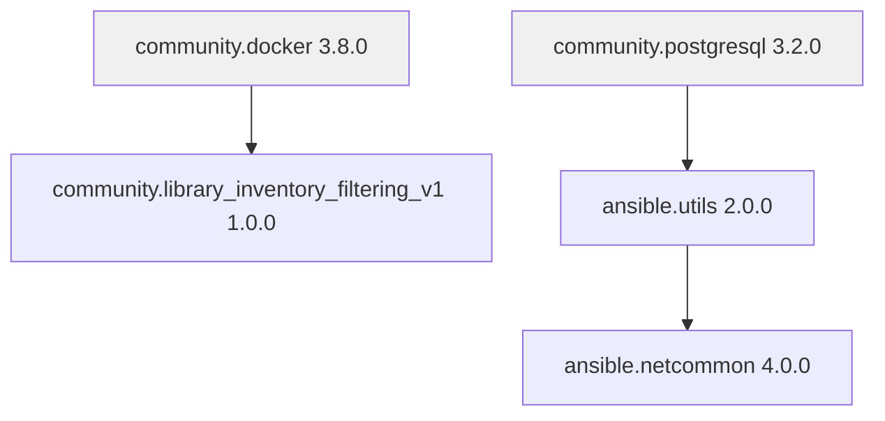

# How to Install Ansible Collections from Tarballs

Author: [nawazdhandala](https://www.github.com/nawazdhandala)

Tags: Ansible, Collections, Offline Installation, DevOps

Description: How to install Ansible collections from tarball files for offline environments, air-gapped networks, and manual distribution workflows.

---

Not every environment has internet access. Data centers with strict security policies, classified networks, and regulated industries often run in air-gapped configurations where downloading from Galaxy or any external source is not an option. In these situations, you install Ansible collections from tarball (.tar.gz) files that you transfer manually.

This post covers how to download, transfer, and install collection tarballs, plus how to build your own tarballs from source.

## What Is a Collection Tarball?

A collection tarball is a compressed archive file that contains all the files for an Ansible collection in a specific directory layout. The file naming convention is:

```
<namespace>-<collection_name>-<version>.tar.gz
```

For example: `community-docker-3.8.0.tar.gz`

Inside the tarball, you will find the standard collection structure: `galaxy.yml`, `plugins/`, `roles/`, `docs/`, and any other content the collection provides. There is also a `MANIFEST.json` and `FILES.json` that ansible-galaxy uses for verification and installation.

## Downloading Tarballs from Galaxy

If you have a machine with internet access, you can download collection tarballs without installing them:

```bash
# Download a single collection tarball
ansible-galaxy collection download community.docker:3.8.0 -p ./tarballs/

# Download multiple collections listed in requirements.yml
ansible-galaxy collection download -r requirements.yml -p ./tarballs/
```

The `download` subcommand saves the tarball files and generates a `requirements.yml` inside the download directory that references the local files:

```bash
# Check what was downloaded
ls ./tarballs/
# community-docker-3.8.0.tar.gz
# community-library_inventory_filtering_v1-1.0.0.tar.gz
# requirements.yml
```

The generated `requirements.yml` looks like this:

```yaml
# Auto-generated requirements.yml pointing to local tarballs
---
collections:
  - name: community-docker-3.8.0.tar.gz
    type: file
  - name: community-library_inventory_filtering_v1-1.0.0.tar.gz
    type: file
```

This is important because it also downloads dependencies. If `community.docker` depends on another collection, that dependency gets downloaded too.

## Transferring Tarballs to Air-Gapped Environments

Once you have the tarballs on a connected machine, transfer them to your target environment using whatever method your security policies allow:

```bash
# Using SCP to transfer to a bastion host
scp -r ./tarballs/ user@bastion.internal:/opt/ansible/collection-tarballs/

# Using a USB drive (mount point example)
cp -r ./tarballs/ /mnt/usb/ansible-collection-tarballs/

# Using rsync for efficient transfers
rsync -avz ./tarballs/ user@target:/opt/ansible/collection-tarballs/
```

## Installing from a Tarball File

Once the tarballs are on your target machine, installation is straightforward:

```bash
# Install a single collection tarball
ansible-galaxy collection install ./tarballs/community-docker-3.8.0.tar.gz

# Install to a specific path
ansible-galaxy collection install ./tarballs/community-docker-3.8.0.tar.gz -p ./collections

# Force reinstall if already installed
ansible-galaxy collection install ./tarballs/community-docker-3.8.0.tar.gz --force
```

## Installing Multiple Tarballs with requirements.yml

If you downloaded with `ansible-galaxy collection download`, you already have a generated `requirements.yml`. Use it:

```bash
# Install all tarballs using the generated requirements file
cd /opt/ansible/collection-tarballs/
ansible-galaxy collection install -r requirements.yml
```

You can also write your own requirements file that points to tarball paths:

```yaml
# requirements.yml - Pointing to local tarball files
---
collections:
  - name: /opt/ansible/tarballs/community-docker-3.8.0.tar.gz
    type: file

  - name: /opt/ansible/tarballs/community-postgresql-3.2.0.tar.gz
    type: file

  - name: /opt/ansible/tarballs/ansible-posix-1.5.4.tar.gz
    type: file

  - name: /opt/ansible/tarballs/community-general-8.3.0.tar.gz
    type: file
```

The `type: file` field tells ansible-galaxy to treat the name as a filesystem path rather than a Galaxy collection reference.

## Building a Tarball from Source

If you have a collection checked out from Git or you are developing your own collection, you can build a tarball yourself:

```bash
# Navigate to the collection root (where galaxy.yml lives)
cd /path/to/my-collection

# Build the tarball
ansible-galaxy collection build
```

This creates a tarball in the current directory:

```
Created collection for my_namespace.my_collection at
/path/to/my-collection/my_namespace-my_collection-1.0.0.tar.gz
```

You can also specify an output directory:

```bash
# Build and put the tarball in a specific directory
ansible-galaxy collection build --output-path /opt/ansible/tarballs/
```

## Automating the Download-Transfer-Install Workflow

For organizations that regularly update collections in air-gapped environments, it helps to script the entire workflow.

This script runs on the connected machine to prepare the tarball bundle:

```bash
#!/bin/bash
# prepare-collection-bundle.sh
# Run this on a machine with internet access

set -euo pipefail

BUNDLE_DIR="./collection-bundle-$(date +%Y%m%d)"
REQUIREMENTS_FILE="./requirements.yml"

echo "Downloading collections..."
ansible-galaxy collection download -r "${REQUIREMENTS_FILE}" -p "${BUNDLE_DIR}"

echo "Creating archive..."
tar czf "${BUNDLE_DIR}.tar.gz" "${BUNDLE_DIR}"

echo "Bundle ready: ${BUNDLE_DIR}.tar.gz"
echo "Transfer this file to the air-gapped environment"
echo "Then run: tar xzf ${BUNDLE_DIR}.tar.gz && cd ${BUNDLE_DIR} && ansible-galaxy collection install -r requirements.yml"
```

And this script runs on the air-gapped machine to install the bundle:

```bash
#!/bin/bash
# install-collection-bundle.sh
# Run this on the air-gapped machine after transferring the bundle

set -euo pipefail

BUNDLE_ARCHIVE="${1:?Usage: $0 <bundle-archive.tar.gz>}"
INSTALL_PATH="${2:-/opt/ansible/collections}"

echo "Extracting bundle..."
tar xzf "${BUNDLE_ARCHIVE}"

BUNDLE_DIR="${BUNDLE_ARCHIVE%.tar.gz}"
cd "${BUNDLE_DIR}"

echo "Installing collections to ${INSTALL_PATH}..."
ansible-galaxy collection install -r requirements.yml -p "${INSTALL_PATH}"

echo "Installed collections:"
ansible-galaxy collection list -p "${INSTALL_PATH}"
```

## Verifying Tarball Integrity

When transferring files between environments, it is good practice to verify integrity. Generate checksums before transfer and verify after:

```bash
# On the source machine, generate checksums
cd ./tarballs/
sha256sum *.tar.gz > checksums.sha256

# On the target machine, verify after transfer
cd /opt/ansible/collection-tarballs/
sha256sum -c checksums.sha256
```

The output tells you if any files were corrupted during transfer:

```
community-docker-3.8.0.tar.gz: OK
community-postgresql-3.2.0.tar.gz: OK
ansible-posix-1.5.4.tar.gz: OK
```

## Handling Dependency Resolution with Tarballs

One tricky aspect of tarball installation is dependency management. When you install from Galaxy, dependencies are resolved and downloaded automatically. With tarballs, you need to make sure all dependencies are included.

The `ansible-galaxy collection download` command handles this for you by pulling in transitive dependencies. But if you are building tarballs manually, you need to track dependencies yourself.

Check a collection's dependencies by reading its `galaxy.yml`:

```yaml
# galaxy.yml - Dependencies section
---
dependencies:
  community.library_inventory_filtering_v1: ">=1.0.0"
  ansible.utils: ">=2.0.0"
```

Make sure you have tarballs for every dependency listed here, and for their dependencies too. It is recursive.



Using `ansible-galaxy collection download` is always the safer approach because it walks the dependency tree for you.

## Setting Up a Local File Server as a Collection Repository

For larger teams working in restricted environments, you can set up a simple web server to serve tarballs as a collection repository:

```bash
# Simple approach: serve tarballs with Python's HTTP server
cd /opt/ansible/collection-tarballs/
python3 -m http.server 8080
```

Then configure `ansible.cfg` to use it:

```ini
# ansible.cfg - Local tarball server
[galaxy]
server_list = local_server

[galaxy_server.local_server]
url = http://fileserver.internal:8080/
```

This is not a full Galaxy API server, so it has limitations. For a proper solution, consider deploying a private Automation Hub instance, which can serve tarballs natively and handle dependency resolution.

## Common Issues and Fixes

**"ERROR! The tar file does not contain the expected top level directory"**: The tarball was not built with `ansible-galaxy collection build`. It needs the proper internal structure with `MANIFEST.json` at the right level. Rebuild it using the `ansible-galaxy` tool.

**Dependency errors during install**: You are missing a dependency tarball. Use `ansible-galaxy collection download` on a connected machine to get all dependencies automatically.

**Version conflicts**: If two collections require different versions of the same dependency, you may need to find compatible versions. Check the `galaxy.yml` files for each collection to understand the version constraints.

## Conclusion

Tarball-based installation is the go-to method for air-gapped and restricted environments. The key is to use `ansible-galaxy collection download` on a connected machine to capture all dependencies, verify checksums after transfer, and install with the generated `requirements.yml`. Once you have the workflow scripted, it becomes a routine part of your release process.
