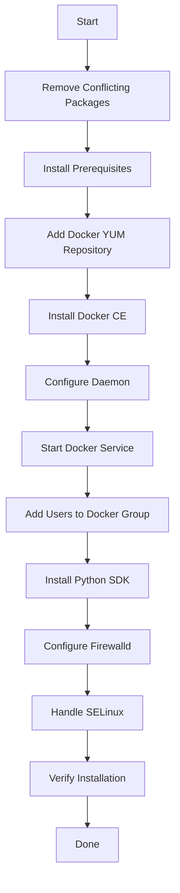

# How to Install Docker with Ansible on CentOS

Author: [nawazdhandala](https://www.github.com/nawazdhandala)

Tags: Ansible, Docker, CentOS, RHEL, Automation

Description: Complete guide to installing Docker Engine on CentOS and RHEL servers using Ansible playbooks with proper repository setup and configuration.

---

CentOS and RHEL are the go-to operating systems for many enterprise environments. Installing Docker on these systems has a few differences compared to Ubuntu, mainly around the package manager (yum/dnf instead of apt) and some SELinux considerations. In this post, we will build a thorough Ansible playbook that installs Docker Engine on CentOS 7, CentOS Stream 8/9, and RHEL 8/9.

## Key Differences from Ubuntu

If you have installed Docker on Ubuntu before, here is what changes for CentOS:

- Uses `yum` or `dnf` instead of `apt`
- The Docker repository URL is different
- You may need to handle SELinux policies
- `firewalld` might need configuration
- The `podman` and `buildah` packages from CentOS repos can conflict with Docker

## Prerequisites

- Ansible 2.10+ on your control machine
- SSH access to your CentOS/RHEL servers
- Sudo privileges on target servers

## Inventory Setup

```ini
# inventory.ini - CentOS/RHEL servers for Docker installation
[docker_hosts]
centos1 ansible_host=192.168.1.20
centos2 ansible_host=192.168.1.21
rhel1   ansible_host=192.168.1.30

[docker_hosts:vars]
ansible_user=centos
ansible_ssh_private_key_file=~/.ssh/id_rsa
```

## The Complete Installation Playbook

```yaml
# install-docker-centos.yml - Install Docker on CentOS/RHEL
---
- name: Install Docker on CentOS/RHEL
  hosts: docker_hosts
  become: true
  gather_facts: true

  vars:
    docker_users:
      - centos
    docker_edition: "ce"

  tasks:
    # Step 1: Remove conflicting packages
    - name: Remove conflicting packages (podman, buildah, old docker)
      ansible.builtin.yum:
        name:
          - docker
          - docker-client
          - docker-client-latest
          - docker-common
          - docker-latest
          - docker-latest-logrotate
          - docker-logrotate
          - docker-engine
          - podman
          - buildah
          - runc
        state: absent
      when: ansible_os_family == "RedHat"

    # Step 2: Install required packages
    - name: Install prerequisite packages
      ansible.builtin.yum:
        name:
          - yum-utils
          - device-mapper-persistent-data
          - lvm2
          - python3
          - python3-pip
        state: present

    # Step 3: Add Docker repository
    - name: Add Docker CE repository
      ansible.builtin.yum_repository:
        name: docker-ce-stable
        description: "Docker CE Stable - $basearch"
        baseurl: "https://download.docker.com/linux/centos/$releasever/$basearch/stable"
        gpgcheck: true
        gpgkey: "https://download.docker.com/linux/centos/gpg"
        enabled: true

    # Step 4: Install Docker Engine
    - name: Install Docker Engine and plugins
      ansible.builtin.yum:
        name:
          - docker-ce
          - docker-ce-cli
          - containerd.io
          - docker-buildx-plugin
          - docker-compose-plugin
        state: present

    # Step 5: Create Docker configuration directory
    - name: Ensure /etc/docker directory exists
      ansible.builtin.file:
        path: /etc/docker
        state: directory
        mode: "0755"

    # Step 6: Configure Docker daemon
    - name: Write Docker daemon configuration
      ansible.builtin.copy:
        content: |
          {
            "log-driver": "json-file",
            "log-opts": {
              "max-size": "10m",
              "max-file": "3"
            },
            "storage-driver": "overlay2",
            "live-restore": true,
            "exec-opts": ["native.cgroupdriver=systemd"]
          }
        dest: /etc/docker/daemon.json
        mode: "0644"
      notify: restart docker

    # Step 7: Start and enable Docker
    - name: Start and enable Docker service
      ansible.builtin.systemd:
        name: docker
        state: started
        enabled: true
        daemon_reload: true

    # Step 8: Add users to docker group
    - name: Add users to docker group
      ansible.builtin.user:
        name: "{{ item }}"
        groups: docker
        append: true
      loop: "{{ docker_users }}"

    # Step 9: Install Docker Python SDK
    - name: Install Docker Python SDK
      ansible.builtin.pip:
        name:
          - docker
        state: present
        executable: pip3

    # Step 10: Configure firewalld for Docker (if active)
    - name: Check if firewalld is running
      ansible.builtin.systemd:
        name: firewalld
      register: firewalld_status
      ignore_errors: true

    - name: Allow Docker through firewalld
      ansible.posix.firewalld:
        zone: trusted
        interface: docker0
        permanent: true
        state: enabled
      when:
        - firewalld_status.status is defined
        - firewalld_status.status.ActiveState == "active"
      notify: reload firewalld

    # Step 11: Handle SELinux
    - name: Check SELinux status
      ansible.builtin.command: getenforce
      register: selinux_status
      changed_when: false
      failed_when: false

    - name: Install container-selinux if SELinux is enforcing
      ansible.builtin.yum:
        name: container-selinux
        state: present
      when: selinux_status.stdout == "Enforcing"

    # Step 12: Verify installation
    - name: Verify Docker is running
      ansible.builtin.command: docker info
      register: docker_info
      changed_when: false

    - name: Show Docker version
      ansible.builtin.command: docker version --format '{{ "{{" }}.Server.Version{{ "}}" }}'
      register: docker_version
      changed_when: false

    - name: Show Docker Compose version
      ansible.builtin.command: docker compose version --short
      register: compose_version
      changed_when: false

    - name: Display installation results
      ansible.builtin.debug:
        msg: |
          Docker Engine: {{ docker_version.stdout }}
          Docker Compose: {{ compose_version.stdout }}
          Storage Driver: overlay2
          Installation complete on {{ ansible_hostname }}

  handlers:
    - name: restart docker
      ansible.builtin.systemd:
        name: docker
        state: restarted

    - name: reload firewalld
      ansible.builtin.systemd:
        name: firewalld
        state: reloaded
```

## Running the Playbook

```bash
# Install Docker on all CentOS/RHEL hosts
ansible-playbook -i inventory.ini install-docker-centos.yml

# Target a specific host
ansible-playbook -i inventory.ini install-docker-centos.yml --limit centos1

# Dry run to see what would change
ansible-playbook -i inventory.ini install-docker-centos.yml --check
```

## Installation Flow



## Handling CentOS 7 vs Stream 8/9

CentOS 7 uses `yum` while CentOS Stream 8+ and RHEL 8+ use `dnf`. Ansible's `yum` module handles both transparently, but there are some version-specific considerations.

```yaml
# version-aware-install.yml - Handle different CentOS/RHEL versions
---
- name: Version-Aware Docker Installation
  hosts: docker_hosts
  become: true
  gather_facts: true

  tasks:
    - name: Show detected OS version
      ansible.builtin.debug:
        msg: "Detected: {{ ansible_distribution }} {{ ansible_distribution_major_version }}"

    # CentOS 7 specific: install EPEL for newer Python
    - name: Install EPEL repository on CentOS 7
      ansible.builtin.yum:
        name: epel-release
        state: present
      when:
        - ansible_distribution == "CentOS"
        - ansible_distribution_major_version == "7"

    # CentOS 7 specific: some packages have different names
    - name: Install prerequisites for CentOS 7
      ansible.builtin.yum:
        name:
          - yum-utils
          - device-mapper-persistent-data
          - lvm2
        state: present
      when: ansible_distribution_major_version == "7"

    # CentOS 8/9 and RHEL 8/9
    - name: Install prerequisites for CentOS/RHEL 8+
      ansible.builtin.dnf:
        name:
          - dnf-plugins-core
          - device-mapper-persistent-data
          - lvm2
        state: present
      when: ansible_distribution_major_version | int >= 8

    # Add Docker repo differently for CentOS 7
    - name: Add Docker repo for CentOS 7
      ansible.builtin.command: >
        yum-config-manager --add-repo
        https://download.docker.com/linux/centos/docker-ce.repo
      args:
        creates: /etc/yum.repos.d/docker-ce.repo
      when: ansible_distribution_major_version == "7"

    # Add Docker repo for CentOS 8/9
    - name: Add Docker repo for CentOS/RHEL 8+
      ansible.builtin.command: >
        dnf config-manager --add-repo
        https://download.docker.com/linux/centos/docker-ce.repo
      args:
        creates: /etc/yum.repos.d/docker-ce.repo
      when: ansible_distribution_major_version | int >= 8

    - name: Install Docker Engine
      ansible.builtin.yum:
        name:
          - docker-ce
          - docker-ce-cli
          - containerd.io
          - docker-compose-plugin
        state: present

    - name: Start and enable Docker
      ansible.builtin.systemd:
        name: docker
        state: started
        enabled: true
```

## SELinux Considerations

SELinux is enabled by default on CentOS and RHEL. Docker works with SELinux, but you might run into issues with volume mounts. Here is how to handle it properly.

```yaml
# selinux-config.yml - Handle SELinux for Docker
---
- name: Configure SELinux for Docker
  hosts: docker_hosts
  become: true

  tasks:
    - name: Ensure container-selinux is installed
      ansible.builtin.yum:
        name: container-selinux
        state: present

    # Option 1: Keep SELinux enforcing (recommended for production)
    # Docker volumes may need :z or :Z suffix
    - name: Document SELinux volume mount requirements
      ansible.builtin.debug:
        msg: |
          SELinux is enforcing on this host.
          When mounting volumes, use the :z (shared) or :Z (private) suffix:
          docker run -v /host/path:/container/path:z myimage

    # Option 2: Set SELinux to permissive (less secure, easier)
    # Only use this if you cannot make :z/:Z work
    # - name: Set SELinux to permissive
    #   ansible.posix.selinux:
    #     policy: targeted
    #     state: permissive
```

## Making It a Reusable Role

```yaml
# roles/docker_centos/defaults/main.yml
---
docker_users: []
docker_log_max_size: "10m"
docker_log_max_file: "3"
docker_storage_driver: "overlay2"
docker_cgroup_driver: "systemd"
```

```yaml
# roles/docker_centos/meta/main.yml
---
dependencies: []
galaxy_info:
  author: "Your Name"
  description: "Install Docker on CentOS/RHEL"
  min_ansible_version: "2.10"
  platforms:
    - name: EL
      versions:
        - "7"
        - "8"
        - "9"
```

## Uninstalling Docker

```yaml
# uninstall-docker-centos.yml - Remove Docker from CentOS/RHEL
---
- name: Uninstall Docker from CentOS/RHEL
  hosts: docker_hosts
  become: true

  tasks:
    - name: Stop Docker service
      ansible.builtin.systemd:
        name: docker
        state: stopped
      ignore_errors: true

    - name: Remove Docker packages
      ansible.builtin.yum:
        name:
          - docker-ce
          - docker-ce-cli
          - containerd.io
          - docker-buildx-plugin
          - docker-compose-plugin
        state: absent

    - name: Remove Docker data
      ansible.builtin.file:
        path: "{{ item }}"
        state: absent
      loop:
        - /var/lib/docker
        - /var/lib/containerd
        - /etc/docker

    - name: Remove Docker repository
      ansible.builtin.file:
        path: /etc/yum.repos.d/docker-ce.repo
        state: absent
```

## Troubleshooting

1. **"package docker-ce-3:xx requires containerd.io >= 1.6"**: This means the containerd version in the repo is too old. Make sure you are using the Docker repository, not the OS repository.

2. **Firewalld blocking Docker networking**: Docker adds iptables rules, which can conflict with firewalld. Adding the docker0 interface to the trusted zone resolves most issues.

3. **SELinux denials with volume mounts**: Use the `:z` or `:Z` suffix on volume mounts, or check `audit2allow` for the specific denial messages.

4. **"conflicting requests" with podman**: CentOS Stream ships with podman pre-installed. Remove it before installing Docker to avoid conflicts.

5. **systemd cgroup driver**: If you plan to run Kubernetes on these nodes, make sure Docker uses the systemd cgroup driver (configured in the daemon.json we created).

## Conclusion

Installing Docker on CentOS and RHEL with Ansible handles the nuances that differ from Ubuntu: the yum/dnf package manager, SELinux integration, firewalld configuration, and the need to remove conflicting packages like podman. The playbook in this post covers all of these and produces a consistent Docker installation across your entire CentOS/RHEL fleet. Whether you are managing a handful of servers or hundreds, this gives you reliable, repeatable Docker deployments.
