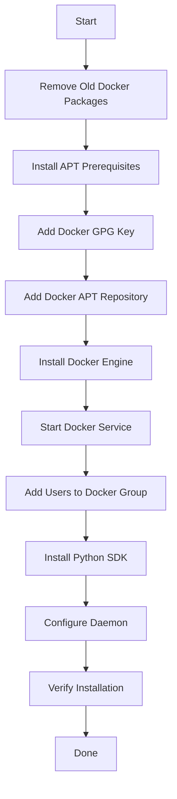

# How to Install Docker with Ansible on Ubuntu

Author: [nawazdhandala](https://www.github.com/nawazdhandala)

Tags: Ansible, Docker, Ubuntu, Automation, DevOps

Description: Step-by-step guide to installing Docker Engine on Ubuntu servers using Ansible playbooks, including Docker Compose and post-install configuration.

---

Installing Docker on a single Ubuntu server is straightforward. You follow the official docs, run a handful of commands, and you are done in five minutes. But what about installing Docker on 10 servers? Or 50? Or ensuring that every new server in your fleet gets Docker installed with the exact same configuration? That is where Ansible comes in. In this post, we will build a complete Ansible playbook that installs Docker Engine on Ubuntu, configures it properly, and handles all the little things that the quick-start guides leave out.

## What We Will Install

- Docker Engine (not Docker Desktop)
- Docker CLI
- containerd
- Docker Compose plugin (the v2 version that runs as `docker compose`)
- The Docker Python SDK (needed if you plan to use Ansible's Docker modules later)

## Prerequisites

- Ansible 2.10+ installed on your control machine
- SSH access to your Ubuntu target servers
- Sudo privileges on the target servers

## The Inventory File

Start with a simple inventory file listing your servers.

```ini
# inventory.ini - Target servers for Docker installation
[docker_hosts]
server1 ansible_host=192.168.1.10
server2 ansible_host=192.168.1.11
server3 ansible_host=192.168.1.12

[docker_hosts:vars]
ansible_user=ubuntu
ansible_ssh_private_key_file=~/.ssh/id_rsa
```

## The Complete Playbook

Here is the full playbook. We will break it down section by section after.

```yaml
# install-docker-ubuntu.yml - Install Docker Engine on Ubuntu
---
- name: Install Docker on Ubuntu
  hosts: docker_hosts
  become: true
  gather_facts: true

  vars:
    docker_users:
      - ubuntu
    docker_compose_version: "2.24.5"

  tasks:
    # Step 1: Remove any old Docker packages
    - name: Remove old Docker packages if present
      ansible.builtin.apt:
        name:
          - docker
          - docker-engine
          - docker.io
          - containerd
          - runc
        state: absent

    # Step 2: Install prerequisites
    - name: Install required packages for apt over HTTPS
      ansible.builtin.apt:
        name:
          - apt-transport-https
          - ca-certificates
          - curl
          - gnupg
          - lsb-release
          - python3-pip
        state: present
        update_cache: true

    # Step 3: Add Docker's GPG key
    - name: Create directory for Docker GPG key
      ansible.builtin.file:
        path: /etc/apt/keyrings
        state: directory
        mode: "0755"

    - name: Download Docker GPG key
      ansible.builtin.get_url:
        url: https://download.docker.com/linux/ubuntu/gpg
        dest: /etc/apt/keyrings/docker.asc
        mode: "0644"

    # Step 4: Add the Docker repository
    - name: Get system architecture
      ansible.builtin.command: dpkg --print-architecture
      register: dpkg_arch
      changed_when: false

    - name: Add Docker apt repository
      ansible.builtin.apt_repository:
        repo: >-
          deb [arch={{ dpkg_arch.stdout }}
          signed-by=/etc/apt/keyrings/docker.asc]
          https://download.docker.com/linux/ubuntu
          {{ ansible_distribution_release }} stable
        state: present
        filename: docker

    # Step 5: Install Docker Engine
    - name: Install Docker Engine and related packages
      ansible.builtin.apt:
        name:
          - docker-ce
          - docker-ce-cli
          - containerd.io
          - docker-buildx-plugin
          - docker-compose-plugin
        state: present
        update_cache: true

    # Step 6: Ensure Docker service is running
    - name: Start and enable Docker service
      ansible.builtin.systemd:
        name: docker
        state: started
        enabled: true

    # Step 7: Add users to the docker group
    - name: Add users to the docker group
      ansible.builtin.user:
        name: "{{ item }}"
        groups: docker
        append: true
      loop: "{{ docker_users }}"

    # Step 8: Install Docker Python SDK for Ansible modules
    - name: Install Docker Python SDK
      ansible.builtin.pip:
        name:
          - docker
          - docker-compose
        state: present

    # Step 9: Configure Docker daemon
    - name: Create Docker daemon configuration
      ansible.builtin.copy:
        content: |
          {
            "log-driver": "json-file",
            "log-opts": {
              "max-size": "10m",
              "max-file": "3"
            },
            "storage-driver": "overlay2",
            "live-restore": true
          }
        dest: /etc/docker/daemon.json
        mode: "0644"
      notify: restart docker

    # Step 10: Verify installation
    - name: Check Docker version
      ansible.builtin.command: docker version
      register: docker_version
      changed_when: false

    - name: Check Docker Compose version
      ansible.builtin.command: docker compose version
      register: compose_version
      changed_when: false

    - name: Display versions
      ansible.builtin.debug:
        msg: |
          Docker: {{ docker_version.stdout_lines[0] }}
          Compose: {{ compose_version.stdout }}

    - name: Run hello-world to verify Docker works
      community.docker.docker_container:
        name: hello-world
        image: hello-world
        state: started
        auto_remove: true
      register: hello_result

    - name: Docker is working
      ansible.builtin.debug:
        msg: "Docker installation verified successfully."

  handlers:
    - name: restart docker
      ansible.builtin.systemd:
        name: docker
        state: restarted
```

## Running the Playbook

```bash
# Run the installation playbook
ansible-playbook -i inventory.ini install-docker-ubuntu.yml

# Run with verbose output for troubleshooting
ansible-playbook -i inventory.ini install-docker-ubuntu.yml -v
```

## Installation Flow



## Breaking Down the Key Steps

### Removing Old Packages

Ubuntu might have the `docker.io` package from the default repositories. This is an older, community-maintained version. We remove it to avoid conflicts with the official Docker Engine packages.

### Adding the Docker Repository

We add Docker's official apt repository rather than using Ubuntu's built-in Docker packages. This ensures we get the latest stable version with security patches.

### The Docker Daemon Configuration

The `daemon.json` file controls Docker's behavior. Here is what each setting does:

- **log-driver: json-file**: Uses the default logging driver
- **max-size: 10m, max-file: 3**: Limits container log files to 10MB and keeps only 3 rotated files. Without this, container logs can fill up your disk.
- **storage-driver: overlay2**: The recommended storage driver for modern Linux kernels
- **live-restore: true**: Keeps containers running during Docker daemon restarts. This is important for production servers.

### The Docker Group

Adding users to the `docker` group lets them run Docker commands without sudo. Note that this is equivalent to giving those users root access, since Docker containers can mount the host file system. Only add trusted users.

## Handling Different Ubuntu Versions

The playbook uses `ansible_distribution_release` to automatically detect the Ubuntu version (jammy, focal, noble, etc.). This means the same playbook works on Ubuntu 20.04, 22.04, and 24.04 without changes.

## Making It a Reusable Role

For better reuse, convert the playbook into an Ansible role.

```yaml
# roles/docker/defaults/main.yml - Default variables for the Docker role
---
docker_users: []
docker_log_max_size: "10m"
docker_log_max_file: "3"
docker_storage_driver: "overlay2"
docker_live_restore: true
```

```yaml
# roles/docker/handlers/main.yml - Handlers for the Docker role
---
- name: restart docker
  ansible.builtin.systemd:
    name: docker
    state: restarted
```

Then use it in a playbook:

```yaml
# site.yml - Use the Docker role
---
- name: Setup Docker Servers
  hosts: docker_hosts
  become: true
  roles:
    - role: docker
      vars:
        docker_users:
          - ubuntu
          - deploy
```

## Uninstalling Docker

If you ever need to remove Docker completely, here is the playbook for that.

```yaml
# uninstall-docker.yml - Completely remove Docker from Ubuntu
---
- name: Uninstall Docker from Ubuntu
  hosts: docker_hosts
  become: true

  tasks:
    - name: Stop Docker service
      ansible.builtin.systemd:
        name: docker
        state: stopped
      ignore_errors: true

    - name: Remove Docker packages
      ansible.builtin.apt:
        name:
          - docker-ce
          - docker-ce-cli
          - containerd.io
          - docker-buildx-plugin
          - docker-compose-plugin
        state: absent
        purge: true

    - name: Remove Docker data directory
      ansible.builtin.file:
        path: /var/lib/docker
        state: absent

    - name: Remove Docker repository
      ansible.builtin.apt_repository:
        repo: >-
          deb [arch=amd64 signed-by=/etc/apt/keyrings/docker.asc]
          https://download.docker.com/linux/ubuntu
          {{ ansible_distribution_release }} stable
        state: absent

    - name: Remove Docker GPG key
      ansible.builtin.file:
        path: /etc/apt/keyrings/docker.asc
        state: absent
```

## Troubleshooting Common Issues

1. **"Permission denied" errors**: The user was added to the docker group but has not logged out and back in. The group membership change requires a new login session to take effect.

2. **APT key errors**: If you get GPG key errors, make sure the `/etc/apt/keyrings` directory exists and the key was downloaded correctly.

3. **Docker fails to start**: Check the daemon.json for JSON syntax errors with `docker info` or look at `journalctl -u docker.service`.

4. **Conflicting packages**: If you see dependency conflicts, make sure you completely removed the old `docker.io` packages before installing Docker CE.

## Conclusion

Installing Docker with Ansible gives you a consistent, repeatable process that works whether you are setting up one server or a hundred. The playbook handles all the steps that the manual installation docs describe, plus it adds production-ready configurations like log rotation and live restore. Once you have this playbook, every new server in your fleet gets Docker installed the same way, every time.
