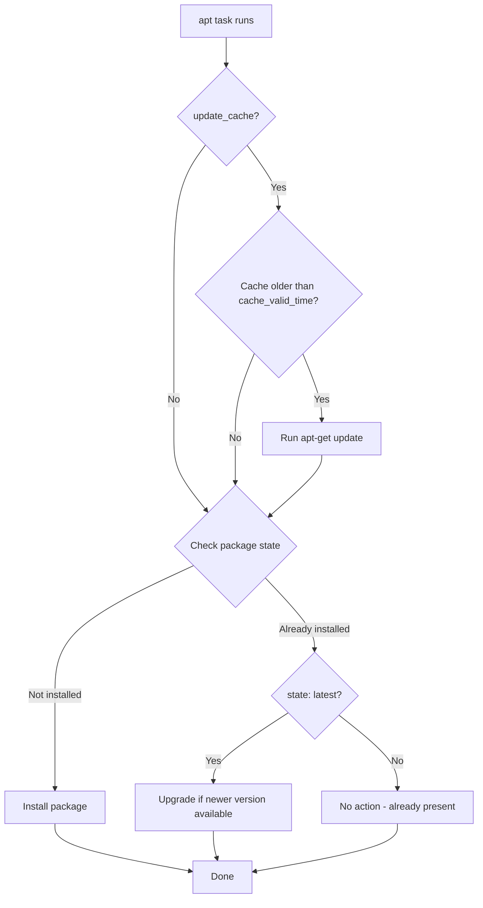

# How to Install Packages with the Ansible apt Module

Author: [nawazdhandala](https://www.github.com/nawazdhandala)

Tags: Ansible, apt, Ubuntu, Package Management

Description: A complete guide to installing packages on Debian and Ubuntu systems using the Ansible apt module with practical examples.

---

The `apt` module is one of the most frequently used modules in Ansible if you manage Debian or Ubuntu servers. It wraps the `apt-get` command and gives you a clean, idempotent way to install, remove, and update packages. This post covers everything you need to know to use it effectively for package installation.

## Basic Package Installation

The simplest use case is installing a single package. Here is how you install `nginx`:

```yaml
# Install a single package
- name: Install nginx
  ansible.builtin.apt:
    name: nginx
    state: present
```

The `state: present` parameter tells Ansible to install the package if it is not already installed, and do nothing if it is. This is the default behavior, so you could omit `state` entirely, but being explicit makes your playbooks easier to read.

## Installing Multiple Packages

You can pass a list to install several packages in a single task. This is more efficient than writing separate tasks because Ansible batches them into a single `apt-get` call:

```yaml
# Install multiple packages in a single task
- name: Install web server dependencies
  ansible.builtin.apt:
    name:
      - nginx
      - php-fpm
      - php-mysql
      - php-curl
      - certbot
      - python3-certbot-nginx
    state: present
```

You can also use a variable for the package list, which is handy when different server roles need different packages:

```yaml
# Install packages from a variable list
- name: Install role-specific packages
  ansible.builtin.apt:
    name: "{{ required_packages }}"
    state: present
  vars:
    required_packages:
      - htop
      - curl
      - wget
      - jq
      - unzip
```

## Updating the Package Cache

A common gotcha with `apt` is running it on a freshly provisioned server that has a stale package cache. The install will fail because `apt-get` cannot find the package metadata. Always update the cache first.

```yaml
# Update the apt cache before installing
- name: Install git with cache update
  ansible.builtin.apt:
    name: git
    state: present
    update_cache: yes
    cache_valid_time: 3600
```

The `cache_valid_time` parameter is important for performance. It tells Ansible "only update the cache if it is older than 3600 seconds (1 hour)." Without this, every run would hit the package mirrors, which wastes time and bandwidth.

You can also update the cache as a separate task:

```yaml
# Update the apt cache as a standalone task
- name: Update apt cache
  ansible.builtin.apt:
    update_cache: yes
    cache_valid_time: 3600

- name: Install packages
  ansible.builtin.apt:
    name:
      - docker-ce
      - docker-compose-plugin
    state: present
```

## Installing the Latest Version

If you want to ensure you have the newest version of a package (not just that it is installed), use `state: latest`:

```yaml
# Install or upgrade to the latest version
- name: Ensure latest version of security packages
  ansible.builtin.apt:
    name:
      - openssl
      - libssl3
      - ca-certificates
    state: latest
    update_cache: yes
```

Be careful with `state: latest` in production. It can trigger unexpected upgrades that break things. For most applications, `state: present` is safer, and you should handle upgrades through a deliberate maintenance window.

## Installing Specific Versions

To pin a specific version, append the version string to the package name:

```yaml
# Install a specific version of a package
- name: Install PostgreSQL 15
  ansible.builtin.apt:
    name: postgresql-15=15.4-1.pgdg22.04+1
    state: present
```

To find the exact version string, run `apt-cache policy <package>` on a target host. The version string must match exactly what apt expects.

## Installing .deb Files

The `apt` module can install local `.deb` files directly:

```yaml
# Download and install a .deb file
- name: Download Slack .deb package
  ansible.builtin.get_url:
    url: https://downloads.slack-edge.com/releases/linux/4.35.126/prod/x64/slack-desktop-4.35.126-amd64.deb
    dest: /tmp/slack.deb

- name: Install Slack from .deb file
  ansible.builtin.apt:
    deb: /tmp/slack.deb
```

When using the `deb` parameter, the module handles dependency resolution automatically, just like `apt install ./package.deb` does on the command line.

## Handling Dependencies

Sometimes you need to fix broken dependencies before installing a package. The `apt` module does not have a direct "fix broken" parameter, but you can handle it:

```yaml
# Fix broken dependencies if needed
- name: Fix broken packages
  ansible.builtin.apt:
    state: fixed

# Then install your package
- name: Install package after fixing dependencies
  ansible.builtin.apt:
    name: my-custom-package
    state: present
```

## Using apt with Become

Package installation requires root privileges. Make sure you have `become: yes` set at the play level or the task level:

```yaml
# Play-level become for all package tasks
- name: Set up web server
  hosts: web_servers
  become: yes
  tasks:
    - name: Install nginx
      ansible.builtin.apt:
        name: nginx
        state: present
        update_cache: yes
        cache_valid_time: 3600

    - name: Install monitoring agent
      ansible.builtin.apt:
        name: datadog-agent
        state: present
```

## Preventing Prompts During Installation

Some packages launch interactive prompts during installation (like asking you to configure a mail server when installing `postfix`). Use the `DEBIAN_FRONTEND` environment variable to suppress these:

```yaml
# Install a package that normally prompts for input
- name: Install postfix non-interactively
  ansible.builtin.apt:
    name: postfix
    state: present
  environment:
    DEBIAN_FRONTEND: noninteractive
```

You can also pre-seed debconf answers:

```yaml
# Pre-configure postfix answers before installation
- name: Set postfix configuration type
  ansible.builtin.debconf:
    name: postfix
    question: postfix/main_mailer_type
    value: 'Internet Site'
    vtype: select

- name: Set postfix mail name
  ansible.builtin.debconf:
    name: postfix
    question: postfix/mailname
    value: '{{ ansible_fqdn }}'
    vtype: string

- name: Install postfix
  ansible.builtin.apt:
    name: postfix
    state: present
  environment:
    DEBIAN_FRONTEND: noninteractive
```

## Installing Recommended Packages

By default, apt installs recommended packages along with the requested package. You can control this behavior:

```yaml
# Install without recommended packages (smaller footprint)
- name: Install package without recommends
  ansible.builtin.apt:
    name: python3
    state: present
    install_recommends: no
```

This is useful for container images or minimal server installations where you want to keep the package footprint small.

## Complete Example: Setting Up a LAMP Stack

Here is a full playbook that installs a LAMP stack:

```yaml
# Install a complete LAMP stack on Ubuntu
- name: Set up LAMP stack
  hosts: web_servers
  become: yes
  vars:
    php_version: "8.2"
  tasks:
    - name: Update apt cache
      ansible.builtin.apt:
        update_cache: yes
        cache_valid_time: 3600

    - name: Install Apache
      ansible.builtin.apt:
        name:
          - apache2
          - apache2-utils
        state: present

    - name: Install MySQL server
      ansible.builtin.apt:
        name:
          - mysql-server
          - python3-mysqldb
        state: present

    - name: Install PHP and common extensions
      ansible.builtin.apt:
        name:
          - "php{{ php_version }}"
          - "php{{ php_version }}-mysql"
          - "php{{ php_version }}-curl"
          - "php{{ php_version }}-gd"
          - "php{{ php_version }}-mbstring"
          - "php{{ php_version }}-xml"
          - "php{{ php_version }}-zip"
          - "libapache2-mod-php{{ php_version }}"
        state: present
      notify: restart apache

  handlers:
    - name: restart apache
      ansible.builtin.service:
        name: apache2
        state: restarted
```

## Package Installation Flow



The `apt` module handles the overwhelming majority of package management tasks on Debian-based systems. Combined with `update_cache` and `cache_valid_time`, it gives you reliable, idempotent package installation that works the same whether it is the first run or the hundredth.
