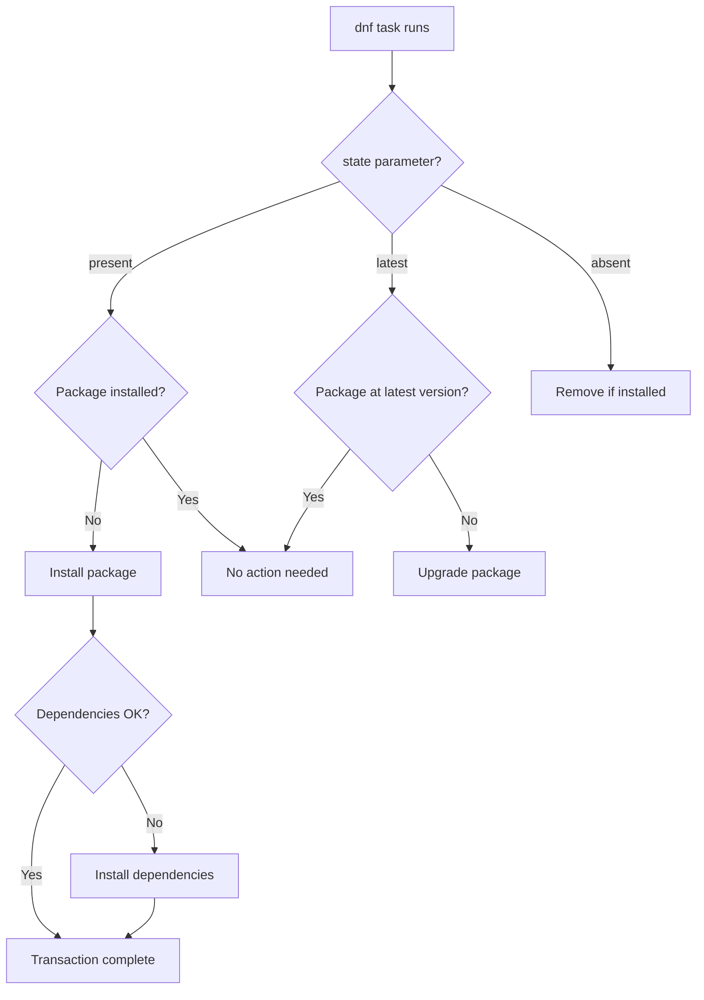

# How to Install Packages with the Ansible dnf Module

Author: [nawazdhandala](https://www.github.com/nawazdhandala)

Tags: Ansible, dnf, RHEL, Fedora, Package Management

Description: A hands-on guide to installing packages on RHEL, CentOS, and Fedora using the Ansible dnf module with real-world examples.

---

If you manage Red Hat, CentOS, AlmaLinux, Rocky Linux, or Fedora servers, the `dnf` module is your primary tool for package management in Ansible. It replaced the older `yum` module as the default package manager starting with RHEL 8 and Fedora 22. This post covers everything you need for day-to-day package installation with dnf.

## Basic Package Installation

Installing a single package is straightforward:

```yaml
# Install a single package
- name: Install nginx
  ansible.builtin.dnf:
    name: nginx
    state: present
```

Like the `apt` module on Debian systems, `state: present` means "install it if it is not there, otherwise leave it alone." This is the default and makes the task idempotent.

## Installing Multiple Packages

Pass a list to install several packages at once:

```yaml
# Install multiple packages in one task
- name: Install development tools
  ansible.builtin.dnf:
    name:
      - git
      - gcc
      - make
      - cmake
      - python3-devel
      - openssl-devel
    state: present
```

Batching packages into a single task is significantly faster than separate tasks because Ansible makes a single dnf transaction instead of multiple.

## Installing Package Groups

dnf supports package groups, which are collections of packages that serve a common purpose. Use the `@` prefix to reference a group:

```yaml
# Install a package group
- name: Install Development Tools group
  ansible.builtin.dnf:
    name: "@Development Tools"
    state: present

# Install multiple groups and individual packages together
- name: Install development environment
  ansible.builtin.dnf:
    name:
      - "@Development Tools"
      - "@System Tools"
      - vim-enhanced
      - tmux
    state: present
```

To list available groups on a system, run `dnf group list` on a target host.

## Installing Specific Versions

To install a specific version, append the version to the package name:

```yaml
# Install a specific package version
- name: Install PostgreSQL 15
  ansible.builtin.dnf:
    name: postgresql15-server-15.4-1PGDG.rhel9.x86_64
    state: present
```

You can also use version comparison operators:

```yaml
# Install a minimum version
- name: Install Python 3.11 or newer
  ansible.builtin.dnf:
    name: python3.11 >= 3.11.0
    state: present
```

## Getting the Latest Version

Use `state: latest` to upgrade a package to the newest available version:

```yaml
# Ensure the latest version of security-related packages
- name: Update security packages to latest
  ansible.builtin.dnf:
    name:
      - openssl
      - openssh-server
      - ca-certificates
    state: latest
```

Be careful with `state: latest` in production playbooks. It can trigger unexpected upgrades that break applications.

## Installing from a URL

dnf can install packages directly from a URL:

```yaml
# Install an RPM package from a URL
- name: Install the EPEL release package
  ansible.builtin.dnf:
    name: https://dl.fedoraproject.org/pub/epel/epel-release-latest-9.noarch.rpm
    state: present
    disable_gpg_check: yes
```

The `disable_gpg_check` is sometimes needed for packages that are not signed by a key already in your RPM keyring. Use this cautiously and only for trusted sources.

## Installing from a Local RPM File

If you have a local `.rpm` file on the target host:

```yaml
# Copy and install a local RPM file
- name: Copy custom RPM to target
  ansible.builtin.copy:
    src: files/myapp-2.5.0-1.el9.x86_64.rpm
    dest: /tmp/myapp-2.5.0-1.el9.x86_64.rpm

- name: Install custom RPM package
  ansible.builtin.dnf:
    name: /tmp/myapp-2.5.0-1.el9.x86_64.rpm
    state: present
    disable_gpg_check: yes
```

## Enabling Modules (dnf Module Streams)

RHEL 8+ and Fedora use modularity to provide multiple versions of software. You can enable a specific module stream:

```yaml
# Enable the Node.js 20 module stream
- name: Enable Node.js 20 module
  ansible.builtin.dnf:
    name: "@nodejs:20"
    state: present

# Or more explicitly using the dnf module_hotfixes approach
- name: Reset nodejs module
  ansible.builtin.command:
    cmd: dnf module reset nodejs -y
  changed_when: true

- name: Enable nodejs 20 stream
  ansible.builtin.command:
    cmd: dnf module enable nodejs:20 -y
  changed_when: true

- name: Install nodejs
  ansible.builtin.dnf:
    name: nodejs
    state: present
```

## Enabling Repositories

You can enable additional repositories during installation:

```yaml
# Install a package from a specific repository
- name: Install package from PowerTools/CRB
  ansible.builtin.dnf:
    name: ninja-build
    state: present
    enablerepo: crb

# Enable EPEL and install a package
- name: Ensure EPEL is available
  ansible.builtin.dnf:
    name: epel-release
    state: present

- name: Install htop from EPEL
  ansible.builtin.dnf:
    name: htop
    state: present
    enablerepo: epel
```

## Excluding Packages During Installation

Sometimes you want to install a group but exclude specific packages:

```yaml
# Install a group while excluding certain packages
- name: Install server tools without unnecessary packages
  ansible.builtin.dnf:
    name: "@Server with GUI"
    state: present
    exclude:
      - libreoffice*
      - evolution
      - cheese
```

## A Complete Server Setup Playbook

Here is a real-world playbook that sets up a web application server:

```yaml
# Set up a RHEL-based web application server
- name: Configure web application server
  hosts: app_servers
  become: yes
  tasks:
    - name: Install EPEL repository
      ansible.builtin.dnf:
        name: epel-release
        state: present

    - name: Install base packages
      ansible.builtin.dnf:
        name:
          - nginx
          - python3
          - python3-pip
          - python3-devel
          - gcc
          - redis
          - supervisor
        state: present

    - name: Install PostgreSQL client libraries
      ansible.builtin.dnf:
        name:
          - postgresql15
          - postgresql15-devel
        state: present

    - name: Install monitoring tools
      ansible.builtin.dnf:
        name:
          - htop
          - iotop
          - sysstat
          - net-tools
          - strace
          - lsof
        state: present

    - name: Enable and start services
      ansible.builtin.systemd:
        name: "{{ item }}"
        state: started
        enabled: yes
      loop:
        - nginx
        - redis
        - supervisord
```

## dnf Module Installation Flow



## Handling dnf Locks

On systems with automatic updates enabled, you might hit the dnf lock:

```yaml
# Wait for any existing dnf processes to finish
- name: Wait for dnf lock to be released
  ansible.builtin.shell: |
    while pgrep -x dnf > /dev/null; do
      sleep 5
    done
  changed_when: false
  timeout: 300

- name: Install packages
  ansible.builtin.dnf:
    name:
      - nginx
      - redis
    state: present
```

## Key Differences from the yum Module

If you are migrating from the `yum` module, here are the notable differences:

1. **Module streams**: dnf supports module streams for multi-version software. The yum module does not.
2. **Performance**: dnf is generally faster than yum for dependency resolution.
3. **Python dependency**: dnf requires Python 3, while yum uses Python 2.
4. **Group syntax**: Both use `@GroupName`, but dnf also supports `@module:stream/profile`.

For RHEL 8+ and Fedora, always use the `dnf` module. The `yum` module still works (it redirects to dnf internally), but using `dnf` directly avoids the extra abstraction layer and makes your playbooks clearer about what is actually happening on the target system.
