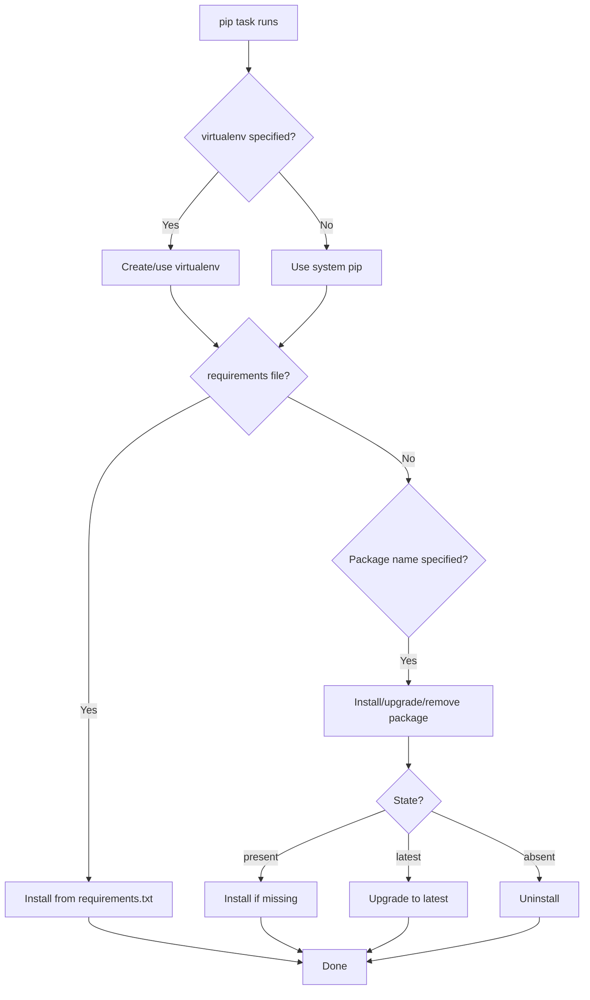

# How to Install Python Packages with the Ansible pip Module

Author: [nawazdhandala](https://www.github.com/nawazdhandala)

Tags: Ansible, Python, pip, Package Management

Description: A practical guide to installing and managing Python packages with the Ansible pip module including version pinning and virtualenvs.

---

Python packages are everywhere in modern infrastructure. Whether you are deploying a Django application, installing AWS CLI tools, or setting up data processing pipelines, the Ansible `pip` module is your tool for managing Python dependencies. This post covers the essential patterns for using it effectively.

## Basic Package Installation

The simplest use case is installing a Python package system-wide:

```yaml
# Install a Python package globally
- name: Install the requests library
  ansible.builtin.pip:
    name: requests
    state: present
```

This runs `pip install requests` under the hood. By default, it uses whatever `pip` is available on the PATH, which on most modern systems is `pip3`.

## Installing Multiple Packages

Pass a list to install several packages at once:

```yaml
# Install multiple Python packages
- name: Install application dependencies
  ansible.builtin.pip:
    name:
      - flask
      - gunicorn
      - celery
      - redis
      - psycopg2-binary
    state: present
```

## Specifying the pip Executable

On systems with both Python 2 and Python 3, you need to be explicit about which pip to use:

```yaml
# Use pip3 explicitly
- name: Install package with pip3
  ansible.builtin.pip:
    name: boto3
    executable: pip3

# Or specify the full path
- name: Install package with specific pip
  ansible.builtin.pip:
    name: boto3
    executable: /usr/bin/pip3
```

## Installing Specific Versions

Pin a package to an exact version using the standard pip version specifier:

```yaml
# Install an exact version
- name: Install Django 4.2 LTS
  ansible.builtin.pip:
    name: Django==4.2.8
    state: present
```

You can also use version ranges:

```yaml
# Install with version constraints
- name: Install packages with version constraints
  ansible.builtin.pip:
    name:
      - "Django>=4.2,<5.0"
      - "celery>=5.3.0"
      - "redis>=4.0,<6.0"
      - "psycopg2-binary~=2.9.0"
    state: present
```

The version specifiers follow standard PEP 440:
- `==4.2.8` - exact version
- `>=4.2,<5.0` - version range
- `~=2.9.0` - compatible release (equivalent to `>=2.9.0,<2.10.0`)

## Upgrading to the Latest Version

Use `state: latest` to upgrade a package to the newest available version:

```yaml
# Upgrade to the latest version
- name: Ensure latest version of awscli
  ansible.builtin.pip:
    name: awscli
    state: latest
```

To upgrade pip itself:

```yaml
# Upgrade pip to the latest version
- name: Upgrade pip
  ansible.builtin.pip:
    name: pip
    state: latest
    executable: pip3
```

## Installing from a requirements.txt File

For applications with a requirements file:

```yaml
# Install all packages from a requirements file
- name: Install application requirements
  ansible.builtin.pip:
    requirements: /opt/myapp/requirements.txt
    executable: pip3
```

## Installing from Git Repositories

pip can install packages directly from Git:

```yaml
# Install a package from a Git repository
- name: Install custom library from Git
  ansible.builtin.pip:
    name: "git+https://github.com/example/mylib.git@v2.0.0#egg=mylib"
    state: present
```

The `@v2.0.0` specifies a tag or branch, and `#egg=mylib` tells pip the package name.

## Installing from a Local Directory

For development or custom packages:

```yaml
# Install a package from a local directory (editable mode)
- name: Install application in editable mode
  ansible.builtin.pip:
    name: /opt/myapp
    editable: yes
    state: present

# Or install from a wheel file
- name: Install from a wheel file
  ansible.builtin.pip:
    name: /tmp/mypackage-1.0.0-py3-none-any.whl
    state: present
```

## Using Extra Arguments

The `extra_args` parameter lets you pass additional flags to pip:

```yaml
# Install with extra pip arguments
- name: Install package from a custom index
  ansible.builtin.pip:
    name: mycompany-utils
    extra_args: "--index-url https://pypi.internal.example.com/simple/"
    state: present

# Install with no dependencies (if you manage deps separately)
- name: Install package without dependencies
  ansible.builtin.pip:
    name: mylib
    extra_args: "--no-deps"
    state: present

# Install with a trusted host (for internal repos without valid SSL)
- name: Install from internal PyPI
  ansible.builtin.pip:
    name: internal-package
    extra_args: "--trusted-host pypi.internal.example.com --index-url http://pypi.internal.example.com/simple/"
    state: present
```

## Removing Packages

```yaml
# Uninstall a Python package
- name: Remove unused package
  ansible.builtin.pip:
    name: flask
    state: absent
```

## Ensuring pip Is Installed First

On minimal systems, pip might not be installed. Handle this with the system package manager:

```yaml
# Ensure pip is available (Debian/Ubuntu)
- name: Install pip3 on Ubuntu
  ansible.builtin.apt:
    name:
      - python3-pip
      - python3-venv
    state: present
  when: ansible_os_family == "Debian"

# Ensure pip is available (RHEL/CentOS)
- name: Install pip3 on RHEL
  ansible.builtin.dnf:
    name:
      - python3-pip
      - python3-virtualenv
    state: present
  when: ansible_os_family == "RedHat"
```

## Complete Example: Deploying a Flask Application

Here is a full playbook that deploys a Flask application with all its Python dependencies:

```yaml
# Deploy a Flask application with Python dependencies
- name: Deploy Flask application
  hosts: app_servers
  become: yes
  vars:
    app_dir: /opt/myapp
    app_user: myapp
    venv_dir: /opt/myapp/venv
  tasks:
    - name: Create application user
      ansible.builtin.user:
        name: "{{ app_user }}"
        system: yes
        shell: /bin/bash

    - name: Install system dependencies
      ansible.builtin.apt:
        name:
          - python3-pip
          - python3-venv
          - python3-dev
          - libpq-dev
          - gcc
        state: present

    - name: Create application directory
      ansible.builtin.file:
        path: "{{ app_dir }}"
        state: directory
        owner: "{{ app_user }}"
        group: "{{ app_user }}"

    - name: Deploy application code
      ansible.builtin.copy:
        src: app/
        dest: "{{ app_dir }}/"
        owner: "{{ app_user }}"
        group: "{{ app_user }}"

    - name: Install Python packages in virtualenv
      ansible.builtin.pip:
        requirements: "{{ app_dir }}/requirements.txt"
        virtualenv: "{{ venv_dir }}"
        virtualenv_command: python3 -m venv
      become_user: "{{ app_user }}"
      notify: restart myapp

    - name: Deploy systemd service
      ansible.builtin.template:
        src: myapp.service.j2
        dest: /etc/systemd/system/myapp.service
        mode: '0644'
      notify:
        - reload systemd
        - restart myapp

  handlers:
    - name: reload systemd
      ansible.builtin.systemd:
        daemon_reload: yes

    - name: restart myapp
      ansible.builtin.systemd:
        name: myapp
        state: restarted
        enabled: yes
```

## pip Module Workflow



## Common Gotchas

1. **PEP 668 externally managed environments.** On Ubuntu 23.04+ and other recent distributions, system Python is marked as externally managed, and pip refuses to install packages globally. Use virtualenvs or pass `--break-system-packages` via `extra_args` (not recommended for production).

2. **Permission issues.** Installing packages globally requires root. Always use `become: yes` for system-wide installs, or run pip as the application user with a virtualenv.

3. **pip version mismatches.** Old pip versions do not support some features like dependency resolution backtracking. Upgrade pip first if you hit weird dependency errors.

4. **Build dependencies.** Packages like `psycopg2`, `cryptography`, and `pillow` need C libraries and a compiler. Install the system-level build dependencies before running pip.

The `pip` module handles the vast majority of Python package management needs in Ansible. For production deployments, always use virtualenvs and pin your versions. The few extra minutes spent on proper dependency management saves hours of debugging version conflicts later.
