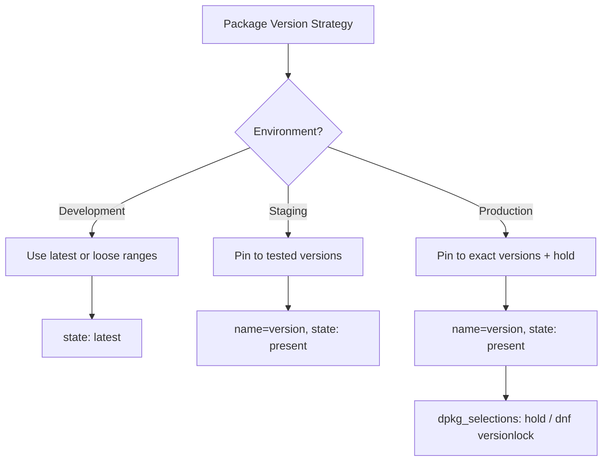

# How to Install Specific Package Versions with Ansible

Author: [nawazdhandala](https://www.github.com/nawazdhandala)

Tags: Ansible, Package Management, Version Pinning, DevOps

Description: How to install exact package versions across Debian, RHEL, and Python using Ansible for reproducible and predictable deployments.

---

Installing the "latest" version of a package is fine for development, but in production you want exact versions that you have tested. A package upgrade you did not plan for can introduce bugs, change behavior, or break compatibility with your application. This post covers how to install specific versions on every major platform Ansible supports.

## Specific Versions with the apt Module (Debian/Ubuntu)

On Debian-based systems, you append the version to the package name with an equals sign:

```yaml
# Install a specific version of PostgreSQL on Ubuntu
- name: Install PostgreSQL 15.4
  ansible.builtin.apt:
    name: postgresql-15=15.4-1.pgdg22.04+1
    state: present
    update_cache: yes
```

The version string has to match exactly what apt knows about. To find available versions, check `apt-cache policy`:

```yaml
# Check available versions of a package
- name: List available nginx versions
  ansible.builtin.command:
    cmd: apt-cache policy nginx
  register: nginx_versions
  changed_when: false

- name: Show available versions
  ansible.builtin.debug:
    msg: "{{ nginx_versions.stdout }}"
```

For multiple packages at specific versions:

```yaml
# Install multiple packages at specific versions
- name: Install LAMP stack with pinned versions
  ansible.builtin.apt:
    name:
      - apache2=2.4.57-2ubuntu2
      - php8.2=8.2.12-1ubuntu4
      - php8.2-mysql=8.2.12-1ubuntu4
      - libapache2-mod-php8.2=8.2.12-1ubuntu4
    state: present
```

## Allowing Downgrades

If the target host already has a newer version installed, Ansible will not downgrade by default. You need to explicitly allow it:

```yaml
# Downgrade a package to a specific version
- name: Downgrade Redis to stable version
  ansible.builtin.apt:
    name: redis-server=5:7.0.12-1
    state: present
    allow_downgrade: yes
```

Without `allow_downgrade: yes`, the task would fail with a message saying it cannot install a version older than what is currently installed.

## Specific Versions with the dnf Module (RHEL/Fedora)

On Red Hat-based systems, the version syntax is similar:

```yaml
# Install a specific version on RHEL
- name: Install specific nginx version
  ansible.builtin.dnf:
    name: nginx-1.24.0-1.el9
    state: present
```

To find available versions:

```yaml
# List available versions of a package
- name: Check available nginx versions
  ansible.builtin.command:
    cmd: dnf list --showduplicates nginx
  register: nginx_list
  changed_when: false

- name: Display versions
  ansible.builtin.debug:
    msg: "{{ nginx_list.stdout_lines }}"
```

dnf also supports allowing downgrades:

```yaml
# Downgrade a package with dnf
- name: Downgrade httpd to specific version
  ansible.builtin.dnf:
    name: httpd-2.4.57-5.el9
    state: present
    allow_downgrade: yes
```

## Specific Versions with the pip Module (Python)

Python packages use PEP 440 version specifiers:

```yaml
# Install exact Python package versions
- name: Install specific Django version
  ansible.builtin.pip:
    name:
      - Django==4.2.8
      - celery==5.3.6
      - redis==5.0.1
    virtualenv: /opt/myapp/venv
    virtualenv_command: python3 -m venv
```

pip supports several version operators:

```yaml
# Use different version specifiers
- name: Install Python packages with version constraints
  ansible.builtin.pip:
    name:
      - "Django==4.2.8"          # Exact version
      - "celery>=5.3.0,<5.4.0"  # Range
      - "redis~=5.0.0"          # Compatible release (>=5.0.0, <5.1.0)
      - "requests!=2.30.0"      # Exclude a specific version
    virtualenv: /opt/myapp/venv
    virtualenv_command: python3 -m venv
```

## Using Variables for Version Management

Centralizing version numbers in variables makes them easy to update and audit:

```yaml
# Define versions as variables
- name: Install application stack
  hosts: app_servers
  become: yes
  vars:
    versions:
      nginx: "1.24.0-1ubuntu1"
      postgresql: "15.4-1.pgdg22.04+1"
      redis: "5:7.0.12-1"
      python_packages:
        django: "4.2.8"
        gunicorn: "21.2.0"
        celery: "5.3.6"
  tasks:
    - name: Install system packages at specific versions
      ansible.builtin.apt:
        name:
          - "nginx={{ versions.nginx }}"
          - "postgresql-15={{ versions.postgresql }}"
          - "redis-server={{ versions.redis }}"
        state: present
        update_cache: yes

    - name: Install Python packages at specific versions
      ansible.builtin.pip:
        name: "{{ item.key }}=={{ item.value }}"
        virtualenv: /opt/myapp/venv
        virtualenv_command: python3 -m venv
      loop: "{{ versions.python_packages | dict2items }}"
      loop_control:
        label: "{{ item.key }}=={{ item.value }}"
```

## Version Management Across Environments

Different environments might need different versions. Use group_vars to manage this:

```yaml
# group_vars/staging.yml
package_versions:
  nginx: "1.25.3-1ubuntu1"
  postgresql: "16.1-1.pgdg22.04+1"
  redis: "5:7.2.3-1"

# group_vars/production.yml
package_versions:
  nginx: "1.24.0-1ubuntu1"
  postgresql: "15.4-1.pgdg22.04+1"
  redis: "5:7.0.12-1"
```

Then your playbook uses the variables without caring which environment it is running against:

```yaml
# Playbook that works across environments with different versions
- name: Install packages at environment-specific versions
  ansible.builtin.apt:
    name:
      - "nginx={{ package_versions.nginx }}"
      - "postgresql-15={{ package_versions.postgresql }}"
      - "redis-server={{ package_versions.redis }}"
    state: present
```

## Checking Currently Installed Versions

Before installing, you might want to check what is already there:

```yaml
# Gather package facts and check versions
- name: Gather package facts
  ansible.builtin.package_facts:
    manager: auto

- name: Display installed nginx version
  ansible.builtin.debug:
    msg: "Nginx version: {{ ansible_facts.packages['nginx'][0].version }}"
  when: "'nginx' in ansible_facts.packages"

- name: Check if upgrade is needed
  ansible.builtin.debug:
    msg: "Nginx needs upgrade from {{ ansible_facts.packages['nginx'][0].version }} to {{ target_nginx_version }}"
  when:
    - "'nginx' in ansible_facts.packages"
    - ansible_facts.packages['nginx'][0].version != target_nginx_version
```

## Version Pinning Strategies



## Locking Versions After Installation

Installing a specific version is only half the battle. You also need to prevent unplanned upgrades. See the next section for each platform.

For Debian/Ubuntu:

```yaml
# Lock the installed version to prevent upgrades
- name: Hold nginx at installed version
  ansible.builtin.dpkg_selections:
    name: nginx
    selection: hold
```

For RHEL:

```yaml
# Install versionlock plugin and lock the package
- name: Install versionlock plugin
  ansible.builtin.dnf:
    name: python3-dnf-plugin-versionlock
    state: present

- name: Lock nginx version
  ansible.builtin.command:
    cmd: dnf versionlock add nginx
  changed_when: true
```

## Full Workflow: Version-Controlled Deployment

```yaml
# Complete version-pinned deployment workflow
- name: Deploy with pinned versions
  hosts: all
  become: yes
  vars:
    target_versions:
      nginx: "1.24.0-1ubuntu1"
      redis: "5:7.0.12-1"
  tasks:
    - name: Update apt cache
      ansible.builtin.apt:
        update_cache: yes
        cache_valid_time: 3600

    - name: Install packages at target versions
      ansible.builtin.apt:
        name: "{{ item.key }}={{ item.value }}"
        state: present
      loop: "{{ target_versions | dict2items }}"
      loop_control:
        label: "{{ item.key }}={{ item.value }}"

    - name: Hold packages at installed versions
      ansible.builtin.dpkg_selections:
        name: "{{ item.key }}"
        selection: hold
      loop: "{{ target_versions | dict2items }}"
      loop_control:
        label: "{{ item.key }}"
```

## Tips for Version Management

1. **Store versions in a single file.** Whether it is `group_vars`, a dedicated `versions.yml`, or a vault file, keep all version definitions in one place for easy auditing.

2. **Test version upgrades in staging first.** Change the staging versions, deploy, test, then update production.

3. **Automate version discovery.** Write a script that checks for available updates and proposes version bumps, so you do not fall too far behind.

4. **Document why a version is pinned.** If you pin a specific version because of a known bug in a newer release, document that reasoning so the next person knows when it is safe to upgrade.

5. **Monitor for security advisories.** Pinned versions are safer for stability but can leave you exposed to known vulnerabilities. Balance stability with security.

Pinning versions adds some maintenance overhead, but it is one of the most important practices for production infrastructure. The few minutes spent getting version strings right in your playbooks prevents hours of debugging unexpected behavior from unplanned upgrades.
