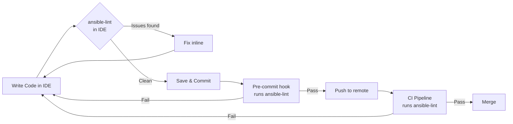

# How to Integrate ansible-lint with IDE Extensions

Author: [nawazdhandala](https://www.github.com/nawazdhandala)

Tags: Ansible, ansible-lint, IDE, VS Code, DevOps

Description: Set up ansible-lint integration with VS Code, Vim, and other IDEs to get real-time linting feedback while writing Ansible playbooks.

---

Getting linting feedback only when you run a command in the terminal means you are already context-switching away from the code you are writing. The better approach is to have ansible-lint running inside your editor, highlighting problems as you type. This gives you immediate feedback and makes fixing issues natural rather than something you batch up and deal with later. In this post I will cover setting up ansible-lint integration with VS Code, Neovim, and other popular editors.

## VS Code Setup

VS Code has the best ansible-lint integration thanks to the official Ansible extension maintained by Red Hat.

### Installing the Extension

```bash
# Install the Ansible extension from the command line
code --install-extension redhat.ansible
```

Or search for "Ansible" in the VS Code extensions marketplace and install the one published by Red Hat.

### Configuring the Extension

After installation, you need to configure the extension to use ansible-lint. Open your VS Code settings (JSON) and add the following.

```json
{
  "ansible.validation.enabled": true,
  "ansible.validation.lint.enabled": true,
  "ansible.validation.lint.path": "ansible-lint",
  "ansible.python.interpreterPath": "/usr/bin/python3",
  "ansible.ansible.path": "ansible",
  "files.associations": {
    "*.yml": "ansible",
    "*.yaml": "ansible"
  }
}
```

If you use a Python virtual environment (which I recommend), point to the right interpreter.

```json
{
  "ansible.python.interpreterPath": "${workspaceFolder}/.venv/bin/python3",
  "ansible.validation.lint.path": "${workspaceFolder}/.venv/bin/ansible-lint"
}
```

### Workspace-Specific Configuration

For projects where only certain YAML files are Ansible files, use workspace settings to avoid false positives.

```json
// .vscode/settings.json in your Ansible project root
{
  "ansible.validation.enabled": true,
  "ansible.validation.lint.enabled": true,
  "ansible.validation.lint.arguments": "--strict",
  "files.associations": {
    "playbooks/*.yml": "ansible",
    "roles/**/*.yml": "ansible",
    "inventory/**/*.yml": "ansible"
  },
  // Exclude non-Ansible YAML files from Ansible language detection
  "ansible.ansible.useFullyQualifiedCollectionNames": true
}
```

### How It Looks in Practice

Once configured, you will see linting results in several places:

1. Red and yellow squiggly underlines directly on problematic lines
2. The Problems panel at the bottom of VS Code showing all issues
3. Hover tooltips that explain the rule and suggest fixes
4. The file explorer showing icons on files with issues

The extension runs ansible-lint in the background whenever you save a file, so there is minimal delay.

## Neovim Setup

For Neovim users, there are several approaches depending on your plugin setup.

### Using nvim-lint

nvim-lint is a lightweight linting framework that supports ansible-lint out of the box.

```lua
-- In your Neovim config (init.lua or equivalent)
-- First install nvim-lint with your package manager

-- Using lazy.nvim
{
  "mfussenegger/nvim-lint",
  config = function()
    local lint = require("lint")

    -- Configure ansible-lint as the linter for yaml.ansible filetype
    lint.linters_by_ft = {
      ["yaml.ansible"] = { "ansible_lint" },
    }

    -- Run linter on save and when entering a buffer
    vim.api.nvim_create_autocmd({ "BufWritePost", "BufEnter" }, {
      callback = function()
        lint.try_lint()
      end,
    })
  end,
}
```

### Using ALE (Asynchronous Lint Engine)

If you prefer ALE, the configuration is straightforward.

```vim
" .vimrc or init.vim configuration for ALE with ansible-lint

" Enable ansible-lint for YAML files in Ansible directories
let g:ale_linters = {
\   'yaml': ['ansible_lint'],
\   'ansible': ['ansible_lint'],
\}

" Specify the ansible-lint executable path if needed
let g:ale_ansible_ansible_lint_executable = 'ansible-lint'

" Run linter on save only (not while typing, to save resources)
let g:ale_lint_on_text_changed = 'never'
let g:ale_lint_on_save = 1
let g:ale_lint_on_enter = 1

" Show linting errors in the sign column
let g:ale_sign_error = '>>'
let g:ale_sign_warning = '--'

" Enable virtual text for inline error display (Neovim only)
let g:ale_virtualtext_cursor = 1
```

### Using ansible-language-server with coc.nvim

For a VS Code-like experience in Neovim, use the Ansible language server.

```bash
# Install the Ansible language server globally
npm install -g @ansible/ansible-language-server
```

```json
// coc-settings.json
{
  "languageserver": {
    "ansible": {
      "command": "ansible-language-server",
      "args": ["--stdio"],
      "filetypes": ["yaml.ansible"],
      "rootPatterns": [".ansible-lint", "ansible.cfg", "galaxy.yml"],
      "initializationOptions": {
        "ansible": {
          "validation": {
            "enabled": true,
            "lint": {
              "enabled": true,
              "path": "ansible-lint"
            }
          }
        }
      }
    }
  }
}
```

## JetBrains IDEs (PyCharm, IntelliJ)

JetBrains IDEs can integrate ansible-lint through the External Tools feature or file watchers.

### Setting Up as an External Tool

Navigate to Settings > Tools > External Tools and add a new tool.

```
Name: ansible-lint
Program: ansible-lint
Arguments: $FilePath$
Working Directory: $ProjectFileDir$
```

### Setting Up as a File Watcher

For automatic linting on save, use File Watchers.

```
File type: YAML
Scope: Project Files
Program: ansible-lint
Arguments: --parseable $FilePath$
Output filters: $FILE_PATH$:$LINE$:$COLUMN$: $MESSAGE$
```

## Editor-Agnostic Setup with ansible-language-server

The Ansible Language Server provides IDE features for any editor that supports the Language Server Protocol (LSP). This includes VS Code, Neovim, Emacs, Sublime Text, and others.

```bash
# Install the language server
npm install -g @ansible/ansible-language-server

# Verify the installation
ansible-language-server --version
```

The language server provides more than just linting. It also offers:

- Auto-completion for module names and parameters
- Documentation on hover
- Go-to-definition for roles and variables
- Syntax highlighting aware of Ansible structures

## Configuring Your Project for IDE Integration

Regardless of which editor you use, having a proper `.ansible-lint` file in your project root ensures consistent behavior between the IDE and command-line usage.

```yaml
# .ansible-lint - project root configuration
# This file is read by both CLI and IDE integrations

# Profiles set the strictness level
profile: production

# Exclude paths that should not be linted
exclude_paths:
  - .cache/
  - .git/
  - tests/fixtures/
  - molecule/

# Rules configuration
enable_list:
  - fqcn
  - yaml

# Warn but do not error on these rules
warn_list:
  - experimental
  - yaml[line-length]

# Skip these rules entirely
skip_list: []
```

## Workflow Integration Diagram

Here is how IDE linting fits into the broader development workflow.



## Troubleshooting Common Issues

### Extension Not Detecting Ansible Files

If your IDE does not recognize YAML files as Ansible, check the file detection heuristics. Most tools look for keywords like `hosts:`, `tasks:`, or `roles:` in the file.

```yaml
# Make sure your playbooks start with the standard structure
# This helps editors detect the file as Ansible
---
- name: My playbook
  hosts: all
  tasks:
    - name: Example task
      ansible.builtin.debug:
        msg: "This file will be detected as Ansible"
```

### Slow Linting Performance

If linting feels slow in your IDE, ansible-lint might be scanning too many files.

```yaml
# .ansible-lint - optimize for speed
# Only lint specific directories
exclude_paths:
  - collections/
  - .cache/
  - .git/
  - node_modules/
  - "*.tar.gz"

# Disable rules that are computationally expensive
skip_list:
  - galaxy[no-changelog]
```

### Virtual Environment Issues

The most common integration problem is the IDE not finding ansible-lint because it is installed in a virtual environment.

```bash
# Create and activate a virtual environment in your project
python3 -m venv .venv
source .venv/bin/activate

# Install ansible-lint in the virtual environment
pip install ansible-lint ansible-core

# Point your IDE to this virtual environment's Python interpreter
# VS Code: set ansible.python.interpreterPath to .venv/bin/python3
# Neovim: set the path in your linter configuration
```

Having ansible-lint integrated into your editor transforms it from a gate you hit at the end of development into a continuous guide that keeps your playbooks clean as you write them. The initial setup takes a few minutes, but it saves hours of back-and-forth with CI pipeline failures and manual lint runs.
