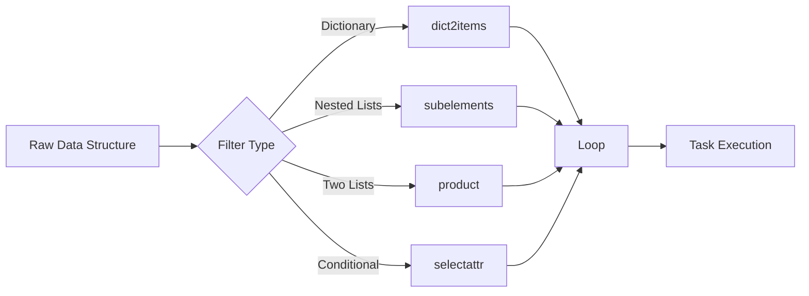

# How to Iterate Over Complex Data Structures in Ansible

Author: [nawazdhandala](https://www.github.com/nawazdhandala)

Tags: Ansible, Data Structures, Loops, Automation

Description: Learn how to iterate over nested dictionaries, lists of lists, and complex YAML structures in Ansible using loop, dict2items, subelements, and filters.

---

Ansible playbooks deal with simple lists most of the time, but real infrastructure data is rarely flat. You might have a dictionary of users with nested SSH keys, a list of applications each with their own list of ports, or a deeply nested YAML structure pulled from an API. Knowing how to iterate over these complex data structures is what separates basic Ansible usage from production-grade automation.

This post covers the most common patterns for iterating over nested and complex data in Ansible, including dictionaries, lists of dictionaries, nested lists, and combined structures.

## Iterating Over Dictionaries with dict2items

The `dict2items` filter converts a dictionary into a list of key-value pairs that you can loop over.

```yaml
# dict-loop.yml
# Creates system users from a dictionary of usernames and properties
- name: Create users from dictionary
  hosts: all
  become: true
  vars:
    users:
      alice:
        uid: 1001
        shell: /bin/bash
        groups: ["sudo", "docker"]
      bob:
        uid: 1002
        shell: /bin/zsh
        groups: ["docker"]
      charlie:
        uid: 1003
        shell: /bin/bash
        groups: ["developers"]
  tasks:
    - name: Create user accounts
      ansible.builtin.user:
        name: "{{ item.key }}"
        uid: "{{ item.value.uid }}"
        shell: "{{ item.value.shell }}"
        groups: "{{ item.value.groups }}"
        append: true
      loop: "{{ users | dict2items }}"
```

After `dict2items`, each item has a `.key` (the username) and a `.value` (the nested dictionary with uid, shell, and groups).

## Nested Lists with subelements

The `subelements` filter is designed for iterating over a list of items where each item contains its own sub-list. The classic example is users with multiple SSH keys.

```yaml
# subelements-loop.yml
# Deploys SSH keys for users, handling multiple keys per user
- name: Deploy SSH keys
  hosts: all
  become: true
  vars:
    users:
      - name: alice
        home: /home/alice
        ssh_keys:
          - "ssh-rsa AAAAB3... alice@laptop"
          - "ssh-rsa AAAAB3... alice@desktop"
      - name: bob
        home: /home/bob
        ssh_keys:
          - "ssh-rsa AAAAB3... bob@work"
  tasks:
    - name: Ensure .ssh directory exists
      ansible.builtin.file:
        path: "{{ item.home }}/.ssh"
        state: directory
        owner: "{{ item.name }}"
        mode: '0700'
      loop: "{{ users }}"

    - name: Deploy authorized keys
      ansible.posix.authorized_key:
        user: "{{ item.0.name }}"
        key: "{{ item.1 }}"
      loop: "{{ users | subelements('ssh_keys') }}"
```

The `subelements` filter produces pairs: `item.0` is the parent item (the user), and `item.1` is the current element from the sub-list (the SSH key). For alice, it generates two iterations; for bob, one.

## Nested Loops with product

When you need every combination of two lists (a Cartesian product), use the `product` filter.

```yaml
# product-loop.yml
# Creates directories for every combination of environment and service
- name: Create environment-service directories
  hosts: all
  become: true
  vars:
    environments:
      - staging
      - production
    services:
      - api
      - worker
      - scheduler
  tasks:
    - name: Create directory for each environment-service pair
      ansible.builtin.file:
        path: "/opt/deploy/{{ item.0 }}/{{ item.1 }}"
        state: directory
        mode: '0755'
      loop: "{{ environments | product(services) | list }}"
```

This creates six directories: staging/api, staging/worker, staging/scheduler, production/api, production/worker, production/scheduler.

## Iterating Over Deeply Nested Structures

Sometimes your data has multiple levels of nesting. You can chain filters or use Jinja2 expressions to flatten things out.

```yaml
# deep-nesting.yml
# Processes a complex application structure with nested components
- name: Process deeply nested application data
  hosts: all
  vars:
    applications:
      - name: web-platform
        environments:
          production:
            replicas: 3
            ports: [80, 443]
          staging:
            replicas: 1
            ports: [8080, 8443]
      - name: api-gateway
        environments:
          production:
            replicas: 5
            ports: [8080]
          staging:
            replicas: 2
            ports: [9080]
  tasks:
    - name: Display all application-environment-port combinations
      ansible.builtin.debug:
        msg: "App: {{ item.0.name }}, Env: {{ item.1.key }}, Ports: {{ item.1.value.ports }}"
      loop: "{{ applications | subelements('environments | dict2items') }}"
```

If the nesting gets too deep for inline filters, flatten the data first with `set_fact`.

```yaml
    - name: Flatten complex data into a simple list
      ansible.builtin.set_fact:
        flat_configs: >-
          {{
            flat_configs | default([]) +
            [{'app': app.name, 'env': env.key, 'replicas': env.value.replicas, 'ports': env.value.ports}]
          }}
      loop: "{{ applications | subelements('environments | dict2items') }}"
      loop_control:
        loop_var: _pair
      vars:
        app: "{{ _pair.0 }}"
        env: "{{ _pair.1 }}"

    - name: Use the flattened data
      ansible.builtin.debug:
        msg: "{{ item.app }} in {{ item.env }}: {{ item.replicas }} replicas on ports {{ item.ports }}"
      loop: "{{ flat_configs }}"
```

## Dictionary of Lists

When you have a dictionary where each value is a list, `dict2items` combined with `subelements` handles it.

```yaml
# dict-of-lists.yml
# Installs packages grouped by category
- name: Install categorized packages
  hosts: all
  become: true
  vars:
    package_groups:
      networking:
        - curl
        - wget
        - net-tools
      monitoring:
        - htop
        - iotop
        - sysstat
      security:
        - fail2ban
        - ufw
        - clamav
  tasks:
    - name: Install packages by category
      ansible.builtin.apt:
        name: "{{ item.1 }}"
        state: present
      loop: "{{ package_groups | dict2items | subelements('value') }}"
```

Here `item.0` is the dict2items entry (with `.key` being the category name), and `item.1` is each individual package from the list.

## Combining Multiple Data Sources

You can merge data from different sources before looping.

```yaml
# merge-data.yml
# Combines host-specific and group-wide firewall rules
- name: Apply merged firewall rules
  hosts: all
  become: true
  vars:
    global_rules:
      - { port: 22, proto: tcp, comment: "SSH" }
      - { port: 9100, proto: tcp, comment: "Node Exporter" }
  tasks:
    - name: Merge global and host-specific rules
      ansible.builtin.set_fact:
        all_rules: "{{ global_rules + (host_rules | default([])) }}"

    - name: Apply all firewall rules
      community.general.ufw:
        rule: allow
        port: "{{ item.port | string }}"
        proto: "{{ item.proto }}"
        comment: "{{ item.comment }}"
      loop: "{{ all_rules }}"
```

## Filtering Complex Structures

The `selectattr` and `rejectattr` filters let you loop over only the items that match a condition.

```yaml
# filter-loop.yml
# Deploys only enabled applications from a complex structure
- name: Deploy enabled applications
  hosts: appservers
  become: true
  vars:
    applications:
      - name: api
        enabled: true
        port: 8080
        workers: 4
      - name: admin
        enabled: false
        port: 9090
        workers: 2
      - name: worker
        enabled: true
        port: 0
        workers: 8
      - name: cron
        enabled: true
        port: 0
        workers: 1
  tasks:
    - name: Deploy only enabled applications
      ansible.builtin.template:
        src: "app-service.j2"
        dest: "/etc/systemd/system/{{ item.name }}.service"
      loop: "{{ applications | selectattr('enabled', 'equalto', true) | list }}"
```

## Data Flow Visualization

Here is how data flows through filters before reaching the loop.



## Practical Example: Multi-Tenant Setup

Here is a real-world example that combines several patterns to set up a multi-tenant application.

```yaml
# multi-tenant.yml
# Sets up directories, databases, and configs for multiple tenants
- name: Set up multi-tenant infrastructure
  hosts: appservers
  become: true
  vars:
    tenants:
      - name: acme
        domain: acme.example.com
        db_name: acme_production
        features: ["api", "webhooks", "export"]
      - name: globex
        domain: globex.example.com
        db_name: globex_production
        features: ["api", "export"]
  tasks:
    - name: Create tenant directories
      ansible.builtin.file:
        path: "/opt/tenants/{{ item.name }}/{{ dir }}"
        state: directory
        mode: '0755'
      loop: "{{ tenants }}"
      loop_control:
        label: "{{ item.name }}"
      vars:
        dir: "{{ item.name }}"

    - name: Generate tenant configs
      ansible.builtin.template:
        src: tenant.conf.j2
        dest: "/etc/myapp/tenants/{{ item.name }}.conf"
      loop: "{{ tenants }}"
      loop_control:
        label: "{{ item.name }}"

    - name: Display feature matrix
      ansible.builtin.debug:
        msg: "Tenant {{ item.0.name }} has feature: {{ item.1 }}"
      loop: "{{ tenants | subelements('features') }}"
```

The `loop_control.label` parameter controls what appears in the Ansible output, keeping it readable instead of dumping the entire dictionary.

## Summary

Iterating over complex data structures in Ansible comes down to knowing which filter to apply. Use `dict2items` for dictionaries, `subelements` for nested lists, `product` for Cartesian products, and `selectattr` for filtered iteration. When the data gets deeply nested, flatten it with `set_fact` first and then loop over the simplified structure. The goal is always to transform your complex data into something a `loop` can consume cleanly, one item at a time.
