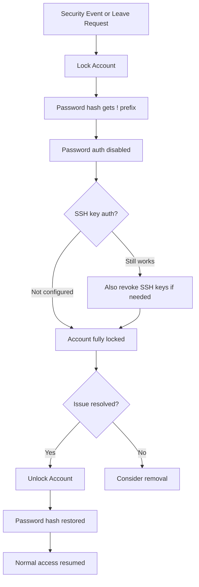

# How to Lock and Unlock User Accounts with Ansible

Author: [nawazdhandala](https://www.github.com/nawazdhandala)

Tags: Ansible, User Management, Security, Linux

Description: Learn how to lock and unlock user accounts with Ansible using the password_lock parameter, including automation strategies for account security.

---

Locking a user account is a fundamental security operation. Maybe someone is on leave, maybe there is a suspected compromise, or maybe you just need to disable access temporarily without deleting the account. Ansible provides a clean way to lock and unlock accounts using the `user` module's `password_lock` parameter. Let me walk through the various scenarios and approaches.

## How Account Locking Works on Linux

Before diving into Ansible, it helps to understand what "locking" a user actually does at the OS level. When you lock an account, Linux prepends an exclamation mark (`!`) to the password hash in `/etc/shadow`. This makes the hash invalid, so password-based authentication always fails.

Here is what a locked account looks like in `/etc/shadow`:

```
lockeduser:!$6$salthash...:19100:0:99999:7:::
```

The `!` prefix is the lock indicator. The actual hash is still there, so when you unlock the account, the password works again without needing to be reset.

## Locking an Account with Ansible

The `password_lock` parameter is the simplest way to lock an account:

```yaml
# lock-account.yml - Lock a user account
- name: Lock a user account
  hosts: all
  become: yes
  tasks:
    - name: Lock the compromised account
      ansible.builtin.user:
        name: jsmith
        password_lock: yes
```

That is it. One parameter. Ansible runs `usermod -L jsmith` behind the scenes, and the account is locked.

## Unlocking an Account

To unlock, set `password_lock` to `no`:

```yaml
# unlock-account.yml - Unlock a user account
- name: Unlock a user account
  hosts: all
  become: yes
  tasks:
    - name: Unlock the user account
      ansible.builtin.user:
        name: jsmith
        password_lock: no
```

This removes the `!` prefix from the password hash, restoring normal password authentication.

## Account Lock Lifecycle

Here is the typical lifecycle of an account lock/unlock operation:



## Important: Locking Does Not Block SSH Keys

This is a critical point that catches many people off guard. Locking an account with `password_lock` only disables password-based authentication. If the user has SSH key-based access configured, they can still log in.

To fully lock someone out, you need to handle SSH keys too:

```yaml
# full-lockout.yml - Complete account lockout
- name: Fully lock out a user account
  hosts: all
  become: yes
  vars:
    locked_user: jsmith
  tasks:
    # Lock the password
    - name: Lock the user account password
      ansible.builtin.user:
        name: "{{ locked_user }}"
        password_lock: yes

    # Disable SSH key access by renaming the authorized_keys file
    - name: Backup and remove SSH authorized keys
      ansible.builtin.command: >
        mv /home/{{ locked_user }}/.ssh/authorized_keys
        /home/{{ locked_user }}/.ssh/authorized_keys.locked
      args:
        removes: "/home/{{ locked_user }}/.ssh/authorized_keys"

    # Set shell to nologin as an extra layer
    - name: Set shell to nologin
      ansible.builtin.user:
        name: "{{ locked_user }}"
        shell: /usr/sbin/nologin

    # Kill any existing sessions
    - name: Kill all user sessions
      ansible.builtin.shell: "pkill -u {{ locked_user }} || true"
```

And to restore access:

```yaml
# full-unlock.yml - Complete account unlock
- name: Fully unlock a user account
  hosts: all
  become: yes
  vars:
    locked_user: jsmith
  tasks:
    # Unlock the password
    - name: Unlock the user account password
      ansible.builtin.user:
        name: "{{ locked_user }}"
        password_lock: no

    # Restore SSH authorized keys
    - name: Restore SSH authorized keys
      ansible.builtin.command: >
        mv /home/{{ locked_user }}/.ssh/authorized_keys.locked
        /home/{{ locked_user }}/.ssh/authorized_keys
      args:
        removes: "/home/{{ locked_user }}/.ssh/authorized_keys.locked"

    # Restore the login shell
    - name: Restore shell to bash
      ansible.builtin.user:
        name: "{{ locked_user }}"
        shell: /bin/bash
```

## Locking Multiple Accounts

When you need to lock multiple accounts at once (incident response scenario), use a loop:

```yaml
# lock-multiple.yml - Lock multiple accounts during incident
- name: Lock multiple accounts during security incident
  hosts: all
  become: yes
  vars:
    compromised_accounts:
      - user1
      - user2
      - user3
  tasks:
    - name: Lock all compromised accounts
      ansible.builtin.user:
        name: "{{ item }}"
        password_lock: yes
      loop: "{{ compromised_accounts }}"

    - name: Kill all sessions for compromised users
      ansible.builtin.shell: "pkill -u {{ item }} || true"
      loop: "{{ compromised_accounts }}"

    - name: Remove SSH keys for compromised users
      ansible.builtin.file:
        path: "/home/{{ item }}/.ssh/authorized_keys"
        state: absent
      loop: "{{ compromised_accounts }}"
```

## Automated Account Locking on Failed Logins

You can set up Ansible to automatically lock accounts after a certain number of failed login attempts by configuring PAM:

```yaml
# auto-lock-pam.yml - Configure automatic account locking
- name: Configure automatic account locking via PAM
  hosts: all
  become: yes
  tasks:
    # Install pam_faillock (available on RHEL/CentOS 8+)
    - name: Configure faillock for authentication
      ansible.builtin.copy:
        dest: /etc/security/faillock.conf
        content: |
          # Lock account after 5 failed attempts
          deny = 5
          # Unlock after 900 seconds (15 minutes)
          unlock_time = 900
          # Count failures within this window
          fail_interval = 900
          # Also apply to root
          even_deny_root
          root_unlock_time = 60
        mode: '0644'
        backup: yes
```

## Checking Account Lock Status

Before locking or unlocking, you might want to check the current status:

```yaml
# check-lock-status.yml - Check if accounts are locked
- name: Check account lock status
  hosts: all
  become: yes
  vars:
    users_to_check:
      - alice
      - bob
      - carol
  tasks:
    - name: Check password status for each user
      ansible.builtin.command: "passwd -S {{ item }}"
      register: passwd_status
      loop: "{{ users_to_check }}"
      changed_when: false

    - name: Report lock status
      ansible.builtin.debug:
        msg: "{{ item.item }}: {{ 'LOCKED' if ' L ' in item.stdout or ' LK ' in item.stdout else 'UNLOCKED' }}"
      loop: "{{ passwd_status.results }}"
```

The `passwd -S` command outputs the account status. The second field will be `L` (locked) or `P` (password set) or `NP` (no password).

## Lock/Unlock with Audit Trail

In a production environment, you should log who locked or unlocked an account and when:

```yaml
# audited-lock.yml - Lock account with audit trail
- name: Lock account with audit logging
  hosts: all
  become: yes
  vars:
    target_user: jsmith
    reason: "Security incident SR-2024-0042"
    operator: "admin@company.com"
  tasks:
    - name: Lock the account
      ansible.builtin.user:
        name: "{{ target_user }}"
        password_lock: yes
      register: lock_result

    - name: Write audit log entry
      ansible.builtin.lineinfile:
        path: /var/log/account-actions.log
        line: "{{ ansible_date_time.iso8601 }} | LOCK | {{ target_user }} | {{ reason }} | {{ operator }} | {{ inventory_hostname }}"
        create: yes
        mode: '0640'
        owner: root
        group: adm
      when: lock_result.changed
```

## Scheduled Account Locking

For temporary contractors or interns, you might want to lock accounts on a specific date:

```yaml
# scheduled-lock.yml - Lock accounts based on contract end date
- name: Lock expired contractor accounts
  hosts: all
  become: yes
  vars:
    contractors:
      - name: contractor1
        end_date: "2024-12-31"
      - name: contractor2
        end_date: "2025-03-15"
  tasks:
    - name: Lock accounts past their end date
      ansible.builtin.user:
        name: "{{ item.name }}"
        password_lock: yes
      loop: "{{ contractors }}"
      when: item.end_date < ansible_date_time.date
```

## Best Practices

1. **Lock before deleting**. When offboarding, lock the account first, wait a few days for any issues to surface, then delete.

2. **Always handle SSH keys**. Password locking alone is not enough if the user has SSH keys configured.

3. **Kill active sessions**. A locked account can still have active sessions. Use `pkill` to terminate them.

4. **Log everything**. Keep an audit trail of lock/unlock operations. You will need it for compliance and incident investigations.

5. **Test unlocking**. After locking an account, make sure you can unlock it. It sounds obvious, but a misconfigured PAM module can make unlocking harder than expected.

6. **Use `password_lock` instead of setting an invalid password**. Setting the password to `*` or `!` directly is less clean than using the `password_lock` parameter.

Account locking is a basic but essential security control. With Ansible, you can implement it consistently across your entire infrastructure in seconds instead of manually SSHing into each server.
