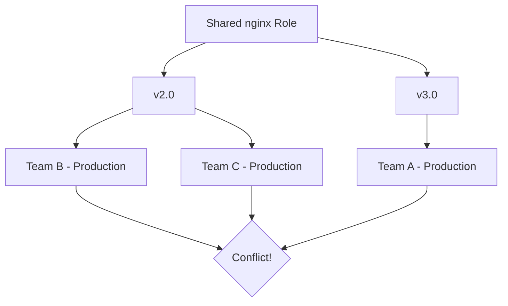
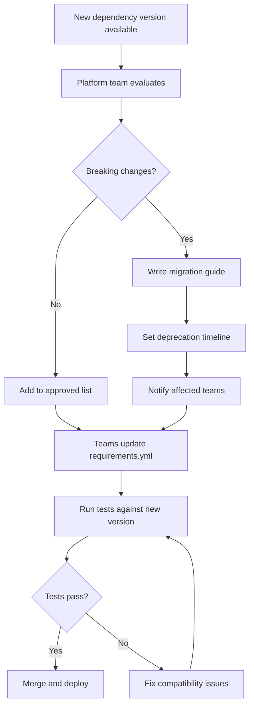

# How to Manage Ansible Dependencies Across Teams

Author: [nawazdhandala](https://www.github.com/nawazdhandala)

Tags: Ansible, Dependency Management, Collections, Team Collaboration

Description: Learn strategies for managing Ansible collection and role dependencies across multiple teams including version pinning and conflict resolution.

---

When multiple teams share Ansible roles and collections, dependency management becomes a real challenge. Team A depends on version 2.0 of a shared role, team B needs version 3.0, and both need to work together in the same environment. Without a clear strategy, you end up with version conflicts, broken deployments, and frustrated engineers.

## The Dependency Problem

Consider this scenario: Three teams all use a shared `nginx` role. The platform team releases version 3.0 with a breaking change to variable names. Team A upgrades immediately, team B stays on 2.0, and team C does not know about the update. Now production has two different nginx configurations managed by different versions of the same role.



## Pin Everything

The first rule: always pin exact versions in production:

```yaml
# requirements.yml - GOOD: Exact versions
collections:
  - name: community.general
    version: 8.2.0
  - name: community.mysql
    version: 3.8.0
  - name: company.infrastructure
    version: 3.2.0

roles:
  - name: geerlingguy.docker
    version: 6.1.0
  - name: geerlingguy.nginx
    version: 3.1.4
```

```yaml
# requirements.yml - BAD: Unpinned or too loose
collections:
  - name: community.general  # No version = latest, unpredictable
  - name: community.mysql
    version: ">=3.0.0"       # Too broad, may get breaking changes
```

## Centralized Dependency Manifest

Create a single source of truth for approved dependency versions:

```yaml
# company-wide/approved-dependencies.yml
# Maintained by the platform team
# All teams must use versions from this list

ansible_core_version: "2.16.2"

approved_collections:
  community.general:
    version: 8.2.0
    approved_date: "2024-11-15"
    notes: "Tested and validated for production"
  community.mysql:
    version: 3.8.0
    approved_date: "2024-10-20"
  community.postgresql:
    version: 3.3.0
    approved_date: "2024-10-20"
  community.docker:
    version: 3.6.0
    approved_date: "2024-12-01"
  company.infrastructure:
    version: 3.2.0
    approved_date: "2025-01-10"
    notes: "Internal collection, changelog at wiki/collections/infrastructure"

approved_roles:
  geerlingguy.docker:
    version: 6.1.0
  geerlingguy.certbot:
    version: 5.0.0
```

## Dependency Update Workflow

When a new version of a dependency becomes available:

```yaml
# .github/workflows/dependency-update.yml
name: Check for Dependency Updates

on:
  schedule:
    - cron: '0 8 * * 1'  # Every Monday at 8 AM

jobs:
  check-updates:
    runs-on: ubuntu-latest
    steps:
      - uses: actions/checkout@v4

      - name: Install ansible-core
        run: pip install ansible-core

      - name: Check for collection updates
        run: |
          echo "## Available Updates" > updates.md
          echo "" >> updates.md

          while IFS= read -r line; do
            name=$(echo "$line" | yq '.name')
            current=$(echo "$line" | yq '.version')
            latest=$(ansible-galaxy collection list "$name" 2>/dev/null | tail -1 | awk '{print $2}')
            if [ "$current" != "$latest" ] && [ -n "$latest" ]; then
              echo "- **$name**: $current -> $latest" >> updates.md
            fi
          done < <(yq '.collections[]' requirements.yml -o json -I 0)

      - name: Create update PR if needed
        run: |
          if [ -s updates.md ]; then
            gh issue create \
              --title "Dependency updates available - $(date +%Y-%m-%d)" \
              --body "$(cat updates.md)" \
              --label "dependencies"
          fi
        env:
          GH_TOKEN: ${{ secrets.GITHUB_TOKEN }}
```

## Lock Files for Reproducibility

Generate a lock file that records the exact resolved versions:

```python
#!/usr/bin/env python3
# scripts/generate-lockfile.py
# Generate a lock file from installed collections

import subprocess
import json
import yaml

def get_installed_collections():
    """Get all installed collections and their versions."""
    result = subprocess.run(
        ['ansible-galaxy', 'collection', 'list', '--format', 'json'],
        capture_output=True, text=True
    )
    return json.loads(result.stdout)

def generate_lockfile():
    """Create a lockfile with all resolved dependencies."""
    collections = get_installed_collections()
    lockfile = {
        'generated': subprocess.run(
            ['date', '-u', '+%Y-%m-%dT%H:%M:%SZ'],
            capture_output=True, text=True
        ).stdout.strip(),
        'collections': {}
    }

    for path, colls in collections.items():
        for name, version in colls.items():
            lockfile['collections'][name] = {
                'version': version,
                'install_path': path
            }

    with open('requirements.lock', 'w') as f:
        yaml.dump(lockfile, f, default_flow_style=False)

    print(f"Lock file generated with {len(lockfile['collections'])} collections")

if __name__ == '__main__':
    generate_lockfile()
```

```yaml
# requirements.lock (generated, committed to repo)
generated: '2025-01-15T10:30:00Z'
collections:
  amazon.aws:
    install_path: /home/user/.ansible/collections
    version: 7.2.0
  ansible.posix:
    install_path: /home/user/.ansible/collections
    version: 1.5.4
  community.general:
    install_path: /home/user/.ansible/collections
    version: 8.2.0
```

## Conflict Resolution

When teams need different versions, use execution environments to isolate:

```yaml
# Team A's execution environment
# ee-team-a/execution-environment.yml
version: 3
dependencies:
  galaxy: |
    collections:
      - name: company.infrastructure
        version: 3.2.0
      - name: community.general
        version: 8.2.0
```

```yaml
# Team B's execution environment
# ee-team-b/execution-environment.yml
version: 3
dependencies:
  galaxy: |
    collections:
      - name: company.infrastructure
        version: 2.5.0  # Older version still needed
      - name: community.general
        version: 8.2.0
```

## Deprecation Policy

Establish a deprecation timeline for shared dependencies:

```yaml
# company-wide/deprecation-schedule.yml
deprecations:
  - collection: company.infrastructure
    version: 2.x
    deprecated_date: "2025-01-01"
    removal_date: "2025-04-01"
    migration_guide: "https://wiki.company.com/infra-collection-v3-migration"
    affected_teams:
      - team-b
      - team-c

  - role: geerlingguy.nginx
    version: 2.x
    deprecated_date: "2025-02-01"
    removal_date: "2025-05-01"
    replacement: "company.infrastructure.nginx"
    migration_guide: "https://wiki.company.com/nginx-role-migration"
```

## Dependency Management Flow



## Automated Compatibility Testing

Test your playbooks against new dependency versions before upgrading:

```yaml
# .github/workflows/compat-test.yml
name: Dependency Compatibility Test

on:
  workflow_dispatch:
    inputs:
      collection:
        description: 'Collection to test'
        required: true
      version:
        description: 'Version to test'
        required: true

jobs:
  test:
    runs-on: ubuntu-latest
    steps:
      - uses: actions/checkout@v4

      - name: Install dependencies with test version
        run: |
          pip install ansible-core
          # Install the test version
          ansible-galaxy collection install \
            "${{ inputs.collection }}:==${{ inputs.version }}" --force
          # Install remaining dependencies
          ansible-galaxy collection install -r requirements.yml

      - name: Run all Molecule tests
        run: |
          pip install molecule molecule-docker
          for role in roles/*/; do
            if [ -d "$role/molecule" ]; then
              cd "$role" && molecule test && cd ../..
            fi
          done

      - name: Run playbook syntax check
        run: |
          for pb in playbooks/*.yml; do
            ansible-playbook "$pb" --syntax-check -i localhost,
          done
```

## Summary

Managing Ansible dependencies across teams requires pinned versions, a centralized list of approved dependencies, and a clear update workflow. Use lock files for reproducibility. Resolve version conflicts with execution environments that isolate each team's dependencies. Establish deprecation policies with migration guides and timelines. Automate compatibility testing before upgrading. These practices prevent the "it works on my machine" problems that plague multi-team Ansible environments.
