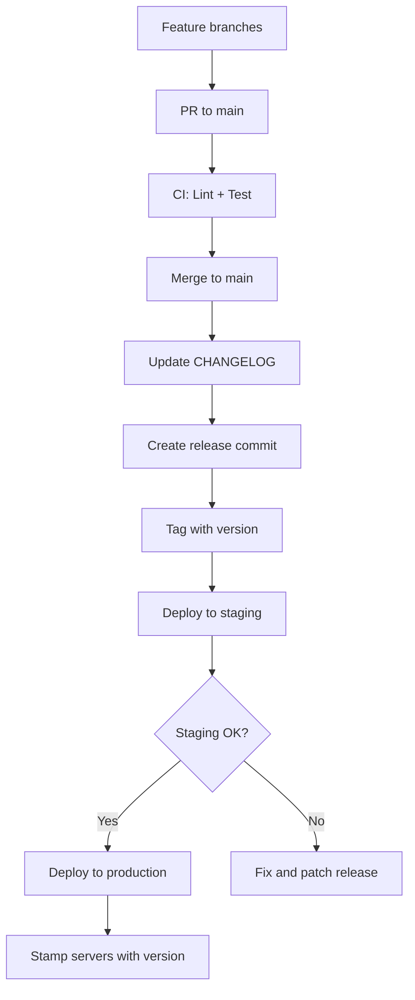

# How to Manage Ansible Playbook Versioning

Author: [nawazdhandala](https://www.github.com/nawazdhandala)

Tags: Ansible, Versioning, Release Management, DevOps

Description: Learn strategies for versioning Ansible playbooks and roles using Git tags, semantic versioning, and changelog management for reliable deployments.

---

Versioning your Ansible playbooks gives you the ability to deploy a known-good state, rollback when things break, and track what changed between releases. Without versioning, every deployment uses "whatever is on the main branch right now," which is a recipe for surprises. Here is how to version Ansible projects properly.

## Semantic Versioning for Ansible

Apply semantic versioning (SemVer) to your Ansible project:

- **Major** (X.0.0): Breaking changes to variable names, removed roles, changed default behavior
- **Minor** (0.X.0): New roles, new features in existing roles, new playbooks
- **Patch** (0.0.X): Bug fixes, security patches, documentation updates

```bash
# Tag a release
git tag -a v2.3.0 -m "Release 2.3.0: Add Redis cluster role and update nginx SSL defaults"

# Push tags
git push origin v2.3.0
```

## Changelog Management

Maintain a changelog that tracks every version:

```yaml
# CHANGELOG.yml
releases:
  - version: 2.3.0
    date: 2025-01-15
    changes:
      added:
        - "New redis_cluster role for Redis cluster deployments"
        - "SSL session ticket rotation in nginx role"
      changed:
        - "nginx_ssl_protocols now defaults to TLSv1.3 only"
        - "postgresql role now requires postgresql_version to be explicitly set"
      fixed:
        - "Fixed backup role failing on servers with spaces in hostnames"
        - "Fixed monitoring_agent not restarting after config change"
      deprecated:
        - "nginx_ssl_ciphers variable replaced by nginx_ssl_profile"

  - version: 2.2.1
    date: 2025-01-08
    changes:
      fixed:
        - "Security fix: Updated OpenSSL configuration for CVE-2024-XXXX"
        - "Fixed idempotency issue in common role NTP configuration"

  - version: 2.2.0
    date: 2024-12-20
    changes:
      added:
        - "New backup_verification role for automated backup testing"
        - "Support for Ubuntu 24.04 in all roles"
      changed:
        - "Increased default postgresql_max_connections from 100 to 200"
```

## Git-Based Release Workflow

```bash
# Development workflow
git checkout -b feature/redis-cluster-role
# ... make changes, test with Molecule ...
git add roles/redis_cluster/
git commit -m "Add redis_cluster role with replication support"
git push origin feature/redis-cluster-role
# Create PR, get review, merge

# Release workflow
git checkout main
git pull origin main

# Update changelog
vim CHANGELOG.yml

# Create release commit
git add CHANGELOG.yml
git commit -m "Release 2.3.0"

# Tag the release
git tag -a v2.3.0 -m "Release 2.3.0"
git push origin main --tags
```

## Deploying Specific Versions

Always deploy from a tagged version, never from a branch tip:

```bash
# Deploy a specific version to production
git checkout v2.3.0
ansible-playbook playbooks/site.yml -i inventories/production/hosts.yml

# Check which version is currently deployed
cat VERSION  # or check git tag
```

Create a VERSION file in your repository:

```bash
# VERSION file updated during release
echo "2.3.0" > VERSION
```

Reference it in your playbooks:

```yaml
# playbooks/site.yml
- name: Display deployment version
  hosts: all
  gather_facts: false
  tasks:
    - name: Show version being deployed
      ansible.builtin.debug:
        msg: "Deploying Ansible version {{ lookup('file', '../VERSION') }}"
      run_once: true
      tags: [always]
```

## Version Tracking on Servers

Stamp each server with the version of Ansible that last configured it:

```yaml
# roles/common/tasks/version-stamp.yml
# Record which Ansible version configured this server

- name: Write Ansible version stamp
  ansible.builtin.copy:
    content: |
      ansible_project_version: {{ lookup('file', playbook_dir + '/../VERSION') | trim }}
      last_run: {{ ansible_date_time.iso8601 }}
      playbook: {{ ansible_play_name }}
      git_commit: {{ lookup('pipe', 'git rev-parse HEAD') }}
    dest: /etc/ansible-version
    mode: '0644'
  tags: [always]
```

This lets you query what version any server is running:

```bash
# Check version on remote servers
ansible webservers -i inventories/production/hosts.yml -a "cat /etc/ansible-version"
```

## Release Pipeline



## Automated Release Process

```yaml
# .github/workflows/release.yml
name: Create Release

on:
  push:
    tags: ['v*']

jobs:
  release:
    runs-on: ubuntu-latest
    steps:
      - uses: actions/checkout@v4
        with:
          fetch-depth: 0

      - name: Get version from tag
        id: version
        run: echo "VERSION=${GITHUB_REF#refs/tags/v}" >> $GITHUB_OUTPUT

      - name: Extract changelog for this version
        run: |
          python3 -c "
          import yaml
          with open('CHANGELOG.yml') as f:
              data = yaml.safe_load(f)
          for release in data['releases']:
              if release['version'] == '${{ steps.version.outputs.VERSION }}':
                  for category, items in release['changes'].items():
                      print(f'### {category.title()}')
                      for item in items:
                          print(f'- {item}')
                      print()
                  break
          " > release-notes.md

      - name: Create GitHub Release
        uses: softprops/action-gh-release@v1
        with:
          body_path: release-notes.md
          tag_name: ${{ github.ref }}
```

## Rollback Strategy

When a deployment goes wrong, rollback to the previous version:

```bash
# Find the previous version
git tag --sort=-version:refname | head -5
# v2.3.0
# v2.2.1
# v2.2.0
# v2.1.0
# v2.0.0

# Rollback to previous version
git checkout v2.2.1
ansible-playbook playbooks/site.yml -i inventories/production/hosts.yml
```

Automate rollback in CI:

```yaml
# playbooks/rollback.yml
- name: Rollback to specified version
  hosts: all
  become: yes
  vars:
    rollback_version: "{{ version | mandatory }}"
  tasks:
    - name: Display rollback target
      ansible.builtin.debug:
        msg: "Rolling back to version {{ rollback_version }}"
      run_once: true

    - name: Verify the target version tag exists
      ansible.builtin.command: git tag -l "v{{ rollback_version }}"
      register: tag_check
      delegate_to: localhost
      run_once: true
      changed_when: false

    - name: Fail if version does not exist
      ansible.builtin.fail:
        msg: "Version v{{ rollback_version }} does not exist"
      when: tag_check.stdout | length == 0
      run_once: true
```

## Summary

Versioning Ansible projects requires semantic version tags, a maintained changelog, and a release workflow that deploys from tags rather than branch tips. Stamp servers with the deployed version so you can always determine their state. Automate the release process with CI. Keep a clear rollback strategy using previous version tags. This discipline transforms Ansible from "run whatever is in git" to a predictable, auditable deployment system.
