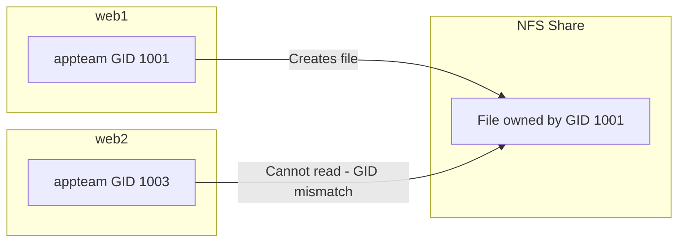

# How to Manage Group GID with the Ansible group Module

Author: [nawazdhandala](https://www.github.com/nawazdhandala)

Tags: Ansible, Group Management, Linux, File Permissions

Description: Learn how to manage Group IDs (GIDs) with the Ansible group module, including GID allocation strategies and cross-server consistency.

---

The Group ID (GID) is a numeric identifier that Linux uses internally to track group membership and file ownership. While most day-to-day operations use group names, the GID is what actually matters at the filesystem level. If a file is owned by GID 2000 on one server but GID 2000 maps to "developers" on one machine and "operations" on another, you have a permission nightmare. Managing GIDs consistently is one of those boring-but-critical tasks that Ansible handles well.

## Why GIDs Matter

Consider this scenario. You have two servers: web1 and web2. On both servers, you create a group called "appteam" without specifying a GID. On web1, it gets GID 1001. On web2 (which has a few more groups), it gets GID 1003.

Now you mount an NFS share between them. Files created by "appteam" on web1 (GID 1001) are not readable by "appteam" on web2 (GID 1003) because the system sees different GIDs.



This is why explicit GID management matters.

## Setting a GID During Group Creation

Use the `gid` parameter to specify the numeric ID:

```yaml
# set-gid.yml - Create group with specific GID
- name: Create group with specific GID
  hosts: all
  become: yes
  tasks:
    - name: Create appteam with GID 2000
      ansible.builtin.group:
        name: appteam
        gid: 2000
        state: present
```

When this runs across your entire fleet, every server ends up with GID 2000 for "appteam". NFS shares, CIFS mounts, and container bind mounts all work correctly because the GID is consistent.

## GID Allocation Strategy

Before you start creating groups, establish a GID allocation plan. Here is a commonly used scheme:

| GID Range | Purpose |
|-----------|---------|
| 0-99 | System groups (root, daemon, etc.) |
| 100-999 | System service groups |
| 1000-1999 | Default user private groups |
| 2000-2999 | Team/project groups |
| 3000-3999 | Application groups |
| 4000-4999 | Infrastructure groups |
| 5000+ | Reserved for future use |

Implement this in your Ansible variables:

```yaml
# vars/gid-registry.yml - Central GID registry
gid_registry:
  # Team groups (2000-2999)
  developers: 2000
  operations: 2001
  security: 2002
  data_engineering: 2003
  platform: 2004

  # Application groups (3000-3999)
  webapp: 3000
  api_service: 3001
  worker: 3002
  scheduler: 3003

  # Infrastructure groups (4000-4999)
  docker: 4000
  monitoring: 4001
  backup: 4002
  ssl_cert: 4003
```

Use the registry in your playbooks:

```yaml
# create-from-registry.yml - Create groups from GID registry
- name: Create groups from central registry
  hosts: all
  become: yes
  vars_files:
    - vars/gid-registry.yml
  tasks:
    - name: Create all registered groups
      ansible.builtin.group:
        name: "{{ item.key }}"
        gid: "{{ item.value }}"
        state: present
      loop: "{{ gid_registry | dict2items }}"
```

## Checking Current GID Assignments

Before making changes, you might want to see what GIDs are currently in use:

```yaml
# check-gids.yml - Audit current GID assignments
- name: Audit GID assignments across fleet
  hosts: all
  become: yes
  tasks:
    - name: Get all groups and their GIDs
      ansible.builtin.shell: "getent group | sort -t: -k3 -n"
      register: current_groups
      changed_when: false

    - name: Display groups
      ansible.builtin.debug:
        msg: "{{ current_groups.stdout_lines }}"

    # Check for GID conflicts
    - name: Check if desired GID 2000 is available
      ansible.builtin.shell: "getent group 2000 || echo 'AVAILABLE'"
      register: gid_check
      changed_when: false

    - name: Report GID 2000 status
      ansible.builtin.debug:
        msg: "{{ 'GID 2000 is used by: ' + gid_check.stdout if 'AVAILABLE' not in gid_check.stdout else 'GID 2000 is available' }}"
```

## Handling GID Conflicts

If the GID you want is already taken, you need to resolve the conflict. Here is how to detect and handle it:

```yaml
# resolve-gid-conflict.yml - Handle GID conflicts
- name: Resolve GID conflicts
  hosts: all
  become: yes
  vars:
    desired_group: developers
    desired_gid: 2000
  tasks:
    # Check what currently uses GID 2000
    - name: Check existing GID usage
      ansible.builtin.shell: "getent group {{ desired_gid }} | cut -d: -f1"
      register: existing_group
      changed_when: false
      failed_when: false

    # If a different group has our GID, we have a conflict
    - name: Handle GID conflict
      block:
        - name: Report conflict
          ansible.builtin.debug:
            msg: >
              GID {{ desired_gid }} is currently used by '{{ existing_group.stdout }}'
              on {{ inventory_hostname }}. Reassigning...

        # Move the conflicting group to a temporary GID
        - name: Reassign conflicting group to temp GID
          ansible.builtin.command: "groupmod -g 59999 {{ existing_group.stdout }}"

        # Fix file ownership for the moved group
        - name: Fix file ownership for moved group
          ansible.builtin.shell: >
            find / -gid {{ desired_gid }}
            -not -path '/proc/*' -not -path '/sys/*'
            -exec chgrp {{ existing_group.stdout }} {} + 2>/dev/null || true
      when:
        - existing_group.stdout | length > 0
        - existing_group.stdout != desired_group

    # Now create our group with the desired GID
    - name: Create group with desired GID
      ansible.builtin.group:
        name: "{{ desired_group }}"
        gid: "{{ desired_gid }}"
        state: present
```

## Changing a Group's GID

Sometimes you need to change the GID of an existing group. The `group` module does not directly support changing GIDs, so you need to use `groupmod`:

```yaml
# change-gid.yml - Change an existing group's GID
- name: Change a group GID
  hosts: all
  become: yes
  vars:
    group_name: developers
    old_gid: 1001
    new_gid: 2000
  tasks:
    # Get current GID
    - name: Get current group GID
      ansible.builtin.shell: "getent group {{ group_name }} | cut -d: -f3"
      register: current_gid
      changed_when: false

    - name: Change GID if different
      block:
        # Change the group GID
        - name: Modify group GID
          ansible.builtin.command: "groupmod -g {{ new_gid }} {{ group_name }}"

        # Update file ownership to reflect new GID
        - name: Update file ownership from old GID to new GID
          ansible.builtin.shell: >
            find / -gid {{ old_gid }}
            -not -path '/proc/*' -not -path '/sys/*'
            -exec chgrp {{ group_name }} {} + 2>/dev/null || true

      when: current_gid.stdout | int != new_gid
```

## GID Consistency Verification

Run this playbook periodically to verify GID consistency across your fleet:

```yaml
# verify-gid-consistency.yml - Verify GIDs match across all servers
- name: Verify GID consistency
  hosts: all
  become: yes
  vars:
    expected_gids:
      developers: 2000
      operations: 2001
      security: 2002
  tasks:
    - name: Check GIDs on each host
      ansible.builtin.shell: "getent group {{ item.key }} | cut -d: -f3"
      register: gid_checks
      loop: "{{ expected_gids | dict2items }}"
      changed_when: false
      failed_when: false

    - name: Verify GIDs match expected values
      ansible.builtin.assert:
        that:
          - item.stdout == (expected_gids[item.item.key] | string)
        fail_msg: >
          GID mismatch on {{ inventory_hostname }}: {{ item.item.key }}
          expected {{ expected_gids[item.item.key] }}, got {{ item.stdout }}
        success_msg: "{{ item.item.key }} GID {{ item.stdout }} OK on {{ inventory_hostname }}"
      loop: "{{ gid_checks.results }}"
      when: item.stdout | length > 0
```

## System GID Management

System groups (for services and daemons) use GIDs in the lower range:

```yaml
# system-gids.yml - Manage system group GIDs
- name: Create system groups with specific GIDs
  hosts: all
  become: yes
  vars:
    system_groups:
      - name: nginx
        gid: 101
      - name: redis
        gid: 110
      - name: postgres
        gid: 26
      - name: prometheus
        gid: 120
  tasks:
    - name: Create system groups
      ansible.builtin.group:
        name: "{{ item.name }}"
        gid: "{{ item.gid }}"
        system: yes
        state: present
      loop: "{{ system_groups }}"
```

## GID Management in Containers

When working with containers and bind mounts, GID alignment between host and container is critical:

```yaml
# container-gid-alignment.yml - Align GIDs for container use
- name: Align GIDs for Docker containers
  hosts: docker_hosts
  become: yes
  vars:
    # These GIDs must match what the container images use
    container_gids:
      - name: app
        gid: 1000  # Matches container's app group
      - name: www-data
        gid: 33    # Matches Debian container's www-data
  tasks:
    - name: Create container-aligned groups
      ansible.builtin.group:
        name: "{{ item.name }}"
        gid: "{{ item.gid }}"
        state: present
      loop: "{{ container_gids }}"

    - name: Add deploy user to container groups
      ansible.builtin.user:
        name: deploy
        groups: "{{ container_gids | map(attribute='name') | list }}"
        append: yes
```

## Best Practices

1. **Maintain a central GID registry**. Keep a single source of truth for all GID assignments. This prevents conflicts and makes auditing easy.

2. **Specify GIDs for every group in production**. Never rely on auto-assignment. It is the number one cause of permission issues in multi-server environments.

3. **Use consistent ranges**. Establish a GID allocation scheme and stick to it. It makes the group namespace predictable.

4. **Fix file ownership when changing GIDs**. If you change a group's GID, all files owned by the old GID need to be updated.

5. **Run periodic consistency checks**. Verify that GIDs match across your fleet at least monthly.

6. **Align container GIDs with host GIDs**. When using bind mounts, the numeric GID is what matters, not the group name.

GID management is not glamorous, but getting it right prevents a whole class of permission-related problems. Use Ansible to enforce consistency, and you will never have to debug "why can this user not read this file" across 50 servers again.
