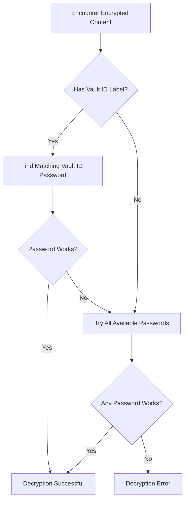

# How to Manage Multiple Vault IDs in Ansible

Author: [nawazdhandala](https://www.github.com/nawazdhandala)

Tags: Ansible, Vault, Security, Multi-Environment, DevOps

Description: Learn how to organize and manage multiple Ansible Vault IDs for environments, teams, and access levels across your infrastructure.

---

Vault IDs are labels that Ansible attaches to encrypted content. When you have multiple vault passwords for different environments, teams, or security levels, vault IDs let Ansible know which password goes with which encrypted content. Managing vault IDs well is the difference between a clean, scalable secrets management setup and a confusing mess where nobody knows which password decrypts what.

## Understanding Vault IDs

A vault ID has two parts: a label and a password source. The label is a human-readable identifier. The password source is where Ansible gets the actual password (a file, a script, or an interactive prompt).

```
--vault-id label@source
```

For example:
- `dev@~/.vault_pass_dev` uses the label `dev` and reads the password from a file
- `prod@prompt` uses the label `prod` and prompts interactively
- `staging@./get_vault_pass.sh` uses the label `staging` and runs a script

## Creating Content with Vault IDs

When you encrypt a file or string with a vault ID, the label gets embedded in the encrypted content header:

```bash
# Encrypt files with specific vault IDs
ansible-vault encrypt --vault-id dev@dev_pass.txt group_vars/dev/vault.yml
ansible-vault encrypt --vault-id staging@staging_pass.txt group_vars/staging/vault.yml
ansible-vault encrypt --vault-id prod@prod_pass.txt group_vars/prod/vault.yml
```

Check the header of an encrypted file to see its vault ID:

```bash
# View the vault header to see which vault ID was used
head -1 group_vars/prod/vault.yml
# Output: $ANSIBLE_VAULT;1.2;AES256;prod
```

The `;prod` at the end is the vault ID label. Files encrypted without a vault ID show version `1.1` and have no label:

```
$ANSIBLE_VAULT;1.1;AES256
```

## Organizing Vault IDs by Environment

The most common pattern is one vault ID per environment:

```bash
# Create password files for each environment
openssl rand -base64 32 > ~/.vault_pass_dev
openssl rand -base64 32 > ~/.vault_pass_staging
openssl rand -base64 32 > ~/.vault_pass_prod
chmod 600 ~/.vault_pass_dev ~/.vault_pass_staging ~/.vault_pass_prod
```

Configure them in `ansible.cfg`:

```ini
# ansible.cfg
[defaults]
# List all vault identities Ansible should know about
vault_identity_list = dev@~/.vault_pass_dev, staging@~/.vault_pass_staging, prod@~/.vault_pass_prod
```

Directory structure:

```
project/
  ansible.cfg
  group_vars/
    dev/
      vars.yml                # plaintext dev config
      vault.yml               # encrypted with vault ID 'dev'
    staging/
      vars.yml                # plaintext staging config
      vault.yml               # encrypted with vault ID 'staging'
    prod/
      vars.yml                # plaintext prod config
      vault.yml               # encrypted with vault ID 'prod'
```

## Organizing Vault IDs by Team

For larger organizations, segment by responsibility:

```ini
# ansible.cfg
[defaults]
vault_identity_list = infra@~/.vault_pass_infra, dba@~/.vault_pass_dba, security@~/.vault_pass_security, app@~/.vault_pass_app
```

```
roles/
  nginx/
    vars/
      vault.yml              # encrypted with 'infra' vault ID
  postgresql/
    vars/
      vault.yml              # encrypted with 'dba' vault ID
  tls/
    vars/
      vault.yml              # encrypted with 'security' vault ID
  webapp/
    vars/
      vault.yml              # encrypted with 'app' vault ID
```

## Combining Environment and Team Vault IDs

In complex organizations, you might combine both dimensions:

```ini
# ansible.cfg
[defaults]
vault_identity_list = dev@~/.vault_pass_dev, prod-infra@~/.vault_pass_prod_infra, prod-dba@~/.vault_pass_prod_dba, prod-app@~/.vault_pass_prod_app
```

This gives you granular control: the DBA team gets `prod-dba` but not `prod-app`, while the platform team gets `prod-infra`.

## How Ansible Resolves Vault IDs

When Ansible encounters encrypted content, it follows this process:



This fallback behavior means that even mismatched vault IDs will often still work (Ansible tries all available passwords). While convenient, this can mask configuration mistakes.

## Listing Vault IDs in Your Project

Create a reference for your team by documenting vault IDs:

```yaml
# vault_ids.yml (documentation only, not used by Ansible)
# This file documents the vault IDs used in this project.
---
vault_ids:
  dev:
    purpose: Development environment secrets
    access: All developers
    password_location: "Team password manager > Ansible > Dev Vault"
    files:
      - group_vars/dev/vault.yml
      - host_vars/dev-server/vault.yml

  staging:
    purpose: Staging environment secrets
    access: Dev leads and QA engineers
    password_location: "Team password manager > Ansible > Staging Vault"
    files:
      - group_vars/staging/vault.yml

  prod:
    purpose: Production environment secrets
    access: SRE team only
    password_location: "Production password manager > Ansible > Prod Vault"
    files:
      - group_vars/prod/vault.yml
      - roles/database/vars/prod_vault.yml
      - roles/tls/vars/prod_vault.yml
```

## Auditing Vault IDs Across a Project

Find all vault-encrypted files and their vault IDs:

```bash
#!/bin/bash
# audit_vault_ids.sh
# Lists all vault-encrypted files and their vault IDs

echo "Vault-encrypted files in this project:"
echo "======================================="

# Find all files with the Ansible Vault header
grep -rl '^\$ANSIBLE_VAULT' . \
  --include="*.yml" \
  --include="*.yaml" \
  --include="*.json" | sort | while read -r file; do
  header=$(head -1 "$file")
  # Extract vault ID from header (if present)
  vault_id=$(echo "$header" | awk -F';' '{if(NF>=4) print $4; else print "default"}')
  printf "%-60s [vault-id: %s]\n" "$file" "$vault_id"
done
```

Sample output:

```
./group_vars/dev/vault.yml                                   [vault-id: dev]
./group_vars/prod/vault.yml                                  [vault-id: prod]
./group_vars/staging/vault.yml                               [vault-id: staging]
./roles/database/vars/vault.yml                              [vault-id: dba]
```

## Using a Single Script for Multiple Vault IDs

Instead of separate password files per vault ID, use one script that returns the right password based on the vault ID argument:

```python
#!/usr/bin/env python3
"""vault_pass_multi.py - Returns passwords for different vault IDs.

Ansible passes the --vault-id label as an argument to this script.
"""
import sys
import os
import json

def get_passwords():
    """Load vault passwords from a secure source."""
    # In production, fetch these from a password manager or secrets API
    # This example reads from an environment variable containing JSON
    passwords_json = os.environ.get('VAULT_PASSWORDS', '{}')
    return json.loads(passwords_json)

def main():
    # Ansible passes the vault ID as the last argument
    vault_id = sys.argv[-1] if len(sys.argv) > 1 else 'default'

    # Remove the --vault-id prefix if present
    if vault_id.startswith('--vault-id'):
        vault_id = sys.argv[-1]

    passwords = get_passwords()

    if vault_id in passwords:
        print(passwords[vault_id], end='')
    else:
        print(f"ERROR: No password configured for vault ID '{vault_id}'", file=sys.stderr)
        sys.exit(1)

if __name__ == '__main__':
    main()
```

```bash
# Set the passwords as a JSON environment variable
export VAULT_PASSWORDS='{"dev":"dev-pass","staging":"staging-pass","prod":"prod-pass"}'

# Configure in ansible.cfg
# vault_identity_list = dev@./vault_pass_multi.py, staging@./vault_pass_multi.py, prod@./vault_pass_multi.py
```

## Migrating from Single Password to Multiple Vault IDs

If you started with a single vault password and want to migrate to vault IDs:

```bash
#!/bin/bash
# migrate_to_vault_ids.sh
# Migrates vault-encrypted files from default password to vault IDs

OLD_PASS_FILE="$1"

# Step 1: Rekey dev files with dev vault ID
ansible-vault rekey \
  --vault-password-file "${OLD_PASS_FILE}" \
  --new-vault-id dev@~/.vault_pass_dev \
  group_vars/dev/vault.yml

# Step 2: Rekey staging files with staging vault ID
ansible-vault rekey \
  --vault-password-file "${OLD_PASS_FILE}" \
  --new-vault-id staging@~/.vault_pass_staging \
  group_vars/staging/vault.yml

# Step 3: Rekey prod files with prod vault ID
ansible-vault rekey \
  --vault-password-file "${OLD_PASS_FILE}" \
  --new-vault-id prod@~/.vault_pass_prod \
  group_vars/prod/vault.yml

echo "Migration complete. Update ansible.cfg with the new vault_identity_list."
```

## Troubleshooting Vault ID Issues

Common problems and solutions:

```bash
# "Decryption failed" - wrong vault ID or password
# Check which vault ID a file expects
head -1 group_vars/prod/vault.yml
# $ANSIBLE_VAULT;1.2;AES256;prod  <- needs the 'prod' vault ID

# "Vault password not found" - vault ID not configured
# Verify your ansible.cfg has the right vault_identity_list
ansible-config dump | grep VAULT

# Run with verbose output to see vault ID matching
ansible-playbook site.yml -vvv 2>&1 | grep -i vault
```

## Summary

Vault IDs provide the organizational layer that makes multi-password vault setups manageable. Label your encrypted content by environment, team, or security level. Configure password sources in `ansible.cfg` so you do not have to specify them on every command. Document your vault IDs so team members know which passwords they need. And audit your project periodically to ensure all encrypted files have the correct vault ID labels. This structure scales from small teams with two environments to large organizations with dozens of separate access levels.
