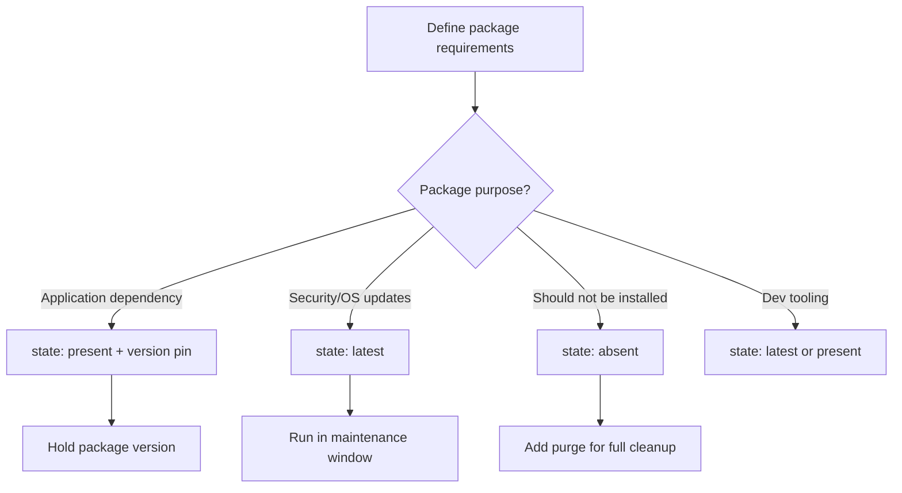

# How to Manage Package State (present, absent, latest) in Ansible

Author: [nawazdhandala](https://www.github.com/nawazdhandala)

Tags: Ansible, Package Management, DevOps, Automation

Description: Understand the differences between present, absent, and latest package states in Ansible and when to use each for reliable automation.

---

Every Ansible package module has a `state` parameter that controls what should happen to a package. The three most common values are `present`, `absent`, and `latest`, but there are additional states for specific package managers. Understanding when to use each state is fundamental to writing reliable playbooks that do not surprise you with unintended changes. This post breaks down each state with practical examples and guidance on when to use which.

## state: present

The `present` state is the most commonly used and safest option. It means "make sure this package is installed, but do not upgrade it if it already is."

```yaml
# Install nginx if it is not already installed
- name: Ensure nginx is installed
  ansible.builtin.apt:
    name: nginx
    state: present
```

Key behaviors:

- If the package is not installed, it gets installed (the latest version available in the repository at that moment)
- If the package is already installed at any version, nothing happens
- The task reports "changed" only when it actually installs something

This is the right choice for most production playbooks. You want deterministic behavior, and `present` gives you that. Once a package is installed, it stays at whatever version was installed, regardless of what is available in the repository.

## state: absent

The `absent` state removes a package:

```yaml
# Remove a package if it is installed
- name: Remove telnet
  ansible.builtin.apt:
    name: telnet
    state: absent
```

Key behaviors:

- If the package is installed, it gets removed
- If the package is not installed, nothing happens
- By default, configuration files are left behind (on Debian systems)

For a complete removal including config files on Debian/Ubuntu, combine with `purge`:

```yaml
# Completely remove a package including its configuration
- name: Purge old web server
  ansible.builtin.apt:
    name: apache2
    state: absent
    purge: yes
```

On RHEL, `state: absent` always removes everything (there is no separate purge concept).

## state: latest

The `latest` state means "install this package if missing, and upgrade it to the newest available version if it is already installed."

```yaml
# Always keep security packages at the latest version
- name: Ensure latest OpenSSL
  ansible.builtin.apt:
    name: openssl
    state: latest
    update_cache: yes
```

Key behaviors:

- If the package is not installed, it gets installed at the latest available version
- If the package is installed but an update is available, it gets upgraded
- The task reports "changed" whenever an install or upgrade happens

**Use `state: latest` with caution in production.** It makes your playbook non-deterministic because the outcome depends on what version is currently in the repository. Running the same playbook on Monday and Tuesday might produce different results if a new version was published between runs.

## state: fixed (apt only)

The `fixed` state is specific to the `apt` module and attempts to fix broken package dependencies:

```yaml
# Fix broken package dependencies
- name: Fix broken packages
  ansible.builtin.apt:
    state: fixed
```

This is equivalent to `apt-get -f install`. Use it as a recovery step when a previous installation left the dpkg database in a bad state.

## state: build-dep (apt only)

This installs the build dependencies for a source package:

```yaml
# Install build dependencies for nginx
- name: Install nginx build dependencies
  ansible.builtin.apt:
    name: nginx
    state: build-dep
```

Useful when you need to compile a package from source with modifications.

## Comparing Package States

Here is a clear comparison of what happens in each scenario:

| State | Package not installed | Package installed (old version) | Package installed (latest) |
|-------|----------------------|--------------------------------|---------------------------|
| present | Install (latest available) | No action | No action |
| absent | No action | Remove | Remove |
| latest | Install (latest available) | Upgrade | No action |

## Choosing the Right State for Your Scenario

### Production application servers

```yaml
# Production: use 'present' for stability
- name: Install application dependencies
  ansible.builtin.apt:
    name:
      - nginx
      - postgresql-client-15
      - redis-tools
    state: present
```

Use `present`. You want your deployments to be predictable. Upgrade packages through a deliberate change management process, not as a side effect of running your deployment playbook.

### Security patching

```yaml
# Security patches: use 'latest' for critical packages
- name: Apply security updates to critical packages
  ansible.builtin.apt:
    name:
      - openssl
      - libssl3
      - openssh-server
      - ca-certificates
    state: latest
    update_cache: yes
```

Use `latest` here because you want the most recent security fixes. Run this in a dedicated patching playbook on a schedule, separate from your application deployment playbooks.

### Server hardening

```yaml
# Hardening: use 'absent' to remove attack surface
- name: Remove unnecessary packages
  ansible.builtin.apt:
    name:
      - telnet
      - ftp
      - rsh-client
      - talk
      - xinetd
    state: absent
    purge: yes
```

Use `absent` (with `purge` on Debian) to remove packages that should not be on your servers.

### Development environments

```yaml
# Development: 'latest' is fine for dev tools
- name: Install latest dev tools
  ansible.builtin.apt:
    name:
      - git
      - vim
      - tmux
      - htop
      - jq
    state: latest
```

Use `latest` for development tools where you want the newest features and bug fixes. The risk of breaking something is low, and developers generally want the latest tools.

## Combining States in a Single Playbook

A common pattern is mixing states for different package categories:

```yaml
# Mix different states based on the package category
- name: Manage packages on web server
  hosts: web_servers
  become: yes
  tasks:
    # Core application dependencies: pinned and stable
    - name: Install application packages (stable)
      ansible.builtin.apt:
        name:
          - nginx=1.24.0-1ubuntu1
          - php8.2
          - php8.2-fpm
        state: present

    # Security packages: always latest
    - name: Keep security packages updated
      ansible.builtin.apt:
        name:
          - openssl
          - ca-certificates
        state: latest
        update_cache: yes

    # Unwanted packages: remove
    - name: Remove unwanted packages
      ansible.builtin.apt:
        name:
          - apache2
          - sendmail
        state: absent
        purge: yes
```

## State-Based Decision Flow



## Checking Current Package State

Before making changes, you can inspect what is installed:

```yaml
# Gather and display package information
- name: Gather package facts
  ansible.builtin.package_facts:
    manager: auto

- name: Show nginx status
  ansible.builtin.debug:
    msg: >
      nginx is {{ 'installed' if 'nginx' in ansible_facts.packages else 'not installed' }}
      
      at version {{ ansible_facts.packages['nginx'][0].version }}
      

# Conditional task based on package state
- name: Configure nginx only if installed
  ansible.builtin.template:
    src: nginx.conf.j2
    dest: /etc/nginx/nginx.conf
  when: "'nginx' in ansible_facts.packages"
  notify: reload nginx
```

## Using state with the package Module

The cross-platform `package` module supports the same states:

```yaml
# Cross-platform package state management
- name: Install git on any distribution
  ansible.builtin.package:
    name: git
    state: present

- name: Upgrade curl on any distribution
  ansible.builtin.package:
    name: curl
    state: latest

- name: Remove telnet on any distribution
  ansible.builtin.package:
    name: telnet
    state: absent
```

## Common Mistakes

1. **Using `state: latest` everywhere.** This makes your playbooks non-deterministic and can cause unexpected breakage in production.

2. **Forgetting `update_cache: yes` with `state: latest`.** On Debian, if the apt cache is stale, `latest` might report "already at latest" when it is not, because it is comparing against the cached metadata.

3. **Not using `purge` with `state: absent` on Debian.** Without it, config files linger and can confuse future installations.

4. **Assuming `state: present` will upgrade.** It will not. If a package is installed at version 1.0 and version 2.0 is available, `state: present` leaves version 1.0 in place.

5. **Not handling the `state: absent` + running service case.** Always stop a service before removing its package:

```yaml
# Stop service before removal
- name: Stop nginx
  ansible.builtin.service:
    name: nginx
    state: stopped
  ignore_errors: yes

- name: Remove nginx
  ansible.builtin.apt:
    name: nginx
    state: absent
    purge: yes
```

Understanding package states is one of those fundamental Ansible concepts that seems simple on the surface but has real implications for production reliability. The key takeaway: use `present` for stability, `latest` only when you explicitly want upgrades, and `absent` when cleaning up.
