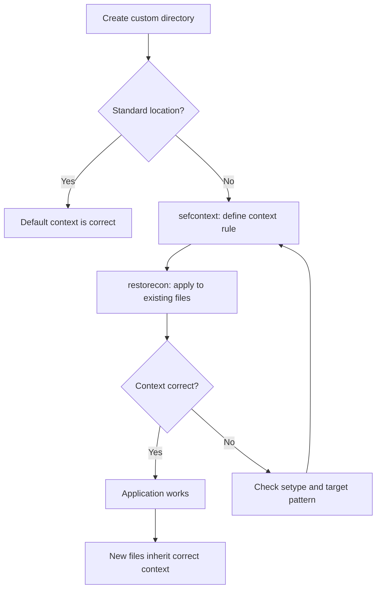

# How to Manage SELinux File Contexts with Ansible

Author: [nawazdhandala](https://www.github.com/nawazdhandala)

Tags: Ansible, SELinux, Security, Linux

Description: Learn how to manage SELinux file contexts with Ansible using the sefcontext module and restorecon to maintain proper security labels on your systems.

---

SELinux (Security-Enhanced Linux) adds mandatory access control to Linux systems. One of its core concepts is file contexts, which are labels that determine what processes can access which files. When you move files to non-standard locations or create custom directories, you need to set the correct SELinux context or your applications will get "permission denied" errors even when standard Unix permissions look correct. Ansible has dedicated modules for managing SELinux contexts, making it possible to automate this otherwise error-prone process.

## How SELinux File Contexts Work

Every file on an SELinux-enabled system has a security context that looks like this:

```
system_u:object_r:httpd_sys_content_t:s0
```

The parts are: user, role, type, and level. For file management, the **type** is what matters most. For example, files served by Apache need the `httpd_sys_content_t` type, and log files need `var_log_t`.

When you create files in standard locations (like `/var/www/html`), they automatically get the right context. But when you use custom paths (like `/opt/webapp/public`), SELinux does not know what context to assign.

## Setting File Contexts with sefcontext

The `sefcontext` module adds a persistent rule to SELinux's file context database. This rule tells SELinux what context to assign to files matching a path pattern.

```yaml
# Define the SELinux context for a custom web content directory
- name: Set SELinux file context for custom web root
  community.general.sefcontext:
    target: '/opt/webapp/public(/.*)?'
    setype: httpd_sys_content_t
    state: present

# Apply the context to existing files
- name: Apply SELinux context to existing files
  ansible.builtin.command: restorecon -irv /opt/webapp/public
  register: restorecon_result
  changed_when: restorecon_result.stdout != ""
```

The `sefcontext` module only updates the policy database. You still need to run `restorecon` to apply the context to existing files. New files created after the policy update will get the correct context automatically.

## Understanding the Target Pattern

The `target` parameter uses regular expressions to match file paths. Common patterns include:

```yaml
# Match a directory and all its contents recursively
- name: Label custom log directory
  community.general.sefcontext:
    target: '/opt/myapp/logs(/.*)?'
    setype: var_log_t
    state: present

# Match specific file types
- name: Label PID files in custom location
  community.general.sefcontext:
    target: '/opt/myapp/run/.*\.pid'
    setype: var_run_t
    state: present

# Match a specific file
- name: Label a specific config file
  community.general.sefcontext:
    target: '/opt/myapp/conf/httpd\.conf'
    setype: httpd_config_t
    state: present
```

The `(/.*)?` pattern matches the directory itself and everything inside it recursively. This is the most common pattern you will use.

## Common SELinux File Types

Here are the types you will work with most often when managing web servers, application servers, and system services.

| Type | Purpose |
|------|---------|
| httpd_sys_content_t | Static web content (read-only by httpd) |
| httpd_sys_rw_content_t | Writable web content (uploads, caches) |
| httpd_log_t | Apache log files |
| var_log_t | General log files |
| var_run_t | PID files and runtime data |
| etc_t | Configuration files |
| bin_t | Executable binaries |
| cert_t | SSL/TLS certificates |
| mysqld_db_t | MySQL database files |
| postgresql_db_t | PostgreSQL database files |

## Practical Example: Custom Web Application

Here is a complete playbook that sets up a web application in a non-standard location with proper SELinux contexts.

```yaml
---
- name: Deploy web application with proper SELinux contexts
  hosts: webservers
  become: yes

  vars:
    app_root: /opt/webapp
    app_user: webapp

  tasks:
    - name: Install required SELinux packages
      ansible.builtin.package:
        name:
          - policycoreutils-python-utils
          - libselinux-python3
        state: present

    - name: Create application directories
      ansible.builtin.file:
        path: "{{ item }}"
        state: directory
        owner: "{{ app_user }}"
        group: "{{ app_user }}"
        mode: '0755'
      loop:
        - "{{ app_root }}"
        - "{{ app_root }}/public"
        - "{{ app_root }}/uploads"
        - "{{ app_root }}/logs"
        - "{{ app_root }}/conf"
        - "{{ app_root }}/run"

    - name: Set SELinux context for static content
      community.general.sefcontext:
        target: "{{ app_root }}/public(/.*)?"
        setype: httpd_sys_content_t
        state: present

    - name: Set SELinux context for upload directory (writable by httpd)
      community.general.sefcontext:
        target: "{{ app_root }}/uploads(/.*)?"
        setype: httpd_sys_rw_content_t
        state: present

    - name: Set SELinux context for log directory
      community.general.sefcontext:
        target: "{{ app_root }}/logs(/.*)?"
        setype: httpd_log_t
        state: present

    - name: Set SELinux context for config directory
      community.general.sefcontext:
        target: "{{ app_root }}/conf(/.*)?"
        setype: httpd_config_t
        state: present

    - name: Set SELinux context for PID/socket directory
      community.general.sefcontext:
        target: "{{ app_root }}/run(/.*)?"
        setype: httpd_var_run_t
        state: present

    - name: Apply SELinux contexts to all application directories
      ansible.builtin.command: "restorecon -irv {{ app_root }}"
      register: restorecon_output
      changed_when: restorecon_output.stdout != ""
```

## Managing SELinux Booleans

SELinux booleans control policy behavior. For example, to allow httpd to connect to the network (needed for reverse proxy setups), you need to enable the `httpd_can_network_connect` boolean.

```yaml
# Enable SELinux booleans needed by your application
- name: Allow httpd to make network connections
  ansible.posix.seboolean:
    name: httpd_can_network_connect
    state: yes
    persistent: yes

- name: Allow httpd to send mail
  ansible.posix.seboolean:
    name: httpd_can_sendmail
    state: yes
    persistent: yes

- name: Allow httpd to read home directories
  ansible.posix.seboolean:
    name: httpd_enable_homedirs
    state: yes
    persistent: yes
```

## Removing File Context Rules

When you decommission an application, clean up its SELinux rules.

```yaml
# Remove custom SELinux file context rules
- name: Remove SELinux context for decommissioned app
  community.general.sefcontext:
    target: '/opt/oldapp(/.*)?'
    setype: httpd_sys_content_t
    state: absent

- name: Restore default contexts on old app directory
  ansible.builtin.command: restorecon -irv /opt/oldapp
  when: false  # Only if directory still exists
```

## Verifying SELinux Contexts

Add verification tasks to confirm contexts are applied correctly.

```yaml
# Verify SELinux contexts are correct
- name: Check SELinux context on web root
  ansible.builtin.command: ls -Z /opt/webapp/public/
  register: selinux_check
  changed_when: false

- name: Display SELinux contexts
  ansible.builtin.debug:
    var: selinux_check.stdout_lines

# Verify no files have incorrect contexts
- name: Find files with wrong context in web root
  ansible.builtin.command: >
    find /opt/webapp/public -not -context '*:httpd_sys_content_t:*' -ls
  register: wrong_context
  changed_when: false

- name: Warn about files with incorrect context
  ansible.builtin.debug:
    msg: "Files with incorrect SELinux context found!"
  when: wrong_context.stdout | length > 0
```

## SELinux Context Management Flow



## Troubleshooting SELinux Denials

When SELinux blocks access, it logs denials to the audit log. Use `audit2why` to understand the problem.

```yaml
# Check for recent SELinux denials
- name: Check audit log for SELinux denials
  ansible.builtin.command: >
    ausearch -m AVC -ts recent
  register: avc_denials
  changed_when: false
  failed_when: false

- name: Analyze SELinux denials
  ansible.builtin.command: >
    ausearch -m AVC -ts recent | audit2why
  register: denial_analysis
  changed_when: false
  failed_when: false
  when: avc_denials.stdout | length > 0

- name: Display denial analysis
  ansible.builtin.debug:
    var: denial_analysis.stdout_lines
  when: denial_analysis.stdout is defined
```

## Summary

Managing SELinux file contexts with Ansible prevents the "it works with SELinux disabled" situation that plagues many deployments. The `sefcontext` module updates the persistent policy database, `restorecon` applies contexts to existing files, and the `seboolean` module toggles policy flags. For any application that uses non-standard file paths, setting the correct SELinux context is just as important as setting the correct file ownership and permissions. Integrate these tasks into your application deployment roles, and you will never have to troubleshoot mysterious "permission denied" errors on SELinux-enabled systems again.
