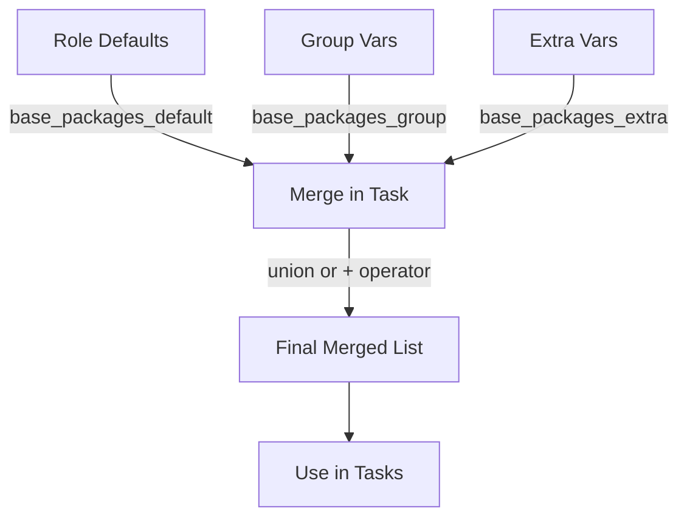

# How to Merge List Variables from Multiple Sources in Ansible

Author: [nawazdhandala](https://www.github.com/nawazdhandala)

Tags: Ansible, Variables, Lists, Jinja2, Configuration Management

Description: Learn techniques for merging list variables from multiple sources in Ansible including group_vars, role defaults, and extra vars.

---

When you are managing infrastructure with Ansible, you frequently need to combine lists from different variable sources. Maybe you have a base list of packages defined in a role's defaults, additional packages specified in group_vars, and a few more passed as extra vars. By default, Ansible does not merge list variables. It replaces them based on variable precedence. This behavior catches a lot of people off guard, so let me walk through the problem and the various solutions.

## The Default Behavior: Replacement, Not Merging

Consider a role that defines a default package list:

```yaml
# roles/base/defaults/main.yml
base_packages:
  - curl
  - wget
  - vim
  - htop
```

And your group_vars override for a specific group:

```yaml
# group_vars/webservers.yml
base_packages:
  - nginx
  - certbot
```

You might expect the webserver hosts to get all six packages. They will not. Group vars have higher precedence than role defaults, so `base_packages` becomes just `[nginx, certbot]`. The original four packages are gone.

## Solution 1: Use Separate Variables and Combine Them

The cleanest approach is to use distinct variable names for each source and merge them in your tasks.

```yaml
# roles/base/defaults/main.yml - Default packages every host should have
base_packages_default:
  - curl
  - wget
  - vim
  - htop

# Additional packages (override per group or host)
base_packages_extra: []
```

```yaml
# group_vars/webservers.yml - Extra packages for web servers
base_packages_extra:
  - nginx
  - certbot
```

```yaml
# roles/base/tasks/main.yml - Combine the two lists
---
- name: Install all packages (defaults + extras)
  ansible.builtin.apt:
    name: "{{ base_packages_default + base_packages_extra }}"
    state: present
  become: true
```

This pattern is explicit and easy to understand. The `+` operator in Jinja2 concatenates two lists.

## Solution 2: The union Filter for Deduplication

If the lists might contain duplicates and you want a unique set, use the `union` filter:

```yaml
# union-example.yml - Merge and deduplicate lists
---
- name: Merge package lists without duplicates
  hosts: all
  gather_facts: false
  vars:
    common_packages:
      - curl
      - wget
      - jq
    team_packages:
      - curl    # duplicate
      - awscli
      - terraform
    host_packages:
      - jq      # duplicate
      - nginx
  tasks:
    - name: Combine all package lists (unique values only)
      ansible.builtin.set_fact:
        all_packages: "{{ common_packages | union(team_packages) | union(host_packages) }}"

    - name: Show merged list
      ansible.builtin.debug:
        msg: "{{ all_packages }}"
    # Result: [curl, wget, jq, awscli, terraform, nginx]
```

## Solution 3: Merging Lists of Dictionaries

Things get more involved when you are merging lists of dictionaries, like user definitions or firewall rules. Simple concatenation might produce duplicates with conflicting values.

```yaml
# dict-list-merge.yml - Merge lists of dictionaries by key
---
- name: Merge user lists from multiple sources
  hosts: localhost
  gather_facts: false
  vars:
    default_users:
      - name: deploy
        shell: /bin/bash
        groups: [sudo]
      - name: monitor
        shell: /bin/false
        groups: [monitoring]
    extra_users:
      - name: deploy
        shell: /bin/bash
        groups: [sudo, docker]  # Added docker group
      - name: appuser
        shell: /bin/bash
        groups: [app]
  tasks:
    # Simple concatenation (may have duplicates)
    - name: Concatenate user lists
      ansible.builtin.set_fact:
        all_users_raw: "{{ default_users + extra_users }}"

    # Deduplicate by 'name' key, keeping the last occurrence
    - name: Deduplicate by name (last wins)
      ansible.builtin.set_fact:
        all_users: "{{ all_users_raw | community.general.lists_mergeby('name') }}"

    - name: Show merged users
      ansible.builtin.debug:
        var: all_users
```

If you do not have the `community.general` collection, you can use a Jinja2 expression:

```yaml
    # Manual deduplication using a Jinja2 dict
    - name: Deduplicate manually
      ansible.builtin.set_fact:
        all_users: >-
          {{ dict(
               (default_users + extra_users) | map(attribute='name') |
               zip(default_users + extra_users)
             ) | dict2items | map(attribute='value') | list }}
```

## Solution 4: The hash_behaviour Setting (Use with Caution)

Ansible has a configuration option `hash_behaviour = merge` that changes the default from replace to merge for all dictionaries. However, this is a global setting and has been deprecated in recent versions. It affects all variable merging, which can lead to unexpected behavior.

```ini
# ansible.cfg - NOT recommended for most use cases
[defaults]
# This is deprecated and will be removed in future versions
# hash_behaviour = merge
```

Instead of relying on this global setting, use the `combine` filter for dictionary merging on a case-by-case basis:

```yaml
# combine-filter.yml - Explicit dictionary merging
---
- name: Merge dictionaries explicitly
  hosts: localhost
  gather_facts: false
  vars:
    default_config:
      log_level: info
      max_connections: 100
      timeout: 30
    override_config:
      log_level: debug
      max_connections: 500
  tasks:
    - name: Merge configurations (override wins)
      ansible.builtin.set_fact:
        final_config: "{{ default_config | combine(override_config) }}"

    - name: Show merged config
      ansible.builtin.debug:
        var: final_config
    # Result: {log_level: debug, max_connections: 500, timeout: 30}
```

## Solution 5: Collecting Variables from Multiple Group Files

When a host belongs to multiple groups, you often want to accumulate list variables from each group. The naming convention approach works well here.

```yaml
# group_vars/all.yml
firewall_rules_base:
  - port: 22
    proto: tcp
    action: allow
  - port: 443
    proto: tcp
    action: allow
```

```yaml
# group_vars/webservers.yml
firewall_rules_webservers:
  - port: 80
    proto: tcp
    action: allow
  - port: 8080
    proto: tcp
    action: allow
```

```yaml
# group_vars/monitoring.yml
firewall_rules_monitoring:
  - port: 9090
    proto: tcp
    action: allow
  - port: 9100
    proto: tcp
    action: allow
```

```yaml
# playbook.yml - Collect all firewall_rules_* variables
---
- name: Apply firewall rules from all sources
  hosts: all
  gather_facts: false
  tasks:
    - name: Collect all firewall rule variables
      ansible.builtin.set_fact:
        all_firewall_rules: >-
          {{ (firewall_rules_base | default([])) +
             (firewall_rules_webservers | default([])) +
             (firewall_rules_monitoring | default([])) }}

    - name: Apply firewall rules
      ansible.builtin.iptables:
        chain: INPUT
        protocol: "{{ item.proto }}"
        destination_port: "{{ item.port }}"
        jump: "{{ item.action | upper }}"
      loop: "{{ all_firewall_rules }}"
      become: true
```

## Solution 6: Dynamic Collection with varnames Lookup

For a more dynamic approach, you can use the `varnames` lookup to find all variables matching a pattern:

```yaml
# dynamic-collect.yml - Find and merge variables by naming pattern
---
- name: Dynamically collect list variables
  hosts: all
  gather_facts: false
  tasks:
    - name: Find all variables matching pattern
      ansible.builtin.set_fact:
        matching_var_names: "{{ lookup('varnames', 'firewall_rules_') }}"

    - name: Merge all matching variables into one list
      ansible.builtin.set_fact:
        all_rules: "{{ all_rules | default([]) + lookup('vars', item) }}"
      loop: "{{ matching_var_names.split(',') }}"
      when: matching_var_names | length > 0

    - name: Show combined rules
      ansible.builtin.debug:
        var: all_rules
```

## The Merge Flow



## Best Practices

Use separate variable names for different sources rather than relying on one variable name across multiple precedence levels. Apply `| default([])` to any list variable that might not be defined in all contexts. Use the `union` filter when you need deduplication. Avoid the global `hash_behaviour = merge` setting since it causes more problems than it solves. When merging lists of dictionaries, use `community.general.lists_mergeby` or handle deduplication explicitly.

Merging variables properly is one of those skills that separates maintainable Ansible codebases from ones that break in mysterious ways when you add a new group or host.
