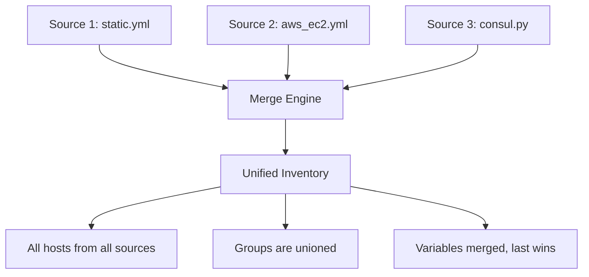

# How to Merge Multiple Ansible Inventories at Runtime

Author: [nawazdhandala](https://www.github.com/nawazdhandala)

Tags: Ansible, Inventory, Multi-Source, Configuration, DevOps

Description: Learn how to merge multiple Ansible inventory sources at runtime to combine static files, dynamic scripts, and cloud plugins into one unified inventory.

---

Real infrastructure rarely lives in a single place. You might have bare metal servers tracked in a static file, cloud VMs discovered by a dynamic plugin, and containers running in Kubernetes. Ansible can merge all these inventory sources into a single unified view at runtime. This post explains every method for combining multiple inventories and the rules that govern how they merge.

## Why Merge Inventories

Common scenarios that require multiple inventory sources:

- Hybrid cloud: some servers in AWS, some on-premise, some in GCP
- Mixed management: static inventory for stable infrastructure, dynamic for auto-scaling groups
- Team separation: different teams maintain different parts of the inventory
- Environment overlays: base inventory plus environment-specific additions

## Method 1: Multiple -i Flags

The simplest approach is passing multiple `-i` flags on the command line:

```bash
# Merge a static file with a dynamic inventory script
ansible-playbook \
    -i inventory/static.yml \
    -i inventory/aws_ec2.yml \
    -i scripts/consul_inventory.py \
    site.yml
```

Ansible processes each source in order and merges the results. Hosts from all sources appear in the unified inventory, and groups with the same name across sources get merged.

## Method 2: Inventory Directory

When you point Ansible at a directory instead of a file, it processes every valid inventory source in that directory:

```
inventory/
  01_static.yml         # Static hosts
  02_aws_ec2.yml        # AWS EC2 dynamic plugin
  03_azure_rm.yml       # Azure dynamic plugin
  04_consul.py          # Consul dynamic script (must be executable)
  05_constructed.yml    # Constructed plugin for cross-source grouping
  group_vars/
    all.yml
    webservers.yml
  host_vars/
    special-server.yml
```

```bash
# Process all inventory sources in the directory
ansible-playbook -i inventory/ site.yml
```

Files are processed in alphabetical order. I prefix them with numbers (01, 02, etc.) to control the order explicitly, which matters when later sources depend on variables set by earlier ones.

## Method 3: ansible.cfg Default Inventory

Set the inventory in `ansible.cfg` to avoid typing `-i` every time:

```ini
# ansible.cfg
[defaults]
# Comma-separated list of inventory sources
inventory = inventory/static.yml,inventory/aws_ec2.yml,scripts/consul_inventory.py

# Or just point to the directory
inventory = inventory/
```

## How Merging Works

When Ansible merges multiple inventory sources, it follows these rules:

**Hosts**: If the same hostname appears in multiple sources, it is treated as one host. Variables from all sources are merged onto that host, with later sources taking precedence.

**Groups**: If a group name exists in multiple sources, the group's host list is the union of hosts from all sources. Group variables are merged, with later sources winning on conflicts.

**Variables**: Host variables follow Ansible's standard precedence rules. Variables from later inventory sources override those from earlier sources for the same host.



## Practical Example: Static + AWS + Constructed

Here is a complete multi-source setup:

```yaml
# inventory/01_static.yml
# On-premise servers that do not exist in any cloud
all:
  children:
    on_premise:
      hosts:
        bare-metal-01:
          ansible_host: 192.168.1.100
          ansible_user: admin
          location: datacenter-a
        bare-metal-02:
          ansible_host: 192.168.1.101
          ansible_user: admin
          location: datacenter-b
    webservers:
      hosts:
        bare-metal-01:
```

```yaml
# inventory/02_aws_ec2.yml
# AWS EC2 instances
plugin: amazon.aws.aws_ec2
regions:
  - us-east-1
keyed_groups:
  - key: tags.Role
    prefix: ""
    separator: ""
compose:
  ansible_host: private_ip_address
  ansible_user: "'ec2-user'"
  location: "'aws-us-east-1'"
filters:
  instance-state-name: running
  tag:ManagedBy: ansible
```

```yaml
# inventory/03_constructed.yml
# Create cross-source groups based on merged variables
plugin: ansible.builtin.constructed
strict: false
groups:
  # Group all webservers regardless of source
  all_webservers: "'webservers' in group_names"
  # Group by location (works across static and AWS sources)
  datacenter_a: location == 'datacenter-a'
  datacenter_b: location == 'datacenter-b'
  aws_east: location == 'aws-us-east-1'
```

The constructed plugin runs after all other sources are loaded, so it can create groups that span across static and dynamic hosts.

## Handling Variable Conflicts

When the same host appears in multiple sources with different variable values, the last source processed wins. Here is an example of how to handle that intentionally:

```yaml
# inventory/01_base.yml
# Base configuration for all web servers
all:
  children:
    webservers:
      hosts:
        web01:
          ansible_host: 10.0.1.10
          http_port: 80
          ssl_enabled: false
          max_connections: 100
```

```yaml
# inventory/02_overrides.yml
# Environment-specific overrides
all:
  children:
    webservers:
      hosts:
        web01:
          # Override SSL and connection settings for production
          ssl_enabled: true
          max_connections: 1000
```

After merging, `web01` will have `ssl_enabled: true` and `max_connections: 1000` (from the override file) but keep `http_port: 80` and `ansible_host: 10.0.1.10` (from the base file, since the override did not set those).

## Merging Dynamic Scripts with Static Files

Dynamic inventory scripts must be executable and follow the JSON format:

```bash
# Ensure the script is executable
chmod +x scripts/custom_inventory.py
```

```python
#!/usr/bin/env python3
# scripts/custom_inventory.py
import json
import sys

inventory = {
    "custom_service": {
        "hosts": ["svc01", "svc02"],
        "vars": {
            "service_port": 8080
        }
    },
    "_meta": {
        "hostvars": {
            "svc01": {"ansible_host": "10.5.1.10"},
            "svc02": {"ansible_host": "10.5.1.11"}
        }
    }
}

if '--list' in sys.argv or len(sys.argv) == 1:
    print(json.dumps(inventory))
elif '--host' in sys.argv:
    print(json.dumps({}))
```

Use it alongside static files:

```bash
ansible-playbook -i inventory/static.yml -i scripts/custom_inventory.py site.yml
```

## group_vars and host_vars with Multiple Sources

When using a directory-based inventory, `group_vars` and `host_vars` directories at the inventory level apply to all sources:

```
inventory/
  01_static.yml
  02_aws_ec2.yml
  group_vars/          # Applies to groups from ALL sources
    all.yml
    webservers.yml     # Works for webservers whether from static or AWS
  host_vars/
    web01.yml          # Works for web01 whether from static or AWS
```

If you use multiple `-i` flags pointing to separate directories, each directory can have its own `group_vars` and `host_vars`:

```
static_inventory/
  hosts.yml
  group_vars/
    webservers.yml    # Only for this inventory's webservers
cloud_inventory/
  aws_ec2.yml
  group_vars/
    webservers.yml    # Only for this inventory's webservers
```

```bash
# Each inventory's group_vars apply to its own hosts
ansible-playbook -i static_inventory/ -i cloud_inventory/ site.yml
```

## Verifying the Merged Inventory

Always check what the merged inventory looks like before running playbooks:

```bash
# Show the merged inventory graph
ansible-inventory -i inventory/ --graph

# Show all hosts with their merged variables
ansible-inventory -i inventory/ --list

# Check a specific host's variables after merging
ansible-inventory -i inventory/ --host web01

# Count total hosts across all sources
ansible -i inventory/ all --list-hosts | wc -l
```

## Ordering and Precedence Tips

Name your inventory files with numeric prefixes to control processing order:

```
inventory/
  01_base.yml            # Base infrastructure (processed first)
  10_aws.yml             # Cloud resources
  20_consul.yml          # Service discovery overlay
  90_constructed.yml     # Dynamic grouping (needs all others loaded first)
  99_overrides.yml       # Final overrides (processed last, wins conflicts)
```

The `constructed` plugin should always come after all other sources, since it needs host data from those sources to evaluate its group conditions.

## Common Pitfalls

Watch out for hostname collisions. If your static inventory has a host called `web01` and your AWS plugin also discovers a host called `web01`, Ansible treats them as the same host and merges their variables. Make sure hostnames are unique across sources, or be very intentional about the overlap.

Dynamic inventory scripts must return valid JSON. A script that outputs malformed JSON will cause the entire inventory merge to fail, not just that one source.

Group variable precedence follows Ansible's rules: all group, parent groups, child groups, host vars. This ordering applies within each source and across merged sources.

Merging multiple inventory sources is one of Ansible's most powerful features for managing heterogeneous infrastructure. Start with separate sources for each infrastructure provider, add a constructed plugin for cross-source grouping, and use numeric file prefixes to control processing order. Always verify the merged result with `ansible-inventory --graph` before running playbooks.
