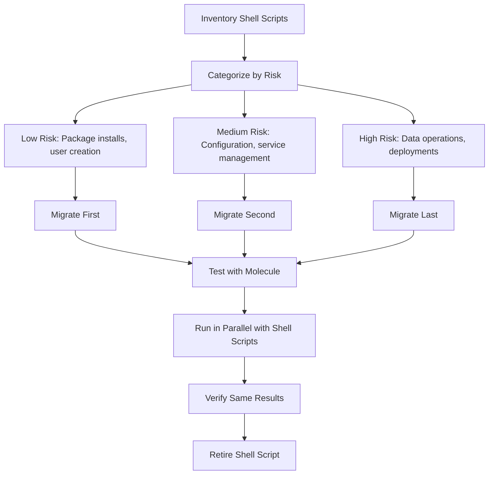

# How to Migrate from Shell Scripts to Ansible Playbooks

Author: [nawazdhandala](https://www.github.com/nawazdhandala)

Tags: Ansible, Shell Scripts, Migration, Automation

Description: A practical guide to migrating your existing shell scripts to Ansible playbooks with side-by-side examples and a step-by-step migration strategy.

---

Every infrastructure team has a collection of shell scripts that grew organically over years. They work, mostly, but they are fragile, not idempotent, and impossible to run safely on 50 servers at once. Migrating to Ansible does not mean rewriting everything overnight. It means systematically replacing scripts with playbooks, one at a time, starting with the ones that cause the most pain.

## Why Shell Scripts Fall Short

Shell scripts have real problems at scale. They are not idempotent by default, so running them twice can break things. They have no built-in error handling beyond `set -e`. They cannot target multiple servers without wrapping them in SSH loops. And they are hard to test.

Here is a typical deployment script:

```bash
#!/bin/bash
# deploy.sh - The old way
set -e

SERVER=$1
VERSION=$2

echo "Deploying version $VERSION to $SERVER..."
ssh $SERVER "sudo systemctl stop myapp"
ssh $SERVER "cd /opt/myapp && git pull origin main && git checkout $VERSION"
ssh $SERVER "cd /opt/myapp && source venv/bin/activate && pip install -r requirements.txt"
ssh $SERVER "cd /opt/myapp && source venv/bin/activate && python manage.py migrate"
ssh $SERVER "sudo systemctl start myapp"
echo "Done!"
```

Problems with this script: no error recovery, no rollback, runs on one server at a time, no health checks, and running it twice might break the database migration.

## The Ansible Equivalent

```yaml
# playbooks/deploy.yml
# The same deployment, but better
- name: Deploy application
  hosts: app_servers
  become: yes
  serial: "25%"

  tasks:
    - name: Stop application service
      ansible.builtin.service:
        name: myapp
        state: stopped

    - name: Deploy application code
      ansible.builtin.git:
        repo: "{{ app_repo }}"
        dest: /opt/myapp
        version: "{{ app_version }}"
      become_user: deploy

    - name: Install Python dependencies
      ansible.builtin.pip:
        requirements: /opt/myapp/requirements.txt
        virtualenv: /opt/myapp/venv
      become_user: deploy

    - name: Run database migrations
      ansible.builtin.command:
        cmd: /opt/myapp/venv/bin/python manage.py migrate --noinput
        chdir: /opt/myapp
      run_once: true
      register: migrate_result
      changed_when: "'No migrations to apply' not in migrate_result.stdout"
      become_user: deploy

    - name: Start application service
      ansible.builtin.service:
        name: myapp
        state: started

    - name: Verify application health
      ansible.builtin.uri:
        url: "http://localhost:8080/health"
        status_code: 200
      retries: 10
      delay: 5
```

## Common Shell-to-Ansible Translations

Here are the most common patterns you will encounter:

**Package installation:**

```bash
# Shell script
apt-get update
apt-get install -y nginx curl git
```

```yaml
# Ansible equivalent
- name: Install required packages
  ansible.builtin.apt:
    name:
      - nginx
      - curl
      - git
    state: present
    update_cache: yes
    cache_valid_time: 3600
```

**User and group management:**

```bash
# Shell script
groupadd -f deploy
useradd -m -g deploy -s /bin/bash deploy
```

```yaml
# Ansible equivalent
- name: Create deploy group
  ansible.builtin.group:
    name: deploy
    state: present

- name: Create deploy user
  ansible.builtin.user:
    name: deploy
    group: deploy
    shell: /bin/bash
    create_home: yes
```

**File operations:**

```bash
# Shell script
mkdir -p /opt/myapp/logs
chown -R deploy:deploy /opt/myapp
chmod 750 /opt/myapp
cp config.template /opt/myapp/config.yml
sed -i "s/DB_HOST/10.0.1.5/g" /opt/myapp/config.yml
```

```yaml
# Ansible equivalent
- name: Create application directory
  ansible.builtin.file:
    path: /opt/myapp/logs
    state: directory
    owner: deploy
    group: deploy
    mode: '0750'
    recurse: yes

- name: Deploy configuration file
  ansible.builtin.template:
    src: config.yml.j2
    dest: /opt/myapp/config.yml
    owner: deploy
    group: deploy
    mode: '0640'
```

**Conditional logic:**

```bash
# Shell script
if [ -f /etc/debian_version ]; then
    apt-get install -y nginx
elif [ -f /etc/redhat-release ]; then
    yum install -y nginx
fi
```

```yaml
# Ansible equivalent
- name: Install nginx on Debian
  ansible.builtin.apt:
    name: nginx
    state: present
  when: ansible_os_family == "Debian"

- name: Install nginx on RedHat
  ansible.builtin.dnf:
    name: nginx
    state: present
  when: ansible_os_family == "RedHat"
```

**Service management:**

```bash
# Shell script
systemctl enable nginx
systemctl restart nginx
systemctl status nginx || echo "Nginx failed to start!"
```

```yaml
# Ansible equivalent
- name: Ensure nginx is enabled and running
  ansible.builtin.service:
    name: nginx
    state: started
    enabled: yes
```

## Migration Strategy



## Handling Complex Shell Logic

Some scripts have logic that does not map to a single module. For these, use command/shell as a bridge during migration:

```yaml
# Phase 1: Wrap the shell script in Ansible (quick migration)
- name: Run legacy backup script
  ansible.builtin.script: scripts/legacy-backup.sh
  args:
    creates: /opt/backups/latest.tar.gz

# Phase 2: Replace with native Ansible modules (proper migration)
- name: Create database backup
  community.postgresql.postgresql_db:
    name: "{{ db_name }}"
    state: dump
    target: "/opt/backups/{{ db_name }}-{{ ansible_date_time.date }}.sql"
  become_user: postgres

- name: Compress backup
  ansible.builtin.archive:
    path: "/opt/backups/{{ db_name }}-{{ ansible_date_time.date }}.sql"
    dest: "/opt/backups/{{ db_name }}-{{ ansible_date_time.date }}.tar.gz"
    format: gz
    remove: yes
```

## Testing the Migration

For each migrated script, verify the Ansible playbook produces the same result:

```bash
# Run the old script on a test server
ssh test-server ./old-setup.sh

# Snapshot the state
ssh test-server "dpkg --get-selections > /tmp/packages-shell.txt"
ssh test-server "find /etc -name '*.conf' -exec md5sum {} \; > /tmp/configs-shell.txt"

# Reset the test server
# Run the Ansible playbook
ansible-playbook playbooks/setup.yml -i test-server,

# Compare the results
ssh test-server "dpkg --get-selections > /tmp/packages-ansible.txt"
ssh test-server "find /etc -name '*.conf' -exec md5sum {} \; > /tmp/configs-ansible.txt"
ssh test-server "diff /tmp/packages-shell.txt /tmp/packages-ansible.txt"
ssh test-server "diff /tmp/configs-shell.txt /tmp/configs-ansible.txt"
```

## Summary

Migrating from shell scripts to Ansible is a gradual process. Start by identifying your most painful scripts and replace them with proper Ansible roles. Use the module-per-shell-command pattern for straightforward translations. For complex scripts, wrap them in `ansible.builtin.script` as a bridge and then refactor into native modules. Test each migration by comparing results. Retire the old script only after verifying the Ansible version produces identical outcomes. The investment pays off immediately in idempotency, multi-server targeting, and error handling.
