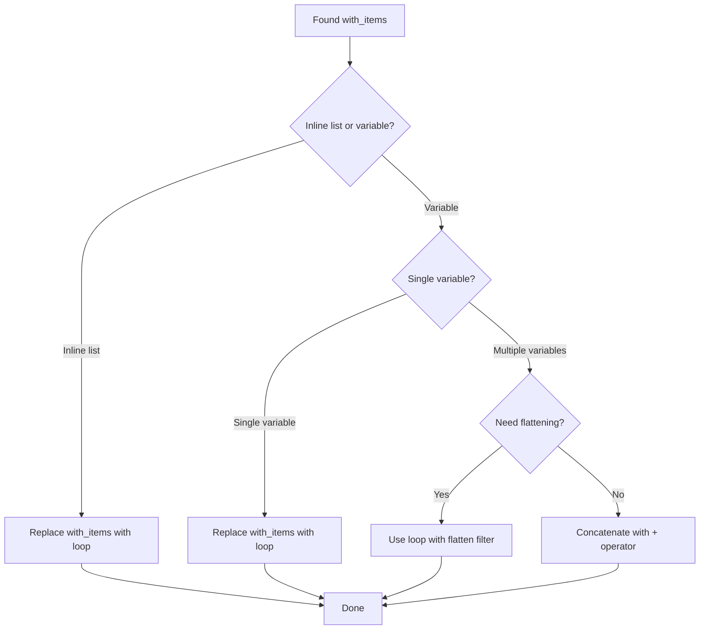

# How to Migrate from with_items to loop in Ansible

Author: [nawazdhandala](https://www.github.com/nawazdhandala)

Tags: Ansible, Migration, Best Practices, Automation

Description: Learn how to migrate your Ansible playbooks from the deprecated with_items syntax to the modern loop keyword with practical before-and-after examples.

---

If you have been working with Ansible for a while, your playbooks probably contain plenty of `with_items` statements. The `with_items` keyword was the original way to iterate over lists in Ansible, but starting with Ansible 2.5, the `loop` keyword became the recommended replacement. While `with_items` still works today, it is considered legacy syntax, and all new playbooks should use `loop`.

This post walks through the migration process with clear before-and-after comparisons, covers the edge cases, and explains the subtle behavioral differences you need to watch out for.

## Why Migrate?

There are several reasons to move from `with_items` to `loop`:

1. **Consistency**: `loop` is a single keyword that replaces over a dozen `with_*` variants (with_items, with_dict, with_nested, with_fileglob, etc.)
2. **Clarity**: `loop` makes it explicit what you are iterating over, especially when combined with filters
3. **Future-proofing**: Ansible documentation promotes `loop` as the standard, and future features will be built around it
4. **Filter compatibility**: `loop` works naturally with Jinja2 filters for transforming data before iteration

## The Simple Case

The most straightforward migration is a 1:1 replacement. For simple lists, just replace `with_items` with `loop`.

Before:

```yaml
# OLD: Using with_items
- name: Install packages
  ansible.builtin.apt:
    name: "{{ item }}"
    state: present
  with_items:
    - nginx
    - curl
    - git
    - htop
```

After:

```yaml
# NEW: Using loop
- name: Install packages
  ansible.builtin.apt:
    name: "{{ item }}"
    state: present
  loop:
    - nginx
    - curl
    - git
    - htop
```

That is it. For inline lists, the migration is just changing the keyword name.

## Variable References

When the list comes from a variable, the migration is equally simple.

Before:

```yaml
# OLD: with_items referencing a variable
- name: Create users
  ansible.builtin.user:
    name: "{{ item }}"
    state: present
  with_items: "{{ user_list }}"
```

After:

```yaml
# NEW: loop referencing a variable
- name: Create users
  ansible.builtin.user:
    name: "{{ item }}"
    state: present
  loop: "{{ user_list }}"
```

## The Flattening Difference

Here is where it gets tricky. `with_items` automatically flattens nested lists one level deep. `loop` does NOT flatten.

Before (with_items flattens automatically):

```yaml
# OLD: with_items flattens nested lists
- name: Install all packages
  ansible.builtin.apt:
    name: "{{ item }}"
    state: present
  with_items:
    - "{{ web_packages }}"
    - "{{ db_packages }}"
    - "{{ monitoring_packages }}"
  # If web_packages = ['nginx', 'curl'] and db_packages = ['postgresql'],
  # with_items iterates: nginx, curl, postgresql
```

After (loop needs explicit flattening):

```yaml
# NEW: loop with flatten filter
- name: Install all packages
  ansible.builtin.apt:
    name: "{{ item }}"
    state: present
  loop: "{{ (web_packages + db_packages + monitoring_packages) | flatten }}"
  # Without flatten, loop would iterate over the lists themselves, not their contents
```

The `flatten` filter is the key. Without it, `loop` would treat each variable as a single item (a list), not iterate over the contents of each list.

You can also use `flatten(1)` for one level of flattening (matching with_items behavior) or `flatten` for recursive flattening.

```yaml
# One level of flattening (same as with_items)
loop: "{{ my_nested_list | flatten(1) }}"

# Deep recursive flattening
loop: "{{ my_deeply_nested_list | flatten }}"
```

## Lists of Dictionaries

When looping over lists of dictionaries, the migration is direct since there is no flattening involved.

Before:

```yaml
# OLD: with_items and dictionaries
- name: Configure services
  ansible.builtin.service:
    name: "{{ item.name }}"
    state: "{{ item.state }}"
    enabled: "{{ item.enabled }}"
  with_items:
    - { name: "nginx", state: "started", enabled: true }
    - { name: "redis", state: "started", enabled: true }
    - { name: "apache2", state: "stopped", enabled: false }
```

After:

```yaml
# NEW: loop with dictionaries (identical behavior)
- name: Configure services
  ansible.builtin.service:
    name: "{{ item.name }}"
    state: "{{ item.state }}"
    enabled: "{{ item.enabled }}"
  loop:
    - { name: "nginx", state: "started", enabled: true }
    - { name: "redis", state: "started", enabled: true }
    - { name: "apache2", state: "stopped", enabled: false }
```

## Registered Variables

The structure of registered variables is slightly different between `with_items` and `loop`, but in practice the difference rarely matters. Both store results in `.results`.

Before:

```yaml
# OLD: register with with_items
- name: Check file existence
  ansible.builtin.stat:
    path: "{{ item }}"
  with_items:
    - /etc/nginx/nginx.conf
    - /etc/redis/redis.conf
  register: file_checks

- name: Show results
  ansible.builtin.debug:
    msg: "{{ item.item }}: exists={{ item.stat.exists }}"
  with_items: "{{ file_checks.results }}"
```

After:

```yaml
# NEW: register with loop
- name: Check file existence
  ansible.builtin.stat:
    path: "{{ item }}"
  loop:
    - /etc/nginx/nginx.conf
    - /etc/redis/redis.conf
  register: file_checks

- name: Show results
  ansible.builtin.debug:
    msg: "{{ item.item }}: exists={{ item.stat.exists }}"
  loop: "{{ file_checks.results }}"
```

## Migration Decision Flow

Here is a visual guide for deciding how to migrate each `with_items` usage.



## Bulk Migration Script

If you have many playbooks to migrate, here is a quick way to find all `with_items` occurrences.

```bash
# Find all files using with_items in your Ansible project
grep -rn "with_items" --include="*.yml" --include="*.yaml" roles/ playbooks/
```

For simple replacements (inline lists, single variables), a sed command works.

```bash
# Replace simple with_items with loop (test on a copy first!)
sed -i 's/with_items:/loop:/g' playbook.yml
```

But do NOT blindly replace everything. Check each occurrence for the flattening behavior first.

## Common Migration Mistakes

### Mistake 1: Forgetting flatten with merged lists

```yaml
# WRONG: This passes a list of lists to loop
loop:
  - "{{ list_a }}"
  - "{{ list_b }}"

# RIGHT: Flatten the merged lists
loop: "{{ (list_a + list_b) | flatten }}"
```

### Mistake 2: Using loop where a module accepts a list

```yaml
# WORKS but SLOW: Iterating one by one
- name: Install packages
  ansible.builtin.apt:
    name: "{{ item }}"
    state: present
  loop: "{{ packages }}"

# BETTER: Pass the list directly (no loop needed)
- name: Install packages
  ansible.builtin.apt:
    name: "{{ packages }}"
    state: present
```

### Mistake 3: Not converting generator to list

```yaml
# WRONG: selectattr returns a generator
loop: "{{ items | selectattr('enabled') }}"

# RIGHT: Convert to list
loop: "{{ items | selectattr('enabled') | list }}"
```

## Testing Your Migration

After migrating, run your playbooks in check mode to verify they behave the same.

```bash
# Run in check mode to verify without making changes
ansible-playbook site.yml --check --diff
```

Compare the output between the old and new versions. The task names, items processed, and results should be identical.

## Summary

Migrating from `with_items` to `loop` is usually a direct keyword replacement. The only real gotcha is the flattening behavior: `with_items` automatically flattens nested lists one level deep, while `loop` does not. When you are merging multiple list variables, add the `| flatten` filter. For everything else, it is a simple find-and-replace from `with_items` to `loop`. Take the time to migrate your existing playbooks so you have a consistent, modern codebase that aligns with Ansible's recommended practices.
