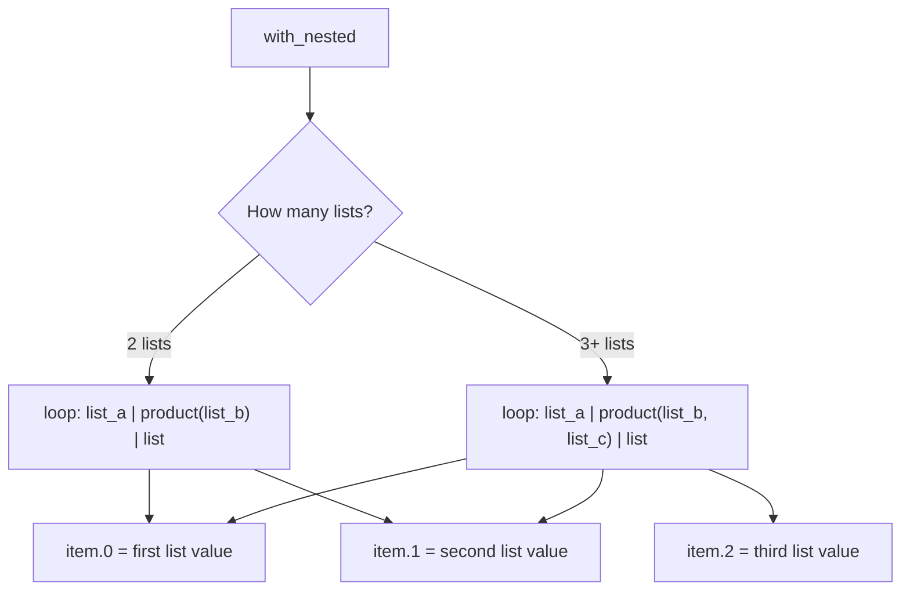

# How to Migrate from with_nested to loop in Ansible

Author: [nawazdhandala](https://www.github.com/nawazdhandala)

Tags: Ansible, Migration, Nested Loops, Automation

Description: Learn how to migrate from the legacy with_nested syntax to the modern loop keyword with the product filter in Ansible playbooks.

---

The `with_nested` keyword in Ansible created a Cartesian product of two or more lists, iterating over every possible combination. If you had a list of three users and a list of four directories, `with_nested` would give you 12 iterations covering every user-directory pair. The modern replacement is `loop` combined with the `product` filter from Jinja2.

This post covers the migration process, explains the `product` filter, and shows how to handle the variable structure differences between the old and new syntax.

## Understanding with_nested

Before we migrate, let us understand what `with_nested` did. Given two lists, it generated all combinations.

```yaml
# OLD: with_nested creates all combinations of users and directories
- name: Create user directories
  ansible.builtin.file:
    path: "/home/{{ item[0] }}/{{ item[1] }}"
    state: directory
    owner: "{{ item[0] }}"
  with_nested:
    - ['alice', 'bob', 'charlie']
    - ['documents', 'downloads', 'projects']
```

This creates 9 directories: alice/documents, alice/downloads, alice/projects, bob/documents, bob/downloads, bob/projects, and so on.

The items were accessed using `item[0]` (first list) and `item[1]` (second list).

## The Basic Migration

Replace `with_nested` with `loop` plus the `product` filter.

Before:

```yaml
# OLD: with_nested syntax
- name: Create user directories
  ansible.builtin.file:
    path: "/home/{{ item[0] }}/{{ item[1] }}"
    state: directory
    owner: "{{ item[0] }}"
  with_nested:
    - "{{ users }}"
    - "{{ directories }}"
```

After:

```yaml
# NEW: loop with product filter
- name: Create user directories
  ansible.builtin.file:
    path: "/home/{{ item.0 }}/{{ item.1 }}"
    state: directory
    owner: "{{ item.0 }}"
  loop: "{{ users | product(directories) | list }}"
```

Notice the access syntax change: `item[0]` becomes `item.0` and `item[1]` becomes `item.1`. Both notations actually work in Jinja2, but `item.0` is the more common style with `loop`.

## Important: The list Filter

The `product` filter returns an iterator, not a list. You must append `| list` to convert it for use with `loop`.

```yaml
# WRONG: Missing | list
loop: "{{ users | product(directories) }}"

# RIGHT: Convert product to list
loop: "{{ users | product(directories) | list }}"
```

## Variable References

With `with_nested`, items from the first list are at `item[0]`, second list at `item[1]`, and so on. The same applies with `product`, using either `item[0]` or `item.0`.

```yaml
# Both access styles work with loop + product
- name: Example with dot notation
  ansible.builtin.debug:
    msg: "User: {{ item.0 }}, Dir: {{ item.1 }}"
  loop: "{{ users | product(dirs) | list }}"

# This also works
- name: Example with bracket notation
  ansible.builtin.debug:
    msg: "User: {{ item[0] }}, Dir: {{ item[1] }}"
  loop: "{{ users | product(dirs) | list }}"
```

## Three or More Lists

`with_nested` supported any number of lists. The `product` filter also supports multiple arguments.

Before:

```yaml
# OLD: Three-way nested loop
- name: Create environment-region-service directories
  ansible.builtin.file:
    path: "/opt/{{ item[0] }}/{{ item[1] }}/{{ item[2] }}"
    state: directory
  with_nested:
    - ['production', 'staging']
    - ['us-east', 'eu-west']
    - ['api', 'worker', 'web']
```

After:

```yaml
# NEW: product with multiple lists
- name: Create environment-region-service directories
  ansible.builtin.file:
    path: "/opt/{{ item.0 }}/{{ item.1 }}/{{ item.2 }}"
    state: directory
  loop: "{{ environments | product(regions, services) | list }}"
  vars:
    environments: ['production', 'staging']
    regions: ['us-east', 'eu-west']
    services: ['api', 'worker', 'web']
```

This generates 12 combinations (2 x 2 x 3).

## Practical Example: User-Group Assignment

A real-world use case for nested loops is assigning users to groups.

Before:

```yaml
# OLD: Add multiple users to multiple groups
- name: Add users to groups
  ansible.builtin.user:
    name: "{{ item[0] }}"
    groups: "{{ item[1] }}"
    append: true
  with_nested:
    - "{{ new_developers }}"
    - ['docker', 'developers', 'deploy']
```

After:

```yaml
# NEW: Using product filter
- name: Add users to groups
  ansible.builtin.user:
    name: "{{ item.0 }}"
    groups: "{{ item.1 }}"
    append: true
  loop: "{{ new_developers | product(developer_groups) | list }}"
  vars:
    developer_groups:
      - docker
      - developers
      - deploy
```

## Dictionaries in Nested Loops

When nesting lists of dictionaries, each element of the product tuple is the full dictionary.

Before:

```yaml
# OLD: Nested dictionaries with with_nested
- name: Deploy configs per app per environment
  ansible.builtin.template:
    src: "{{ item[0].template }}"
    dest: "/etc/{{ item[1] }}/{{ item[0].name }}.conf"
  with_nested:
    - - { name: "app", template: "app.conf.j2" }
      - { name: "db", template: "db.conf.j2" }
    - ['production', 'staging']
```

After:

```yaml
# NEW: product with list of dicts
- name: Deploy configs per app per environment
  ansible.builtin.template:
    src: "{{ item.0.template }}"
    dest: "/etc/{{ item.1 }}/{{ item.0.name }}.conf"
  loop: "{{ app_configs | product(environments) | list }}"
  vars:
    app_configs:
      - { name: "app", template: "app.conf.j2" }
      - { name: "db", template: "db.conf.j2" }
    environments:
      - production
      - staging
```

## Controlling Loop Output

Nested loops can produce verbose output. Use `loop_control` to keep things readable.

```yaml
# Clean output with loop_control
- name: Create environment directories per user
  ansible.builtin.file:
    path: "/home/{{ item.0 }}/{{ item.1 }}"
    state: directory
    owner: "{{ item.0 }}"
  loop: "{{ users | product(directories) | list }}"
  loop_control:
    label: "{{ item.0 }}/{{ item.1 }}"
```

Without `loop_control.label`, Ansible prints the full tuple for each iteration. With the label, you see clean output like `alice/documents` instead of `['alice', 'documents']`.

## Combining product with Filters

An advantage of the new syntax is that you can chain filters with `product`.

```yaml
# Filter the product results before looping
- name: Create directories only for active users
  ansible.builtin.file:
    path: "/home/{{ item.0.name }}/{{ item.1 }}"
    state: directory
    owner: "{{ item.0.name }}"
  loop: >-
    {{
      users
      | selectattr('active', 'equalto', true)
      | list
      | product(directories)
      | list
    }}
  vars:
    users:
      - { name: "alice", active: true }
      - { name: "bob", active: false }
      - { name: "charlie", active: true }
    directories:
      - documents
      - downloads
      - projects
  loop_control:
    label: "{{ item.0.name }}/{{ item.1 }}"
```

This filters the user list first, then creates the product. Bob is excluded from the iteration entirely.

## Registered Variables with Nested Loops

The registered variable structure is the same. Each result includes the full tuple.

```yaml
# Register results from a product loop
- name: Check directory existence
  ansible.builtin.stat:
    path: "/home/{{ item.0 }}/{{ item.1 }}"
  loop: "{{ users | product(directories) | list }}"
  register: dir_checks

- name: Report missing directories
  ansible.builtin.debug:
    msg: "Missing: /home/{{ item.item.0 }}/{{ item.item.1 }}"
  loop: "{{ dir_checks.results }}"
  when: not item.stat.exists
```

The original tuple is accessible via `item.item` in the registered results.

## When to Avoid Nested Loops

The Cartesian product grows quickly. Three lists of 10 items each produce 1,000 iterations. Before migrating a `with_nested`, consider whether you actually need all combinations or if `subelements` would be more appropriate.

```yaml
# If each user has their OWN list of directories, use subelements instead
# This is NOT a Cartesian product
- name: Create user-specific directories
  ansible.builtin.file:
    path: "/home/{{ item.0.name }}/{{ item.1 }}"
    state: directory
  loop: "{{ users | subelements('directories') }}"
  vars:
    users:
      - name: alice
        directories: [documents, code, music]
      - name: bob
        directories: [documents, videos]
```

Use `product` when you truly need all combinations. Use `subelements` when each parent item has its own child list.

## Migration Visualization



## Summary

Migrating from `with_nested` to `loop` with `product` is straightforward. The `product` filter generates the same Cartesian product that `with_nested` did. The main things to remember are: always append `| list` after `product`, use `item.0` and `item.1` (or `item[0]` and `item[1]`) to access the elements, and use `loop_control.label` to keep output readable. The biggest advantage of the new syntax is that you can filter lists before creating the product, reducing unnecessary iterations.
