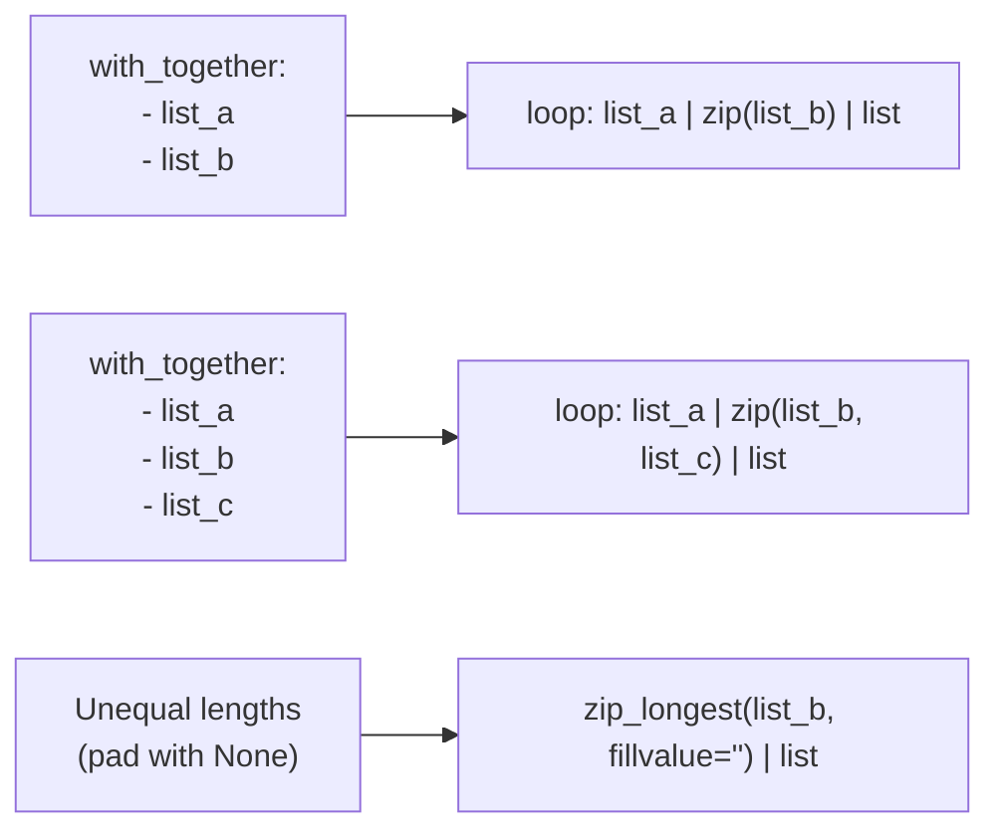

# How to Migrate from with_together to loop in Ansible

Author: [nawazdhandala](https://www.github.com/nawazdhandala)

Tags: Ansible, Migration, Loops, Automation

Description: Learn how to migrate from the legacy with_together syntax to the modern loop keyword with the zip filter in Ansible playbooks.

---

The `with_together` keyword in Ansible zipped two or more lists together, iterating over them in parallel. If you had a list of usernames and a matching list of UIDs, `with_together` would pair them up: first username with first UID, second with second, and so on. The modern replacement is `loop` combined with the `zip` filter.

This post covers the migration from `with_together` to `loop` with `zip`, explains how the filter works, and shows practical patterns for parallel list iteration.

## Understanding with_together

The `with_together` keyword paired up elements from multiple lists by their index position.

```yaml
# OLD: with_together pairs lists element-by-element
- name: Create users with specific UIDs
  ansible.builtin.user:
    name: "{{ item.0 }}"
    uid: "{{ item.1 }}"
  with_together:
    - ['alice', 'bob', 'charlie']
    - [1001, 1002, 1003]
```

This produced three iterations:
- alice with 1001
- bob with 1002
- charlie with 1003

Unlike `with_nested` which creates all combinations, `with_together` creates parallel pairs.

## The Basic Migration

Replace `with_together` with `loop` and the `zip` filter.

Before:

```yaml
# OLD: with_together syntax
- name: Create users with UIDs
  ansible.builtin.user:
    name: "{{ item.0 }}"
    uid: "{{ item.1 }}"
    shell: "{{ item.2 }}"
  with_together:
    - "{{ usernames }}"
    - "{{ user_uids }}"
    - "{{ user_shells }}"
```

After:

```yaml
# NEW: loop with zip filter
- name: Create users with UIDs
  ansible.builtin.user:
    name: "{{ item.0 }}"
    uid: "{{ item.1 }}"
    shell: "{{ item.2 }}"
  loop: "{{ usernames | zip(user_uids, user_shells) | list }}"
```

The `zip` filter works exactly like Python's built-in `zip()` function. It takes elements from each list at the same index and groups them into tuples.

## Important: The list Filter

Like `product`, `zip` returns an iterator that must be converted to a list.

```yaml
# WRONG: Missing | list
loop: "{{ list_a | zip(list_b) }}"

# RIGHT: Convert to list
loop: "{{ list_a | zip(list_b) | list }}"
```

## Two Lists Example

The most common case is zipping exactly two lists.

Before:

```yaml
# OLD: Pair hostnames with IP addresses
- name: Add DNS entries
  ansible.builtin.lineinfile:
    path: /etc/hosts
    line: "{{ item[1] }} {{ item[0] }}"
  with_together:
    - ['web-01', 'web-02', 'db-01']
    - ['10.0.1.10', '10.0.1.11', '10.0.2.10']
```

After:

```yaml
# NEW: zip hostnames and IPs
- name: Add DNS entries
  ansible.builtin.lineinfile:
    path: /etc/hosts
    line: "{{ item.1 }} {{ item.0 }}"
  loop: "{{ hostnames | zip(ip_addresses) | list }}"
  vars:
    hostnames:
      - web-01
      - web-02
      - db-01
    ip_addresses:
      - 10.0.1.10
      - 10.0.1.11
      - 10.0.2.10
```

## Three or More Lists

The `zip` filter accepts multiple arguments, just like `with_together` accepted multiple lists.

Before:

```yaml
# OLD: Three parallel lists
- name: Configure network interfaces
  ansible.builtin.template:
    src: interface.j2
    dest: "/etc/network/interfaces.d/{{ item[0] }}"
  with_together:
    - ['eth0', 'eth1', 'eth2']
    - ['10.0.1.5', '10.0.2.5', '10.0.3.5']
    - ['255.255.255.0', '255.255.255.0', '255.255.0.0']
```

After:

```yaml
# NEW: zip three lists together
- name: Configure network interfaces
  ansible.builtin.template:
    src: interface.j2
    dest: "/etc/network/interfaces.d/{{ item.0 }}"
  loop: "{{ interfaces | zip(addresses, netmasks) | list }}"
  vars:
    interfaces: ['eth0', 'eth1', 'eth2']
    addresses: ['10.0.1.5', '10.0.2.5', '10.0.3.5']
    netmasks: ['255.255.255.0', '255.255.255.0', '255.255.0.0']
```

## Handling Unequal List Lengths

With `with_together`, if lists had different lengths, shorter lists were padded with `None`. The `zip` filter behaves differently. By default, `zip` stops at the shortest list.

```yaml
# zip truncates to the shortest list
- name: Demonstrate zip with unequal lists
  ansible.builtin.debug:
    msg: "{{ item.0 }} - {{ item.1 }}"
  loop: "{{ names | zip(values) | list }}"
  vars:
    names: [a, b, c, d, e]
    values: [1, 2, 3]
  # Only processes: a-1, b-2, c-3 (d and e are dropped)
```

If you need the `with_together` behavior of padding with None, use `zip_longest`.

```yaml
# zip_longest pads shorter lists (matches with_together behavior)
- name: Zip with padding for unequal lists
  ansible.builtin.debug:
    msg: "{{ item.0 }} - {{ item.1 | default('N/A') }}"
  loop: "{{ names | zip_longest(values, fillvalue='') | list }}"
  vars:
    names: [a, b, c, d, e]
    values: [1, 2, 3]
  # Processes: a-1, b-2, c-3, d-, e-
```

The `fillvalue` parameter specifies what to use for missing elements. Use `default()` in the template to handle potential None values.

## Practical Example: Deploy and Configure Applications

Here is a real scenario where parallel lists make sense.

```yaml
# deploy-apps.yml
# Deploys applications to specific ports with specific config files
- name: Deploy applications
  hosts: appservers
  become: true
  vars:
    app_names:
      - api
      - admin
      - worker
      - scheduler
    app_ports:
      - 8080
      - 9090
      - 0
      - 0
    app_templates:
      - api.conf.j2
      - admin.conf.j2
      - worker.conf.j2
      - scheduler.conf.j2
  tasks:
    - name: Deploy application configs
      ansible.builtin.template:
        src: "{{ item.2 }}"
        dest: "/etc/myapp/{{ item.0 }}.conf"
      loop: "{{ app_names | zip(app_ports, app_templates) | list }}"
      loop_control:
        label: "{{ item.0 }}"
```

## Converting to Dictionaries (Better Approach)

While `zip` is the direct replacement for `with_together`, parallel lists are often better represented as a list of dictionaries. This is more readable and less error-prone since you do not have to keep list indices in sync.

Instead of parallel lists:

```yaml
# Parallel lists are fragile (order must match perfectly)
app_names: [api, admin, worker]
app_ports: [8080, 9090, 0]
app_users: [apiuser, admin, worker]
```

Consider restructuring to a list of dictionaries:

```yaml
# List of dictionaries is clearer and less error-prone
applications:
  - { name: api, port: 8080, user: apiuser }
  - { name: admin, port: 9090, user: admin }
  - { name: worker, port: 0, user: worker }
```

Then you can use a simple `loop` without any zip.

```yaml
# Cleaner loop without zip
- name: Deploy application configs
  ansible.builtin.template:
    src: "{{ item.name }}.conf.j2"
    dest: "/etc/myapp/{{ item.name }}.conf"
    owner: "{{ item.user }}"
  loop: "{{ applications }}"
```

## When to Keep zip

Even though dictionaries are often better, there are valid reasons to stick with `zip`:

1. The data comes from different sources that you cannot restructure
2. The lists are generated dynamically by different tasks
3. You are consuming data from an external API that provides separate arrays

```yaml
# Data from different registered commands needs zip
- name: Get running containers
  ansible.builtin.command: docker ps --format '{{.Names}}'
  register: container_names
  changed_when: false

- name: Get container IPs
  ansible.builtin.command: docker ps --format '{{.Networks}}'
  register: container_networks
  changed_when: false

- name: Display container network info
  ansible.builtin.debug:
    msg: "{{ item.0 }} on network {{ item.1 }}"
  loop: >-
    {{
      container_names.stdout_lines
      | zip(container_networks.stdout_lines)
      | list
    }}
```

## Registered Variables

The registered variable structure works the same way.

```yaml
# Register results from zipped loop
- name: Create application directories
  ansible.builtin.file:
    path: "/opt/{{ item.0 }}"
    state: directory
    owner: "{{ item.1 }}"
  loop: "{{ app_names | zip(app_owners) | list }}"
  register: dir_results

- name: Show changed directories
  ansible.builtin.debug:
    msg: "Created {{ item.item.0 }} for {{ item.item.1 }}"
  loop: "{{ dir_results.results }}"
  when: item.changed
```

## Migration Visualization



## Summary

Migrating from `with_together` to `loop` with `zip` is a direct replacement. The `zip` filter pairs elements from multiple lists by position, just like `with_together` did. Remember to append `| list`, use `zip_longest` if you need padding for unequal lists, and consider restructuring parallel lists into a list of dictionaries when possible. The new syntax gives you the ability to chain additional filters like `selectattr` and `map` before the loop processes the zipped data, which was not possible with `with_together`.
