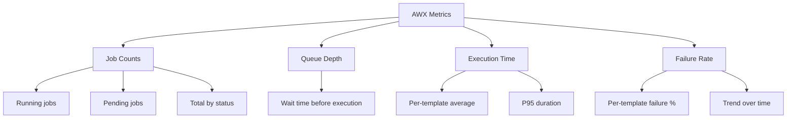

# How to Monitor AWX Job Performance

Author: [nawazdhandala](https://www.github.com/nawazdhandala)

Tags: Ansible, AWX, Monitoring, Performance, Prometheus

Description: Monitor AWX job performance with built-in metrics, Prometheus integration, and custom dashboards to track execution times and failure rates.

---

When you run hundreds of AWX jobs per day, understanding performance becomes critical. Which jobs are slow? Which ones fail often? Is the job queue backing up? AWX exposes performance data through its API, built-in metrics endpoint, and log output. Combine these with Prometheus and Grafana, and you get a monitoring stack that catches problems before your users notice them.

## AWX Metrics Endpoint

AWX exposes a Prometheus-compatible metrics endpoint at `/api/v2/metrics/`. This is the fastest way to get job execution data into your monitoring stack.

```bash
# Fetch AWX metrics in Prometheus format
curl -s -H "Authorization: Bearer ${AWX_TOKEN}" \
  https://awx.example.com/api/v2/metrics/
```

This returns metrics like:

```text
# HELP awx_running_jobs_total Number of running jobs
awx_running_jobs_total 3.0
# HELP awx_pending_jobs_total Number of pending jobs
awx_pending_jobs_total 0.0
# HELP awx_status_total Status of all jobs
awx_status_total{status="successful"} 1547.0
awx_status_total{status="failed"} 23.0
awx_status_total{status="error"} 2.0
awx_status_total{status="canceled"} 5.0
```

## Setting Up Prometheus to Scrape AWX

Add AWX as a scrape target in your Prometheus configuration.

```yaml
# prometheus.yml - Add AWX as a scrape target
scrape_configs:
  - job_name: "awx"
    metrics_path: "/api/v2/metrics/"
    scrape_interval: 30s
    bearer_token: "your-awx-token-here"
    scheme: https
    tls_config:
      insecure_skip_verify: false
    static_configs:
      - targets:
          - "awx.example.com"
        labels:
          environment: "production"
```

If you are running Prometheus in Kubernetes alongside AWX, use a ServiceMonitor instead.

```yaml
# awx-service-monitor.yml
---
apiVersion: monitoring.coreos.com/v1
kind: ServiceMonitor
metadata:
  name: awx-metrics
  namespace: monitoring
  labels:
    release: prometheus
spec:
  namespaceSelector:
    matchNames:
      - awx
  selector:
    matchLabels:
      app.kubernetes.io/name: awx-service
  endpoints:
    - port: http
      path: /api/v2/metrics/
      interval: 30s
      bearerTokenSecret:
        name: awx-metrics-token
        key: token
```

## Key Metrics to Track

Focus on these metrics to understand AWX health and job performance.



## Querying Job Performance via the API

The AWX API gives you detailed per-job data that the metrics endpoint does not include.

```bash
# Get the last 100 jobs with execution times
curl -s -H "Authorization: Bearer ${AWX_TOKEN}" \
  "https://awx.example.com/api/v2/jobs/?order_by=-finished&page_size=100" \
  | python3 -c "
import sys, json
data = json.load(sys.stdin)
for job in data['results']:
    elapsed = job.get('elapsed', 0)
    name = job['name'][:40]
    status = job['status']
    print(f'{status:12s} {elapsed:8.1f}s  {name}')
"
```

## Building a Performance Report Script

Here is a Python script that generates a weekly performance report from the AWX API.

```python
#!/usr/bin/env python3
"""Generate an AWX job performance report."""

import requests
import json
from datetime import datetime, timedelta
from collections import defaultdict

AWX_URL = "https://awx.example.com"
TOKEN = "your-token"
HEADERS = {"Authorization": f"Bearer {TOKEN}"}

# Fetch jobs from the last 7 days
since = (datetime.utcnow() - timedelta(days=7)).strftime("%Y-%m-%dT%H:%M:%SZ")

def get_all_jobs():
    """Fetch all jobs from the last 7 days."""
    jobs = []
    url = f"{AWX_URL}/api/v2/jobs/?created__gt={since}&page_size=200"

    while url:
        resp = requests.get(url, headers=HEADERS)
        resp.raise_for_status()
        data = resp.json()
        jobs.extend(data["results"])
        url = data.get("next")

    return jobs

jobs = get_all_jobs()
print(f"Total jobs in last 7 days: {len(jobs)}\n")

# Group by template
by_template = defaultdict(list)
for job in jobs:
    template_name = job.get("summary_fields", {}).get(
        "job_template", {}
    ).get("name", "Unknown")
    by_template[template_name].append(job)

# Print per-template stats
print(f"{'Template':<40} {'Total':>6} {'Pass':>6} {'Fail':>6} {'Avg(s)':>8} {'P95(s)':>8}")
print("-" * 80)

for template, template_jobs in sorted(
    by_template.items(), key=lambda x: len(x[1]), reverse=True
):
    total = len(template_jobs)
    passed = sum(1 for j in template_jobs if j["status"] == "successful")
    failed = sum(1 for j in template_jobs if j["status"] == "failed")
    durations = sorted([j["elapsed"] for j in template_jobs if j.get("elapsed")])

    avg_dur = sum(durations) / len(durations) if durations else 0
    p95_dur = durations[int(len(durations) * 0.95)] if durations else 0

    print(f"{template[:40]:<40} {total:>6} {passed:>6} {failed:>6} {avg_dur:>8.1f} {p95_dur:>8.1f}")
```

## Grafana Dashboard

Create a Grafana dashboard that visualizes AWX performance. Here are the PromQL queries for the most useful panels.

```text
# Running jobs over time
awx_running_jobs_total

# Pending jobs (queue depth) - alerts when > 0 for extended periods
awx_pending_jobs_total

# Job success rate (last 1 hour)
rate(awx_status_total{status="successful"}[1h])
/ (rate(awx_status_total{status="successful"}[1h])
   + rate(awx_status_total{status="failed"}[1h])
   + rate(awx_status_total{status="error"}[1h]))

# Failed jobs rate
rate(awx_status_total{status="failed"}[1h])
```

## Alerting on Job Performance

Set up alerts for conditions that need attention.

```yaml
# prometheus-rules.yml
---
apiVersion: monitoring.coreos.com/v1
kind: PrometheusRule
metadata:
  name: awx-alerts
  namespace: monitoring
spec:
  groups:
    - name: awx.rules
      rules:
        # Alert when jobs are stuck in the queue
        - alert: AWXJobQueueBacklog
          expr: awx_pending_jobs_total > 5
          for: 10m
          labels:
            severity: warning
          annotations:
            summary: "AWX has {{ $value }} pending jobs"
            description: "Jobs have been queued for over 10 minutes. Check AWX capacity."

        # Alert on high failure rate
        - alert: AWXHighFailureRate
          expr: >
            rate(awx_status_total{status="failed"}[30m])
            / (rate(awx_status_total{status="successful"}[30m])
               + rate(awx_status_total{status="failed"}[30m])) > 0.2
          for: 15m
          labels:
            severity: critical
          annotations:
            summary: "AWX job failure rate above 20%"
            description: "More than 20% of AWX jobs have failed in the last 30 minutes."

        # Alert when no jobs are running (might indicate AWX is down)
        - alert: AWXNoJobsRunning
          expr: awx_running_jobs_total == 0 and awx_pending_jobs_total > 0
          for: 5m
          labels:
            severity: critical
          annotations:
            summary: "AWX has pending jobs but nothing is running"
```

## Tracking Job Duration Trends

The API does not give you duration metrics in Prometheus format, but you can build a custom exporter.

```python
#!/usr/bin/env python3
"""Custom Prometheus exporter for AWX job durations."""

from prometheus_client import start_http_server, Histogram, Gauge
import requests
import time

AWX_URL = "https://awx.example.com"
TOKEN = "your-token"
HEADERS = {"Authorization": f"Bearer {TOKEN}"}

# Define metrics
job_duration = Histogram(
    "awx_job_duration_seconds",
    "Duration of AWX jobs",
    ["template_name", "status"],
    buckets=[30, 60, 120, 300, 600, 1200, 1800, 3600],
)

job_count = Gauge(
    "awx_job_count_by_template",
    "Number of jobs by template and status",
    ["template_name", "status"],
)

last_seen_id = 0

def collect_new_jobs():
    """Fetch completed jobs and record their metrics."""
    global last_seen_id

    resp = requests.get(
        f"{AWX_URL}/api/v2/jobs/?status__in=successful,failed&order_by=-id&page_size=50",
        headers=HEADERS,
    )
    resp.raise_for_status()

    for job in resp.json()["results"]:
        if job["id"] <= last_seen_id:
            continue

        template_name = (
            job.get("summary_fields", {})
            .get("job_template", {})
            .get("name", "unknown")
        )
        status = job["status"]
        elapsed = job.get("elapsed", 0)

        job_duration.labels(
            template_name=template_name, status=status
        ).observe(elapsed)

        job_count.labels(
            template_name=template_name, status=status
        ).inc()

    if resp.json()["results"]:
        last_seen_id = resp.json()["results"][0]["id"]

if __name__ == "__main__":
    start_http_server(9100)
    print("AWX exporter running on :9100")
    while True:
        collect_new_jobs()
        time.sleep(30)
```

## Quick Health Check Script

For teams that do not have Prometheus set up, a simple health check script works well.

```bash
#!/bin/bash
# awx-health-check.sh - Quick AWX performance check

AWX_URL="https://awx.example.com"

echo "=== AWX Health Check ==="
echo ""

# Running and pending jobs
curl -s -H "Authorization: Bearer ${AWX_TOKEN}" \
  "${AWX_URL}/api/v2/metrics/" 2>/dev/null | grep -E "running_jobs|pending_jobs"

echo ""
echo "=== Failed Jobs (Last 24h) ==="
curl -s -H "Authorization: Bearer ${AWX_TOKEN}" \
  "${AWX_URL}/api/v2/jobs/?status=failed&created__gt=$(date -u -v-1d +%Y-%m-%dT%H:%M:%SZ)&page_size=10" \
  | python3 -c "
import sys, json
data = json.load(sys.stdin)
print(f'Total failed: {data[\"count\"]}')
for job in data['results'][:10]:
    print(f'  [{job[\"id\"]}] {job[\"name\"][:50]} - {job[\"finished\"]}')" 2>/dev/null

echo ""
echo "=== Instance Capacity ==="
curl -s -H "Authorization: Bearer ${AWX_TOKEN}" \
  "${AWX_URL}/api/v2/instances/" \
  | python3 -c "
import sys, json
data = json.load(sys.stdin)
for inst in data['results']:
    cap = inst['capacity']
    used = inst['consumed_capacity']
    pct = int(used/cap*100) if cap > 0 else 0
    print(f'  {inst[\"hostname\"]}: {used}/{cap} ({pct}% used)')" 2>/dev/null
```

## Wrapping Up

Monitoring AWX job performance is not optional once you depend on it for production automation. The built-in metrics endpoint gives you the basics, the API provides detailed per-job data, and a Prometheus plus Grafana stack ties it all together into dashboards and alerts. Start by scraping the metrics endpoint and setting up the two critical alerts: queue backlog and high failure rate. Then build out per-template duration tracking as your needs grow.
