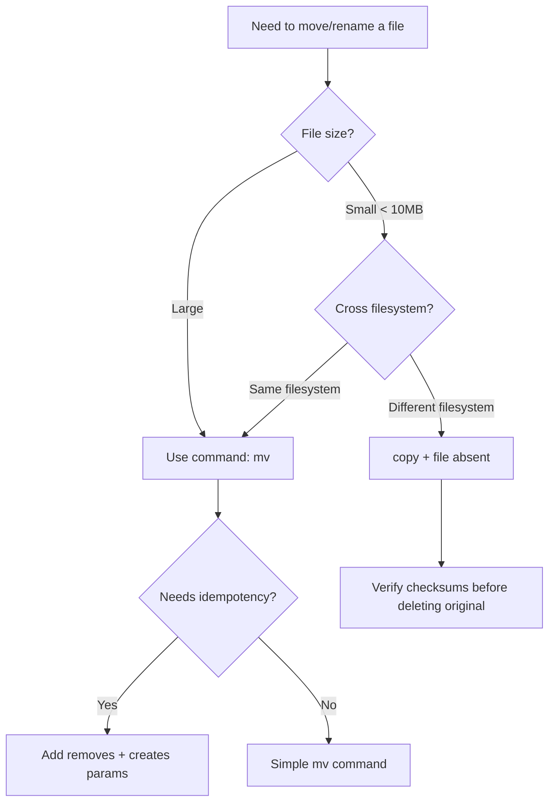

# How to Move and Rename Files with Ansible

Author: [nawazdhandala](https://www.github.com/nawazdhandala)

Tags: Ansible, File Management, DevOps, Linux

Description: Learn multiple approaches to moving and renaming files with Ansible, including the copy-and-delete pattern, command module, and file module techniques.

---

Ansible does not have a dedicated "move" or "rename" module, which surprises many people when they first encounter the need. The reason is philosophical: Ansible is declarative and focuses on desired state, and "move a file" is an imperative action. But the need is real, and there are several reliable ways to accomplish it. This guide covers every practical approach.

## The copy Module Approach (Recommended for Small Files)

The most "Ansible-native" way to move a file is to copy it to the new location and then delete the original. This works well for configuration files and small files.

```yaml
# Move a config file to a new location using copy + file
- name: Copy config to new location
  ansible.builtin.copy:
    src: /etc/myapp/old-config.yml
    dest: /etc/myapp/config.yml
    remote_src: yes
    owner: appuser
    group: appuser
    mode: '0644'

- name: Remove original file
  ansible.builtin.file:
    path: /etc/myapp/old-config.yml
    state: absent
```

The `remote_src: yes` parameter tells the `copy` module to look for the source file on the remote host rather than the controller.

## The command Module Approach (Most Common)

For most file moves and renames, the `command` module with `mv` is the simplest and most efficient approach.

```yaml
# Rename a file using the command module
- name: Rename application binary to include version
  ansible.builtin.command:
    cmd: mv /opt/myapp/bin/app /opt/myapp/bin/app-2.5.0
    removes: /opt/myapp/bin/app
    creates: /opt/myapp/bin/app-2.5.0
```

The `removes` and `creates` parameters make this idempotent. The task only runs if the source file exists (`removes`) and the destination does not (`creates`). This is the key to making `command`-based moves safe for repeated playbook runs.

## Moving Files Conditionally

Often you need to check if a file exists before attempting to move it.

```yaml
# Check if the source file exists before moving
- name: Check for old log file
  ansible.builtin.stat:
    path: /var/log/myapp/app.log.old
  register: old_log

- name: Move old log file to archive
  ansible.builtin.command:
    cmd: mv /var/log/myapp/app.log.old /var/log/archive/myapp-{{ ansible_date_time.date }}.log
  when: old_log.stat.exists
```

## Renaming Files with Timestamps

A common pattern is renaming a file to include a timestamp for archival purposes.

```yaml
# Rename current log file with timestamp before rotation
- name: Get current timestamp
  ansible.builtin.set_fact:
    timestamp: "{{ ansible_date_time.iso8601_basic_short }}"

- name: Rename current log to timestamped backup
  ansible.builtin.command:
    cmd: "mv /var/log/myapp/app.log /var/log/myapp/app-{{ timestamp }}.log"
    removes: /var/log/myapp/app.log
```

## Atomic File Replacement Pattern

When updating a configuration file, you want the change to be atomic. Write the new content to a temp file, then rename it over the original.

```yaml
# Atomic config update: write to temp, validate, rename
- name: Create temporary config file
  ansible.builtin.template:
    src: templates/myapp.conf.j2
    dest: /etc/myapp/myapp.conf.tmp
    owner: root
    group: root
    mode: '0644'

- name: Validate temporary config
  ansible.builtin.command:
    cmd: /opt/myapp/bin/validate-config /etc/myapp/myapp.conf.tmp
  register: config_valid
  changed_when: false

- name: Atomically replace config file
  ansible.builtin.command:
    cmd: mv /etc/myapp/myapp.conf.tmp /etc/myapp/myapp.conf
  when: config_valid.rc == 0
  notify: Reload myapp

- name: Clean up invalid config if validation failed
  ansible.builtin.file:
    path: /etc/myapp/myapp.conf.tmp
    state: absent
  when: config_valid.rc != 0
```

On Linux, `mv` within the same filesystem is atomic, meaning the file appears at the new path instantaneously. This is important for services that might be reading the config at the same time.

## Moving Multiple Files

Use loops or shell globbing to move multiple files at once.

```yaml
# Move all .bak files to an archive directory
- name: Find all backup files
  ansible.builtin.find:
    paths: /opt/myapp/data
    patterns: "*.bak"
  register: backup_files

- name: Move backup files to archive
  ansible.builtin.command:
    cmd: "mv {{ item.path }} /opt/archive/{{ item.path | basename }}"
  loop: "{{ backup_files.files }}"
  when: backup_files.matched > 0
```

For large numbers of files, a single shell command is more efficient.

```yaml
# Move many files at once using shell
- name: Move all CSV files to processed directory
  ansible.builtin.shell: mv /opt/data/incoming/*.csv /opt/data/processed/
  args:
    removes: /opt/data/incoming/*.csv
```

## Moving Directories

Moving an entire directory works the same way.

```yaml
# Move a directory to a new location
- name: Move old application version aside
  ansible.builtin.command:
    cmd: mv /opt/myapp/current /opt/myapp/previous
    removes: /opt/myapp/current
    creates: /opt/myapp/previous

- name: Deploy new application version
  ansible.builtin.unarchive:
    src: "files/myapp-{{ new_version }}.tar.gz"
    dest: /opt/myapp/current/
```

## Cross-Filesystem Moves

The `mv` command handles cross-filesystem moves automatically (it copies and then deletes), but be aware this is not atomic. For critical files, do an explicit copy and verify before deleting the original.

```yaml
# Safe cross-filesystem move with verification
- name: Copy file to new filesystem
  ansible.builtin.copy:
    src: /tmp/large-import.sql
    dest: /opt/data/imports/large-import.sql
    remote_src: yes
    mode: '0644'
  register: copy_result

- name: Verify copy with checksum
  ansible.builtin.stat:
    path: "{{ item }}"
    checksum_algorithm: sha256
  register: file_checksums
  loop:
    - /tmp/large-import.sql
    - /opt/data/imports/large-import.sql

- name: Delete original only if checksums match
  ansible.builtin.file:
    path: /tmp/large-import.sql
    state: absent
  when: file_checksums.results[0].stat.checksum == file_checksums.results[1].stat.checksum
```

## Renaming with Variable Substitution

Variables make file renaming dynamic and reusable.

```yaml
# Rename files based on hostname and version variables
- name: Rename deployment artifact with host info
  ansible.builtin.command:
    cmd: >
      mv /opt/releases/app-latest.tar.gz
      /opt/releases/app-{{ app_version }}-{{ inventory_hostname }}-{{ ansible_date_time.date }}.tar.gz
    removes: /opt/releases/app-latest.tar.gz
```

## A Complete Role Example

Here is a role that rotates application logs by moving them.

```yaml
# tasks/main.yml - Log rotation by moving files
---
- name: Check if log file exists and is large enough to rotate
  ansible.builtin.stat:
    path: /var/log/myapp/application.log
  register: app_log

- name: Rotate log file if larger than 100MB
  block:
    - name: Move current log to dated filename
      ansible.builtin.command:
        cmd: >
          mv /var/log/myapp/application.log
          /var/log/myapp/application-{{ ansible_date_time.iso8601_basic_short }}.log
      notify: Signal application to reopen logs

    - name: Compress rotated log
      ansible.builtin.command:
        cmd: "gzip /var/log/myapp/application-{{ ansible_date_time.iso8601_basic_short }}.log"
        creates: "/var/log/myapp/application-{{ ansible_date_time.iso8601_basic_short }}.log.gz"

    - name: Find old compressed logs
      ansible.builtin.find:
        paths: /var/log/myapp
        patterns: "application-*.log.gz"
        age: 30d
      register: old_logs

    - name: Remove logs older than 30 days
      ansible.builtin.file:
        path: "{{ item.path }}"
        state: absent
      loop: "{{ old_logs.files }}"
  when:
    - app_log.stat.exists
    - app_log.stat.size > 104857600
```

## Decision Flow for Moving Files



## Summary

While Ansible lacks a built-in "move" module, the combination of `command` with `mv`, `copy` with `remote_src`, and the `file` module covers every file moving and renaming scenario. Use `removes` and `creates` parameters to make `command`-based moves idempotent. For critical files, verify checksums when copying across filesystems. And for atomic configuration updates, the temp-file-then-rename pattern is the safest approach. Pick the method that best fits your specific use case, and always consider idempotency so your playbooks can run safely multiple times.
