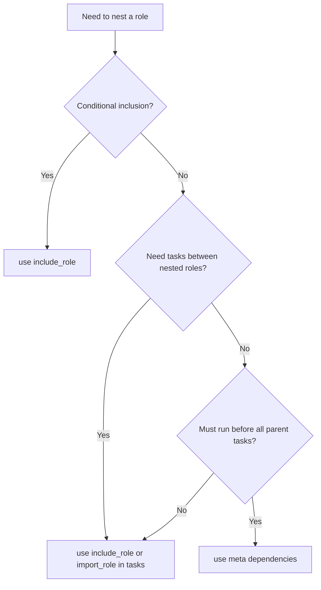

# How to Nest Ansible Roles

Author: [nawazdhandala](https://www.github.com/nawazdhandala)

Tags: Ansible, Roles, Nesting, Composition

Description: Learn how to nest Ansible roles within other roles using include_role, import_role, and meta dependencies for composable automation.

---

Nesting roles means calling one role from inside another. This lets you compose complex automation from smaller, focused building blocks. A "web application" role might internally call a "base system" role, an "nginx" role, and a "certbot" role. The outer role orchestrates everything while delegating the actual work to specialized inner roles. This post covers the different ways to nest roles, the implications of each approach, and patterns that keep nested roles maintainable.

## Why Nest Roles?

Consider deploying a typical web application. You need:

1. Base system configuration (NTP, DNS, package repos)
2. Web server installation and configuration
3. Application deployment
4. TLS certificate management
5. Monitoring agent setup

You could list all five roles in your playbook. But that means every project that deploys this application needs to know the exact list and order of roles. By nesting them inside a "webapp" role, the playbook only needs to reference one role, and the composition logic lives with the role itself.

## Method 1: include_role in Tasks

The most flexible way to nest roles is using `include_role` inside your role's tasks:

```yaml
# roles/webapp/tasks/main.yml
# Orchestrate sub-roles dynamically
---
- name: Apply base system configuration
  ansible.builtin.include_role:
    name: base_system

- name: Install and configure Nginx
  ansible.builtin.include_role:
    name: nginx
  vars:
    nginx_port: "{{ webapp_port }}"
    nginx_server_name: "{{ webapp_domain }}"

- name: Deploy application code
  ansible.builtin.include_tasks: deploy.yml

- name: Set up TLS if enabled
  ansible.builtin.include_role:
    name: certbot
  when: webapp_enable_tls | bool
  vars:
    certbot_domain: "{{ webapp_domain }}"
    certbot_email: "{{ webapp_admin_email }}"

- name: Configure monitoring
  ansible.builtin.include_role:
    name: monitoring
  when: webapp_enable_monitoring | default(true) | bool
```

This approach gives you full control: you can pass variables, add conditions, and interleave custom tasks between the nested roles.

## Method 2: import_role in Tasks

For static nesting where the role should always be included:

```yaml
# roles/webapp/tasks/main.yml
# Orchestrate sub-roles statically
---
- name: Apply base system configuration
  ansible.builtin.import_role:
    name: base_system

- name: Install Nginx
  ansible.builtin.import_role:
    name: nginx
  vars:
    nginx_port: "{{ webapp_port }}"

- name: Deploy application code
  ansible.builtin.import_tasks: deploy.yml
```

With `import_role`, the nested role's tasks are inlined at parse time. Tags propagate correctly, and all tasks appear in `--list-tasks` output.

## Method 3: Meta Dependencies

The third option is declaring dependencies in `meta/main.yml`:

```yaml
# roles/webapp/meta/main.yml
# Dependencies are processed before the role's tasks
---
dependencies:
  - role: base_system

  - role: nginx
    vars:
      nginx_port: "{{ webapp_port }}"
      nginx_server_name: "{{ webapp_domain }}"

  - role: certbot
    vars:
      certbot_domain: "{{ webapp_domain }}"
```

Dependencies run before any tasks in the parent role. This means you cannot add conditions or interleave tasks between dependencies (though you can pass variables).

## Choosing Between the Three Methods



| Feature | include_role | import_role | meta dependency |
|---------|-------------|-------------|----------------|
| Conditional | Yes (when) | Per-task when | No |
| Interleave tasks | Yes | Yes | No |
| Timing | Runtime | Parse time | Before parent tasks |
| Looping | Yes | No | No |
| Tag propagation | Needs apply | Automatic | Automatic |

## Practical Example: A Database-Backed Application Role

```
roles/
  app_stack/
    meta/
      main.yml
    tasks/
      main.yml
      deploy.yml
      database.yml
    defaults/
      main.yml
    templates/
      app.conf.j2
  common/
  postgresql/
  redis/
  nginx/
```

```yaml
# roles/app_stack/defaults/main.yml
---
app_name: myapp
app_version: "2.0.0"
app_port: 8080
app_domain: app.example.com
app_database_name: myapp_production
app_redis_enabled: true
app_workers: 4
```

```yaml
# roles/app_stack/meta/main.yml
# The common role always runs first
---
dependencies:
  - role: common
```

```yaml
# roles/app_stack/tasks/main.yml
# Compose the full application stack from sub-roles and custom tasks
---
- name: Set up PostgreSQL
  ansible.builtin.include_role:
    name: postgresql
  vars:
    postgresql_databases:
      - name: "{{ app_database_name }}"
    postgresql_users:
      - name: "{{ app_name }}"
        password: "{{ app_db_password }}"
        db: "{{ app_database_name }}"
        priv: "ALL"

- name: Set up Redis cache
  ansible.builtin.include_role:
    name: redis
  when: app_redis_enabled | bool
  vars:
    redis_maxmemory: "256mb"
    redis_bind: "127.0.0.1"

- name: Deploy application code
  ansible.builtin.include_tasks: deploy.yml

- name: Set up database schema
  ansible.builtin.include_tasks: database.yml

- name: Configure Nginx reverse proxy
  ansible.builtin.include_role:
    name: nginx
  vars:
    nginx_server_name: "{{ app_domain }}"
    nginx_proxy_pass: "http://127.0.0.1:{{ app_port }}"
```

```yaml
# roles/app_stack/tasks/deploy.yml
# Application-specific deployment tasks (not delegated to a sub-role)
---
- name: Create application user
  ansible.builtin.user:
    name: "{{ app_name }}"
    system: yes
    shell: /usr/sbin/nologin

- name: Create application directory
  ansible.builtin.file:
    path: "/opt/{{ app_name }}"
    state: directory
    owner: "{{ app_name }}"
    mode: '0755'

- name: Download application
  ansible.builtin.get_url:
    url: "https://releases.example.com/{{ app_name }}/{{ app_version }}/{{ app_name }}.tar.gz"
    dest: "/tmp/{{ app_name }}-{{ app_version }}.tar.gz"

- name: Extract application
  ansible.builtin.unarchive:
    src: "/tmp/{{ app_name }}-{{ app_version }}.tar.gz"
    dest: "/opt/{{ app_name }}"
    remote_src: yes
    owner: "{{ app_name }}"

- name: Deploy application configuration
  ansible.builtin.template:
    src: app.conf.j2
    dest: "/opt/{{ app_name }}/config/app.conf"
    owner: "{{ app_name }}"
    mode: '0640'
  notify: Restart application
```

## Variable Scope in Nested Roles

When you nest roles, variable scope can get tricky. Here is how it works:

```yaml
# roles/outer/defaults/main.yml
---
shared_port: 8080

# roles/inner/defaults/main.yml
---
shared_port: 3000
```

If both roles define the same variable name, the behavior depends on how the role is nested:

- **Meta dependency**: The inner role's defaults are loaded first, then overridden by the outer role's defaults (same precedence level, later wins).
- **include_role/import_role with vars**: The passed vars override the inner role's defaults.

This is why variable namespacing is critical:

```yaml
# Good: namespaced, no conflicts
# roles/nginx/defaults/main.yml
nginx_port: 80

# roles/app/defaults/main.yml
app_port: 8080
```

```yaml
# Bad: generic names will collide
# roles/nginx/defaults/main.yml
port: 80

# roles/app/defaults/main.yml
port: 8080
```

## Handling Handler Name Conflicts

If multiple nested roles define handlers with the same name, you get conflicts. Namespace your handlers:

```yaml
# roles/nginx/handlers/main.yml
- name: nginx_restart
  ansible.builtin.service:
    name: nginx
    state: restarted

# roles/app/handlers/main.yml
- name: app_restart
  ansible.builtin.service:
    name: myapp
    state: restarted
```

Or use the `listen` directive with namespaced topics:

```yaml
# roles/nginx/handlers/main.yml
- name: Restart Nginx service
  ansible.builtin.service:
    name: nginx
    state: restarted
  listen: "nginx_config_changed"
```

## Depth Limits and Performance

Ansible does not impose a hard limit on nesting depth, but deeply nested roles (more than 3-4 levels) create problems:

- Variable precedence becomes unpredictable
- Debugging failures requires tracing through multiple layers
- Performance degrades due to repeated variable resolution

If you find yourself nesting more than 2-3 levels deep, consider flattening your role structure.

## Testing Nested Roles

When testing a role that nests other roles, your Molecule scenario needs a `requirements.yml`:

```yaml
# roles/app_stack/molecule/default/requirements.yml
---
roles:
  - name: common
    src: git@github.com:myorg/ansible-role-common.git
    version: v1.0.0
  - name: postgresql
    src: git@github.com:myorg/ansible-role-postgresql.git
    version: v2.0.0
  - name: redis
    src: git@github.com:myorg/ansible-role-redis.git
    version: v1.0.0
  - name: nginx
    src: git@github.com:myorg/ansible-role-nginx.git
    version: v1.0.0
```

```yaml
# roles/app_stack/molecule/default/molecule.yml
dependency:
  name: galaxy
  options:
    requirements-file: requirements.yml
```

## Wrapping Up

Nesting roles lets you build composable automation where each role handles a single concern. Use `include_role` in tasks for the most flexibility, `import_role` for static composition with tag support, and meta dependencies for roles that must run before your role's tasks. Keep your nesting shallow (2-3 levels max), namespace all variables and handlers, and always pass variables explicitly to nested roles rather than relying on shared global state. Well-composed nested roles turn a complex deployment into a single, readable orchestration file.
